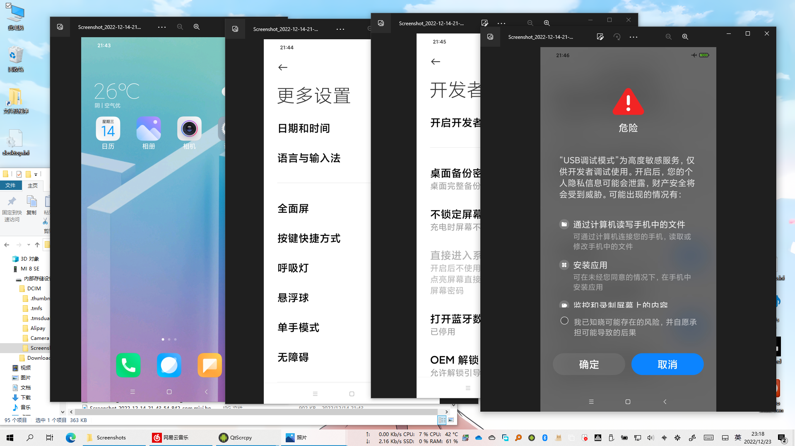
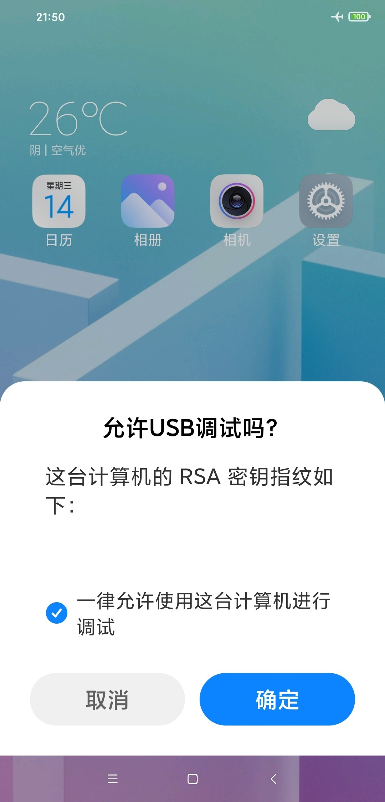
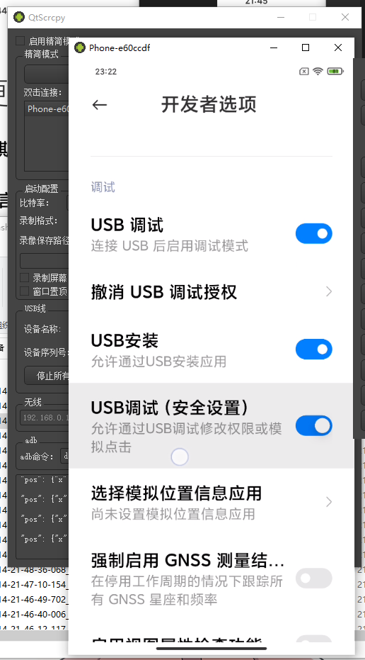
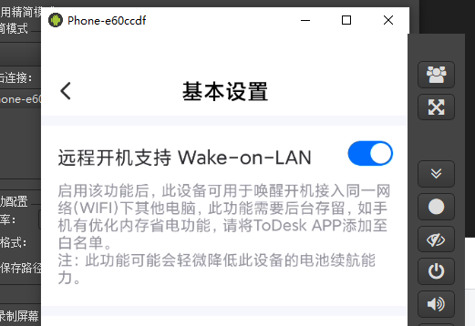
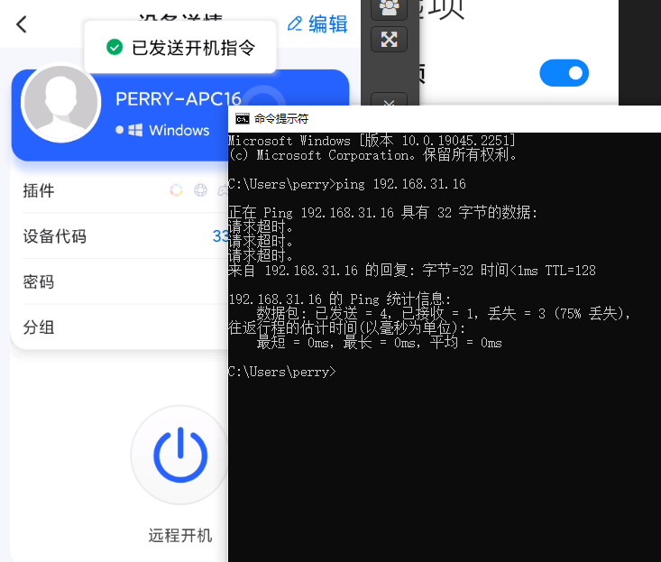

## 前言

家人手里有台 Mi8 SE，内屏挂了，最近终于到手了，稍微摸索了下废物利用的方法。

## 问题

要使用这台手机，因为屏幕是黑的，只知道操控还正常。

- 所以第一步当然是摸着把 MIUI 静音和勿扰给关了
- 然后靠直觉猜位置打手机密码 解锁手机（指纹/面部解锁因手机重启无法使用）
- 连接电脑，靠直觉尝试，按出“文件”或“相机”模式
- 边截图边电脑上看截图，摸着打开 USB调试

- 同理，电脑上请求ADB配对

- Scrcpy 连上去，然后直接操作手机，打开 “USB调试（安全设置）”、“USB安装”

这时就能直接在电脑上用鼠标操作手机了，不过因为这手机不能无线调试，没那么方便就是。

## 利用

弄好了之后，想恢复出厂，想刷机，但显然，不可能。

稍加思考后，想起 ToDesk 有个功能。。。

赶紧下了个 ToDesk

打开一看，可以可以

搞定，

目前还在想 还有没有别的什么能利用的。

