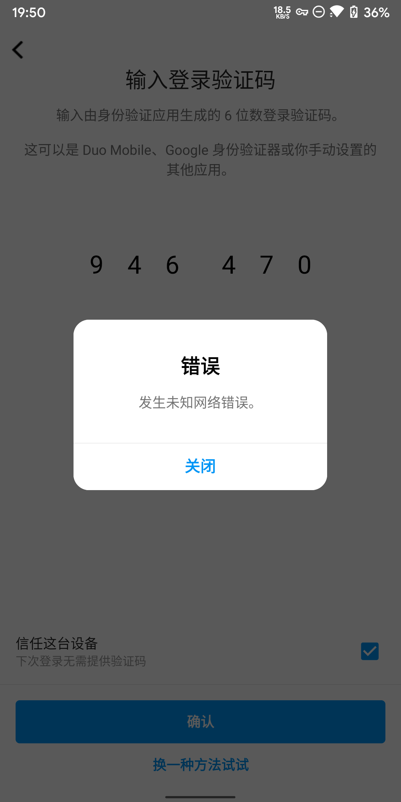
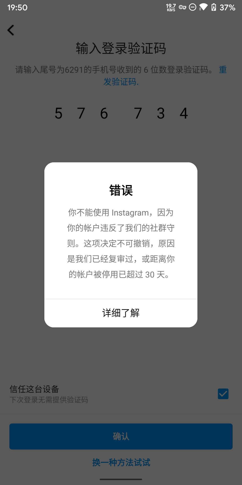
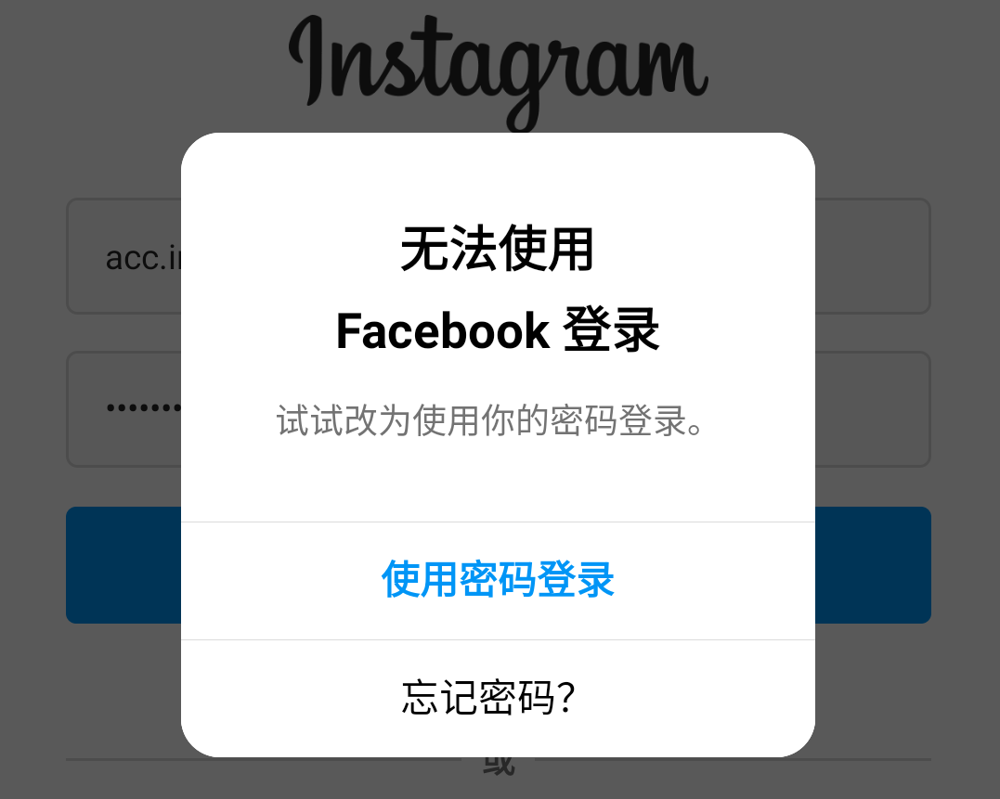
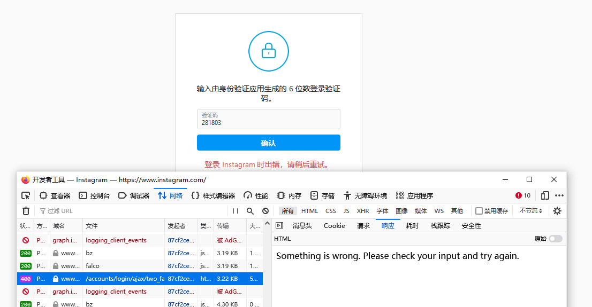
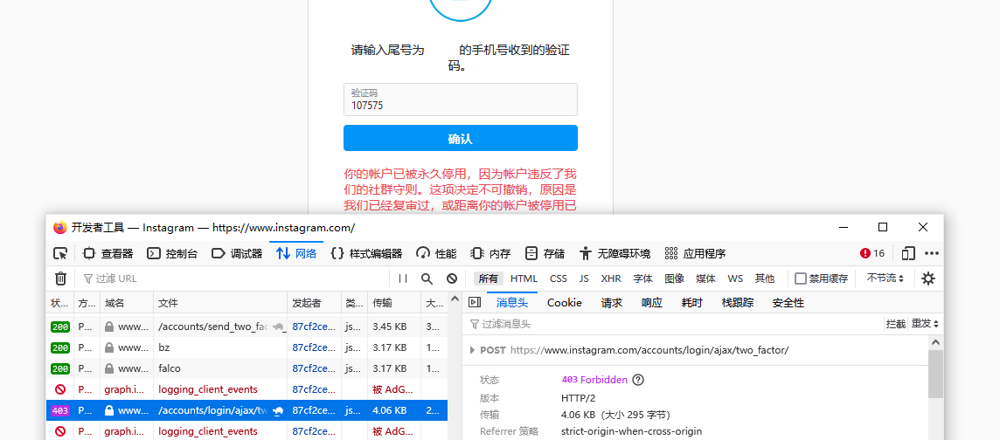
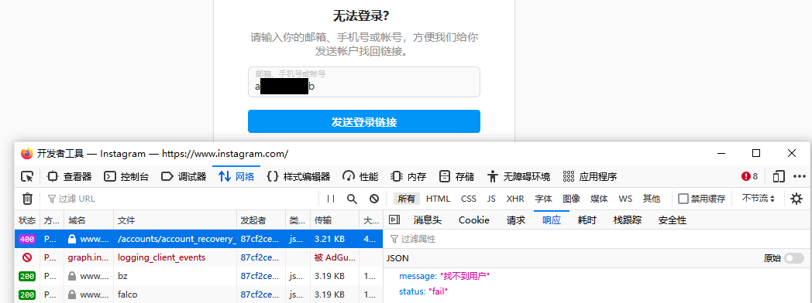
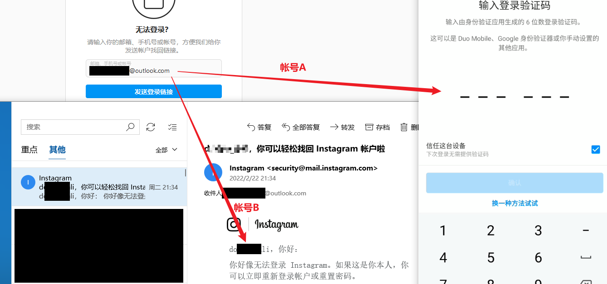
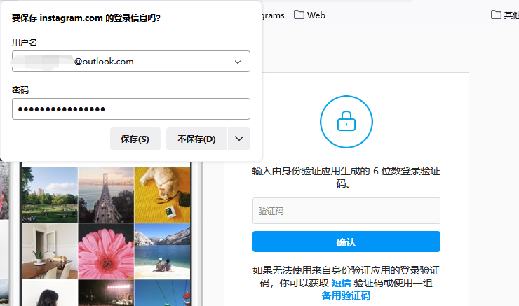
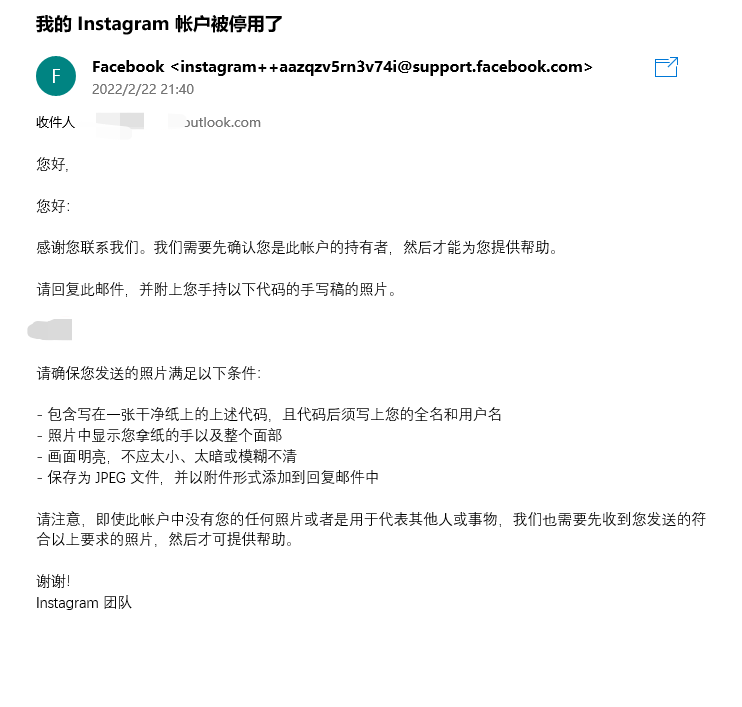

- 前几天突然要用起来 Instagarm，把 Ins 下了回来，把之前的帐号登进去，于是发现号没了。。。
- 根据多年深度使用这软件的经验，这个架构极为拉跨的软件弹的大概率是没多少可信度的。我怀疑是我自己临时停用帐号或删除账号，30天后号没了，现在他给我弹的图二。。。

- 用 FB 登录，同样登不进

- 然后就到电脑上 F12 看了一眼： 400

- 手机验证码登录：403

- 直接用 Email + 密码 登录，也跟上面用用户 ID 登录出来的报错是一样的。。。这我可蒙了。。。
- 直接忘记密码试试 ~~（坚信他这个架构肯定会一堆bug的我）~~
  - 直接给我报一个 “找不到用户”

- 所以说这 ID 是被我自己停用的？我自己删的？用Email试试！~~（坚信他这个架构肯定会一堆bug的我）~~
- 这时候就有趣了，我发现我的 Email 同时关联着两个 Instagram ID！~~（我就说他这个架构肯定会一堆bug）~~

- Ctrl + F 一下以前保存过的密码，找到了 帐号B 的密码

- 尝试用 一个Email 输入不同的两个密码

  - 输入 Email + 帐号A密码，成功进入 帐号A 登录验证

    

  - 输入 Email + 帐号B密码，成功登录 帐号B 进入主页

    

- 所以这么折腾一番下来，我的 帐号A 应该是我自己停用删号的？？？不是被封的？

  
  
- 然后又出现了更奇怪的一幕，我直接去申诉我的 帐号A 他们给我回Email让我证明ID是我的？

  

- 一边登录说着被封了，另一边说我ID不存在？是删数据库的时候删了，但又没完全删？

  - 还要手持拍照，算了算了不要了，反正印象中这 ID 应该是被我自己停用删号的了。。。

