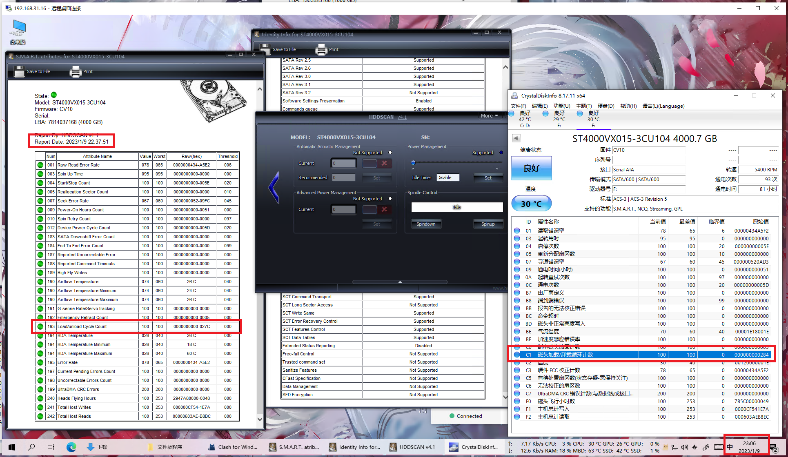
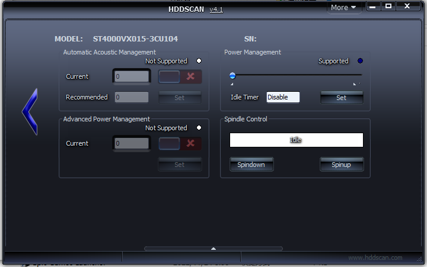
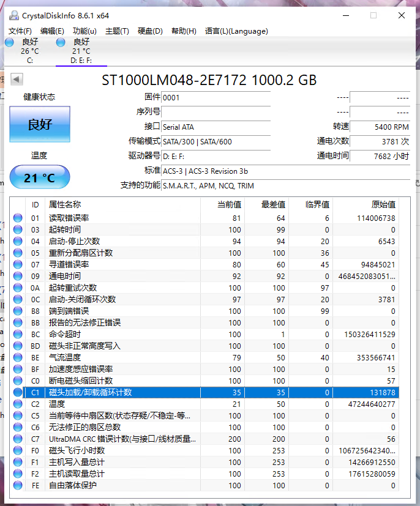

## ST4000VX015

前两个月买了块 4 TB 的海康 OEM 希捷监控盘，一直觉得不太对劲，一直有咔哒声出来，而且每次读到 2T 多一点的时候就 100% 占用卡死，最近终于有空检查一下了。


粗看一眼 CrystalDiskInfo ，没看出点什么问题。

**先做个排除：**

兼容性 & BIOS：正常

SATA驱动：换成 OEM 驱动，咔哒声依旧；

系统兼容：重装，**解决了 Win10 读硬盘卡死 100% 占用的 Bug** ，咔哒声依旧；

供电：换几根，供电线正常，电源正常，咔哒声依旧；

数据线：换几根，均正常，咔哒声依旧。
<br><br>


仔细看 CrystalDiskInfo ，发现空闲过一段时间后 每分钟 C1 + 1，仅 81 小时通电 C1 高达 644 ，而且还在每分钟 + 1；



检查节能模式：这盘根本不支持 APM。




起初以为是监控盘的原因，要不停写入才不会这样。

~~你不用来做监控盘 7x24H 连续(读)写，拿来做 NAS盘/仓库盘 是吧？那计划报废咯。~~
<br><br>


上网查了下， 发现 WD 之前有过 C1 门。

想着 OTA 一下 ROM，结果 海康的这些 OEM 盘根本找不到 ROM，问客服也没有，也不能用希捷的 ROM。

然后发现这块盘固件里的节能模式好像有 Bug，有时候还在读着他都能直接进节能模式，所以 C1 暴涨 。。。~~难不成监控盘还得得写才不进？~~

\*读着他能直接进节能模式：进 Idle B 之后，CrystalDiskInfo 每更新一次数据 C1 + 1。 


**粗略算下这块盘的最快死亡时间（不含意外情况）：**

根据 VX015 文档\*： *Load/unload cycles (at 25°C, 50% rel. humidity)：600,000*

按每天 1440 分钟，每分钟 C1 + 1， 只需 417 天 就能达到 600000 次，甚至硬盘都还没过保;

也就是说，插上电开机进系统给他分区*，然后一直空载什么都不管，就可以把他干挂。。。

\*接上段：如果按最粗暴的方法，等他进 Idle B，然后连续按 60 万次 F5，这硬盘就差不多挂了。


### 解决

**下载 SeaChest Utilities 并以管理员身份运行\*：**

```bash
C:\Program Files\Seagate\SeaChest>SeaChest_PowerControl_x64_windows.exe -s
==========================================================================================
 SeaChest_PowerControl - Seagate drive utilities - NVMe Enabled
 Copyright (c) 2014-2022 Seagate Technology LLC and/or its Affiliates, All Rights Reserved
 SeaChest_PowerControl Version: 3.1.9-2_4_0 X86_64
 Build Date: Apr  8 2022
 Today: Tue Jan 10 17:13:34 2023        User: perry (admin)
==========================================================================================
Vendor   Handle       Model Number            Serial Number          FwRev
SATA     PD0          -----------------       ---------------        ----
SATA     PD1          ST1000DM003-1SB10C      --------               CC43
SATA     PD2          ST4000VX015-3CU104      --------               CV10
```

**PD2 看一眼 EPC 状态**\*

```bash
C:\Program Files\Seagate\SeaChest>SeaChest_PowerControl_x64_windows.exe -d PD2 --showEPCSettings
==========================================================================================
 SeaChest_PowerControl - Seagate drive utilities - NVMe Enabled
 Copyright (c) 2014-2022 Seagate Technology LLC and/or its Affiliates, All Rights Reserved
 SeaChest_PowerControl Version: 3.1.9-2_4_0 X86_64
 Build Date: Apr  8 2022
 Today: Tue Jan 10 17:13:42 2023        User:  (admin)
==========================================================================================

\\.\PhysicalDrive2 - ST4000VX015-3CU104 -  - CV10 - ATA
.

===EPC Settings===
        * = timer is enabled
        C column = Changeable
        S column = Savable
        All times are in 100 milliseconds

Name       Current Timer Default Timer Saved Timer   Recovery Time C S
Idle A     *10           *10           *10           1             Y Y
Idle B     *6000         *6000         *6000         4             Y Y
Idle C      0             18000         18000        25            Y Y
Standby Z   0             0             0            55            Y Y

```

**把 10 分钟进 Idle B 关了**

```bash
C:\Program Files\Seagate\SeaChest>SeaChest_PowerControl_x64_windows.exe -d PD2 --idle_b disable
==========================================================================================
 SeaChest_PowerControl - Seagate drive utilities - NVMe Enabled
 Copyright (c) 2014-2022 Seagate Technology LLC and/or its Affiliates, All Rights Reserved
 SeaChest_PowerControl Version: 3.1.9-2_4_0 X86_64
 Build Date: Apr  8 2022
 Today: Tue Jan 10 17:13:50 2023        User:  (admin)
==========================================================================================

\\.\PhysicalDrive2 - ST4000VX015-3CU104 -  - CV10 - ATA
Successfully configured the requested EPC settings.


C:\Program Files\Seagate\SeaChest>SeaChest_PowerControl_x64_windows.exe -d PD2 --showEPCSettings
==========================================================================================
 SeaChest_PowerControl - Seagate drive utilities - NVMe Enabled
 Copyright (c) 2014-2022 Seagate Technology LLC and/or its Affiliates, All Rights Reserved
 SeaChest_PowerControl Version: 3.1.9-2_4_0 X86_64
 Build Date: Apr  8 2022
 Today: Tue Jan 10 17:13:57 2023        User:  (admin)
==========================================================================================

\\.\PhysicalDrive2 - ST4000VX015-3CU104 -  - CV10 - ATA
.

===EPC Settings===
        * = timer is enabled
        C column = Changeable
        S column = Savable
        All times are in 100 milliseconds

Name       Current Timer Default Timer Saved Timer   Recovery Time C S
Idle A     *10           *10           *10           1             Y Y
Idle B      0            *6000          6000         4             Y Y
Idle C      0             18000         18000        25            Y Y
Standby Z   0             0             0            55            Y Y
```

Idle B Current Timer 已为 0 


**长时间空载 C1 不再往上蹭**

.png)


## ST1000LM048

顺手去看了下之前买的一块 SMR 盘，

差不多平均每 4 分钟 C1 + 1 ，目前 131878 ，文档里也写的理想情况下 C1 周期 600,000 次。

看的我反手过去把 APM 给关了。。。

实际上剩余寿命粗略估计 3 ~ 5 年？~~虽然我也不知道这 SMR 能用多久就是~~




## 参考资料：

1. [Skyhawk Product Manual](https://www.seagate.com/files/www-content/product-content/skyhawk/en-us/docs/201370100a.pdf)
2. [Enscript Output](http://support.seagate.com/seachest/SeaChest_Combo_UserGuides.html)
3. [希捷 PowerChoice 电源管理特性](https://www.bilibili.com/read/cv18851043/)
3. [Book.fm](https://www.seagate.com/www-content/product-content/seagate-laptop-fam/barracuda_25/en-us/docs/100807728a.pdf)


