# 无密码情况下手动清除冰点还原

> 内容仅供学习和参考，禁止用于非法用途！
>
> 截至 2021.4.16 使用官网最新版，再次尝试复现，仍可使用（配图已更新）。

## 事件

从学校拷回来一个冰点还原，安装后就是激活状态，而且还存在还原密码，无法删除卸载，根据网上找到的手动清除方法也都以失败告终。
根据网上部分文章总结及自身能力和运气，成功实现无密码手动清除。

## 复现过程

* 安装当前最新版冰点还原，测试系统与冰点还原版本号如图。
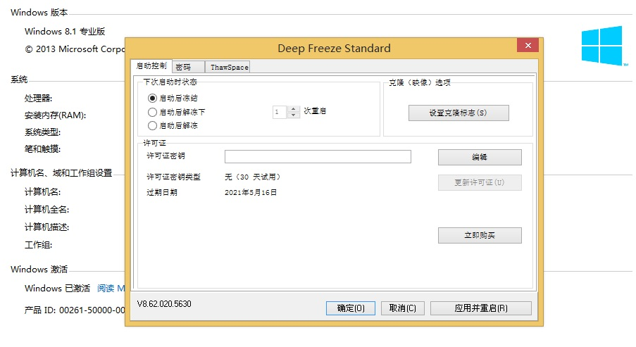

* 确认安装成功，还原有效后，进入PE，打开注册表编辑器，选定`HKEY_LOCAL_MACHINE`，使用`加载配置单元`功能，打开系统`\System32\config\SYSTEM`文件。

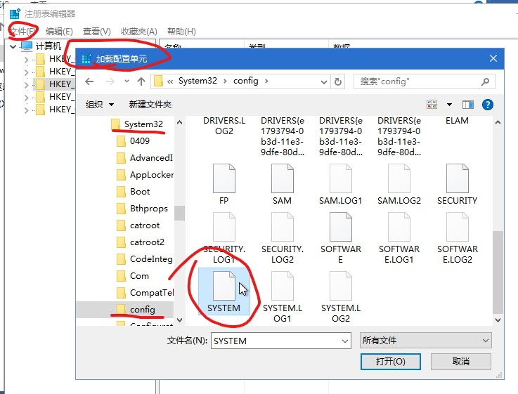

* 项名称随意，此处以**f**为例。

* 从**f**中查找`DFServ`，查找到两个文件夹`\ControlSet001\Control\SafeBoot\Minimal\DFServ`,`\ControlSet001\Services\DFServ`，均删除。

* 在**f**中查找`DeepFrz`，找到`PartMgr`项，双击编辑，删除第一行的`DeepFrz`，但保留第二行，确定。
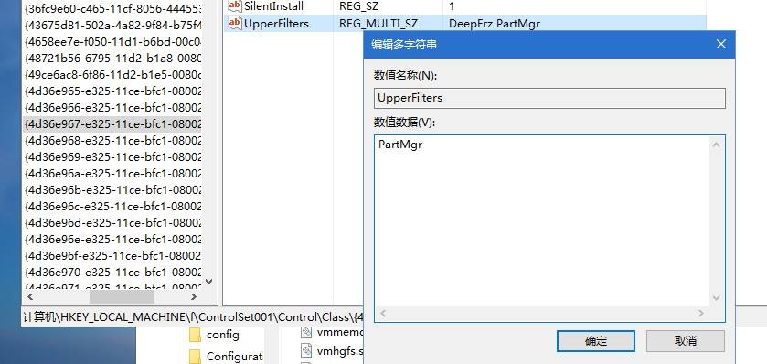

* 删除同文件夹下的`LowerFilters`项
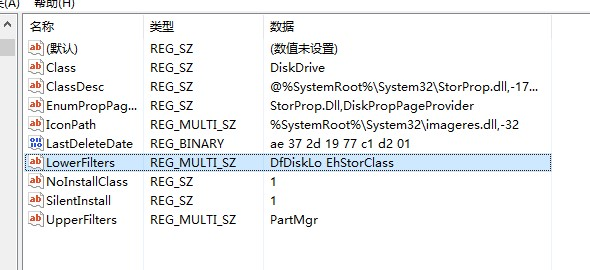

* 继续查找，删除`kbdclass,mouclass中的DeepFrz`,确定
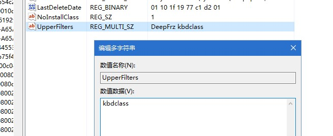
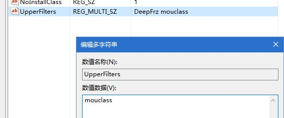

* 继续查找，找到含`FarSpace`项的文件夹，整个删除
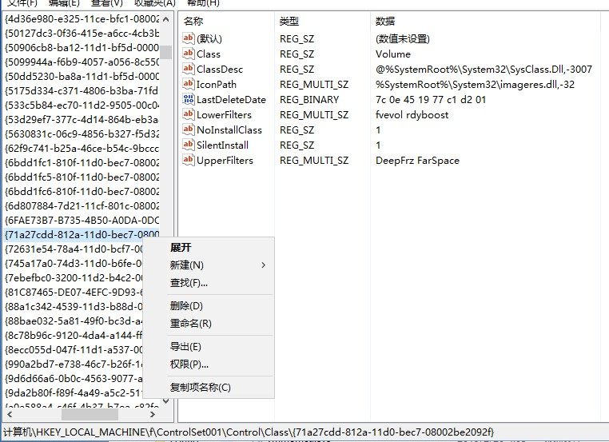

* 在软件安装目录中把``Faronics``文件夹删除。
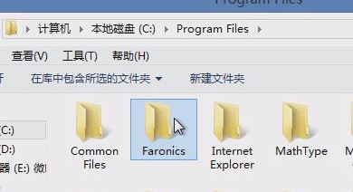

* 系统分区根目录，删除``Persi0.sys``文件。

* 系统驱动目录，按修改时间倒序排序，找到五个冰点还原驱动文件，删除。
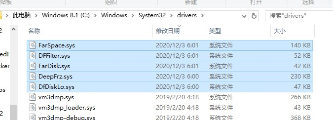

***

* 完成上述操作后，冰点还原已被清除，且无法再次安装到电脑上。
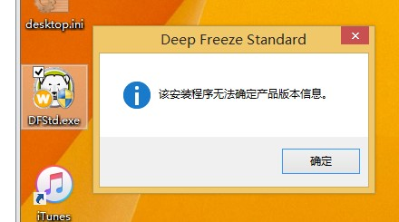

* 若以后还有可能需要安装，需要继续在注册表内查找`DeepFrz`删除`\ControlSet001\Services\DeepFrz`和`\ControlSet001\Services\EventLog\System\DeepFrz`
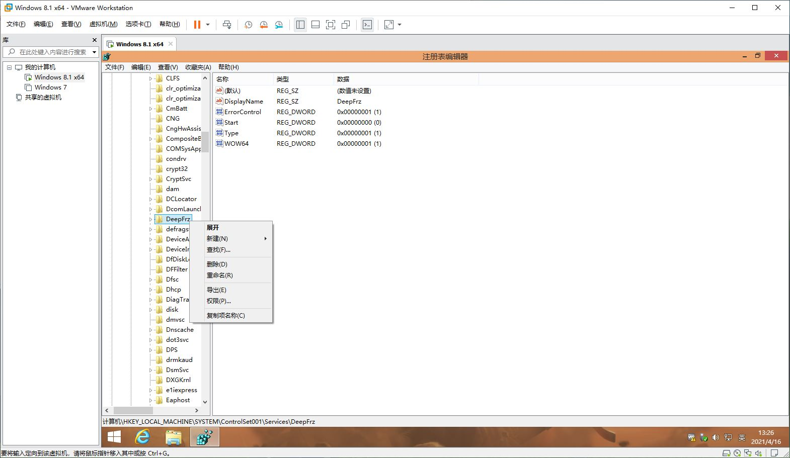
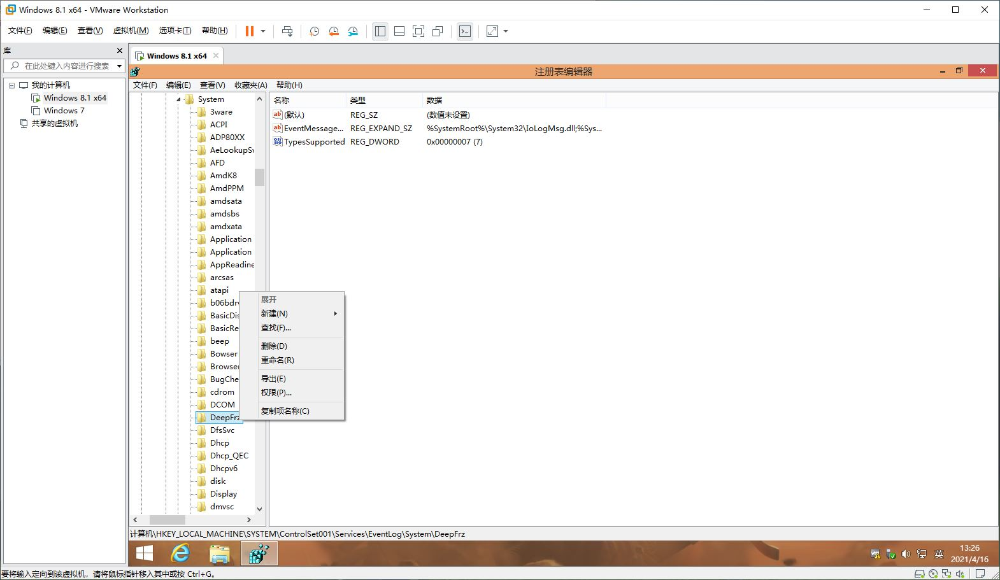

* 冰点还原完全清除完成，如需再次使用，可再次安装。
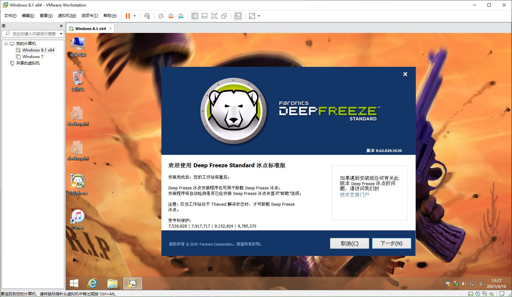
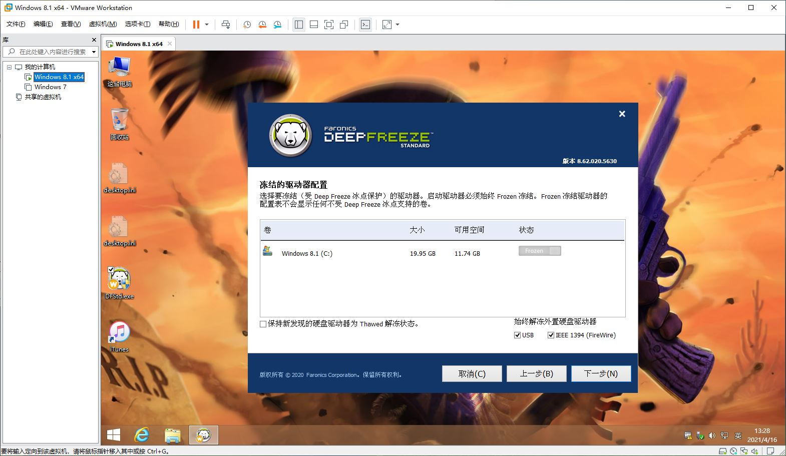