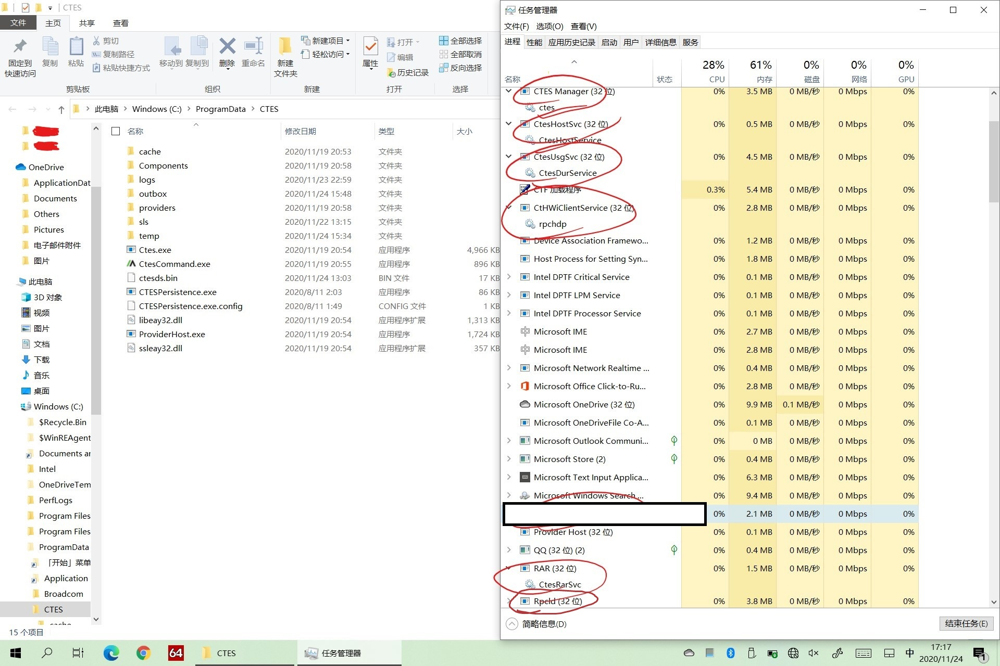
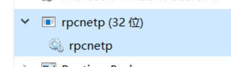
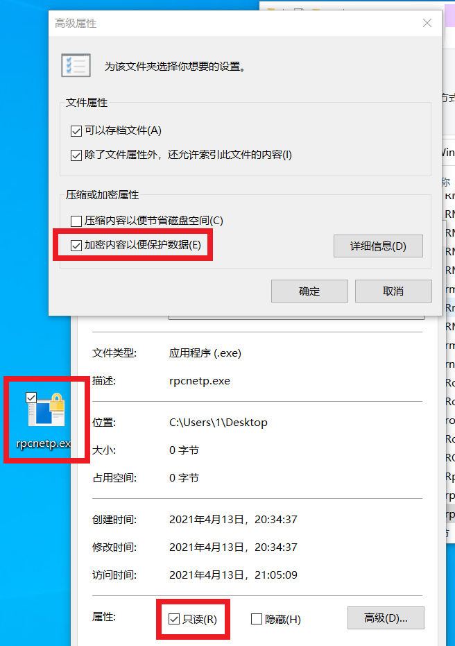
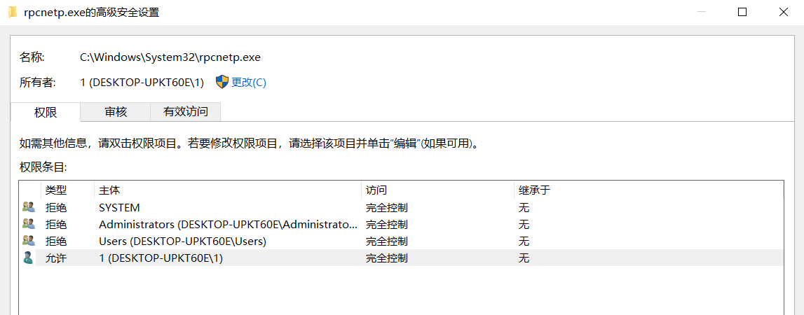
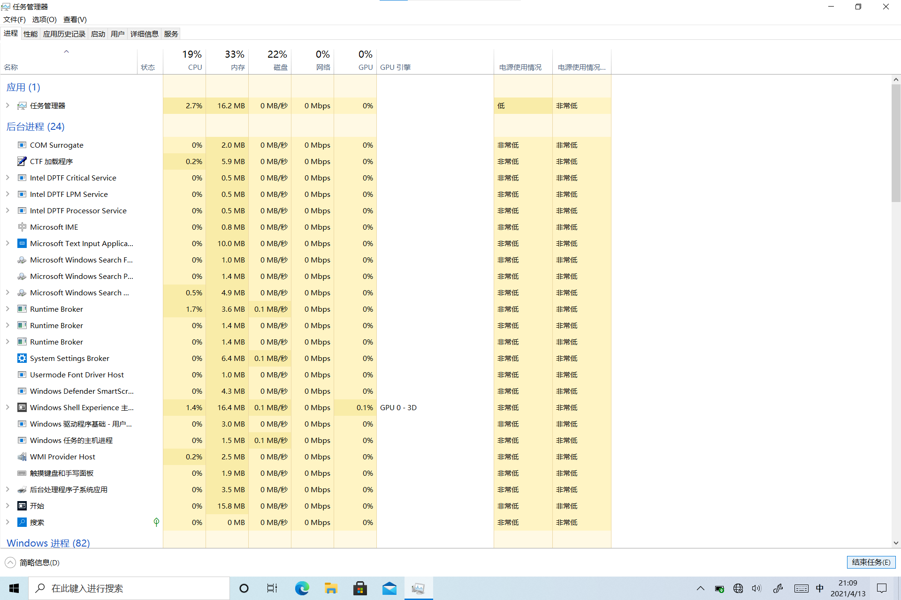

# 清除Absolute防盗追踪软件

> 内容仅供学习和参考，禁止用于非法用途。
>
> 内容仅供学习和参考，禁止用于非法用途。
>
> 内容仅供学习和参考，禁止用于非法用途。

# 起因
由于学业需求,从某鱼上捡来一台Surface 3，使用一段时间后发现疑似存在恶意软件，且重装系统无法清除，BIOS设置内无任何设置选项。

1. 疑似恶意程序&进程

2. 强制托管Chrome,插件名也极为邪恶

后面发现是Absolute公司的一个防盗追踪软件，国内部分大学官网已提供解决方案，但在我的Surface上均不起作用，故找出了新的解决方案。

# 分析
程序固化在BIOS固件中，最佳方案为换主板/刷BIOS。但以上方法并非最低成本解决方案。

经过简单分析，程序固化在BIOS中，仅有rpcnetp.exe一个文件，每次电脑开机时自动检测并嵌入到Windows系统中，如果电脑中没有完整的Absolute软件，等待连接到网络后将自动下载并安装，以此使软件保活。

# 实施
清除方案：
* **以下过程需要全程断网** 
1. 重置系统，进入系统后在进程列表能找到名为rpcnetp的进程(以服务形式)

2. 在桌面上新建一个txt，命名为rpcnetp.exe(需更改拓展名)
3. 更改桌面上的rpcnetp.exe文件属性，勾选“只读”、“加密内容以保护数据”。

4. 更改桌面上的rpcnetp.exe文件属性，“高级安全设置”内将 **STSTEM** , **Administrators** 设为 **拒绝完全控制**。

5. 保存桌面上的rpcnetp.exe的文件属性
6. 打开任务管理器，结束**rpcnetp**进程
7. 将桌面上的rpcnetp.exe拷贝到 **C:\Windows\System32** 并选择覆盖已存在文件。

# 重启电脑
此时**重启的开机速度**会比之前的开机速度慢30秒左右，但**不影响**关机后再开机的开机速度

> 前提：启用了“快速启动”功能并能够正常运作。

系统启动后，任务管理器已不存在rpcnetp进程，Absolute防盗追踪软件已被移除且在重装系统前无法自动修复和启动。(**前提：请勿删除从桌面替换的"C:\Windows\System32\rpcnetp.exe"** )

**清除已完成，连接到网络，正常使用电脑即可！**