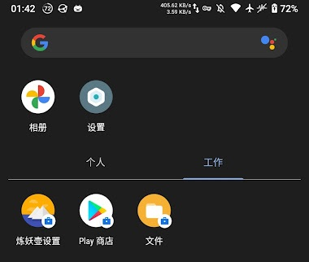
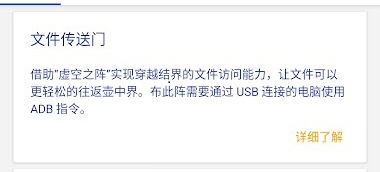
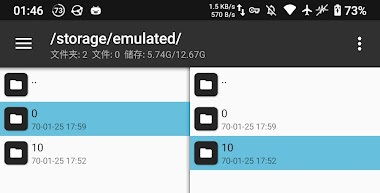
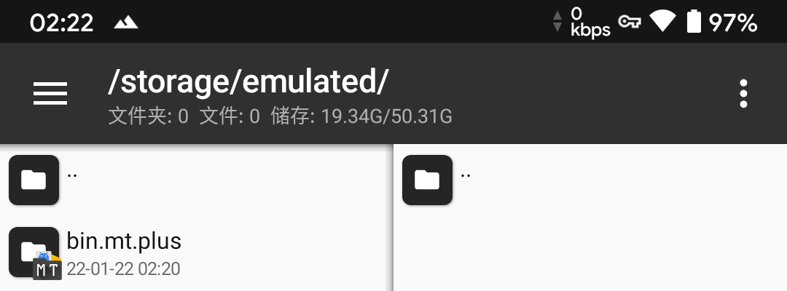
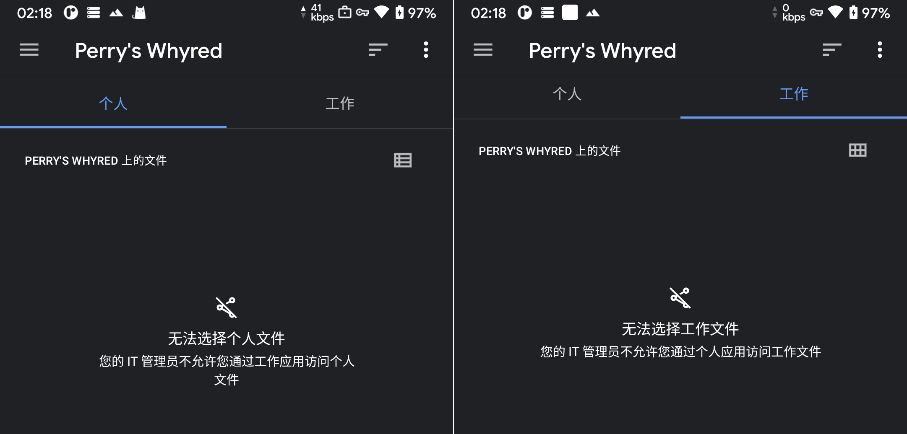
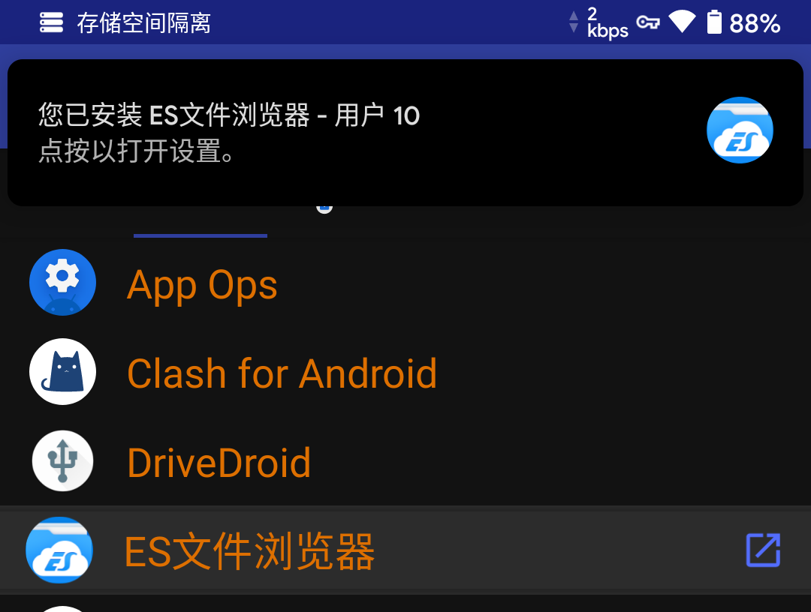
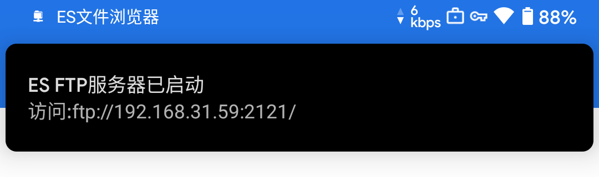
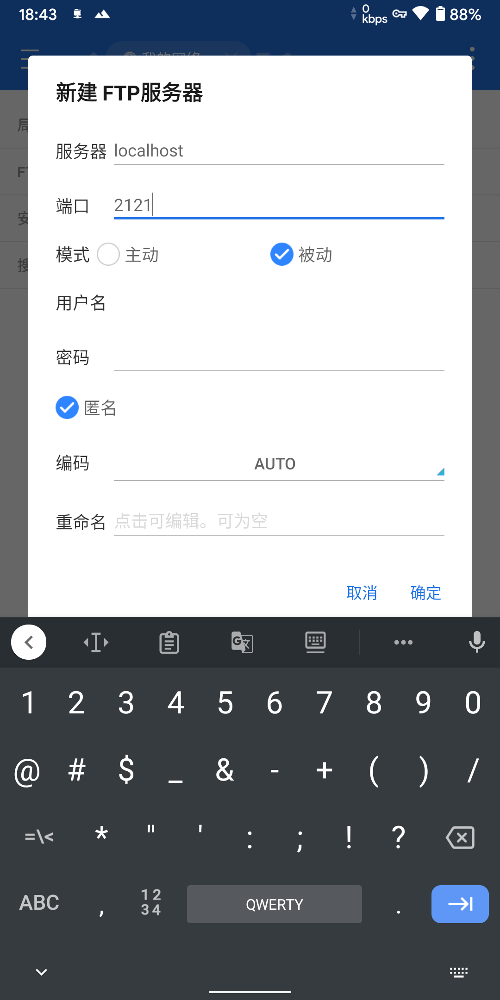
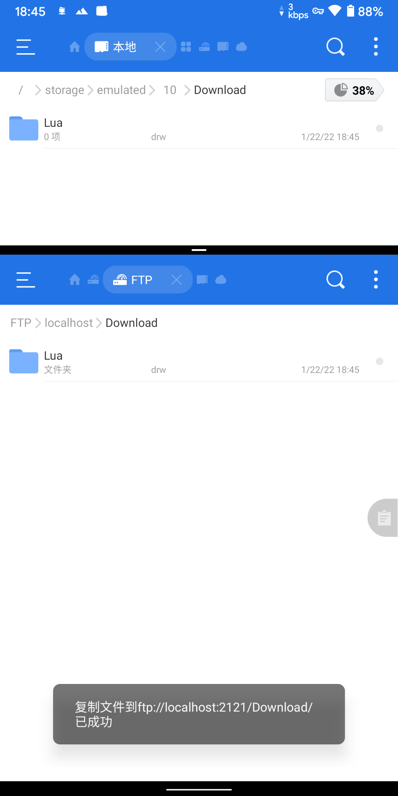

<!-- # 如何在island(炼妖壶)中实现双向文件访问 -->

## 事件

- 在（类）原生Android下，要使用双开或者隔离不同应用，island是很不错的选择，用完之后还能直接把“工作区”禁用，而达到杀后台效果，禁用后也不用担心“工作区”的应用会唤醒自启。

- ~~偶尔~~常常会有一个需求，要让“工作区”和“个人区”的数据访问，island也提供了双向访问的方法“[**文件传送门**](https://github.com/oasisfeng/island/blob/gh-pages/files.md)”。

  - 然而，这个方案在我的手机上并不可用。~~（我也忘了是什么原因了）~~

    

- Android 10及以下版本，还可以用 **root + mt管理器** 来实现双向访问，毕竟其实就是双用户而已。

- 但是，Android 11或以上版本， **root + mt管理器** 已不再可用，于此同时，island的“[**文件传送门**](https://github.com/oasisfeng/island/blob/gh-pages/files.md)”在我的手机上依旧无法使用。

  - Android 11+：你**root**就是能不申请权限直接访问data，我也不让你访问emulated！

    

  - Android 11+：你**文件传送门**能跨区授权算我输！

    

- ~~于是我乖乖下了个TG和QQ用来让这两用户传文件~~

## 解决

- 同一台手机上还要用QQ/TG来传文件？离谱！

- 稍加思考，想起来好像有个叫FTP的东西，同一台手机，而且还是 ~~\*\*文明用语\*\*~~ localhost。。。

- 随便从“个人区”分身一个文件管理器到“工作区”

  

- 从“工作区”文件管理器打开FTP远程管理

  

- 从“个人区”文件管理器添加FTP服务器

  

- 搞定！

  

