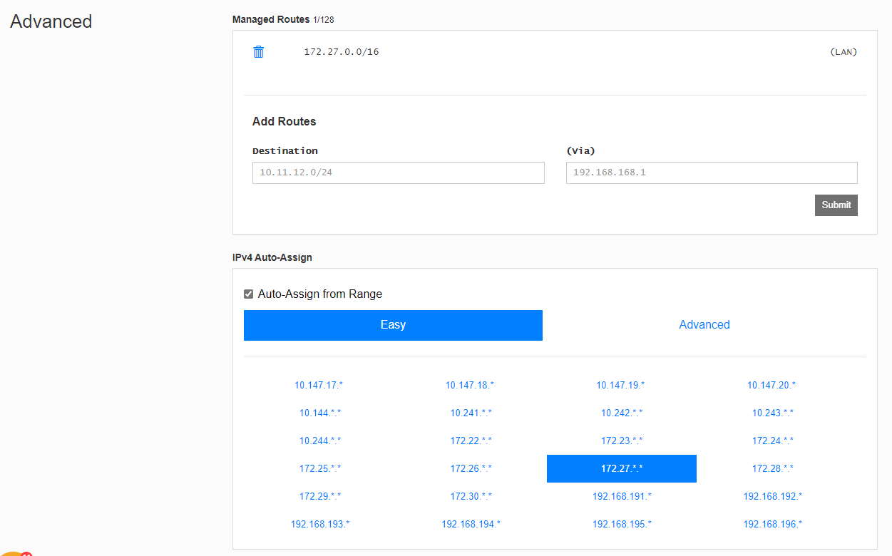
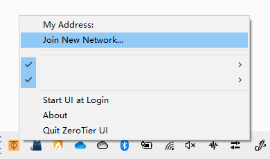
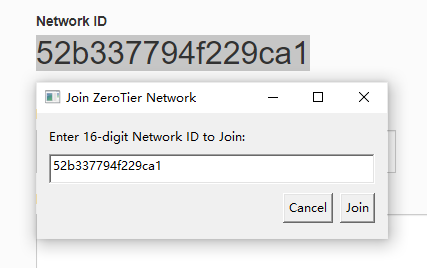
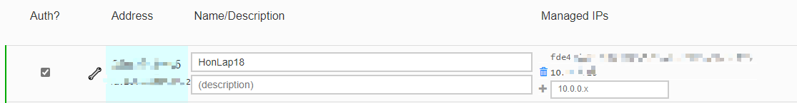
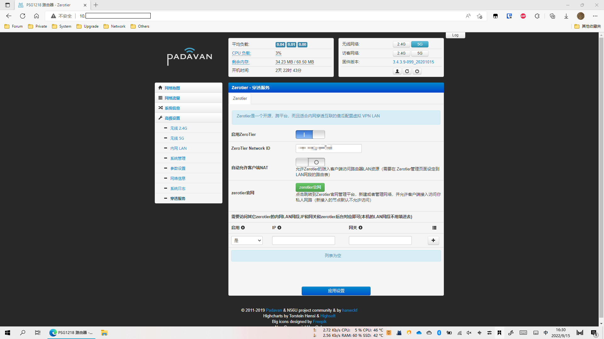
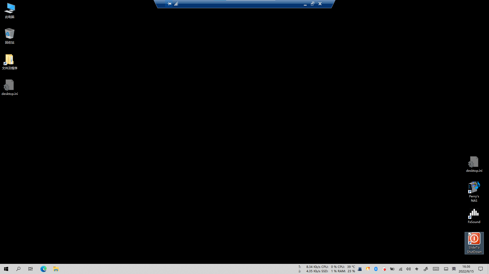

## 网络搭建

注册账号

[ZeroTier – Global Area Networking](https://www.zerotier.com/)

创建网络

[ZeroTier Central](https://my.zerotier.com/)

配置 IP 分配 (可选)

下载客户端

[Download – ZeroTier](https://www.zerotier.com/download/)

## 设备配置

加入网络

授权访问并配置IP

确认防火墙允许通过，。

另一台设备同理

## 使用方式

直接用配置的 IP 访问即可。

如访问 Web 服务：

如 RD：

## *

实际效果因网络环境而定，若延迟过高可配置 Moon；

参考链接：

1. [Jonnyan404/zerotier-planet: 一分钟自建zerotier-planet (github.com)](https://github.com/Jonnyan404/zerotier-planet)

2. [Jonnyan404/docker-zerotier-moon: 🐳 A docker image to create zerotier moon in one step. (github.com)](https://github.com/jonnyan404/docker-zerotier-moon)