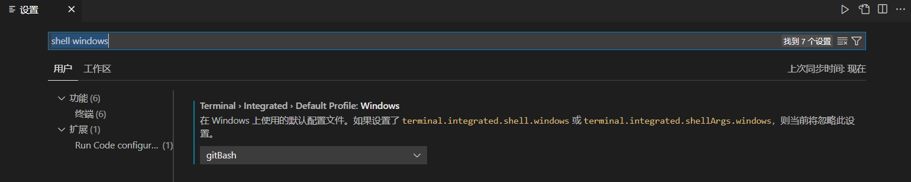

settings.json 加入

```json
{
	"terminal.integrated.profiles.windows": {
        "gitBash": {
          "path": "D:\\Program Files\\Git\\bin\\bash.exe",		//这里是的的bash路径
        }
  	},
  	"terminal.integrated.defaultProfile.windows": "gitBash"
}
```


1. 文件->首选项->设置，打开设置

1. 搜索 `shell windows` ，设置gitBash

