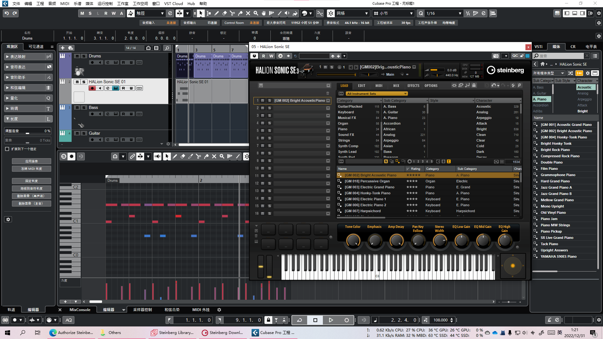
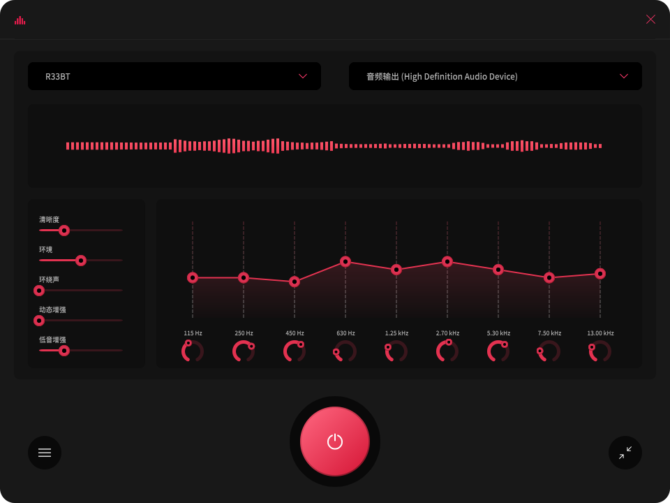
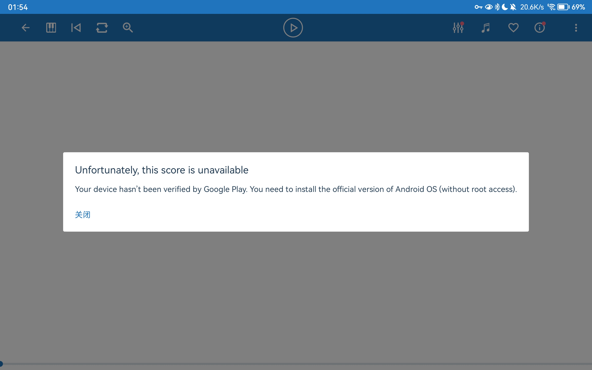
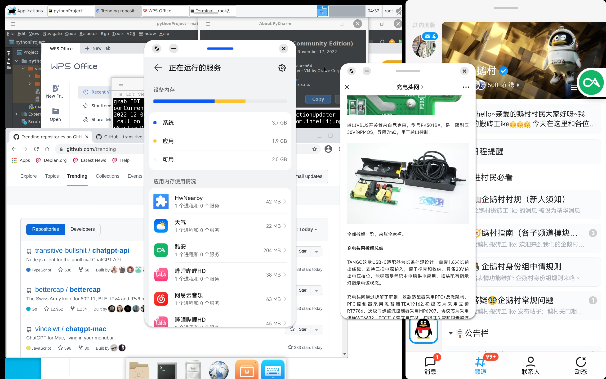
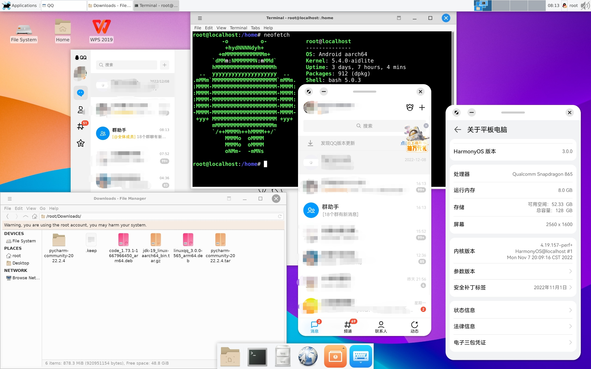
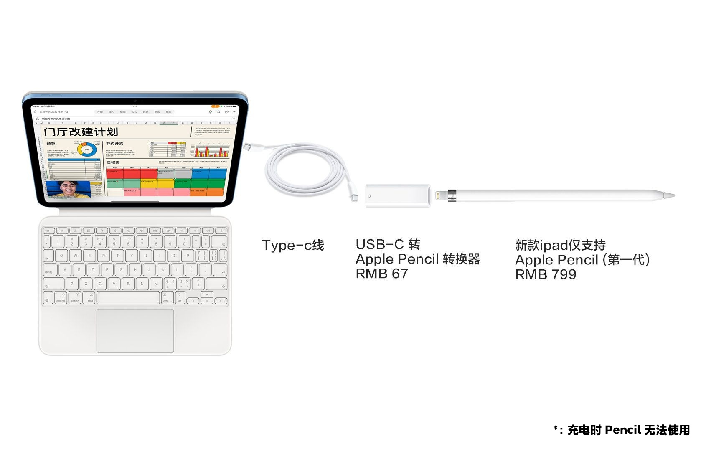
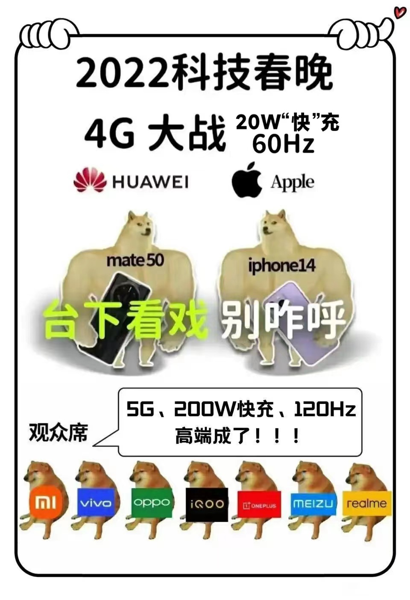
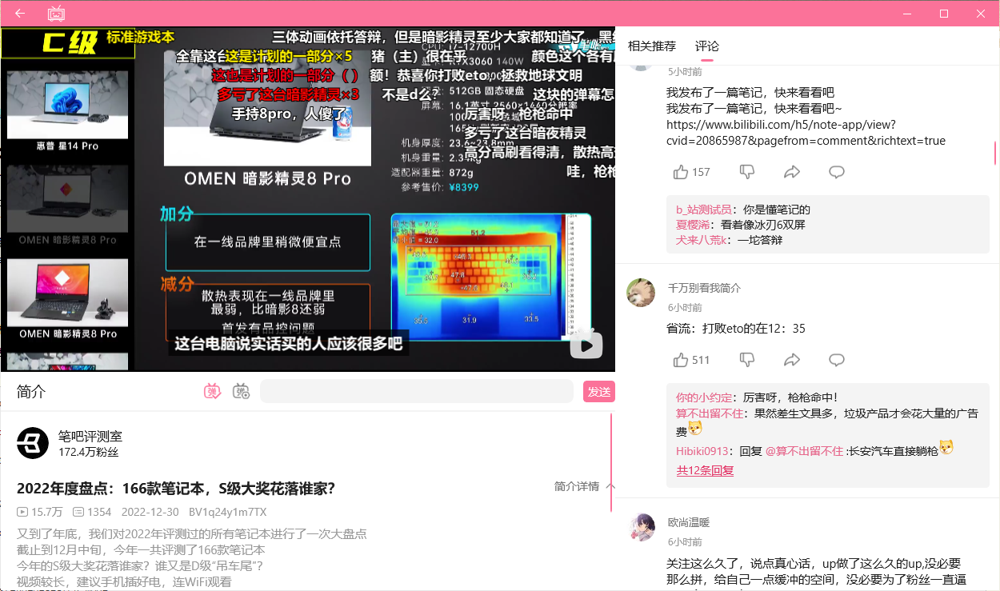

  ~~2023.1.4：修复了一些错误，新增了一些错误，新增了一些内容，删掉了一些内容~~

## 叙言

混科技圈的第十年，~~好像也不是毫无成就~~。

## 业内杂谈

**计算机网络 巩固**

除了理论，顺便还学了下 Cisco & HUAWEI 的命令。

也去参加了 2022 华为 ICT 实践赛  ~~虽然没上岸~~

**Android 开发 入了个门**

​	怎么说我也是个 2013 年前就开始玩 Symbian 刷机的人，2015年就开始玩 Android 刷机的人。

**网络安全 也入了个门**

​	Web安全和内网攻防都打了些靶场，免杀之类的，也因为有底子，也能找到比较不错的方法。

**前端开发 捡了起来**

​	好久没写前端了，跟着练了几个项目。

## 一些荣誉

- “美亚杯”第八届中国电子数据取证大赛 团体赛学生组 国家二等奖

- 第四届“长安杯”电子数据取证竞赛 国家二等奖

## 余暇时刻

**音乐**

去年学了点钢琴，但是今年因为各种原因很少碰了。（~~恨死某学校的层层加码了，~~ 好消息是年底终于放开了。）

吉他 有想过，但是指甲，而且歌单里有人声的歌 99% 都是女声，甚至 99% 都是我不会的日语，放弃。

所以学乐理去了，有乐理到时候再继续学钢琴也会更方便吧。

编曲也是摸了下大概摸了下，等乐理学的七七八八的时候再试试编曲吧。

> 赶在 2022 结束前一个月，把乐理基础学完了，考试成绩 88，也算是入门了。

**摄影**

玩了下微单，后期能力跟之前相比可以说是突飞猛进。

手机摄影跟去年相比进步还是挺大的，得益于 AGC & LMC 拯救了我的 IMX 582，

现在拍照也会思考构图&预留后期了~~除非赶时间~~，出片率跟去年相比也是高了很多。

> 下次换手机一定换个有长焦的，有条件的话就上个潜望。

**天文**

入门天文挺简单，但是玩了一会就没继续了，因为设备&时间&环境受限。

> 等什么时候有机会进山在玩吧

## 来年展望

**业内**

- 学了那么多年了，当年的兴致可以说已经基本没有了，加上目前的形势，可以说是厌学越来越严重了，~~实在不想走了就转行吧~~。
- ~~现在这个形势，还是见步走步吧。~~ Covid-19 放开了，希望会有好转吧。

**一些业余Flag：**

- 学点日语

- 编首曲子

  > 差点就想把黑苹果升级下用 Logic 了，还好 Cubase 翻了些资料，也是搞定了，~~音色库只装了一个 别的还没装~~。
  >
  > ~~强迫症一定要用最新版 而且不能花冤钱~~
  >
  > 这些工业软件的安装/卸载程序真的是写得一个比一个烂，莫名奇妙的安装失败，两个 `%appdata%` 里也翻不到日志，日志都不知道在哪，只能靠经验+资料去找原因。。
  >
  > 

**不算Flag的Flag**

- 挖掘一下华语乐坛。
- 要不要把吉他捡起来？ ~~不太想~~
- 要不要买飞机？
- 画一下自己的 “脑图”

## 小概小节\*

混是混了十年了，什么都会，但都只会一些，好像没什么特别精通的技术，可以说是学的越多越懵，越不知道到底走哪个好。。

&nbsp;&nbsp;&nbsp;&nbsp;好消息是，因为基础好所以现在学什么都学得比较快就是。

&nbsp;&nbsp;&nbsp;&nbsp;明明在学校醒着的时候基本上 80%+ 的时间都呆在自习室，

​	&nbsp;&nbsp;&nbsp;&nbsp;明明一直都在学东西了，好像学到了些什么，好像又没学到些什么。。。

​	&nbsp;&nbsp;&nbsp;&nbsp;也不知道哪来的时间看的那么多视频，可能很多都是两三倍速看的吧，~~也可能是在家里躺的时候看的~~。

在家就容易想躺，除了闲暇兴趣是正常效率，别的基本都是低效学习了，希望能早日克服一下，~~不然对不起我的升降桌~~。

> \*小概小节：小（概小）节 ，~~4/4: 四分音符为一拍, 每小节有四拍，~~ 同音“小结”
>
> \*概：概括的概。

## 附一：数码罐子

**云测评 & 云总结**

今年没有什么产品是比较亮眼而且缺点也不明显的，比烂倒是一大堆。

好消息是 秋季开始发布的手机终于开始用上高频 PWM 或 DC 调光的 OLED 了，坏消息是用 LCD 的手机看起来要无了。

​	&nbsp;&nbsp;&nbsp;&nbsp;秋季过后还是瞎眼屏的手机 ~~印象中好像只有~~ iPhone 14 (含Pro) 全系了，

​	&nbsp;&nbsp;&nbsp;&nbsp;Android 那边最后一台瞎眼屏手机好像是 7 月的 Xiaomi 12S Ultra？

​	&nbsp;&nbsp;&nbsp;&nbsp;也好像 9 月发的有些机器标配还是瞎眼屏？好像是 Mate 50 (标配) ？

​	&nbsp;&nbsp;&nbsp;&nbsp;结果 12 月 Xiaomi 13 (标配) 也只摆脱了瞎眼低频PWM，没上高频 PWM，只有类DC。

​	&nbsp;&nbsp;&nbsp;&nbsp;简评：瞎眼屏什么时候凉啊。。。

**今年下单的产品**

- EDIFIER R33BT

  之前那套音响用了不知道多少年了，~~粗略估计十年以上~~，然后看在体积还可以的份上入了这个 200 价位的音响，也不指望原厂调音有多好了。

  只说缺点：

  ​	&nbsp;&nbsp;&nbsp;&nbsp;高低音不能独立调节，高频不太行，声音偏闷。

  ​	&nbsp;&nbsp;&nbsp;&nbsp;蓝牙不太好用，虽然每次开机都会自动回连上次连接的设备，但是总有些 ~~\*\*文明用语\*\*~~ 厂商或系统 不间断扫蓝牙，扫到就自动连上去，加上我经常忘了上次连的是谁。。。以至于我每次用蓝牙功能的时候，都得把几台手机电脑平板全翻一遍 看看是 ~~\*\*文明用语\*\*~~ 哪台设备抢了我的音响。。。至于音响上所谓的“强制断开”功能，就是重置音响，把所有设备都给取消配对，这又导致了我的几台手机电脑平板得全部重新链接配对。。。然后无限循环以上流程。

  解决方案：

  ​	&nbsp;&nbsp;&nbsp;&nbsp;电脑全部用有线，声音问题因为高中低频单元的体积还可以，所以拉均衡器能拉回来，把他的声音调到听着舒服就行。

  

  ​	

- OPPO Enco Air 2

  这耳机买之前见挺多人说他 129 还是 133 的 ROM 有 Bug ，可能用一段时间有一边会挂掉，某东 12X 上的车（PDD 价格能砍到 89 附近），图他的售后，~~结果发现绿厂的售后是双向包邮的而且据说体验挺好~~。

  用了大概半年，声音比想象中要好很多，大概在 EarPods 附近，低频比 EarPods 强，高频 EarPods 感觉更突出一点，APP 里也能切换调音模式，续航单次使用大概五六个小时？印象中一天戴 12 个小时附近，一般中午和晚上吃饭的时候让他充会电，充电的时候好像还能剩下 30 ~ 40%？充电盒大概 1.5 天一充。

  多设备切换的体验，本来比 AirPods Pro 舒服~~（因为这玩意一旦离开 Apple 生态就会出各种奇奇怪怪的问题）~~，但是后面 ROM 更新了之后就是依托答辩。

  坏消息：身边有朋友的这耳机已经有一边挂了。

  好消息：我的目前还活着，然后这耳机能抓包把 ROM 降级。

- iPad Air 5 (M1)

  ~~不 是 我 在 用，~~ 只能说 iPad 不符合我的需求吧，Goodnotes 和 Notability 这两软件缺失的基础功能也过于致命，没有双页预览，纸张不能自由移动，没法用。跨系统平台也仅限于 Apple 设备，设备太杂看笔记不太方便，iPad 端 OneNote 只有模拟笔压，连物理笔压都没有，Surface上写 iPad 上看笔记还可以，iPad 上写还是算了吧。做笔记方面对我而言不如数位板 + 电脑或者 Surface，不过用来看谱和玩玩游戏还是不错的 ，~~主要是 iPad 不会给我降频降亮度~~。

- MatePad 11

  一套下来 3K ，性价比还不错，安卓平板的生态也比想象中要好不少，常用的软件除了网易云和百度云，~~基本上都适配了~~，后面发现原来国内看视频的只有爱奇艺和哔哩哔哩适配了 HD，别的都是平行视界。

  网易云用平行视界的不能说好用，但也不能说难用，百度云我是基本没打开过 ~~毕竟是 10KB/s 用户~~，主力的阿里云盘和 OneDrive 都适配了。

  但是某个看谱 App 更新之后，必须得过 CTS 才能用，这破板子就看不了了。

  

  

  [笔记部分图文](https://www.coolapk.com/feed/38166396)

  ​	&nbsp;&nbsp;&nbsp;对于我的需求，也不如 Surface + OneNote（除了延迟）。

  ​	&nbsp;&nbsp;&nbsp;另 · 113 固件的 M-Pencil 2 不好用。

  
  
  小试一下 865 + 8G 的性能（性能模式Off）：还是挺强的，只有点轻微卡顿，掉帧几乎没有。
  
  > 前台：WeChat OS运行浏览器 + UE4开发的3A大作QQ + 原生Linux on ARM + WPS Desktop + PyCharm Desktop + Chromium Desktop 两个标签。
  >
  > 后台： 网易云听歌 + 酷安 + 哔哩哔哩 （+ 一堆系统预装App）
  
  
  
   2022.12.30 腾讯QQ 官网上架了 Linux ~~Electron~~ 版，支持 amd64/arm64 ，可正常运行。
  
  > 目前**试过能不出意外**的跑在 ASL ARM64 上的原生应用 ~~以防忘了~~：
  >
  > 基本兼容\*：VSCode
  >
  > 完美兼容：Firefox, Chromium, PyCharm, IDEA, WPS, QQ。
  
  

- 不简的简评

  永远讨厌电容笔这种辣只因玩意，搞私有协议就搞私有协议，就这挤牙膏还 ~~\*\*文明用语\*\*~~ 连自家的设备都不能向(上)下兼容。（特指 Apple Pencil & M-Pencil）

  还是电磁笔好用，主要是通用性强，适合我这种设备乱七杂八的人。（指部分 S-Pen & Surface Pen 等） ~~除了某些电磁笔的延迟，和某些系统上的软件的笔适配情况~~
  
  平板谈电子笔记：
  
  ​	&nbsp;&nbsp;&nbsp;&nbsp;Goodnotes、Notability、云记、享做、Notein、OneNote 等，全都只能说是基本合格。
  
  ​	&nbsp;&nbsp;&nbsp;&nbsp;要说有没有勉强能碰到良好的，那好像有那么一两个： 三星笔记 + OneNote （+享做）的组合。
  
  平板谈生产力：
  
  ​	&nbsp;&nbsp;&nbsp;&nbsp;iPad 能跑 Davinci，Android Pad 能跑原生 Linux/Win11。
  
  ​	&nbsp;&nbsp;&nbsp;&nbsp;说平板是生产力的人，现在在用什么搞正经生产，答案已经很清楚了。
  
  ​	&nbsp;&nbsp;&nbsp;&nbsp;至于 OTA ，看看苹果的 Stage Manager，华为的 PC Engine 有多少平板能用？

**眼前一亮的产品**

- 小米 12S Ultra （含概念版）

  对于手机拍照爱好者来说，这个 IMX 989 、模组设计和成像很难让人不爱啊。

  ~~但是这个频闪 360Hz 的瞎眼屏是几个意思 ？？？还有万年不变的 USB2.0。~~

- vivo X90 Pro +

  优点与上基本相同，那颗 ToF 真香。

- iPad Air 5 64G **涨价前的教育优惠版**

  虽然这板子除了 M1 + 8G 好像没什么特别之处了，系统维护时长也能算一个，感觉这板子会维护到 2030+

  但是 3999，即使不是开学季不送耳机 M1 也还是很香的。

  ~~虽然不太符合我的需求，现在也沦为某人的爱奇艺了，后面还涨价了。~~
  
  

**两眼一黑的产品**

- 所有 Snapdragon 888 & 8 Gen1 产品

  理由：SOC + 三星代工 = 依托答辩。

  包括但不限于：三星Galaxy S22、华为P50、荣耀X40 GT、小米 12 Pro、Redmi K50 电竞版、OPPO Find X5 Pro、一加10 Pro、vivo X80 Pro、iQOO Neo6。*

  > *排名不分先后
  >
  > 你可以永远相信三星工艺

- iPad 10

  全面屏 但是 非全贴合 没有抗反射涂层 还是果冻屏

  USB-C 但是 Apple Pencil 1 和 USB 2.0

  双边开孔 但是 双扬声器

  ￥3599  64G 起步

  简评：Apple 官方认证的依托答辩，认证方式为 iPad 10 发布后，其他 iPad 全系涨价，连上一代 iPad 9 都涨了，而几乎同期 AirPods Pro 则全系降价。

  

- iPhone 14 Pro 系列

  我只想要一块（尽可能）完整的屏幕；

  完全无法接受 “灵动岛” 这种设计，他不一定差，但非常令人恶心。

  从刘海换到这个方案后，屏幕纵向显示的内容还反倒变少了，顶部浪费的空间比刘海还多。

  这些 [Live Activities](https://developer.apple.com/design/human-interface-guidelines/components/system-experiences/live-activities)，他有必要无时无刻最高优先级显示出来吗？

  咱就看这个 Dynamic Island 什么时候成为下一个 Touch Bar。

  

- iPhone 14 Plus

  好消息：刘海屏，不是灵动岛。

  坏消息：￥6999 起，20W，60Hz，A15。
  
  简评：Apple 跟 HUAWEI 一样被制裁了？

## 附二：吉其其他\*

**补番组**

> 回想上次看番还是四五年前。
>
> 为什么又开始看番了？
>
> 因为歌荒。

- 来自多彩世界的明天

  主观评分：7

  简评：给当年好像挺喜欢的 PA 一点面子补的

- 白沙的水族馆

  主观评分：7

  简评：给当年好像挺喜欢的 PA 一点面子补的

- 我的青春恋爱物语果然有问题。

  主观评分：8 - 9

  简评：N 年前因为番名看着怪而错过的好番

- 我的青春恋爱物语果然有问题。续

  主观评分：8 - 9

  简评：N 年前因为番名看着怪而错过的好番

- 我的青春恋爱物语果然有问题。完

  主观评分：7

- 出租女友 S1

  主观评分：2

  简评：基本全程 3 倍速，12 分好评，这是溢出来的 2 分，还是看在 OP 的份上给的。
  
  > 唱 [OP](https://music.163.com/#/album?id=91983411) 的 the peggies 停止活动了，可惜。
  >
  > [2022年9月末を持って活動休止を発表した the peggies。メジャーデビューシングル「ドリーミージャーニー」から最新シングル「ハイライト・ハイライト」までの人気曲に加え、未発表の新曲「CHEESE!」や、インディーズ時代の代表曲の新録音源「グライダー(2022)」を含む全17曲入りの豪華ベストアルバム。](https://music.163.com/m/album?id=150245306&userid=249726190)

**~~2022冬季番组~~**

**2022春季番组**

- 间谍过家家（上半）

  主观评分：6

  简评：前面几集挺好，到后面有点高开低走，能遍地打广告宣传那么狠，经费肯定很足吧，那说明还有很大提升空间，~~还是说日常番不太适合我~~？

- 相合之物

  主观评分：10

  简评：治愈神番，没！有！缺！点！也是今年唯一一部看了不止一遍的番，反正心情不好的时候随便点开一集来看就得，它会告诉你一切都会好起来的。
- 夏日重现

  主观评分：8

  简评：距离 9 差了点 BGM。

**2022夏季番组**

- 莉可丽丝

  主观评分：6 - 7

  简评：割裂感 + 配角工具人，前面还能接受，最后几集就是烂。

- 契约之吻

  主观评分：7 - 8

  简评：乐子番，最后那几话印象中好像还不错。

- 出租女友 S2

  主观评分：4

  简评：基本全程 3 倍速， 这番能 S2 我都觉得厉害，居然还官宣 S3 了，搞不懂。

- 继母的拖油瓶是我的前女友

  主观评分：7

  简评：~~不记得讲什么的了~~。

**2022秋季番组**

- 间谍过家家（下半）

  主观评分：7 - 8

  简评：观感比上半好了不少

- 孤独摇滚！

  主观评分：9 - 10

  简评：主要是解决了我的歌荒问题，剧情 & 人物刻画都不错；
  
  ​			缺点大概 4 - 7 有一集对波奇的心理场景过长，一个字 腻；
  
  ​			看在《星座になれたら》的编曲的份上，把这分给拉回来了 。
  
  > [TVアニメ「ぼっち・ざ・ろっく！」劇中曲「星座になれたら」を弾いてみた by 三井律郎 - YouTube](https://www.youtube.com/watch?v=6wAQRxcLUeE)

**国漫组**

- 三体

  主观评分：不知全貌*

  简评：不予置评*

  

**电影**

- 流浪地球

  主观评分：9

- 黑客帝国 1 - 4

  主观评分：9 8 7 7

  简评：3 直接完结掉就挺好，片里某些套路看多了会腻，下一部还是那些套路就差不多能降到 6 了。

**动画电影**

- HELLO WORLD

  主观评分：7 - 8

  简评：印象中好像剧情还不错

- 天气之子

  主观评分：7

  简评：~~不记得讲什么的了~~

- 昨日青空

  主观评分：7

  ~~不记得讲什么的了~~

- 肆四青春

  主观评分：5

  简评：广州段嘅白话，听到我想呕。

> \*吉其：及其
>
> \*吉其其他：吉（其其）他 

## 附三：年度歌单捷径

[NetEase Music](#)

[Spotify](#)

[QQ Music](#)

