## 叙言

~~今年都干了些什么事来着。。~~

> 去年定的目标，定的也太模糊了，可能是去年年末刚好 COVID-19 刚放开，觉得存在太多不确定性，什么都不敢定。
>
> ​	可以说都完成了，但又好像没完全完成，一言难尽。

### 今年关键词：FREE

一是不用再担心 COVID-19 导致到处封了；

二是出来工作了，钱没以前那么紧张了；

三是因为买了飞机，虽然还只飞了三个月。

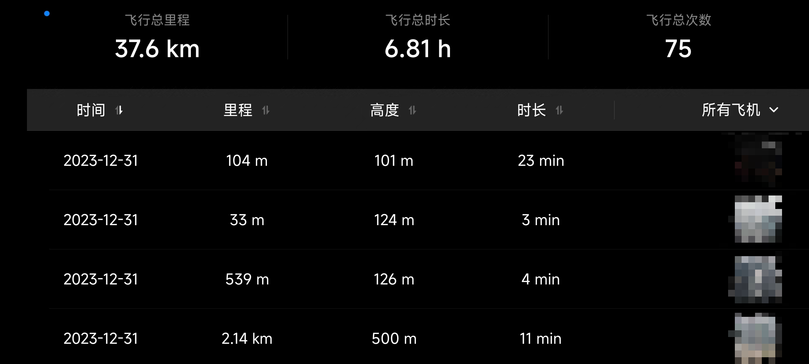

> 每次自己出去飞飞机，都会有老法师过来一起吹水。
>
> 老法师：今天（2023.12.31）早上 400m 就能穿云（雾），错过了。
>
> 天气再怎么差，这也是今年最后 ~~一场日落~~ 一次从天亮到天黑的过程了：

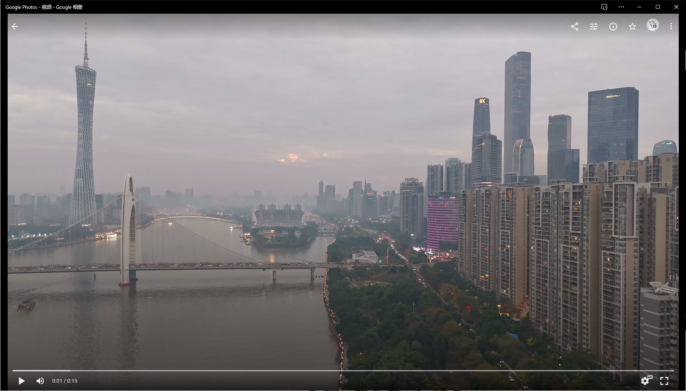

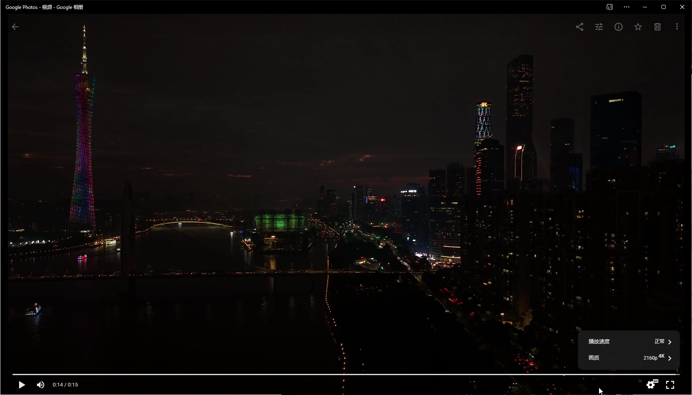

## 毕业 & 工作

**毕业**

- 印象中在学校的期间，基本上就是“前期图书馆，后期自习室”。

- 放一张拿毕业证当天拍的图好了，路过校道突然发现有一个不错的视角，等了一两分钟，拍到了想要的效果：

  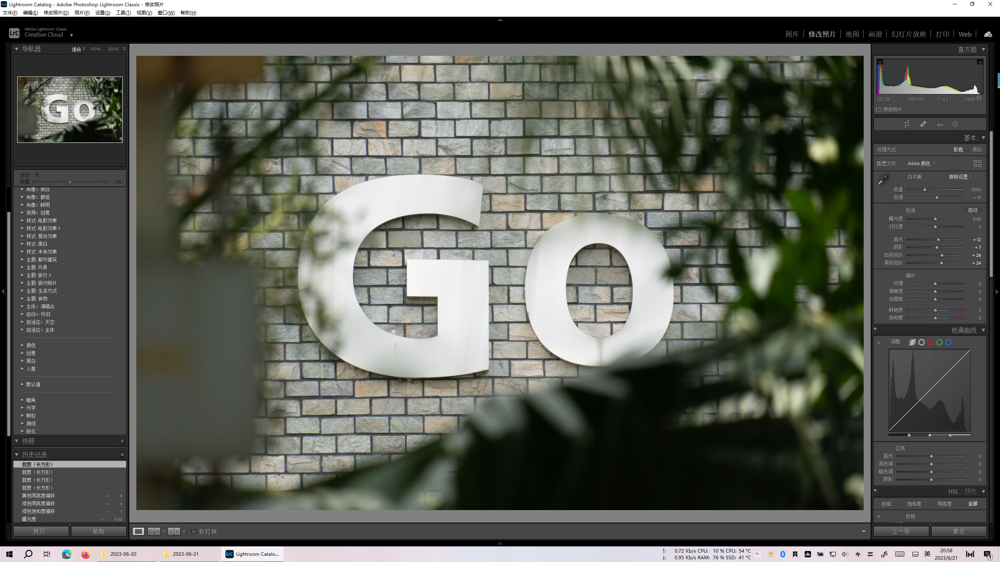

**工作**

- 找到一份目前还挺喜欢的工作，不过能力还是得继续提升就是。 

  - 职位上是网工，实际上什么都要会就是，挺好的。
  - 隔壁桌面实习生硬生生把岗位做成了全栈，组内的需求基本能搞定，太强了。

- 福利是真不错，能获取到的资源也挺多的，比如隔壁的硬件就能借来用一用：

  - All In One？

    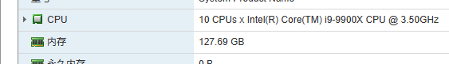

  - 学 AI ？

    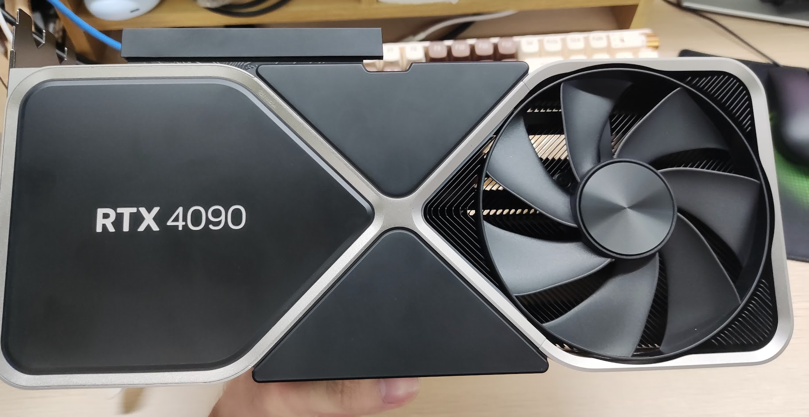

    

> 回想当初实习，是真难熬。
>
> 不过还好熬过来了，还可以吧。

## 劳逸结合

### 各种剧

**番剧**

- 三体（艺画开天）

  主观评分：2 ~ 3

  简评：散了散了，还是去看隔壁腾讯的剧版三体吧，隔壁腾讯剧版强的一批，Netflix 版大概率都没腾讯剧版好看。

- 跃动青春

  简评：~~完了这番讲的什么来着。~~

- BanG Dream! It's MyGO!!!!!

  主观评分：9 ~ 10

  简评：一个片子，两代纠葛，三支乐队分四组人马，五个成员建六个群，平均七个前任，八个代餐，九种组合，十分扭曲。

  另外，他说得基本对：https://www.bilibili.com/video/BV1C94y1p7yk/

- 间谍过家家 S2

  简评：~~只看了前面两三话，后面有空再慢慢看吧~~

**网剧**

- 三体（腾讯）

  主观评分：8 ~ 9

  简评：前面几集印象中节奏稍慢了一些，能照顾没看书的人，虽然有些小缺陷，但总体来说，很有诚意！

**电影**

- 流浪地球 2

  主观评分：9

  简评：国产科幻电影标杆？

  其他：记得当初买了数字生命周边，众筹期最后一天退了，然后好像暴雷降速 USB 3 -> USB 2 了？

- 深海

  主观评分：8

  简评：粒子水墨动画很厉害，剧情不是特别容易看懂，不过混成这样也是比较好过审就是。

- 铃芽之旅

  主管评分：7

  简评：看多了这种类型和剧情，有些腻了。

### 音乐会 & 演唱会

- 《遇见新海诚 -【这次一定】 室内乐团 ACG 音乐会》

  - 票根：

    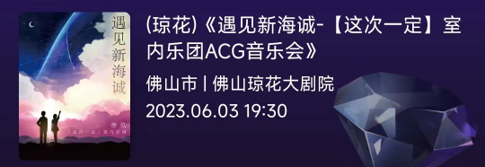

  - 这个剧院一般般，但考虑到价格，那也正常。

- 西城男孩“四海逐梦”演唱会 - 广州站

  - 票根：

    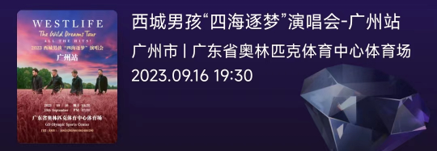

  - 开始抢到 680 的票，想了下觉得不值，退了重抢，成功抢到 480

  - 看台 480 我觉得差不多，680 感觉就不太值了。

  - 至于有没有 “大垫音” ，我们直接看数据：

    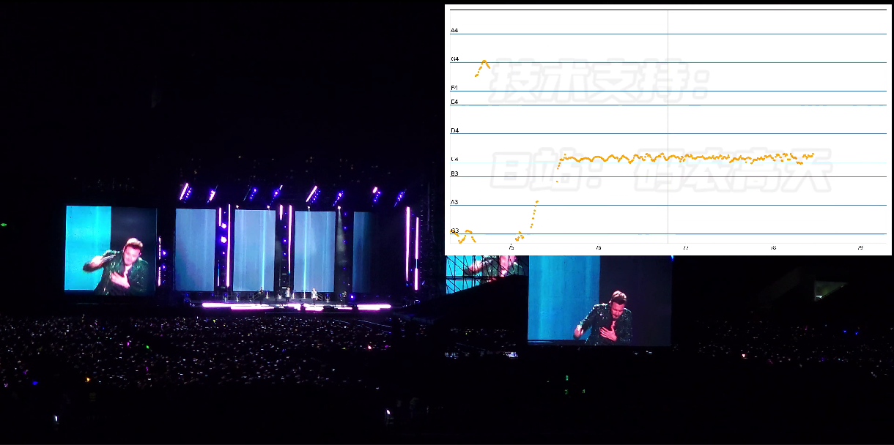

- 五月天2023 好好好想见到你，成都演唱会

  - 票根：

    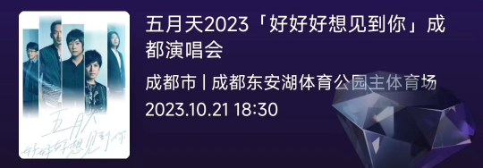

  - 看台 855，开始回看录的视频，怀疑 “大垫音” 有 1/4 附近；
  - 后面看事情好像没那么简单，觉得我还好我主要只是听他们的曲，不是很亏；
  - 再到后面他们自己锤自己，连伴奏都能乱，我都在怀疑以前不会连伴奏都掺了不知道多少假的了，行吧。

> 低情商：
>
> ​		累计被骗 855 + 140 + 480 + 10 = 1485

### 随便走走

~~今年好像也没去哪里，早上 8 点出门，晚上 10 点到家，已经够累了~~

- 成都

  - 规矩有点多，感觉不太自由（不让飞飞机的地方多，进图书馆身上有吃的不让进 等）
  - 不过景点是真的多，部分去过的地方：
    - 2023.10.21
      - 东安湖
    - 2023.10.22
      - 春熙路
      - 太古里
      - IFS
      - 天府广场
      - 人民公园
      - 成都博物馆
      - 四川省图书馆
      - 四川美术馆
      - 四川科技馆
      - 宽窄巷子
      - 文殊院
      - 广州路（非景点）
      - 金融城
    - 2023.10.23
      - 成都大熊猫繁育基地

  >  一个小广场能放几十个保安，还有几辆警车，请问这里是很乱吗？
  >
  > 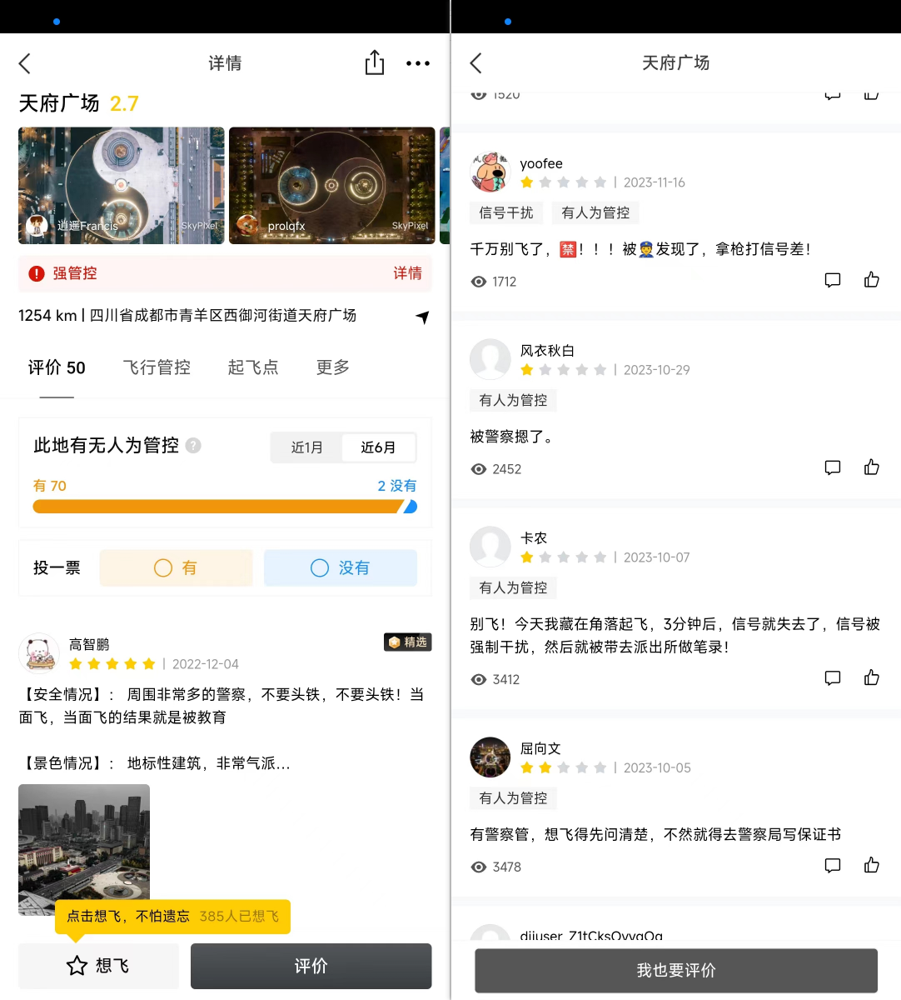

  

- 香港

  - 逛了半天，不过现在去 HK 感觉没什么可干的，有些无聊。

  - 好消息：用消费券白嫖了一顿晚饭。

    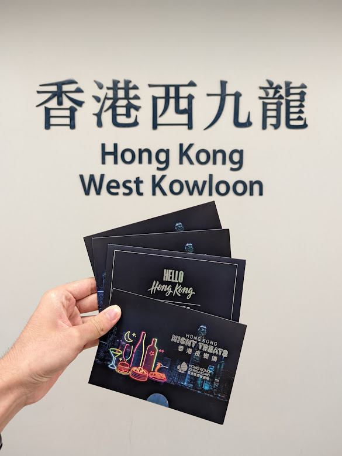

## 数码？

**先放一张照片**

> 果然还是轻便的东西比较愿意带出门。
>
> 要是换成 Sony A7 系列 + DJI AIR 系列，估计大部分时间都在吃灰了。
>
> 当然，这三我最喜欢的地方还是：**能用充电宝充电！**所以我并不需要买多几块电池。

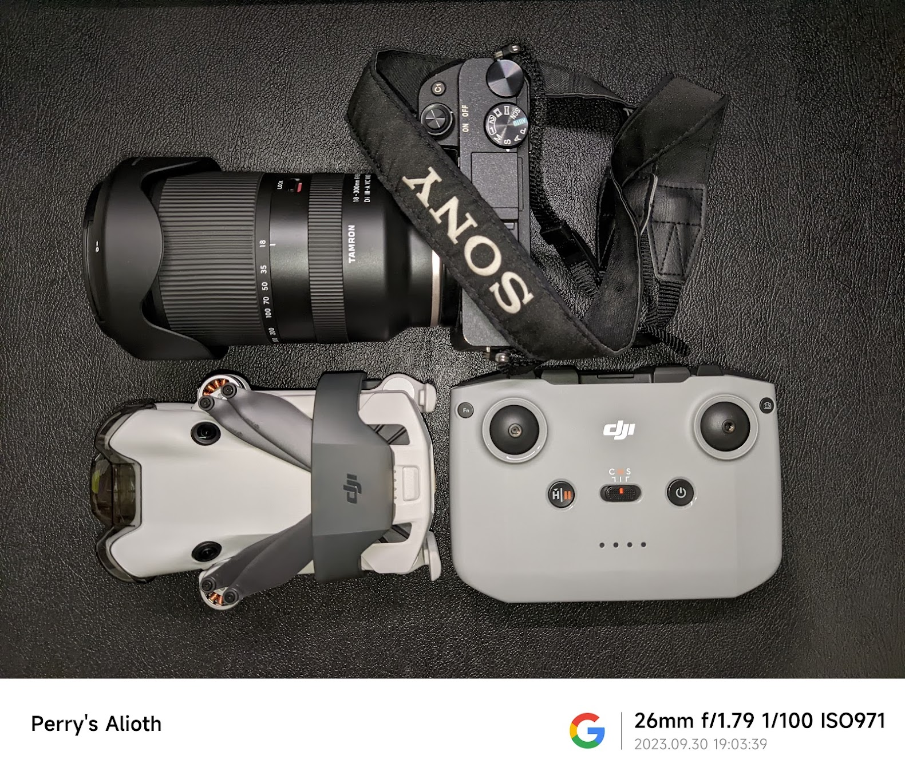

- 公司周年庆当了一回摄影师
  - 是感受到了来自残幅的压力，CMOS 还是太小了，光圈最大进光量不够，快门速度又不能降，长焦段画质全靠后期。
  
    > 还好 ISO 的问题现在能用 AI 降噪解决掉了，再也不用怕切换场景忘记调 ISO 了。
  
  - 小残幅出去玩倒是真的很舒服，18-300 也是一镜走天下完全没压力，但是上正式环境，还是挺吃力的。
  
  - 明年考虑一下 A7M3。

- 很不严谨的拉个距，去某学校的新校区监监工

  > 高度：4m + 499m
  >
  > 距离：2962m 
  >
  > 图传：2/4

  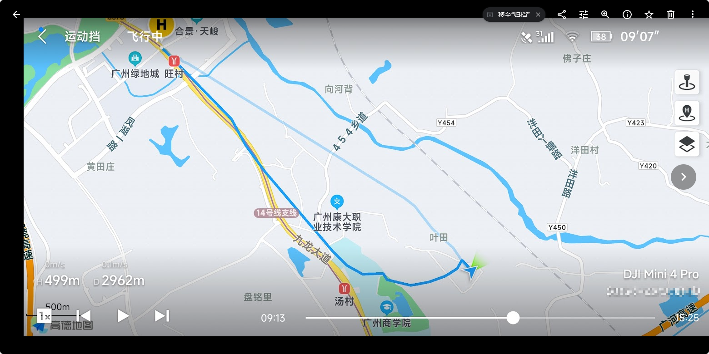

- 明年就大概率只能飞高度 120m 了，今年赶紧把需要 500m 高的地方拍多几张

  > 一个花城广场的保安全加起来，能不能达到天府广场保安的数量？
  >
  > 花城广场应该比天府广场面积还大两三倍可能还不止。
  >
  > 不能的话，再加上临江带状公园的保安，能不能达到天府广场保安的数量？
  >
  > 临江带状公园有保安吗？怎么几乎没见到过。

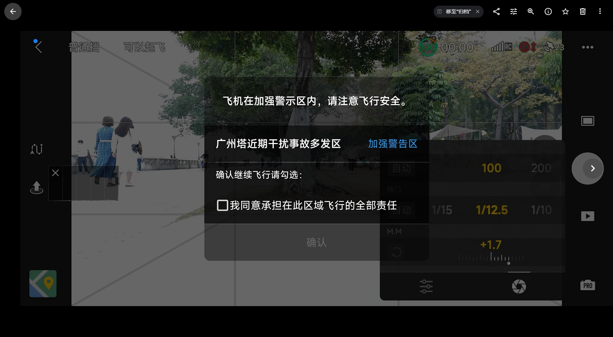

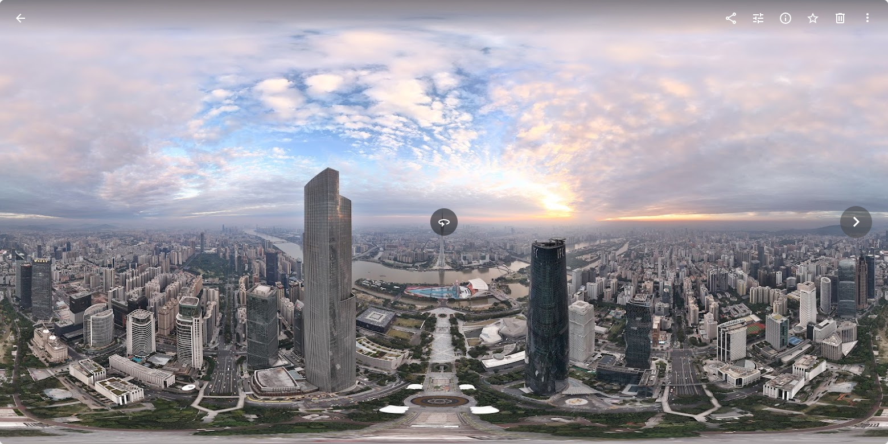

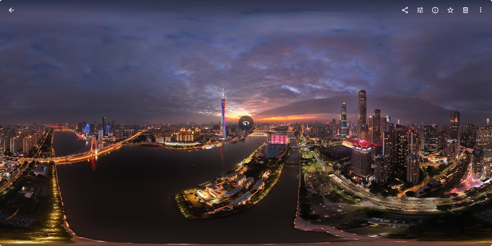

- 大晚上的打别人 GPS，现在的某些条子还是安保，是<u>一点点</u>安全意识都没有的吗？

  > 不知道现在的飞机有全向避障？（除了玻璃/水面/电线）
  >
  > 不知道现在的飞机有四个方位的“倒车影像”？
  >
  > **不知道打 GPS 进姿态模式多危险？是不是飞机底下的群众生命不重要，只要飞机拍不到你就行，反正出了事也是飞的人负责。**
  >
  > 都这么落后的？好像又很正常。
  >
  > **说不定打的人自己都不知道他在打什么，压根看不懂枪上的字是什么意思，没双还打算他还有那么<u>一点点点</u>安全意识吧。**
  >
  > 明年一般人不准持有信号干扰抢，估计也是跟几乎不存在一样的条例了。

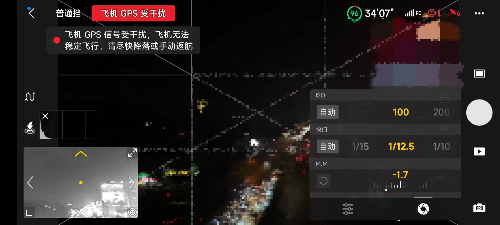

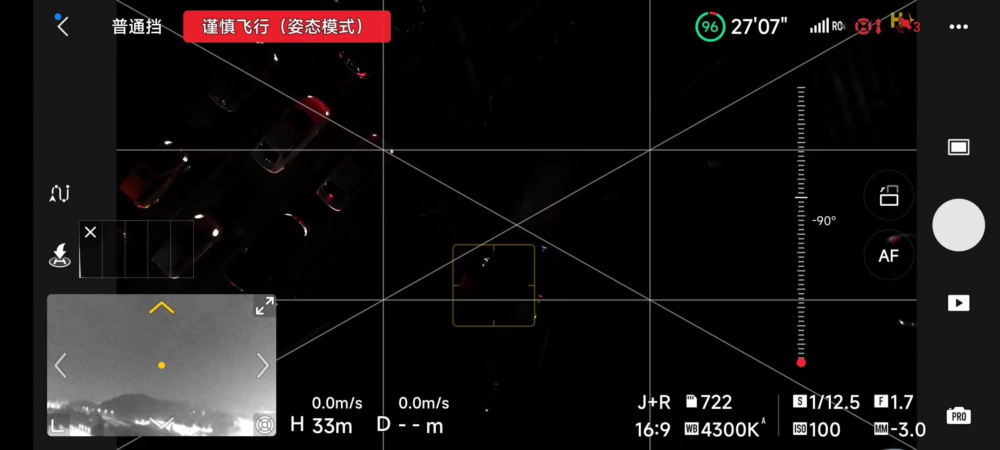

**今年下单的产品**

- AOC Q24N3R

  - 挺好用的，就是有点难用。

    - USB-C 一根线搞定 视频、拓展坞、充电，看似很爽，其实也很多不爽的地方。

    - 显示器息屏后视频信号握手时间长，中间显示器会失去一次视频信号连接吗，窗口全回到笔记本显示器上，然后再回显示器上，窗口大小、分辨率什么的全乱了。

    - 而且用 2m 的 C-C 线，有的笔记本二次握手的时候还会握漏了充电，只有拓展坞和视频信号上来了，结果又得再拔插一次线给他重来一遍恢复充电，就很烦人。

    - 也不知道这些难用的地方，是 AOC 的问题，还是带全功能 C 口的显示器都有的问题就是。

- ST4000VX015

  - 挺好用的，就是有点拉跨。
    - 一分钟不读写数据就一直自动回缩磁头，要是我没发现就能在过保前就挂掉是吧。

- 米家屏幕挂灯 1S

  - 太舒服了，比之前对称光路的某挂灯好用不是一两点，还能无极调节色温亮度。
  - 连接米家之后睡前当夜灯用都可以。

- 海康 M.2 NVMe/NGFF 硬盘盒

  - 主控很垃圾，数据量稍微大一点点就掉盘、I/O错误，跟杂牌比多少区别。

- 绿联 2.5/3.5 寸 硬盘底座

  - 比奥睿科好的不是一点半点，大量数据写入基本没见掉盘和 I/O错误，
  - 之前用的奥睿科的硬盘盒主控实在是太垃圾了，数据量稍微大一点点就掉盘、I/O错误。

- 梵想 S100 Pro 512G

  - 给家里老电脑用的，还可以吧，目前暂时还没遇到过掉盘。

- RK 98

  - 还行吧，纯白键盘挺好看的

- 致态 TiPlus 5000

  - 给另一台笔记本升级一下，支持一下长存消防。

    

    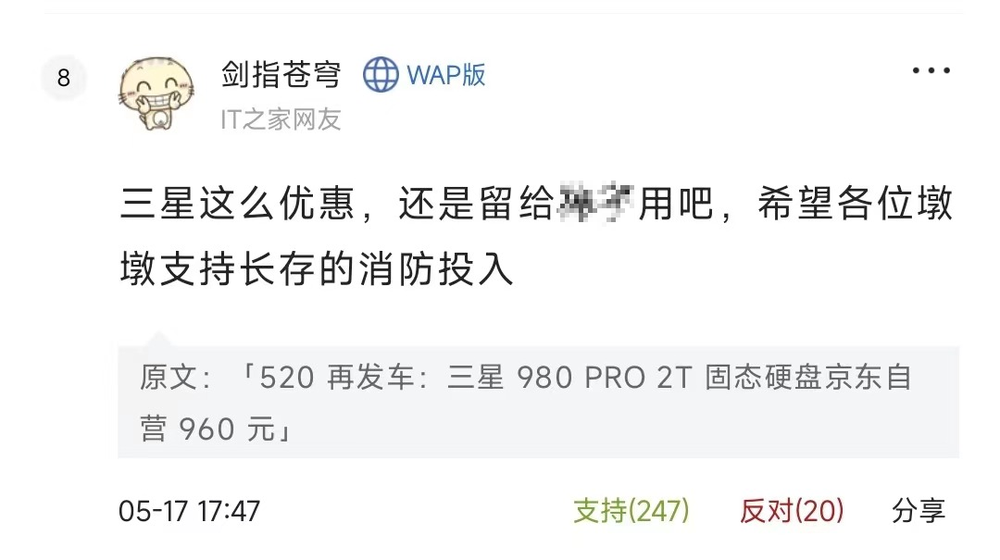

    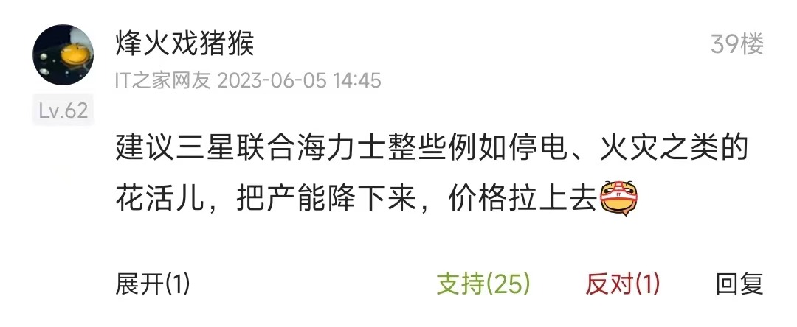

  - 温度表现非常优秀，日常使用基本全程能做到比三星 980 低 10°C 以上，气温越高，两者温差越大。

    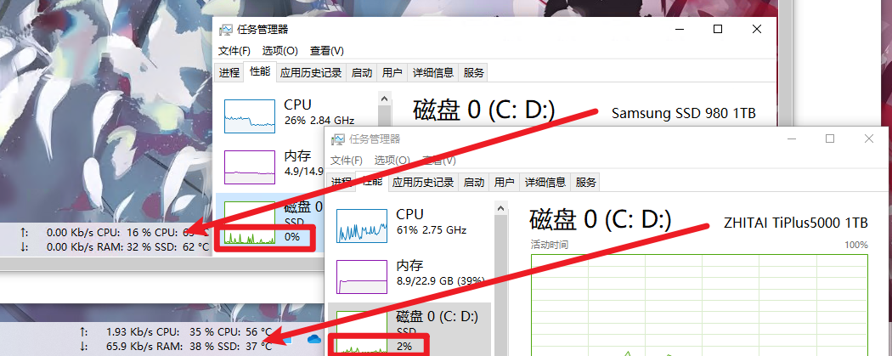

- 御斧 R100

  - 紧凑型键盘，就还行吧
  - 键程、间距都比较短，而且没有分区，需要一段时间适应

- DJI Mini 4 Pro + SanDisk V30 128G

  - 趁着还能飞 500 米，赶紧体验一下自由的感觉

- 漫步者 MR4

  - 监听音箱声音是准一些
  - 实在是受不了某些给我加低频的音箱/耳机了

- OPPO Enco Air 3

  - 买这个是因为我的  Air 2 被长辈拿去用了，AirPods Pro 又不能长时间戴着，耳朵不舒服。
  - 这个就是无脑加低频的典型案例，听得不太舒服，声音还没 Air 2 准。

**去年的平板都怎么样了**

- iPad OS 的 台前调度
  - 至今还是几乎不可用状态；
  - 看起来好像给了些什么，但全是订阅制 + 残血版，说白了就跟什么都没给似的；
  - 除了外接显示器能偶尔 RD 一下家里的电脑；
  - 剩余价值：用残血的专业软件学点东西，比如免费的 “库乐队” 。
- Harmony OS 的 HSL 
  - 用上了 WPS for Linux、CAJ Viewer for Linux、亿图图示 for Linux；
  - 可用吗？可用，但是这些我都用不上；
  - 剩余价值：喇叭比 Air 5 好很多，爱奇艺工具。

> ------ 调侃一下 ------
>
> 虚假的平板生产力：订阅制，残血的 Davinci、Photoshop、Lightroom
>
> 真正的平板生产力：WPS for Linux

但是实际上两一毕业，就都没什么用，纯浪费钱。

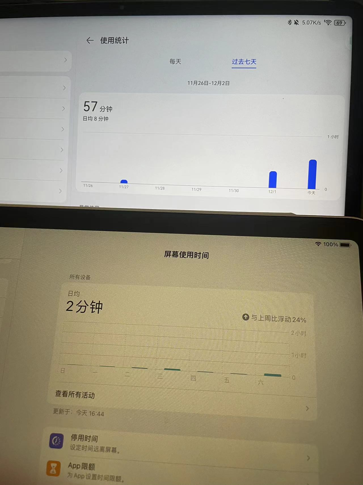

