# 全平台日程或提醒同步

> 使用最少的第三方软件使“Windows,macOS,Linux,iOS,Android,Windows Mobile”全平台日程/提醒同步 

## 需求分析

> 初步需求：Windows, Android, macOS, iOS.
>
> 进阶需求：Windows, Android, macOS, iOS, Linux, Windows Mobile

分析需求后，得出以下导图（省略手机/平板设备的Web端）
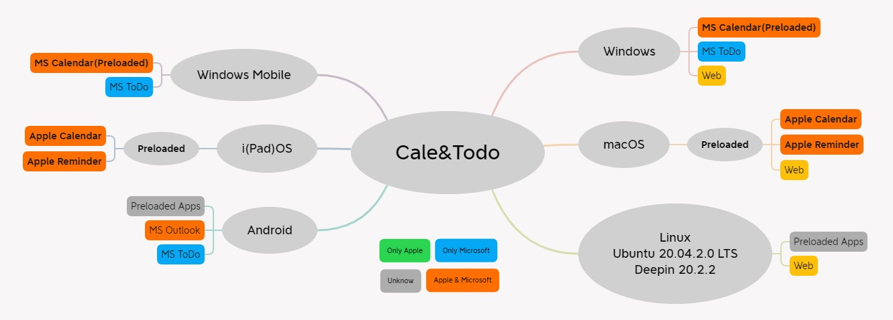

可见，理论最优解决方案为：**使用Apple ID同步日程表**，**使用Microsoft ID同步提醒事项**。

## 准备工作
>  该教程直接使用最优解决方案，可根据需求自行调整

1. 前往Microsoft ID管理页面，新建 Microsoft ID 应用密码。

    `https://account.live.com/proofs/manage/additional?mkt=zh-CN&refd=account.microsoft.com&refp=security&client_flight=m365.suiteheaderhelp`

    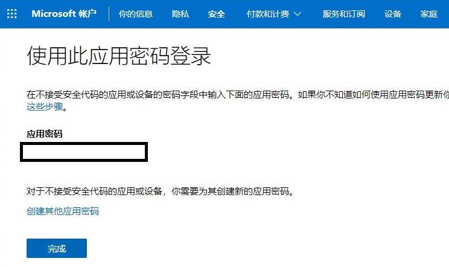

    **请妥善保管，接下来会使用。**

2. 前往 Apple ID管理页面，创建Apple ID应用密码

    `https://appleid.apple.com/account/manage`

    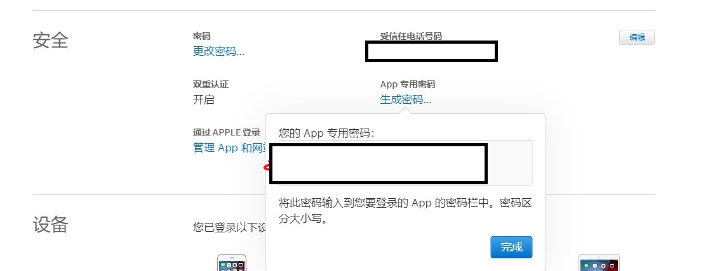

    **请妥善保管，接下来会使用。**

## Windows 平台配置

>  PS：Windows平台能通过MS Calendar与MS To Do实现无后台推送通知,但PWA iCloud提醒事项无完美推送。

* 打开系统自带的`日历`应用，PC此前已连接到MS ID（若未连接可通过向导连接），故只需将`日历`应用连接到iCloud（**使用AppleID App专用密码登录**）
    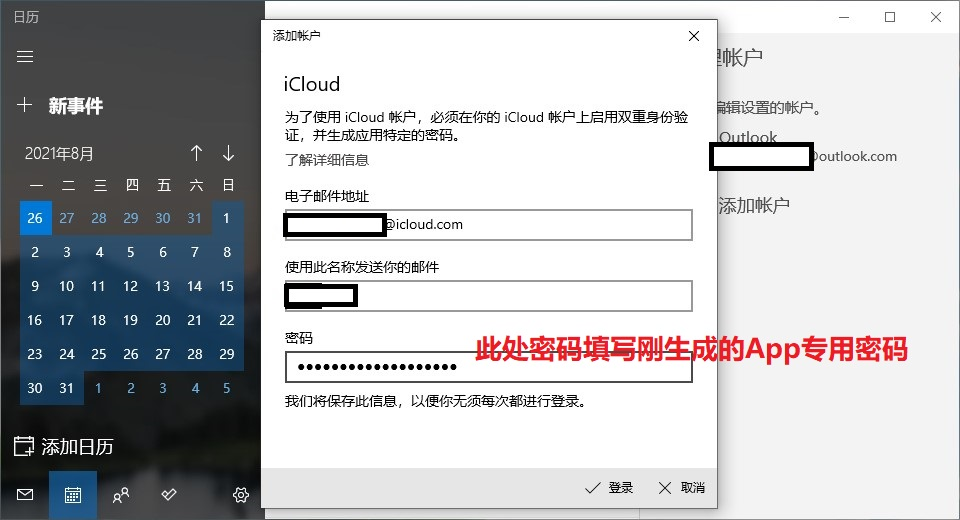
    **MSID, AppleID 日历同步配置**

* 打开系统自带的`Microsoft To Do`应用，通过向导连接到MS账号。
    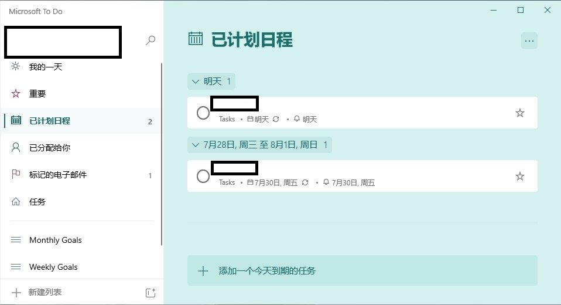
    **MSID 提醒事项同步配置**

* 打开系统自带的`Edge(Chromium)`应用，打开iCloud官网`iCloud.com`，将其安装为应用
    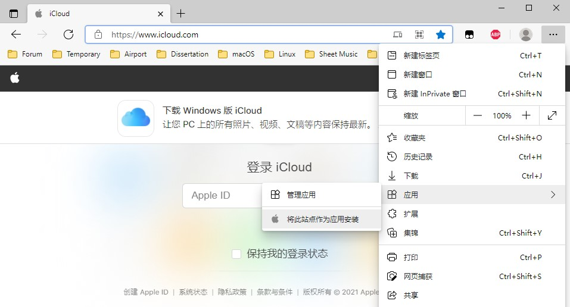
    **安装为应用，关闭浏览器**

    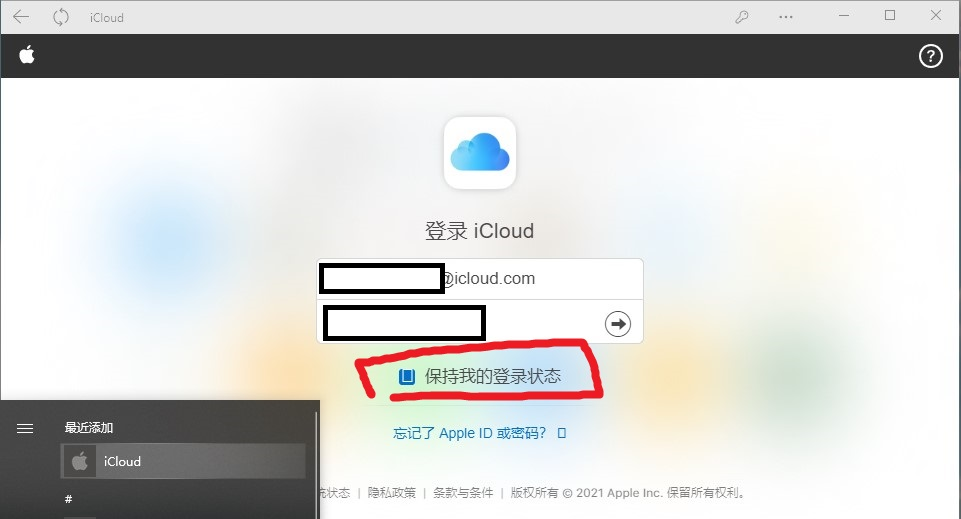
    **打开iCLoud应用，登录账号**

    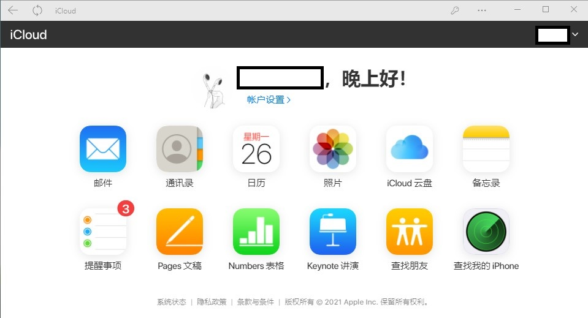
    **完成AppleID 提醒事项（日历）同步配置，但此步骤配置只能查看和编辑，无法推送通知。**

## macOS 平台配置

>  使用Apple Calendar与Apple Reminder即可实现完美无后台推送通知。

* 打开系统`设置-互联网账户`，macOS此前已连接到AppleID，故只需登录MS Exchange账户（**使用MSID应用密码登录**）
    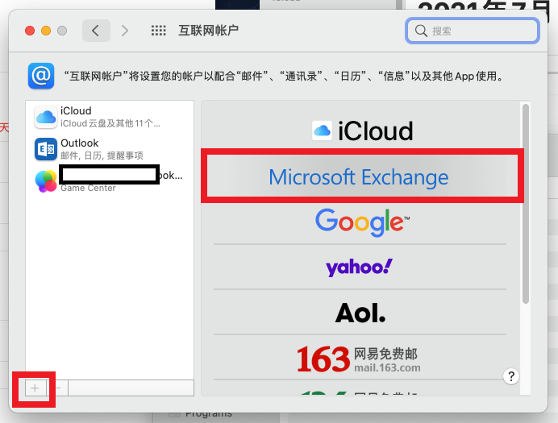
    **MSID登录**

    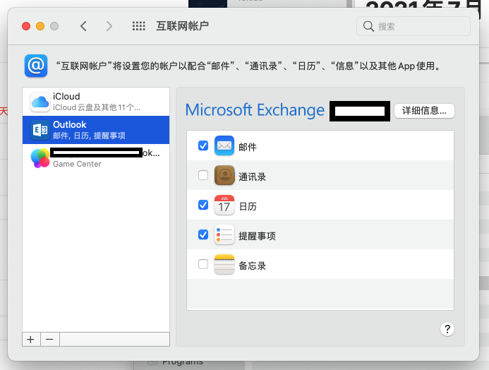
    **根据需求勾选同步选项**

    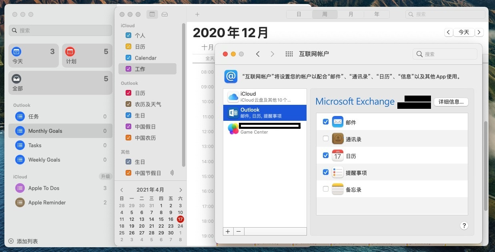
    **完成MSID 日程&提醒事项 同步配置**

## Linux 平台配置

>  部分Linux可能可连接到MSID/iCLoud，以同步日程/提醒事项，可自行尝试，以下方式无完美推送通知。

第三方：

* Elegant Microsoft To-Do：AO 
  
    `https://klaussinani.github.io/ao/`

* 网页端（PWA）

    `https://www.icloud.com/`

    `https://to-do.live.com/tasks/today`

    `https://outlook.live.com/calendar/0/view/month`

## Android 平台配置

> 部分Android UI可能可直接连接到MSID/iCLoud，以同步日程/提醒事项，可自行尝试，以下第三方方式可通过FCM推送实现推送通知。

第三方：

*   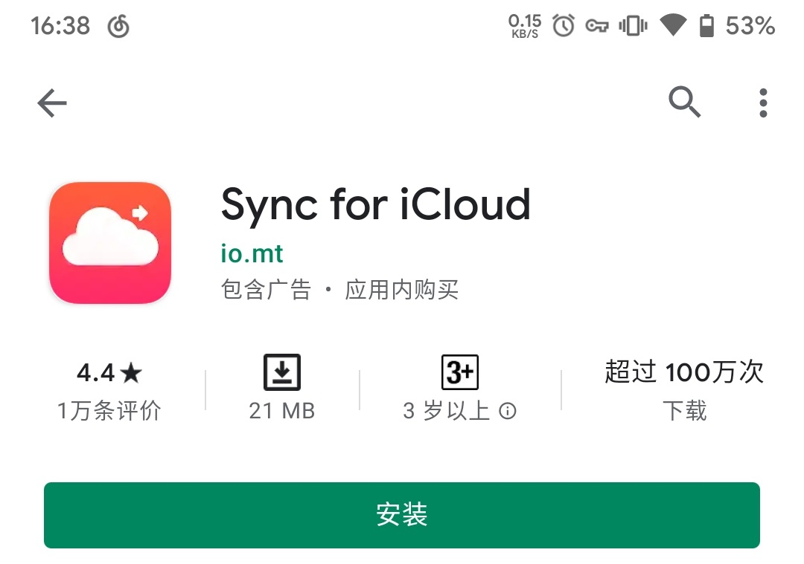
    **可同步iCloud日程到Google Calendar**

*   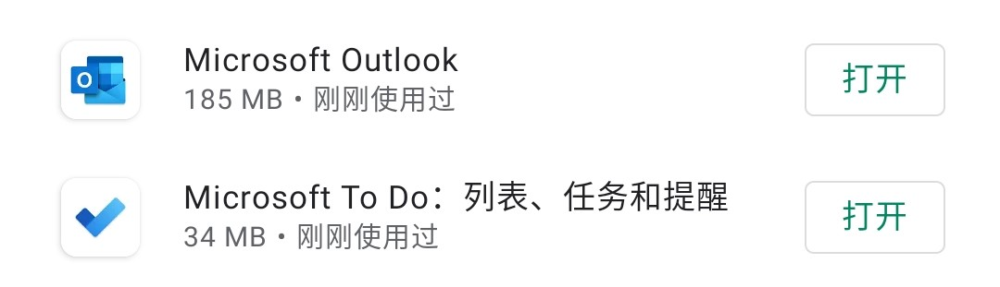
    **通过MS Outlook & MS To Do 同步iCloud日历、Outlook日程、MS提醒事项**

*   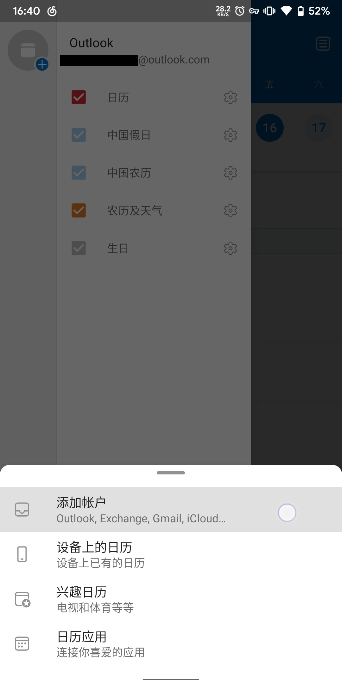
    **Outlook客户端内可登录iCloud同步iCloud日历**

## i(Pad)OS 平台配置

> 使用Apple Calendar与Apple Reminder即可实现完美无后台推送通知。

* 打开系统`设置-邮件-账户(iOS13+)`或`设置-密码与账户(iOS12)`，i(Pad)OS此前已连接到AppleID，故只需登录MS Exchange账户（**使用MSID应用密码登录**）,或登录Outlook账户）（**使用MSID原密码登录**）
    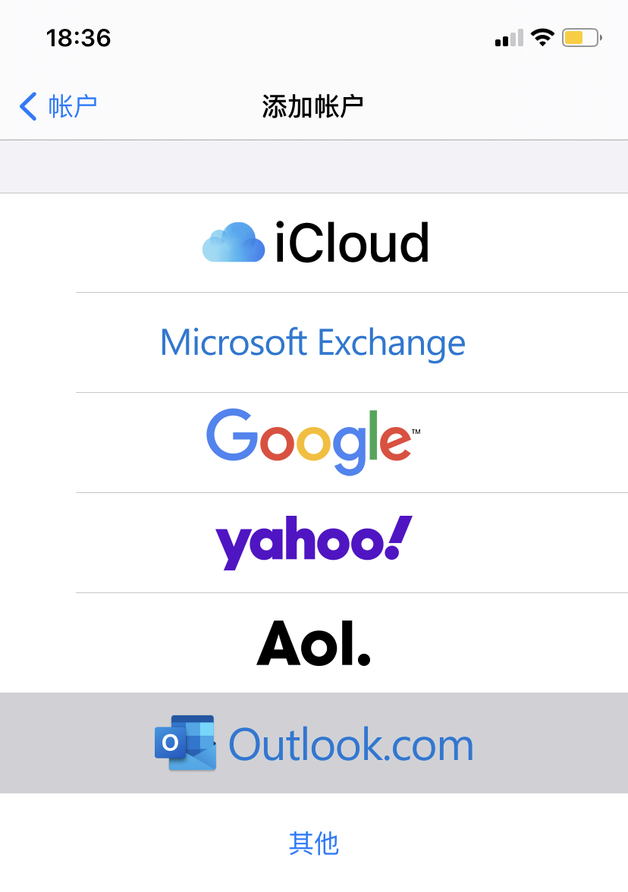
    **MSID登录**

    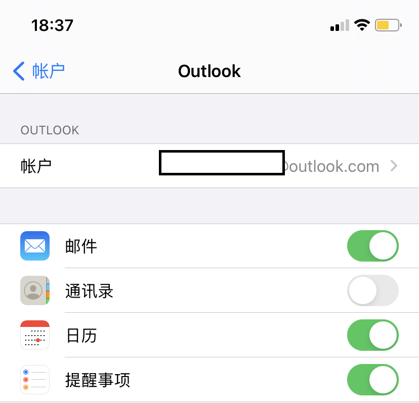
    **根据需求勾选同步选项**

    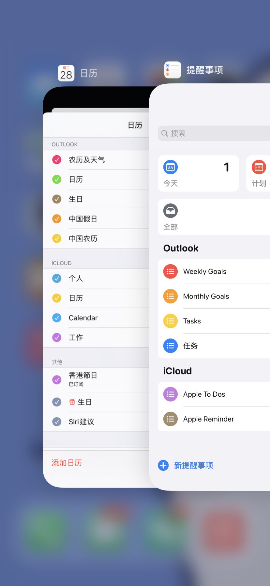
    **完成MSID 日程&提醒事项 同步配置**

## Windows Mobile 平台配置

> 笔者的Windows Phone内屏挂了，故无法截图教程，可参考上面的 “Windows 平台配置” 实现MS日历、MS To Do、iCloud日历无后台推送通知。

## 结语
当使用MS To Do时，笔者多次察觉其设计思路与Apple Reminder不同，在循环项目中多次出现Bug，几乎每次标记MS To Do项目时都会重置提醒时间，**重复提醒事项**建议使用Apple Reminder，可避免提醒时间经常自动重置为0:00的问题。

