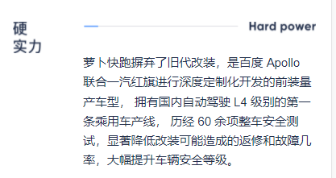
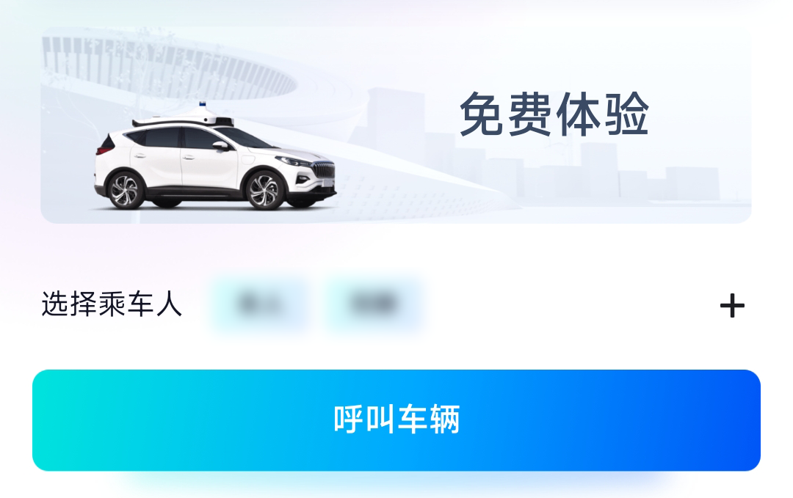
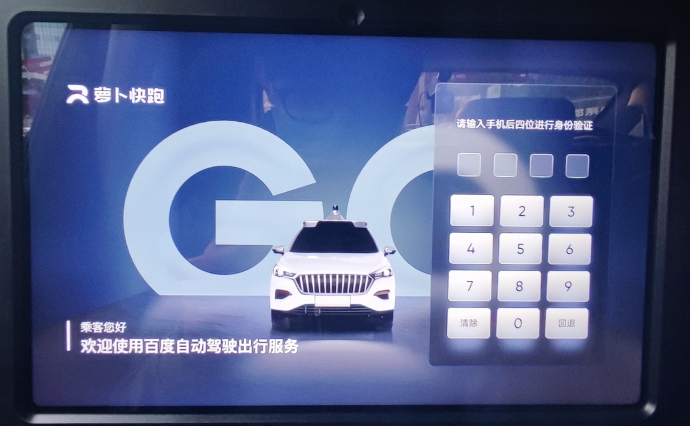
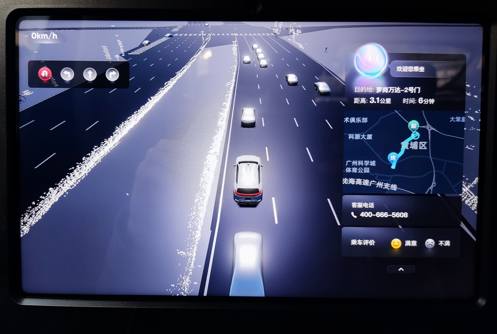
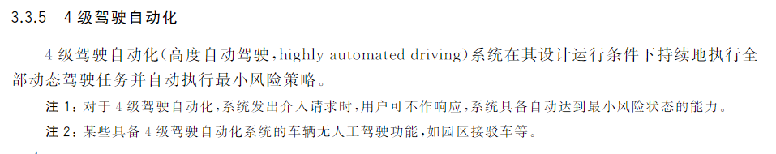
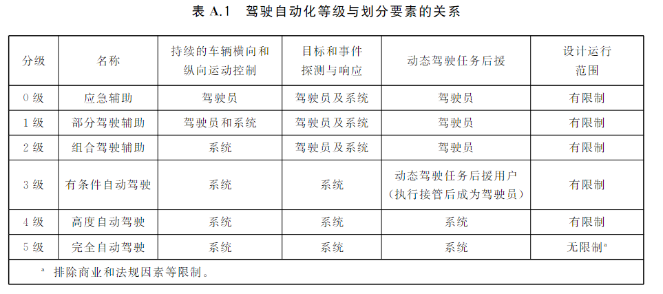

## 体验

恰巧今天去了趟“萝卜快跑”的运营区域范围内，体验了一次~~传说中的~~ L4 自动驾驶，

选好起点终点后，打车界面 “免费体验” 四字相当显眼

呼叫车辆后半分钟内有车接单，加上等待时间，大约10分组到达，上车后输入手机尾号验证即可开始体验。

等待红绿灯时，当前车道红绿灯状态左上角有显示，相应车道也有显示，左侧有轨电车也识别出来了，但在前面同车道等待红绿灯的车辆指识别出了两台，其余车道除了太远的，都识别正常。

大部分体验和平时打车感觉没有太大区别，除了速度慢点，以及不用花钱。

### 缺点

- 变道速度慢

- 人工接管两次
  - 第一次：上图掉头，行人乱闯，加上有轨电车的车轨无法识别或造成干扰，安全员接管掉头。
  - 第二次：接近终点时，下班高峰加上情人节，路况复杂 ，车辆较多，安全员接管。
- SOC 性能不够强
  - 在复杂路况下，可以明显感觉到中控屏卡顿，识别时间延长，而且识别有漏，可能是因为这个原因所以才会有接管？
    - 如果不接管的话可能会停下来计算加塞？

### 优点

- 不花钱！白嫖
- 能亲身体验到科技的发展

### 杂谈

- L4 “高度自动驾驶”，在上述复杂路况计算性能不足时感觉会按照“最小风险策略”执行？

- 在复杂路况下由人工接管更为靠谱。~~离谱的是 会有人拿 L2 L3 当成 L4 L5 来用~~

  

  

- 本来想打4星，想了想是免费的，就给个五星吧。

  

## 参考资料

- [萝卜快跑](https://idgdata.baidu.com/static/accactivity/pages/presentation.html)
- [GB/T 40429-2021](http://openstd.samr.gov.cn/bzgk/gb/newGbInfo?hcno=4754CB1B7AD798F288C52D916BFECA34)

