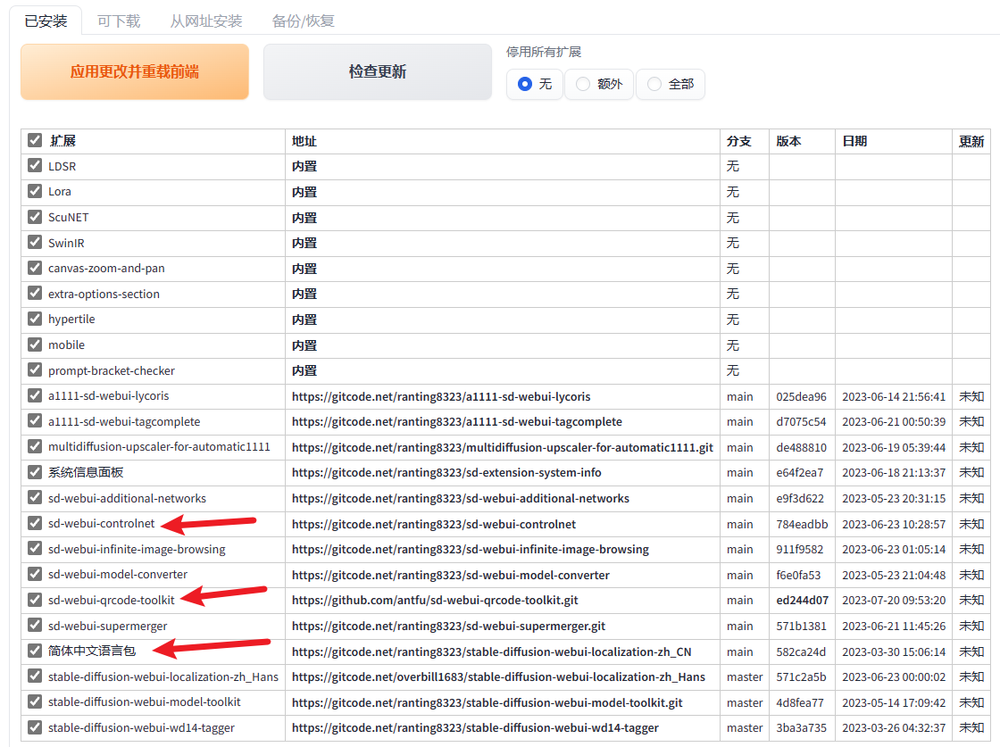
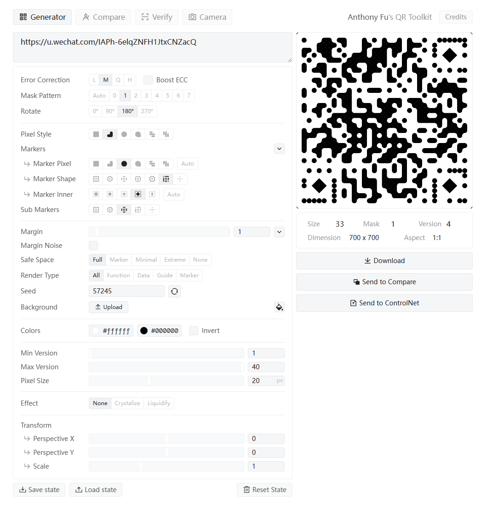

## 什么是 Controlnet

[耗时7天，终于把15种ControlNet模型搞明白了！ - 知乎 (zhihu.com)](https://zhuanlan.zhihu.com/p/640637930)

### Stable Diffusion 拓展

### 模型

[Controlnet QR Pattern (QR Codes) - v2_sd15 | Stable Diffusion Controlnet | Civitai](https://civitai.com/models/90940/controlnet-qr-pattern-qr-codes)

[monster-labs/control_v1p_sd15_qrcode_monster · Hugging Face](https://huggingface.co/monster-labs/control_v1p_sd15_qrcode_monster)

[ioclab/control_v1p_sd15_brightness · Hugging Face](https://huggingface.co/ioclab/control_v1p_sd15_brightness)

### 例1：艺术二维码

https://u.wechat.com/IAPh-6elqZNFH1JtxCNZacQ

QR Toolkit：

> 权重：长得多像
>
> 介入/终止：什么时候开始介入和结束

扫不了，调 monster 权值

长按识别不了，调 brightness 终止时机

