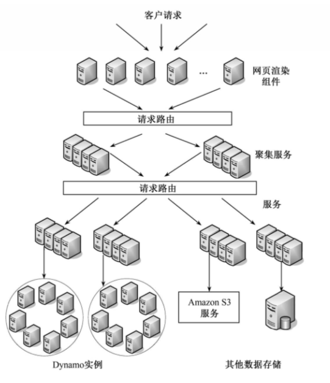
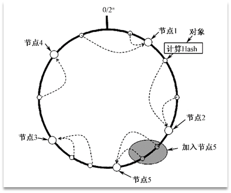
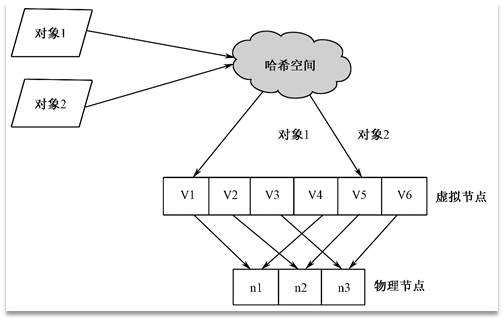
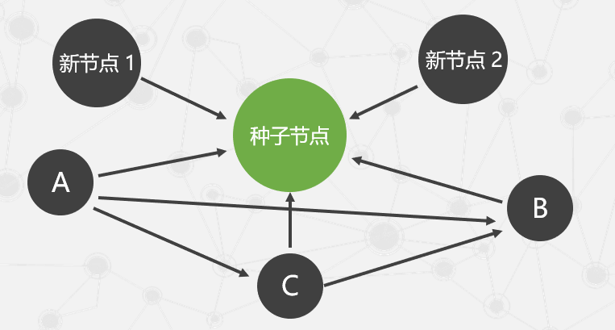
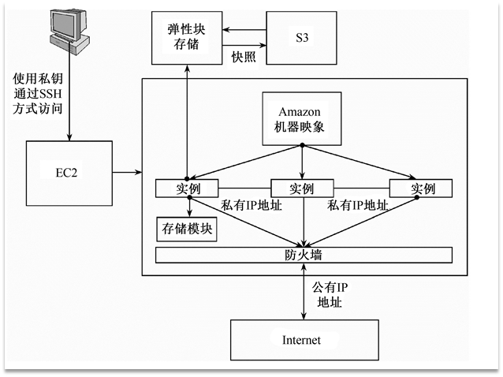
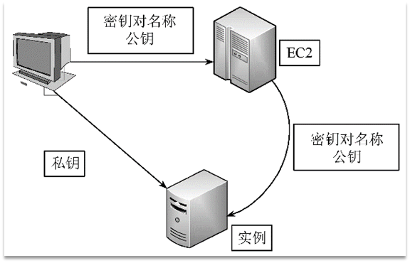

**Amazon 提供的服务**

- 弹性计算云EC2

- 简单存储服务S3

- 简单数据库服务Simple DB

- 简单队列服务SQS

- 弹性MapReduce服务

- 内容推送服务CloudFront

- 电子商务服务DevPay

- FPS

## 3.1 基础存储架构Dynamo

### 3.1.1 Dynamo概况

- 采用完全的分布式、去中心化的架构
  - 存储节点呈无中心的环状分布。

- 作为底层存储架构的Dynamo也同样采用了无中心的模式

- Dynamo只支持简单的键/值（key/value）方式的数据存储，不支持复杂的查询

- Dynamo中存储的是数据值的原始形式，即按位存储，并不解析数据的具体内容

- Dynamo需要解决的主要问题及解决方案

|        问题        |            采取的相关技术            |
| :----------------: | :----------------------------------: |
|    数据均衡分布    |         改进的一致性哈希算法         |
|      数据备份      |       参数可调的弱 quorum 机制       |
|    数据冲突处理    |       向量时钟（Vector Clock）       |
| 成员资格及错误检测 | 基于 Gossip 协议的成员资格和错误检测 |
|    临时故障处理    |   Hinted handoff （数据回传机制）    |
|    永久故障处理    |            Merkle 哈系数             |

#### 数据均衡分布的问题

- Dynamo采用了分布式的数据存储架构，均衡的数据分布可以保证负载平衡和系统良好的扩展性。

- Dynamo中使用**改进后的一致性哈希算法**，并在此基础上进行数据备份，以提高系统的可用性。

  - 一致性哈希算法除了能够保证哈希运算结果充分分散到整个环上外，还能保证在添加或删除设备节点时只会影响到其在哈希环中的前驱设备节点，而不会对其他设备节点产生影响。

  - 一致性哈希算法可以**大大降低**在添加或删除节点时引起的**节点间的数据传输开销**

    

##### 改进的一致性哈希算法

- 每个虚拟节点都隶属于某一个实际的物理节点，一个物理节点根据其性能的差异被分为一个或多个虚拟节点。
- 各个虚拟节点的能力基本相当，并随机分布在哈希环上。

- 在存储数据时，每个数据会被先分配到某个数据分区，再根据负责该数据分区的虚拟节点，最终确定其所存储的物理节点。

  

- 数据分区的好处

  - 减小数据分布不均衡的可能性

  - 添加或删除设备节点时引起较小的数据传输

#### 数据备份

- 在Dynamo中，每个数据的副本备份存储在哈希环顺时针方向上该数据所在虚拟节点的后继节点中。

- 数据备份在存储数据的同时进行，会使每次写操作的延时变长。
- Dynamo中对写操作进行了优化，保证一个副本必须写入硬盘，其他副本只要写入节点的内存即返回写成功。
- 每个虚拟节点上实际存储了分配给它以及分配它的前N-1个前驱虚拟节点的数据。

#### 数据冲突问题

- 分布式系统架构中通常考虑的三个因素
  - 可靠性
  - 可用性
  - 一致性

- Dynamo选择通过**牺牲一致性**来保证系统的可靠性和可用性，没有采用强一致性模型而**采用了最终一致性模型**。
- 采用**向量时钟技术**
- Dynamo中的向量时钟通过`[node, counter] 对` 来表示。
  - **node**表示**操作节点**
  - counter**是其**对应的计数器**，**初始值为** **0**节点每进行一次更新操作则**计数器****加** **1**

#### 成员资格及错误检测

- 由于Dynamo采用了无中心的架构，每个成员节点都需要保存其他节点的路由信息

- 为了保证每个节点都能拥有最新的成员节点信息，Dynamo中采用了一种类似于Gossip（闲聊）协议的技术

- Dynamo中还通过Gossip来实现错误检测任何节点向其他节点发起通信后，如果对方没有回应，则认为对方节点失效

- 为了避免新加入的节点之间不能及时发现其他节点的存在，Dynamo中设置了一些种子节点（Seed Node）。种子节点和所有的节点都有联系。当新节点加入时，它扮演一个中介的角色，使新加入节点之间互相感知。

#### 容错机制

##### 临时故障处理机制

- 为了处理临时失效的节点，Dynamo中采用了一种带有监听的数据回传机制（Hinted Handoff）

- 当虚拟节点A失效后，会将数据临时存放在节点D的临时空间中，并在节点A重新可用后，由节点D将数据回传给节点A。

##### 永久性故障处理机制

- Dynamo采用**Merkle哈希树**技术来加快检测和减少数据传输量

## 3.2 弹性计算云EC2

### 3.2.1  EC2的基本架构

- 主要包括了Amazon机器映象、实例、存储模块等组成部分，并能与S3等其他Amazon云计算服务结合使用。

##### Amazon机器映象（AMI）

- Amazon机器映像（Amazon Machine Image，AMI）是包含了操作系统、服务器程序、应用程序等软件配置的模板

- 四种获取AMI的途径
  - 免费使用Amazon提供的公共AMI
  - 根据自身需要定制一个或多个私有AMI
  - 向开发者付费购买AMI
  - 使用其他开发者分享的共享AMI

- 构建好的AMI分为Amaznon EBS支持和实例存储支持两类

##### 实例（Instance）

EC2中实例由**AMI启动**，可以像传统的主机一样提供服务。同一个AMI可以用于创建具有**不同计算和存储能力的实例**。
Amazon提供了多种不同类型的实例，分别**在计算、GPU、内存、存储、网络、费用**等方面进行了优化
Amazon还允许用户在应用程序的需求发生变更时，对**实例的类型进行调整**，从而实现按需付费。
Amazon EC2还为实例提供了许多**附加功能**，帮助用户更好地**部署和管理应用程序**。

##### 弹性块存储（EBS）

EBS存储卷的设计与**物理硬盘相似**，其大小由用户设定，目前提供的容量从**1GB到1TB**不等。

EBS存储卷适用于数据需要**细粒度**地频繁访问并持久保存的情形，适合作为文件系统或数据库的**主存储**。

**快照功能**是EBS的特色功能之一，用于在S3中存储Amazon EBS卷的时间点副本。

### 3.2.2  EC2的关键技术

#### 地理区域和可用区域

- 地理区域

- 可用区域

  - 是否有独立的供电系统和冷却系统等

  - 通常将每个数据中心看做一个可用区域

- EC2系统中包含多个地理区域，而每个地理区域中又包含多个可用区域。为了确保系统的稳定性，用户最好将自己的多个实例分布在不同的可用区域和地理区域中。

#### EC2的通信机制

#### 弹性负载平衡

#### 监控服务

- AWS资源的可视化检测功能
  - EC2实例状态
  - 资源利用率
  - 需求状况
  - CPU利用率
  - 磁盘读取
  - 写入
  - 网络流量

用户只需要选择EC2实例，设定监视时间，CloudWatch就可以自动收集和存储检测数据

#### 自动缩放

自动缩放可以按照用户自定义的条件，自动调整EC2的计算能力：

- 需求高峰期
  - 确保EC2实例的处理能力无缝增大
- 需求下降时
  - 自动缩小EC2实例规模以降低成本

自动缩放功能特别适合**周期性变化**的应用程序，它由**CloudWatch**自动启动。

#### 服务管理控制台

各项技术通过互相配合来实现EC2的可扩展性和可靠性

### 3.2.3  EC2的安全及容错机制

- 安全组是一组规则，用户利用这些规则来决定哪些**网络流量会被实例接受**，其他则全部拒绝。
- 当用户的实例被创建时，如果没有指定**安全组**，则系统自动将该实例分配给一个**默认组**。
- 默认组只接受**组内成员的消息**，拒绝其他消息。
- 当一个组的**规则改变**后，改变的规则自动**适用**于组中所有的成员。

- SSH是目前对网络上传输的数据进行加密的一种很可靠的协议，当用户创建一个**密钥对**时，**密钥对的名称**（Key Pair Name）和**公钥**（Public Key）会被**存储**在EC2中

  

#### EC2引入了弹性IP地址的概念

- 弹性IP地址和**用户账号绑定**而不是和某个特定的实例绑定
- 当系统正在使用的实例出现故障时，用户只需要将弹性IP地址通过网络地址转换**NAT**转换为新实例所对应的**私有IP地址**
- 通过弹性IP地址改变映射关系总可以**保证有实例可用**