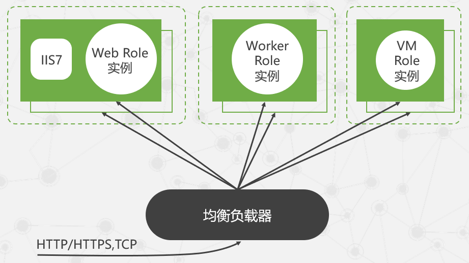

# 微软云计算 Windows Azure

## 4.1 微软云计算平台

- 传统的企业和用户在开发和部署自己的应用程序主要有两种方式
  - 购买和维护自己基础设施
    - 需要耗费大量的资金和维护精力
  - 租用服务器或租用虚拟主机
    - 后台服务器的控制权降低，受到其他应用程序的影响

- 微软的云计算服务平台Windows Azure属于PaaS模式，一般面向的是软件开发商。

### 四个组成部分

- Windows Azure
  - 作为微软云计算操作系统，提供了一个在微软数据中心服务器上运行应用程序和存储数据的Windows环境
- SQL Azure
  - 它是云中的关系数据库，为云中基于SQL Server的关系型数据提供服务
- Windows Azure AppFabric
  - 为在云中或本地系统中的应用提供基于云的基础架构服务
- Windows Azure Marketplace
  - 为购买云计算环境下的数据和应用提供在线服务

### 平台体系架构

## 4.2 微软云操作系统Windows Azure

### 4.2.2 计算服务器

#### 体系架构

### 运行机制

### 4.2.3 存储服务

- Table
  - 提供更加结构化的数据存储

- Blob
  - 存储二进制数据，可以存储大型的无结构数据，容量巨大，能够满足海量数据存储需求。
- Queue
  - 用来支持在Windows Azure应用程序组件之间进行通信

#### 体系架构

#### 层次结构

## 4.3 微软云关系数据库 SQL Azure

## 4.4 Windows Azure AppFabric

## 4.5 Windows Azure Marketplace

## 4.6 Windows Azure服务平台