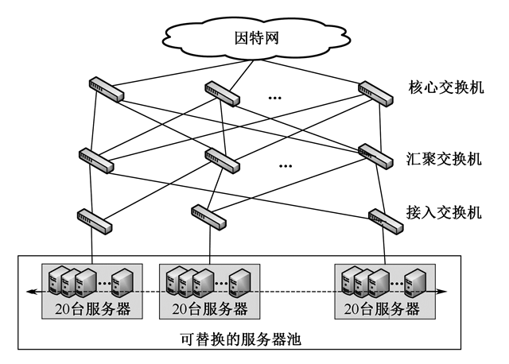
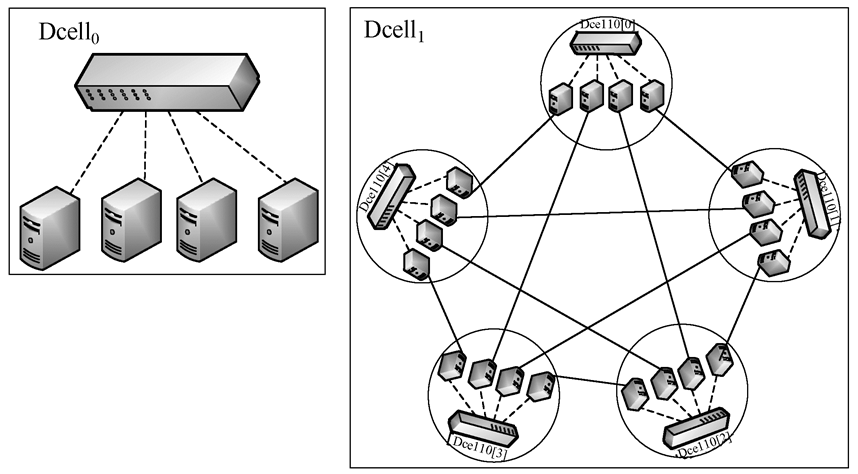
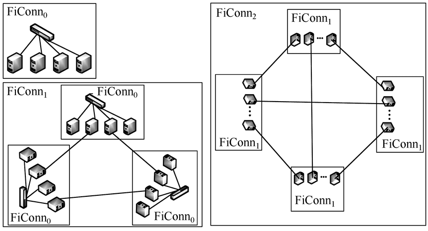
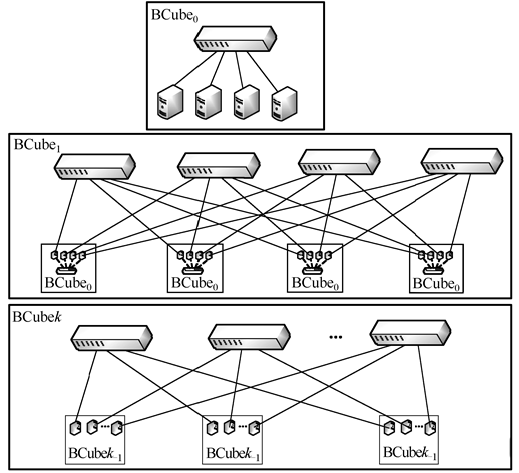
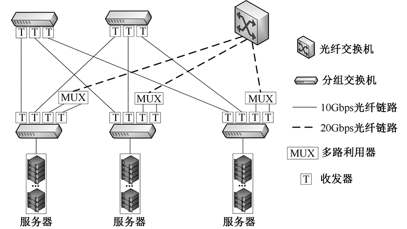
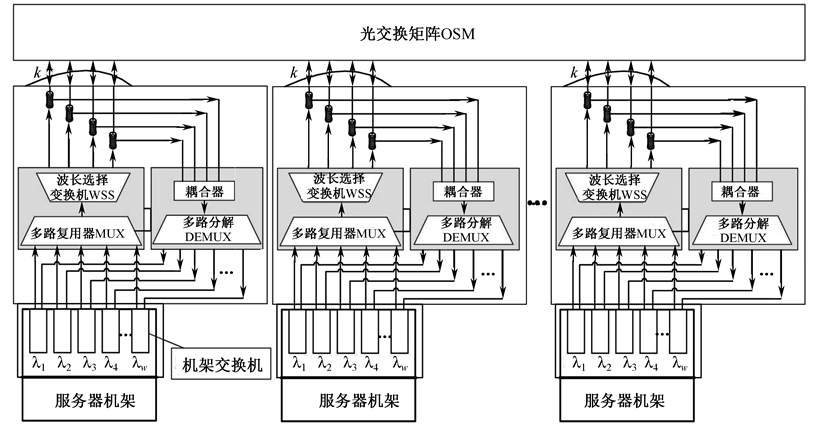
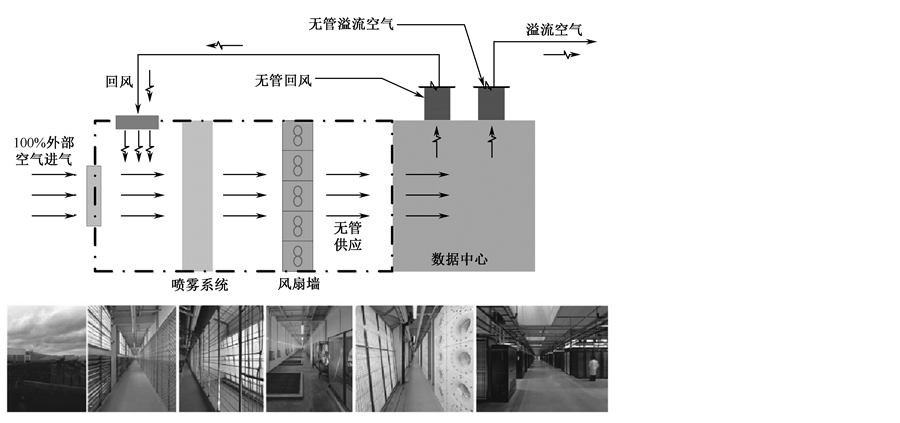
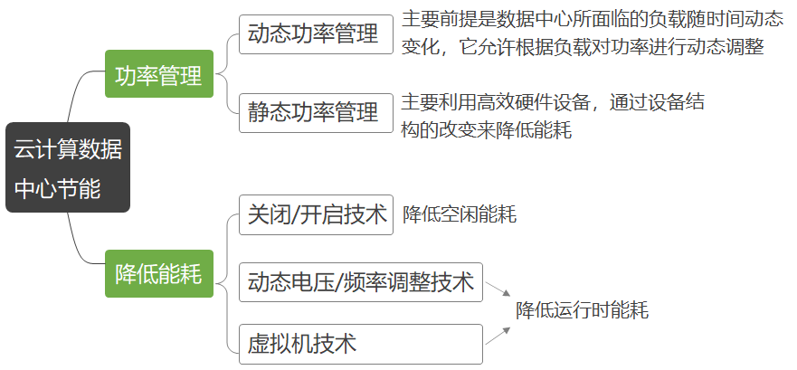

---
title: 云数据中心
date: 2022-03-07
tags:
  - Cloud
categories:
  - tech
---

## 9.1  云数据中心的特征

云数据中心的几个特征

- 高设备利用率
- 绿色节能
- 高可用性
- 自动化管理

## 9.2  云数据中心网络部署

| **网络**  **拓扑** | **规模** | **带宽** | **容错性** | **扩展性** | **布线**** **    **复杂性** | **成本** | **兼容性** | **配置开销** | **流量隔离** | **灵活性** |
| ------------------ | -------- | -------- | ---------- | ---------- | --------------------------- | -------- | ---------- | ------------ | ------------ | ---------- |
| **FatTree**        | 中       | 中       | 中         | 中         | 较高                        | 较高     | 高         | 较高         | 无           | 低         |
| **VL2**            | 大       | 大       | 中         | 中         | 较高                        | 较高     | 中         | 较高         | 无           | 中         |
| **OSA**            | 小       | 大       | 差         | 中         | 较低                        | 较高     | 低         | 中           | 无           | 高         |
| **WDCN**           | 小       | 大       | 较好       | 中         | 较低                        | 中       | 中         | 中           | 无           | 高         |
| **DCell**          | 大       | 较大     | 较好       | 较好       | 高                          | 较高     | 中         | 较高         | 无           | 较高       |
| **FiConn**         | 大       | 较大     | 较好       | 较好       | 较高                        | 中       | 中         | 较高         | 无           | 较高       |
| **BCube**          | 小       | 大       | 好         | 较好       | 高                          | 较高     | 中         | 较高         | 无           | 较高       |
| **MDCube**         | 大       | 大       | 较好       | 较好       | 高                          | 高       | 中         | 较高         | 无           | 较高       |

### 9.2.1  改进型树结构

#### FatTree

特点：

- 消除了树形结构上层链路对吞吐量的限制
- 为内部节点间通信提供多条并行链路
- 横向扩展的尝试降低了构建数据中心网络的成本
- 与现有数据中心网络使用的以太网结构和IP 配置的服务器兼容
- 缺点：扩展性受限于核心交换机端口数量，目前比较常用的是48端口10G核心交换机，在3层树结构中能够支持27648台主机。

#### VL2

VL2仍然采用三层拓扑结构进行交换机级联。但不同的是，VL2中的各级交换机之间都采用10Gbps端口以减小布线开销。

- 在VL2中，IP地址仅仅作为名字使用，没有拓扑含义。
- VL2的寻址机制将服务器的名字与其位置分开。
- VL2使用可扩展、可靠的目录系统来维持名字和位置间的映射。
- 当服务器发送分组时，服务器上的VL2代理开启目录系统以得到实际的目的位置，然后将分组发送到目的地。
- VL2是目前最易用于对现有数据中心网络改造的结构，但VL2依赖于中心化的基础设施来实现2层语义和资源整合，面临单点失效和扩展性问题。

### 9.2.2  递归层次结构

构建高层次网络时，需要的低层网络的个数等于每个低层网络中的服务器个数加1，其拓扑结构如图所示。

BCube使用交换机构建层次化网络，网络中主要包括服务器和交换机两种组件。

一个BCubek有N=nk+1个服务器和k+1层交换机，每一层有nk个n端口交换机。

### 9.2.3  光交换网络

### 9.2.4  无线数据中心网络

无线技术可以在不必进行重新布线的情况下**灵活调整拓扑**，省去了复杂的布线工作，但无线技术在提供足够带宽的前提下，其**传输距离是有限**的，因而限制了其在大规模数据中心的部署。

### 9.2.5  软件定义网络

## 9.3  绿色节能技术

### 9.3.1  配电系统节能技术

#### 高压直流配电技术

机架式电源将传统的集中供电分散到每个机架，可靠性较传统UPS有很大提高，能够更好地适应云计算业务场景。

#### 市电直供配电技术

### 9.3.22  空调系统节能技术

**核心理念**

- 注重IT设备的温湿度要求，高效解决区域化的制冷，
- 是机架级别甚至是IT设备级别的制冷解决方案，而非着眼机房环境温湿度控制。

**三个系统**

- 高温回风空调系统
  - 根据不同出水温度下的制冷和能耗，对应的出水温度（即空调回风温度）提高1℃，空调系统约节能3%。
- 低能耗加湿系统
  - 将纯净的水直接喷洒在多孔介质或者空气中，形成颗粒极小的水雾，由送风气流送出。
- 自然冷空调系统
  - 使用室外自然冷风直接带走机房的IT设备的散热，减少了机械制冷系统中最大的压缩耗能环节，压缩机制冷系统的EER由2～3.5提高到10～15，节能空间巨大。

### 9.3.3  集装箱数据中心节能技术

将数据中心的服务器设备、网络设备、空调设备、供电设备等高密度地装入固定尺寸的集装箱中，使其成为数据中心的标准构建模块，进而通过若干集装箱模块网络和电力的互连互通构建完整的数据中心。

**特点**：

- 高密度
  - 集装箱数据中心模块可容纳高密度计算设备，相同空间内可容纳六倍于传统数据中心的机柜数量。
- 模块化
  - 建立一个最优的数据中心生态系统，具有恰如所需的供电、冷却和计算能力等。
- 按需快速部署
  - 集装箱数据中心不需要企业再经过空间租用、土地申请、机房建设、硬件部署等周期，可大大缩短部署周期。
- 移动便携
  - 集装箱数据中心的安装非常容易，只需要提供电源连接、水源连接（用于冷却）和数据连接即可。

### 9.3.4  数据中心节能策略和算法研究

- DVFS节能技术
  - 降低CPU的供电电压和时钟频率主动降低CPU性能
- 基于虚拟化的节能技术
  - 一个主机上创建多个虚拟机，因此减少了硬件资源的使用数量
- 基于主机关闭/开启的节能技术
  - 节能策略可以分为随机式策略、超时式策略和预测式策略三类。
- 其他节能技术

## 9.4  自动化管理

### 9.4.1  自动化管理的特征

**云自动化**：按需分配和收回服务器、存储、网络、应用程序

**特征：**

- 自动化管理
- 环境设备（如供配电系统、冷却系统、消防系统等）的智能监控
- 统一的资源可视化管理虚拟化网络
- 自动监测虚拟机的创建和迁移

### 9.4.2  自动化管理实现阶段

- IT服务操作
  - 这一阶段主要是监控和管理IT基础设施的广义集合，如网络、服务器、应用和相关的存储设备。
- IT服务管理
  - 这一阶段会制定一系列的设施间的交互和协作处理，确保IT服务符合标准规范。
- 数据中心自动化
  - 这一阶段的时间和精力主要是维护IT环境，定制、检查和执行服务层协议。

#### IT服务管理

**IT服务管理通常由4个主题范围**

- 服务管理
- 服务层管理
- IT资产管理
- 财务管理

**IT流程自动化工具有两种类型**

- 提供通用的IT流程自动化
- 关注具体流程

**采用数据中心自动化工具必须具备下列条件**

- 管理系统
  - 支持各类IT管理软件，能管理、监控、探测、识别和解决IT设施的异常行为。
- 定义过程
  - 一套基本明确定义的流程并能运作良好，应包括事件管理、变更管理、配置管理和版本管理。
- 认知非自动化过程的成本
  - 为了计算引入自动化的成本节约，必须知道非自动化过程的成本，避免为了自动化而自动化。
- 内部流程资源
  - 在初始配置时可使用外部资源，但是在后续的维护中，使用内部资源是更节约并有效的。

### 9.4.3  Facebook自动化管理

**硬件管理主要关注四个方面的内容**

- 固件的生命周期
  - 提供一个统一界面独立地对固件的二进制文件和配置进行部署和更新
- 事件告警和日志
  - 对产生的机器事件和日志消息进行格式统一
- 远程管理
  - 远程控制机器配置和执行系统操作，并打开一个远程控制台
- 策略技术
  - 遵循和鼓励有潜在利益的产品和标准，探索未来的开放计算规范

**创建服务器集群的命令时，StarCluster会完成如下工作：**

- 初始化虚拟机实例；
- 配置一个新的安全组；
- 定义一个用户友好的主机名（如node001）；
- 创建一个非管理员的用户账号；
- 为密码登录配置SSH；
- 定义跨集群的网络文件系统（NFS）文件共享；
- 配置Oracle网格引擎排队系统以实现跨服务器集群的任务管理。

## 9.5  容灾备份

- 数据级容灾
  - 数据级容灾只保证数据的完整性、可靠性和安全性，但提供实时服务的请求在灾难中会中断。
- 应用级容灾
  - 应用级容灾系统能够提供不间断的应用服务，让服务请求能够透明地继续运行，保证数据中心提供的服务完整、可靠、安全。

**原理**

**两个技术指标**

- 数据恢复点目标 Recovery Point Objective，**RPO**
  - RPO主要指的是业务系统所能容忍的数据丢失量
- 恢复时间目标 Recovery Time Objective，**RTO**
  - RTO主要指的是所能容忍的业务停止服务的最长时间

### 9.5.1  容灾系统的等级标准

| **SHARE78** |                                                              |        | GB/T 20988—2007                                              |
| :---------- | ------------------------------------------------------------ | ------ | ------------------------------------------------------------ |
| **Tier-0**  | 在异地没有备份数据                                           | 第一级 | 异地有备份数据，没有备份系统，没有网络                       |
| **Tier-1**  | 异地有备份数据，没有备份系统，没有网络                       |        |                                                              |
| **Tier-2**  | 异地有备份数据，有备份系统，没有网络                         | 第二级 | 异地有备份数据，备份系统和网络在预定时间内可以安装好         |
| **Tier-3**  | 异地有备份数据，有备份系统，有网络支持                       | 第三级 | 异地有备份数据，有备份系统，部分网络支持                     |
| **Tier-4**  | 主备两个中心的数据相互备份，关键应用恢复时间达到小时级       | 第四级 | 异地有备份数据，有备份系统，完整网络支持，关键应用恢复时间达到小时级 |
| **Tier-5**  | 数据同时写向主备中心，实现双重在线存储，关键应用恢复时间达到分钟级 | 第五级 | 数据同时写向主备中心，关键应用恢复时间达到分钟级             |
| **Tier-6**  | 主备中心同时向外提供服务，可实现负载均衡，数据丢失率为零     | 第六级 | 主备中心同时向外提供服务，应用远程集群，数据丢失率为零       |

### 9.5.2  容灾备份的关键技术 

- 远程镜像技术
  - 核心技术，同时也是保持远程数据同步和实现灾难恢复的基础
- 快照技术
  - 由快照软件提供系统磁盘存储的即时数据映像，它存在缓冲区调度的问题
- 基于IP的SAN的远程数据容灾备份技术
  - 可以跨越LAN、MAN和WAN，成本低、可扩展性好，具有广阔的发展前景
- 数据库复制技术
  - 服务于全球可用性和地理局部性；客户端会自动在副本之间进行失败恢复