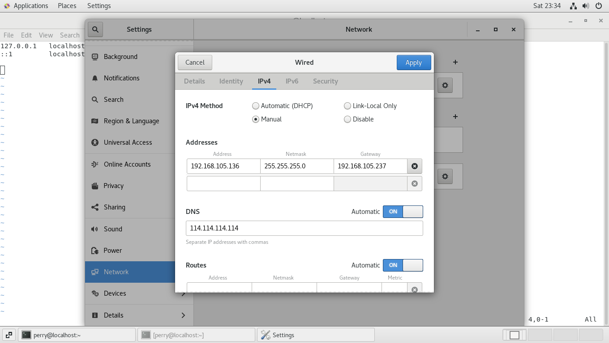
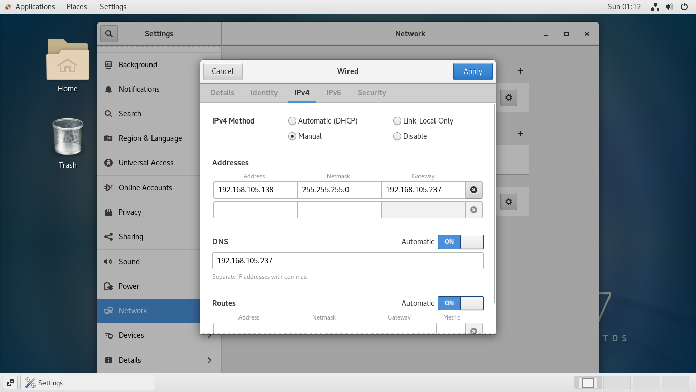
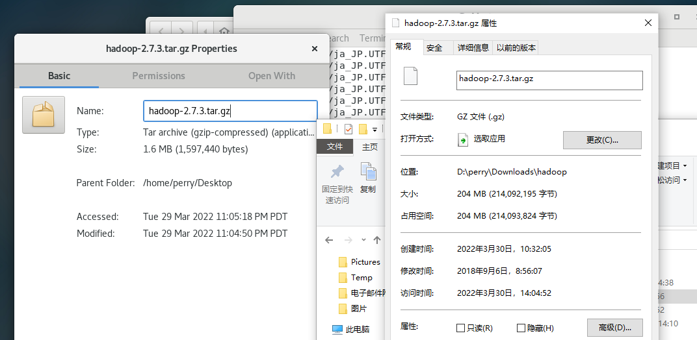
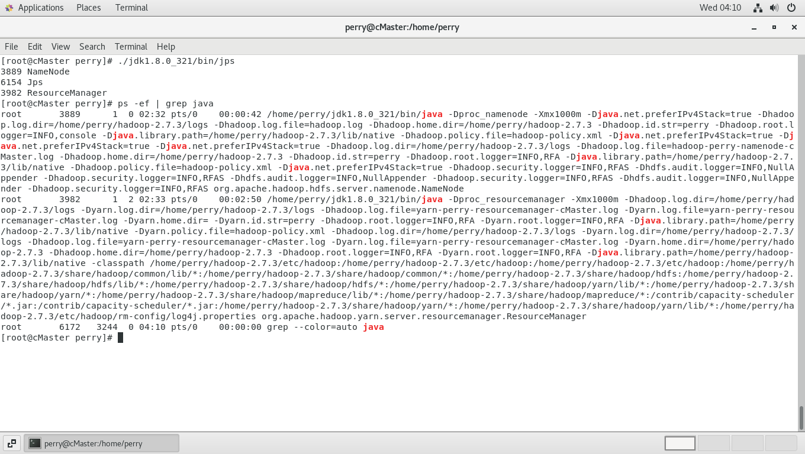
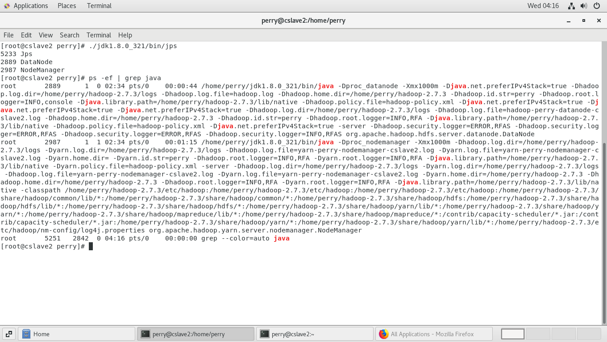
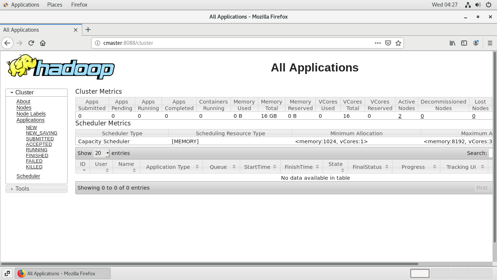
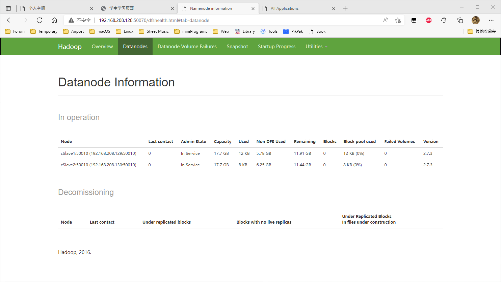

## 安装CentOS7

略

## 创建快照

略

## 配置cMaster

- 配置设备名


- 配置IP



- 配置hosts **（注：记得sudo；且三台机器都要配）**


## 配置cSlave1

直接通过快照克隆即可

- 给网卡生成新Mac地址以防出现冲突问题


- 配置IP


- cSlave1网络重连后，查看 cMaster 与 cSlave1 网络配置信息（IPv6暂不使用 实验过程不修，解决方案同理）

  ```shell
  [perry@cmaster ~]$ ifconfig
  ens33: flags=4163<UP,BROADCAST,RUNNING,MULTICAST>  mtu 1500
          inet 192.168.105.136  netmask 255.255.255.0  broadcast 192.168.105.255
          inet6 fe80::dfe1:4928:3d3b:ea82  prefixlen 64  scopeid 0x20<link>
          inet6 240e:47c:4e50:25f0:e0d6:8f10:aca0:ea05  prefixlen 64  scopeid 0x0<global>
          ether 00:0c:29:78:dc:ff  txqueuelen 1000  (Ethernet)
          RX packets 17742  bytes 23648604 (22.5 MiB)
          RX errors 0  dropped 0  overruns 0  frame 0
          TX packets 3436  bytes 229019 (223.6 KiB)
          TX errors 0  dropped 0 overruns 0  carrier 0  collisions 0
  ```

  ```shell
  [perry@cslave1 ~]$ ifconfig
  ens33: flags=4163<UP,BROADCAST,RUNNING,MULTICAST>  mtu 1500
          inet 192.168.105.137  netmask 255.255.255.0  broadcast 192.168.105.255
          inet6 fe80::dfe1:4928:3d3b:ea82  prefixlen 64  scopeid 0x20<link>
          inet6 240e:47c:4e50:25f0:e0d6:8f10:aca0:ea05  prefixlen 64  scopeid 0x0<global>
          ether 00:50:56:20:d3:e1  txqueuelen 1000  (Ethernet)
          RX packets 3525  bytes 4779282 (4.5 MiB)
          RX errors 0  dropped 0  overruns 0  frame 0
          TX packets 687  bytes 46416 (45.3 KiB)
          TX errors 0  dropped 0 overruns 0  carrier 0  collisions 0
  
  ```


## 配置cSlave2

同理，克隆快照，然后重建网卡。

- 配置IP



- 查看IP配置

  ```shell
  [perry@cslave2 ~]$ ifconfig
  ens33: flags=4163<UP,BROADCAST,RUNNING,MULTICAST>  mtu 1500
          inet 192.168.105.138  netmask 255.255.255.0  broadcast 192.168.105.255
          inet6 240e:47c:4e50:25f0:250:56ff:fe34:f24d  prefixlen 64  scopeid 0x0<global>
          inet6 fe80::250:56ff:fe34:f24d  prefixlen 64  scopeid 0x20<link>
          ether 00:50:56:34:f2:4d  txqueuelen 1000  (Ethernet)
          RX packets 5428  bytes 7626044 (7.2 MiB)
          RX errors 0  dropped 0  overruns 0  frame 0
          TX packets 2581  bytes 179304 (175.1 KiB)
          TX errors 0  dropped 0 overruns 0  carrier 0  collisions 0
  ```


## 配置密钥对与主机间信任关系

**注：此步骤三台机器都要跑一遍**

**此处仅以cMaster为例，其余同理**

- 生成密钥对

  ```shell
  [perry@cmaster ~]$ su
  Password: 
  [root@cmaster perry]# ssh-keygen -t rsa
  Generating public/private rsa key pair.
  Enter file in which to save the key (/root/.ssh/id_rsa): 
  Created directory '/root/.ssh'.
  Enter passphrase (empty for no passphrase): 
  Enter same passphrase again: 
  Your identification has been saved in /root/.ssh/id_rsa.
  Your public key has been saved in /root/.ssh/id_rsa.pub.
  The key fingerprint is:
  SHA256:h3epj488lX/m26pV3gQo8OD9Xj8DmkbMVgC8Mn2NOac root@cmaster
  The key's randomart image is:
  +---[RSA 2048]----+
  |        +...     |
  |       . *  ..   |
  |        o = =..  |
  |       o +oB.+ . |
  |        S +=Bo. o|
  |         ooE=..=.|
  |          .=...o+|
  |         .o+ .. *|
  |          +o+..*+|
  +----[SHA256]-----+
  ```

- 将公钥copy到其他机器上

  ```shell
  [root@ cMaster ~]# ssh-copy-id -i ~/.ssh/id_rsa.pub cMaster
  [root@ cMaster ~]# ssh-copy-id -i ~/.ssh/id_rsa.pub cSlave1
  [root@ cMaster ~]# ssh-copy-id -i ~/.ssh/id_rsa.pub cSlave2
  ```

  Ex.

  ```shell
  [root@cmaster perry]# cd /root/.ssh/
  [root@cmaster .ssh]# ls
  id_rsa  id_rsa.pub
  [root@cmaster .ssh]# ssh-copy-id -i ~/.ssh/id_rsa.pub cMaster
  /usr/bin/ssh-copy-id: INFO: Source of key(s) to be installed: "/root/.ssh/id_rsa.pub"
  The authenticity of host 'cmaster (192.168.105.136)' can't be established.
  ECDSA key fingerprint is SHA256:xF82Ukz8MwbWy/R7D9wvQvPdbVIbP06JUbqMs1o5FU8.
  ECDSA key fingerprint is MD5:21:f1:62:b8:47:86:e7:a7:05:e3:2b:0d:0d:bf:4f:23.
  Are you sure you want to continue connecting (yes/no)? yes
  /usr/bin/ssh-copy-id: INFO: attempting to log in with the new key(s), to filter out any that are already installed
  /usr/bin/ssh-copy-id: INFO: 1 key(s) remain to be installed -- if you are prompted now it is to install the new keys
  root@cmaster's password: 
  
  Number of key(s) added: 1
  
  Now try logging into the machine, with:   "ssh 'cMaster'"
  and check to make sure that only the key(s) you wanted were added.
  
  ```

  ```shell
  [root@cmaster .ssh]# ssh-copy-id -i ~/.ssh/id_rsa.pub cSlave1
  /usr/bin/ssh-copy-id: INFO: Source of key(s) to be installed: "/root/.ssh/id_rsa.pub"
  The authenticity of host 'cslave1 (192.168.105.137)' can't be established.
  ECDSA key fingerprint is SHA256:xF82Ukz8MwbWy/R7D9wvQvPdbVIbP06JUbqMs1o5FU8.
  ECDSA key fingerprint is MD5:21:f1:62:b8:47:86:e7:a7:05:e3:2b:0d:0d:bf:4f:23.
  Are you sure you want to continue connecting (yes/no)? y
  Please type 'yes' or 'no': yes
  /usr/bin/ssh-copy-id: INFO: attempting to log in with the new key(s), to filter out any that are already installed
  /usr/bin/ssh-copy-id: INFO: 1 key(s) remain to be installed -- if you are prompted now it is to install the new keys
  root@cslave1's password: 
  
  Number of key(s) added: 1
  
  Now try logging into the machine, with:   "ssh 'cSlave1'"
  and check to make sure that only the key(s) you wanted were added.
  ```

  ```shell
  [root@cmaster .ssh]# ssh-copy-id -i ~/.ssh/id_rsa.pub cSlave2
  /usr/bin/ssh-copy-id: INFO: Source of key(s) to be installed: "/root/.ssh/id_rsa.pub"
  The authenticity of host 'cslave2 (192.168.105.138)' can't be established.
  ECDSA key fingerprint is SHA256:xF82Ukz8MwbWy/R7D9wvQvPdbVIbP06JUbqMs1o5FU8.
  ECDSA key fingerprint is MD5:21:f1:62:b8:47:86:e7:a7:05:e3:2b:0d:0d:bf:4f:23.
  Are you sure you want to continue connecting (yes/no)? yes
  /usr/bin/ssh-copy-id: INFO: attempting to log in with the new key(s), to filter out any that are already installed
  /usr/bin/ssh-copy-id: INFO: 1 key(s) remain to be installed -- if you are prompted now it is to install the new keys
  root@cslave2's password: 
  
  Number of key(s) added: 1
  
  Now try logging into the machine, with:   "ssh 'cSlave2'"
  and check to make sure that only the key(s) you wanted were added.
  ```


## 关闭防火墙

- 查看防火墙状态

  ```shell
  systemctl status firewalld.service
  ```

- 执行关闭命令

  ```shell
  systemctl stop firewalld.service
  ```

- 禁用防火墙开机自启

  ```shell
  systemctl disable firewalld.service
  ```

- 附：启用方法

  ```shell
  systemctl start firewalld.service
  systemctl enable firewalld.service
  ```

  

- 以cMaster上执行为例

  ```shell
  [perry@cmaster ~]$ systemctl status firewalld.service
  ● firewalld.service - firewalld - dynamic firewall daemon
     Loaded: loaded (/usr/lib/systemd/system/firewalld.service; enabled; vendor preset: enabled)
     Active: active (running) since Mon 2022-03-28 08:57:02 HKT; 23min ago
       Docs: man:firewalld(1)
   Main PID: 761 (firewalld)
      Tasks: 2
     CGroup: /system.slice/firewalld.service
             └─761 /usr/bin/python2 -Es /usr/sbin/firewalld --nofork --nopid
  
  Mar 28 08:57:01 cmaster systemd[1]: Starting firewalld - dynamic firewall daemon...
  Mar 28 08:57:02 cmaster systemd[1]: Started firewalld - dynamic firewall daemon.
  Mar 28 08:57:03 cmaster firewalld[761]: WARNING: AllowZoneDrifting is enabled. This is considered an insecure configuration option. It wil... it now.
  Hint: Some lines were ellipsized, use -l to show in full.
  
  
  [perry@cmaster ~]$ systemctl stop firewalld.service
  
  
  [perry@cmaster ~]$ systemctl status firewalld.service
  ● firewalld.service - firewalld - dynamic firewall daemon
     Loaded: loaded (/usr/lib/systemd/system/firewalld.service; enabled; vendor preset: enabled)
     Active: inactive (dead) since Mon 2022-03-28 09:21:17 HKT; 6s ago
       Docs: man:firewalld(1)
    Process: 761 ExecStart=/usr/sbin/firewalld --nofork --nopid $FIREWALLD_ARGS (code=exited, status=0/SUCCESS)
   Main PID: 761 (code=exited, status=0/SUCCESS)
  
  Mar 28 08:57:01 cmaster systemd[1]: Starting firewalld - dynamic firewall daemon...
  Mar 28 08:57:02 cmaster systemd[1]: Started firewalld - dynamic firewall daemon.
  Mar 28 08:57:03 cmaster firewalld[761]: WARNING: AllowZoneDrifting is enabled. This is considered an insecure configuration option. It wil... it now.
  Mar 28 09:21:13 cmaster systemd[1]: Stopping firewalld - dynamic firewall daemon...
  Mar 28 09:21:17 cmaster systemd[1]: Stopped firewalld - dynamic firewall daemon.
  Hint: Some lines were ellipsized, use -l to show in full.
  [perry@cmaster ~]$ systemctl disable firewalld.service
  Removed symlink /etc/systemd/system/multi-user.target.wants/firewalld.service.
  Removed symlink /etc/systemd/system/dbus-org.fedoraproject.FirewallD1.service.
  
  ```


## 安装JDK

[Java Downloads | Oracle](https://www.oracle.com/java/technologies/downloads/)

解包命令

```shell
tar -zxvf jdk-8u321-linux-x64.tar.gz
```

系统环境变量

```shell
vim /etc/profile
```

加入

```shell
export JAVA_HOME=/home/perry/jdk1.8.0_321
export PATH=$PATH:$JAVA_HOME/bin:$JAVA_HOME/jre/bin
export CLASSPATH=$CLASSPATH:.:$JAVA_HOME/lib:$JAVA_HOME/jre/lib
```

注意：（据说）不可使用openJDK，已安装的JDK版本具体可通过以下命令查询

```shell
[perry@cslave2 ~]$ java -version
openjdk version "1.8.0_262"
OpenJDK Runtime Environment (build 1.8.0_262-b10)
OpenJDK 64-Bit Server VM (build 25.262-b10, mixed mode)
```


**JDK与Hadoop使用SSH而非VMTools拖进虚拟机，否则可能会出现文件大小不一致等问题**

**JDK与Hadoop使用SSH而非VMTools拖进虚拟机，否则可能会出现文件大小不一致等问题**

**JDK与Hadoop使用SSH而非VMTools拖进虚拟机，否则可能会出现文件大小不一致等问题**




## 部署Hadoop集群

**解压Hadoop** 

```shell
tar -zxvf /home/perry/hadoop-2.7.3.tar.gz
```


**如果JDK环境变量已设置好，此步骤可跳过：**

​	更改Hadoop配置文件 `/home/perry/hadoop-2.7.3/etc/hadoop/hadoop-env.sh`

​	将 `export JAVA_HOME=${JAVA_HOME}` 改为 Java安装路径（可通过 `whitch java`查询 ），此处为 `/usr/bin/java`


**编辑配置文件**

编辑文件“/home/perry/hadoop-2.7.3/etc/hadoop/core-site.xml”，将如下内容嵌入到此文件的configuration标签间，三台机器操作相同

```xml
<property><name>hadoop.tmp.dir</name><value>/home/perry/cloudData</value></property>
<property><name>fs.defaultFS</name><value>hdfs://cMaster:8020</value></property>
```

编辑文件“/home/perry/hadoop-2.7.3/etc/hadoop/yarn-site.xml”，将如下内容嵌入到此文件的configuration标签间，三台机器操作相同

```xml
<property><name>yarn.resourcemanager.hostname</name><value>cMaster</value></property>
<property><name>yarn.nodemanager.aux-services</name><value>mapreduce_shuffle</value></property>
```

将文件“/home/perry/hadoop-2.7.3/etc/hadoop/mapred-site.xml.template”重命名为“/home/xmy/hadoop-2.7.3/etc/hadoop/mapred-site.xml”。接着编辑此文件，将如下内容嵌入到此文件的configuration标签间，三台机器操作相同（重命名：`mv fileNameA fileNameB`）

```xml
<property><name>mapreduce.framework.name</name><value>yarn</value></property>
```


**启动Hadoop**

- 在cMaster上格式化主节点命名空间

  ```
  [perry@cMaster~]# hadoop-2.7.3/bin/hdfs namenode -format
  ```

- 在主节点cMaster上启动存储主服务namenode和资源管理主服务resourcemanager

  ```shell
  [perry@cMaster~]# hadoop-2.7.3/sbin/hadoop-daemon.sh start namenode     	#cMaster启动存储主服务  
  [perry@cMaster~]# hadoop-2.7.3/sbin/yarn-daemon.sh start resourcemanager  	#cMaster启动资源管理主服务
  ```

- 在从节点上启动存储从服务datanode和资源管理从服务nodemanager

  ```shell
  [perry@cSlave1~]# hadoop-2.7.3/sbin/hadoop-daemon.sh start datanode     	# cSlave0启动存储从服务
  [perry@cSlave1~]# hadoop-2.7.3/sbin/yarn-daemon.sh start nodemanager    	# cSlave0启动资源管理从服务
  ```

  ```shell
  [perry@cSlave2~]# hadoop-2.7.3/sbin/hadoop-daemon.sh start datanode     	# cSlave1启动存储从服务
  [perry@cSlave2~]# hadoop-2.7.3/sbin/yarn-daemon.sh start nodemanager     	# cSlave1启动资源管理从服务
  ```

  

**测试Hadoop**

分别在三台机器上执行如下命令，查看hadoop服务是否已经启动。

```shell
[root@cMaster perry]# ./jdk1.8.0_321/bin/jps		# jps查看java进程
[root@cMaster perry]# ps -ef | grep java			# ps查看java进程
```

- cMaster上应能看到 NameNode 和 ResourceManager



- cSlave1, cSlave2 上应能看到 DataNode 和 NodeManager





- 任意设备打开浏览器测试访问






!

- 用程序验证集群

（1）使用hadoop命令在在群集中新建文件夹“/in”

（2）将cMaster上，文件夹“/home/xmy/ hadoop-2.7.3/etc/hadoop”里的所有文件上传至群集文件夹“/in”下

（3）使用示例程序WordCount，统计“/in”下每个单词出现次数，并将结果存入“/out”目录。

```shell
[perry@cMaster hadoop-2.7.3]$ bin/hdfs dfs -mkdir /in             								#集群里新建in目录
[perry@cMaster hadoop-2.7.3]$ bin/hdfs dfs -put /home/perry/ hadoop-2.7.3/etc/hadoop/* /in		#将本地文件上传至hdfs
[perry@cMaster hadoop-2.7.3]$ bin/hadoop jar share/hadoop/mapreduce/hadoop-mapreduce-examples-2.7.3.jar wordcount /in /out/wc-01		#使用示例程序WordCount计算数据
```


此时在浏览器迅速打开“cMaster:8088”，将会看到web界面上显示正在运行的WordCount信息。打开“cMaster:50070”，点击链接“Browse the filesystem”，将会看到刚才的输入数据“/in”和输出结果数据“/out/wc-01/part-r-00000”。


也可以用shell查看输入/输出：

```shell
[root@cMaster hadoop-2.7.3]# bin/hdfs dfs -cat /in/*			# 使用命令查看hdfs中的文件
cat: `/in/perry': Is a directory

[root@cMaster hadoop-2.7.3]# bin/hdfs dfs -cat /out/wc-01/*
cat: `/out/wc-01/*': No such file or directory
```


**分布式集群的弹性扩展验证**

- 关掉cSlave2：


