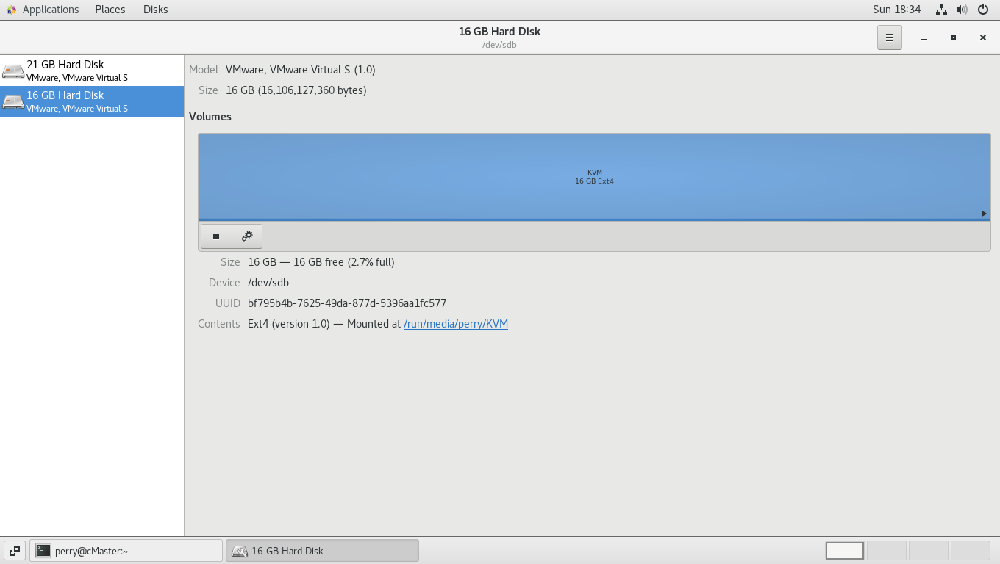
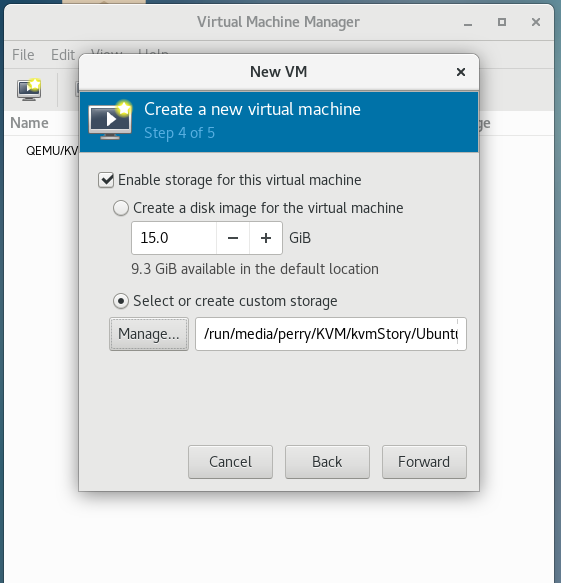
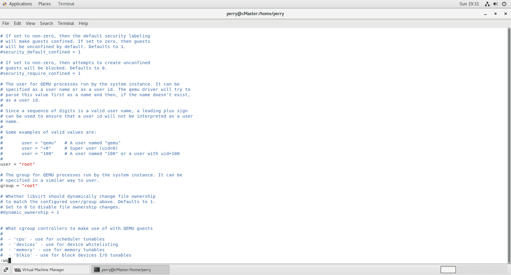
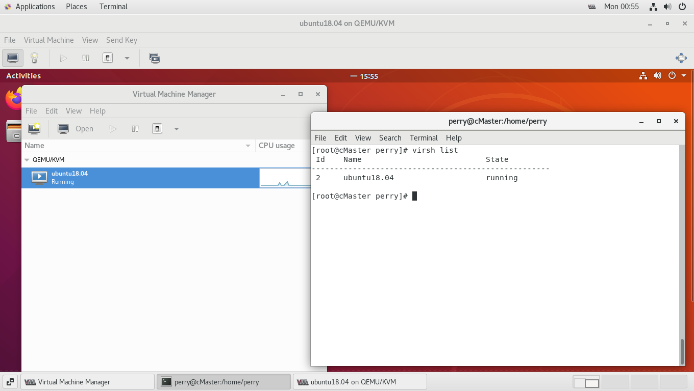
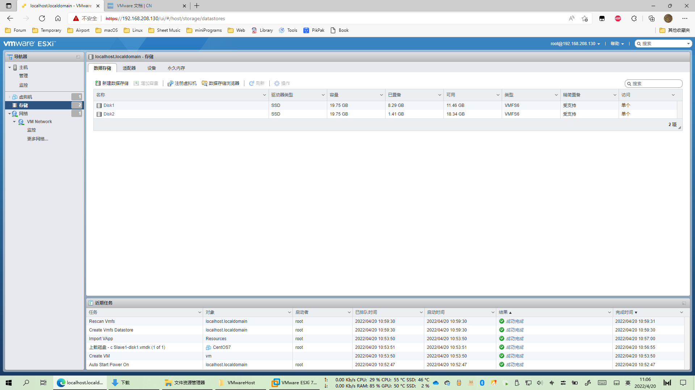
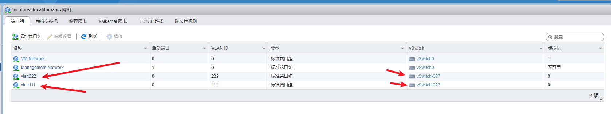
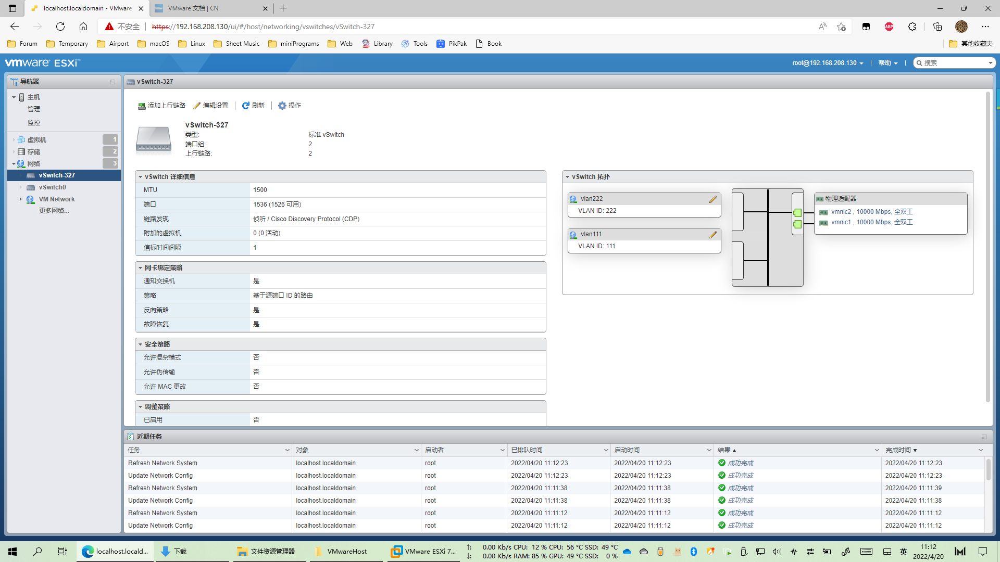
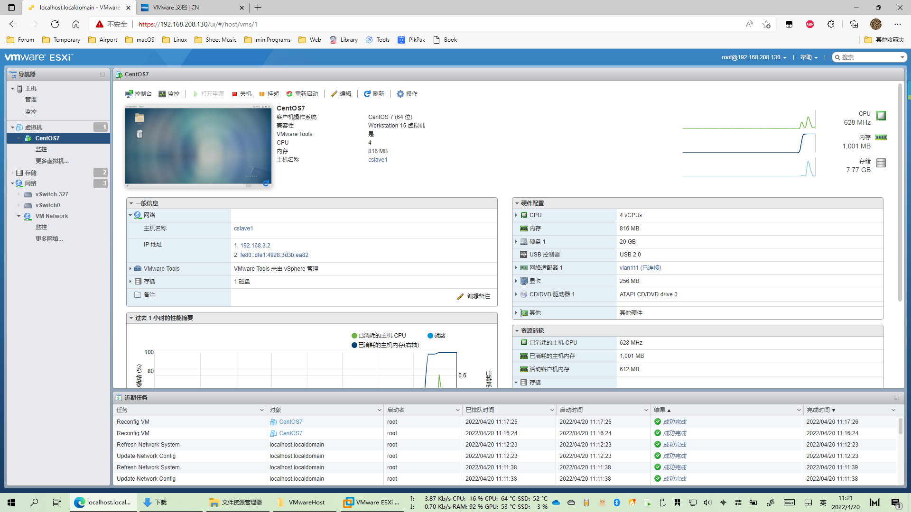

# 虚拟化实验

## **QEMU-KVM虚拟机镜像制作**

- 关闭防火墙和selinux

```shell
[root@cMaster perry]# systemctl stop firewalld
[root@cMaster perry]# setenforce 0
```

- 安装kvm并重启系统

```shell
## 1.安装kvm
yum install -y qemu-kvm libvirt virt-install bridge-utils
## 2.重启系统
init 6
```

- 验证kvm安装情况

```
[root@cMaster perry]# virsh -c qemu:///system list
 Id    Name                           State
----------------------------------------------------

```

- 加载并检测kvm模块是否工作正常

```shell
## 加载kvm模块
modprobe kvm

## 检查模块是否加载成功，执行如下命令
lsmod |grep kvm
```

- 启动kvm服务

```shell
## 1.启动libvirtd守护进程
systemctl start libvirtd
## 2.查看是否启动成功 下方显示“Active: active (running)”，则表示启动成功。
systemctl status libvirtd
● libvirtd.service - Virtualization daemon
   Loaded: loaded (/usr/lib/systemd/system/libvirtd.service; enabled; vendor preset: enabled)
   Active: active (running) since Sun 2022-04-17 18:22:21 PDT; 2min 28s ago
     Docs: man:libvirtd(8)
           https://libvirt.org
 Main PID: 1014 (libvirtd)
    Tasks: 19 (limit: 32768)
   CGroup: /system.slice/libvirtd.service
           ├─1014 /usr/sbin/libvirtd
           ├─1343 /usr/sbin/dnsmasq --conf-file=/var/lib/libvirt/dnsmasq/defa...
           └─1346 /usr/sbin/dnsmasq --conf-file=/var/lib/libvirt/dnsmasq/defa...

Apr 17 18:22:23 cMaster dnsmasq[1330]: listening on virbr0(#3): 192.168.122.1
Apr 17 18:22:23 cMaster dnsmasq[1343]: started, version 2.76 cachesize 150
Apr 17 18:22:23 cMaster dnsmasq[1343]: compile time options: IPv6 GNU-getop...fy
Apr 17 18:22:23 cMaster dnsmasq-dhcp[1343]: DHCP, IP range 192.168.122.2 -- ...h
Apr 17 18:22:23 cMaster dnsmasq-dhcp[1343]: DHCP, sockets bound exclusively ...0
Apr 17 18:22:23 cMaster dnsmasq[1343]: reading /etc/resolv.conf
Apr 17 18:22:23 cMaster dnsmasq[1343]: using nameserver 192.168.208.2#53
Apr 17 18:22:23 cMaster dnsmasq[1343]: read /etc/hosts - 5 addresses
Apr 17 18:22:23 cMaster dnsmasq[1343]: read /var/lib/libvirt/dnsmasq/defaul...es
Apr 17 18:22:23 cMaster dnsmasq-dhcp[1343]: read /var/lib/libvirt/dnsmasq/de...e
Hint: Some lines were ellipsized, use -l to show in full.

```

- 系统安装过程：略


- 检查KVM状态

```shell
virsh list
```


- 配置SSH

```shell
# 检查是否安装了ssh服务
apt-cache policy openssh-client openssh-server

# 安装openssh
apt-get install openssh-server

# 检查运行状态
ps -e|grep ssh

# 启用ssh服务
sudo /etc/init.d/ssh start
```

检查状态


- ~~配置KVM中的Linux（此处为Ubuntu 18.04）~~

```shell
[root@cMaster perry]# sudo apt update
[root@cMaster perry]# sudo apt upgrade

# 安装Xfce桌面环境
sudo apt install xfce4 xfce4-goodies

# 安装TightVNC服务器
sudo apt install tightvncserver

# 设置安全密码并创建初始配置文件
vncserver
```


## 以上 · 可能会遇到的问题


- 解决方案：检查网络连接状态，代理服务器状态。


- 磁盘空间不足

添加新磁盘并分区




分区后 添加到KVM存储池中


创建虚拟机时选择刚才创建的虚拟磁盘




- 权限不足问题：


```shell
[root@cMaster perry]# vim /etc/libvirt/qemu.conf
```

去除以下两行含"root"字样的注释




- 可能会使用到的SSH命令：

```shell
## 检查安装状态
rpm -qa |grep ssh 

## 启动SSH服务
service sshd start 
```

```shell
# 安装ssh-client命令：
sudo apt-get install openssh-client
# 安装ssh-server命令：
sudo apt-get install openssh-server
```


- virsh list -all 为空问题


解决方案：su ！！！




## VMware vSphere ESXi安装及网络设置

- 配置虚拟存储池



- 虚拟机安装

过程过于简单，直接从WorkStation中导出OVF，ESXi中导入即可。


- 配置网络虚拟化

在虚拟交换机中添加，并做端口聚合


创建并配置VLAN







- 配置服务器虚拟化

编辑ESXi内虚拟机选项，配置网卡


虚拟机运行截图




