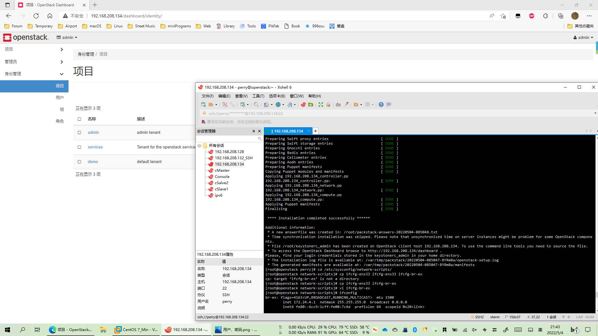
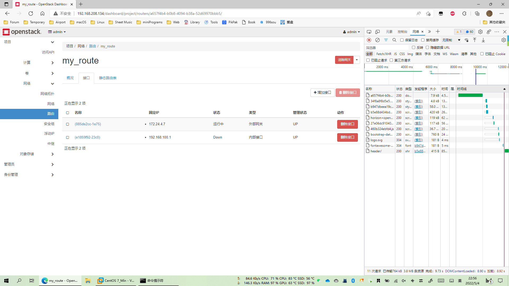
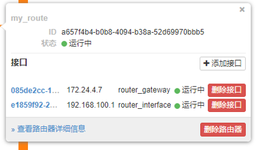
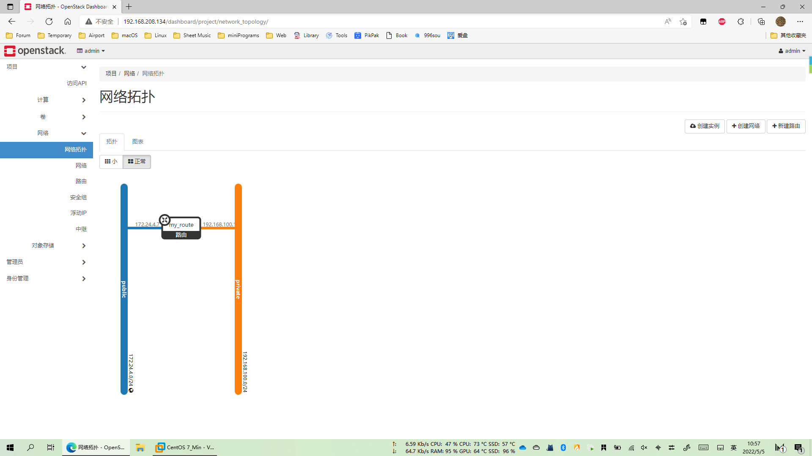
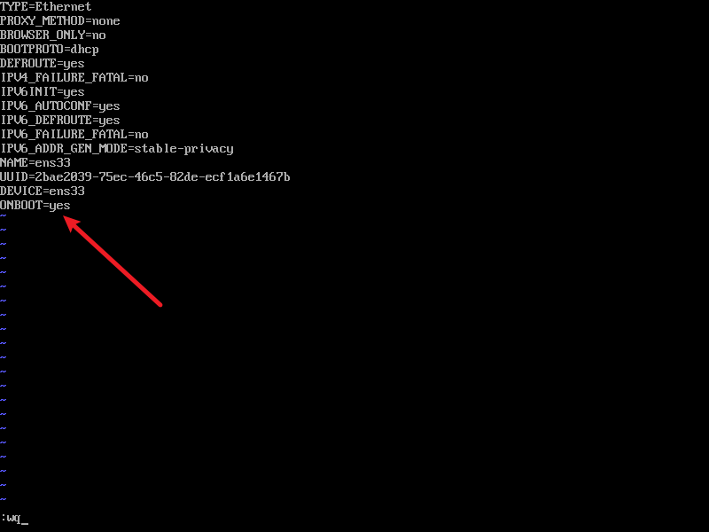
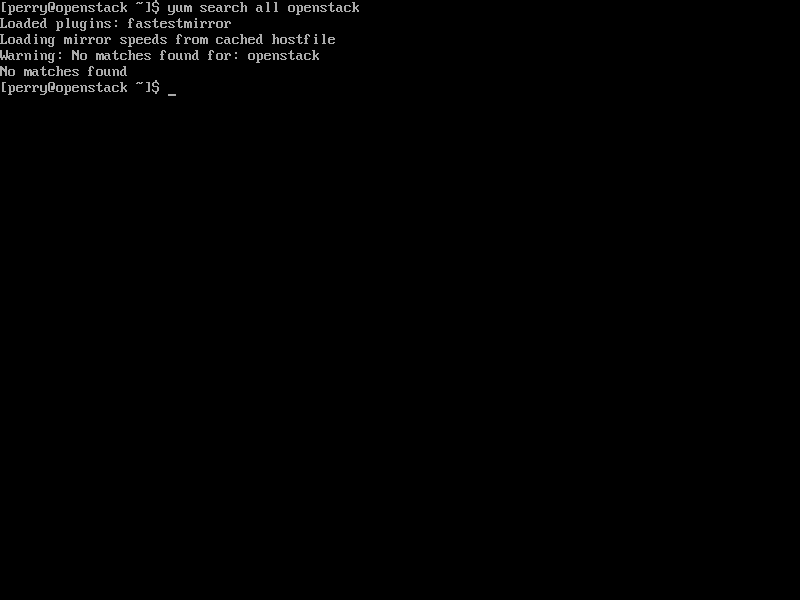

# OpenStack

## 前期部署

**最小化安装 CentOS 7**

略


**更改设备名**

```shell
vi /etc/hostname
```

将内容改为 openstack


**防火墙配置**

取消防火墙自启，并停止其服务

```shell
systemctl disable firewalld 
systemctl stop firewalld
```


**取消 NetworkManager 开机启动，停止服务**

```shell
systemctl disable NetworkManager 
systemctl stop NetworkManager
```


**关闭 SeLinux 开机启动**

```shell
vi /etc/sysconfig/selinux
```


**重启系统**

```shell
reboot
```


## 使用 packstack 一键部署 OpenStack

**更新yum仓库**

```
yum -y update
```

**安装wget**

```
yum -y install wget
```

换源

```shell
$ cd /etc/yum.repos.d
$ sudo wget -nc http://mirrors.aliyun.com/repo/Centos-7.repo
$ sudo mv Centos-7.repo CentOS-Base.repo
```


**更新**

```
yum update
```


**本项目选择安装 queens 版本OpenStack**

```
yum install -y centos-release-openstack-queens
```


**安装 packstack 软件包**

```
yum install -y openstack-packstack
```


**部署OpenStack**

```
packstack --allinone
```

OpenStack 部署完成之后，Linux 虚拟网桥 br-ex 中的 IP 地址是临时的，需要生成配置文件。

需要先将 ens33 网卡的配置文件拷贝一份，执行如下命令。

```shell
[root@openstack ~]# cd /etc/sysconfig/network-scripts/ 
[root@openstack network-scripts]# cp ifcfg-ens33 ifcfg-br-ex
```

通过 vi 命令，编辑 ifcfg-br-ex 文件

```shell
TYPE="Ethernet"
PROXY_METHOD="none"
BROWSER_ONLY="no"
BOOTPROTO="none"
DEFROUTE="yes"
IPV4_FAILURE_FATAL="no"
IPV6INIT="yes"
IPV6_AUTOCONF="yes"
IPV6_DEFROUTE="yes"
IPV6_FAILURE_FATAL="no"
IPV6_ADDR_GEN_MODE="stable-privacy"
NAME="br-ex"
UUID="684e7321-ad5b-424b-bfcb-e1daf6801ec9"
DEVICE="br-ex"
ONBOOT="yes"
IPADDR="172.24.4.1"
PREFIX="24"
GATEWAY="172.24.4.2"
DNS1="114.114.114.114"
IPV6_PRIVACY="no"
```

至此，已经完成 OpenStack 的部署。控制台消息的最后部分提示了环境变量文件和日志 文件的位置，以及登录 Dashboard 的方法。根据提示，在浏览器中输入 http://主机 IP 地址/dashboard,可以登录 OpenStack 的 Horizon Web 界面。


安装 OpenStack 后，在 root 用户的 Home 目录下会生成一个 keystone_admin 文件。该 文件记录有 keystone（OpenStack 认证组件）认证环境变量，包括用户名和登录密码。
注意：不同服务器生成的默认密码是不同的，如下所示。

```shell
[root@openstack ~]# cat keystonerc_admin 
unset OS_SERVICE_TOKEN
 export OS_USERNAME=admin
 export OS_PASSWORD='bc6fd682491a4b2a'
 export OS_REGION_NAME=RegionOne
 export OS_AUTH_URL=http://192.168.158.200:5000/v3
 export PS1='[\u@\h \W(keystone_admin)]\$ ' 
export OS_PROJECT_NAME=admin
export OS_USER_DOMAIN_NAME=Default
export OS_PROJECT_DOMAIN_NAME=Default
export OS_IDENTITY_API_VERSION=3
```


部署成功截图



## 创建云主机

**创建网络**


**创建路由**





**网络拓扑**






**创建实例**


### 附录


**部署前序要装wegt，安装wegt时遇到**

Could not retrieve mirrorlist http://mirrorlist.centos.org/?release=7&arch=x86_64&repo=os&infra=stock32 error was 14: curl#6 - "Could not resolve host: mirrorlist.centos.org; Unknown error"


解决方案：

修改dns

```
vi /etc/sysconfig/network-scripts/ifcfg-ens33
```



重启网络服务

```
service network restart
```


如果 `ping baidu.com` 依旧不通，可手动配置dns

```
vi /etc/resolv.conf
```


yum中没有openstack

