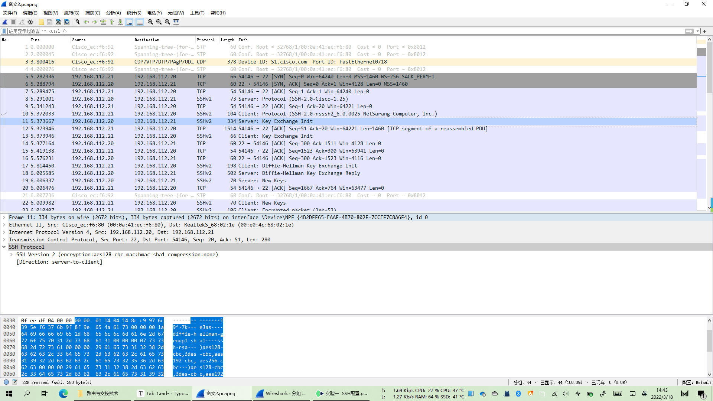

---
title: Cisco 交换机配置 SSH
date: 2022-03-18
tags:
  - Networking
  - Cisco
categories:
  - tech
---


# SSH配置

- 工具
  - Xshell6
  - USB to 232


## 配置主机IP


## Cisco交换机恢复出厂设置方法

1、电脑COM口通过console线连接到交换机console口，并打开超级终端调试窗口。
2、交换机接上电，  并按住“mode”按钮，直到sys灯不闪动为止松开“mode”按钮（也可以关注超级终端界面显示字符了就可以松开“mode”按钮），进入到交换机的底层模式switch:。
3、输入命令switch: flash_init 回车，初始化flash文件系统（该模式下，不支持命令的缩写）。
4、输入命令switch: dir flash: 回车，查看交换机配置文件（注意flash后面是有冒号的）。
5、输入命令switch: rename flash:config.text flash:config.bak回车，重命名交换机原始配置文件为config.bak,并使用命令switch: dir flash:查看文件名是否修改成功。
6、成功后，输入命令switch: boot,重启交换机。
7、在重启后清空当前配置和VLAN数据

```
Switch#erase startup-config
Switch#delete flash:vlan.dat
Switch#reload
```

最后当系统提示是否保存配置时，选择no

## 配置交换机

```shell
Switch>en
Switch#conf t
Enter configuration commands, one per line.  End with CNTL/Z.
Switch(config)#int vlan 1
Switch(config-if)#ip add 192.168.112.20 255.255.255.0
Switch(config-if)#no shut

```

```shell
Switch(config-if)#username admin password ccna
Switch(config)#line vty 0 15
Switch(config-line)#login local
Switch(config-line)#
*Mar  1 00:10:36.595: %LINK-3-UPDOWN: Interface FastEthernet0/18, changed state to up
*Mar  1 00:10:37.599: %LINEPROTO-5-UPDOWN: Line protocol on Interface FastEthernet0/18, changed state to up
*Mar  1 00:11:08.599: %LINEPROTO-5-UPDOWN: Line protocol on Interface Vlan1, changed state to up

```

### Telnet登录抓包测试


## SSH配置

```shell
S1(config)#host S1
S1(config)#ip domain-name cisco.com
S1(config)#crypto key generate rsa
The name for the keys will be: S1.cisco.com
Choose the size of the key modulus in the range of 360 to 2048 for your
  General Purpose Keys. Choosing a key modulus greater than 512 may take
  a few minutes.

How many bits in the modulus [512]: 1024
% Generating 1024 bit RSA keys, keys will be non-exportable...[OK]

S1(config)#line vty 0 15
S1(config-line)#transport input ssh     
S1(config-line)#login local
S1(config-line)#ip ssh version 2

```

## SSH连接

- --

  

### SSH登录抓包测试




