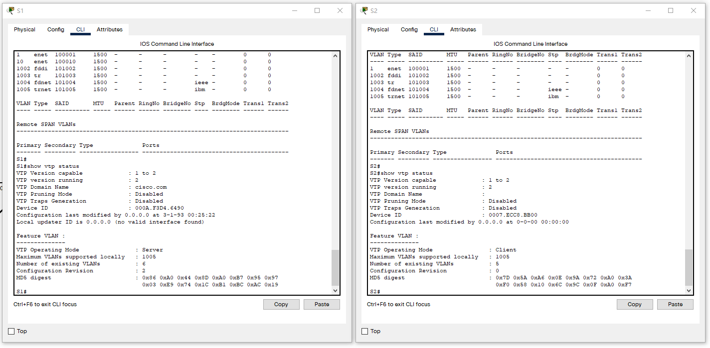
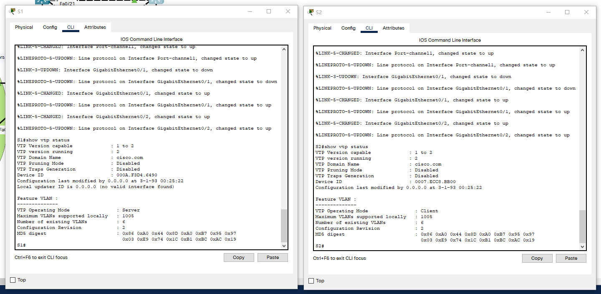

---
title: VTP+VLAN+TRUNK+CHANNEL实现小型局域网
date: 2022-03-28
tags:
  - Networking
  - Cisco
categories:
  - tech
---


# 实验二、VTP+VLAN+TRUNK+CHANNEL实现小型局域网

## 实验步骤

**以太通道**：分别在 S1 和 S2 交换机配置(为避免不同厂商,不同型号的设备之间的协商，请务必两端 手工配置，不要 auto)

```shell
S1(config)#interface range g0/1 - 2
S1(config-if-range)#channel-group 1 mode on
S1(config-if-range)#
Creating a port-channel interface Port-channel 1
```

**设置接口的 Trunk模式**：分别在 S1 和 S2 交换机的 port-channel 或者 range g0/1 – 2 封装 802.1q 协议,并设置 trunk 模式

```shell
S1(config)#int port-channel 1
S1(config-if)#switchport trunk encapsulation dot1q
S1(config-if)#switchport mode  trunk 
```

**VTP 管理 VLAN**：服务器设置为 server 模式,如在简单网络中,只设置一个 domain

```shell
S1(vlan)#vtp server
Device mode already VTP SERVER.
S1(vlan)#vtp domain cisco.com
Changing VTP domain name from NULL to cisco.com
S1(vlan)#vlan 10 name teacher
VLAN 10 modified:
    Name: teacher
```

客户机一般只需要设置模式为client,只要是接口trunk模式正确,则可学习domain和vlan

```shell
S2#vlan database
% Warning: It is recommended to configure VLAN from config mode,
  as VLAN database mode is being deprecated. Please consult user
  documentation for configuring VTP/VLAN in config mode.

S2(vlan)#vtp client
Setting device to VTP CLIENT mode.
S2(vlan)#exit
APPLY completed.
Exiting....
```

客户机会自动学习 vlan,最好使用 show vtp status 查看



改用G口




**各部门接口 access 到 vlan**：

```shell
S1(config)#int range f0/1-10,f0/22
S1(config-if-range)#switchport mode access
S1(config-if-range)#switchport access vlan 10
```


## 附

将运行配置保存到启动配置：

```shell
S1# copy running-config startup-config
```

