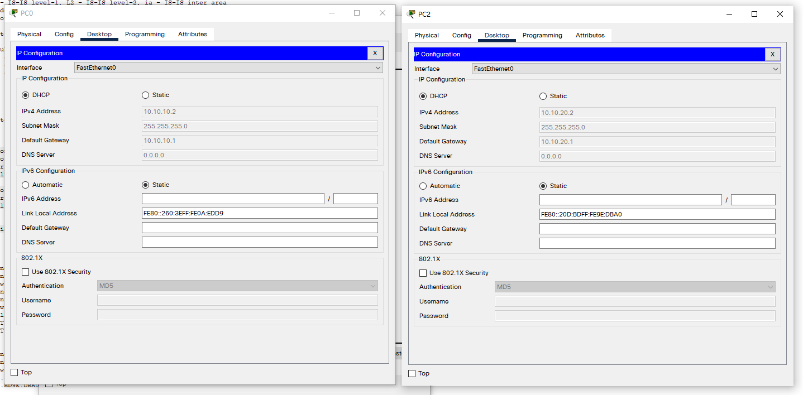
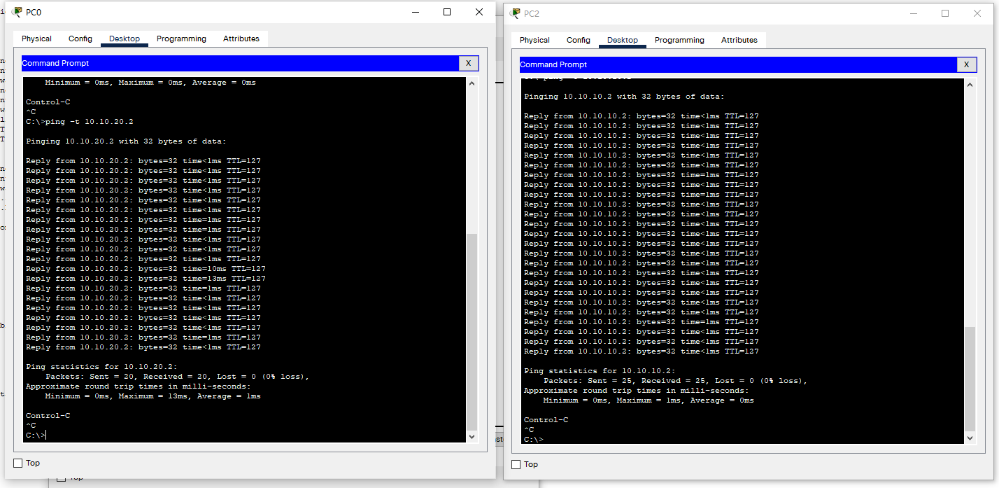

```
title: VLAN 间路由
date: 2022-04-15
tags:
  - Networking
  - Cisco
categories:
  - tech
```


# VLAN 间路由

## 拓扑


## 配置交换机

- 创建VLAN

  ```shell
  Switch>en
  Switch#conf t
  Enter configuration commands, one per line.  End with CNTL/Z.
  Switch(config)#host S0
  S0(config)#VLAN 10
  S0(config-vlan)#name Finance
  S0(config-vlan)#VLAN 20
  S0(config-vlan)#name Development
  S0(config-vlan)#VLAN 30
  S0(config-vlan)#name Management
  S0(config-vlan)#exit
  ```

- 划分VLAN

  ```shell
  S0(config)#int range f0/1-10
  S0(config-if-range)#switchport mode access
  S0(config-if-range)#switchport access VLAN 10
  S0(config-if-range)#int range f0/11-20
  S0(config-if-range)#switchport mode access
  S0(config-if-range)#switchport access VLAN 20
  S0(config-if-range)#int range f0/21-24
  S0(config-if-range)#switchport mode access
  S0(config-if-range)#switchport access VLAN 30
  S0(config-if-range)#end
  S0#
  %SYS-5-CONFIG_I: Configured from console by console
  ```

- 设置与路由连线的接口为trunk

  ```shell
  S0(config)#int g0/1
  S0(config-if)#switchport mode trunk
  ```

- 查看VLAN信息

  ```shell
  S0#show vlan
  
  VLAN Name                             Status    Ports
  ---- -------------------------------- --------- -------------------------------
  1    default                          active    Gig0/1, Gig0/2
  10   Finance                          active    Fa0/1, Fa0/2, Fa0/3, Fa0/4
                                                  Fa0/5, Fa0/6, Fa0/7, Fa0/8
                                                  Fa0/9, Fa0/10
  20   Development                      active    Fa0/11, Fa0/12, Fa0/13, Fa0/14
                                                  Fa0/15, Fa0/16, Fa0/17, Fa0/18
                                                  Fa0/19, Fa0/20
  30   Management                       active    Fa0/21, Fa0/22, Fa0/23, Fa0/24
  1002 fddi-default                     active    
  1003 token-ring-default               active    
  1004 fddinet-default                  active    
  1005 trnet-default                    active    
  
  VLAN Type  SAID       MTU   Parent RingNo BridgeNo Stp  BrdgMode Trans1 Trans2
  ---- ----- ---------- ----- ------ ------ -------- ---- -------- ------ ------
  1    enet  100001     1500  -      -      -        -    -        0      0
  10   enet  100010     1500  -      -      -        -    -        0      0
  20   enet  100020     1500  -      -      -        -    -        0      0
  30   enet  100030     1500  -      -      -        -    -        0      0
  1002 fddi  101002     1500  -      -      -        -    -        0      0   
  1003 tr    101003     1500  -      -      -        -    -        0      0   
  1004 fdnet 101004     1500  -      -      -        ieee -        0      0   
  1005 trnet 101005     1500  -      -      -        ibm  -        0      0   
  
  VLAN Type  SAID       MTU   Parent RingNo BridgeNo Stp  BrdgMode Trans1 Trans2
  ---- ----- ---------- ----- ------ ------ -------- ---- -------- ------ ------
  
  Remote SPAN VLANs
  ------------------------------------------------------------------------------
  
  Primary Secondary Type              Ports
  ------- --------- ----------------- ------------------------------------------
  ```


## 配置路由器

- 启用 g0/0 端口

  ```shell
  Router>en
  Router#conf t
  Enter configuration commands, one per line.  End with CNTL/Z.
  Router(config)#host R0
  R0(config)#int f0/0
  R0(config-if)#no shut
  
  R0(config-if)#
  %LINK-5-CHANGED: Interface FastEthernet0/0, changed state to up
  
  %LINEPROTO-5-UPDOWN: Line protocol on Interface FastEthernet0/0, changed state to up
  ```

- 回到 S0，检查Trunk状态

  ```shell
  S0#
  %LINK-5-CHANGED: Interface GigabitEthernet0/1, changed state to up
  
  %LINEPROTO-5-UPDOWN: Line protocol on Interface GigabitEthernet0/1, changed state to up
  
  S0#show interfaces trunk 
  Port        Mode         Encapsulation  Status        Native vlan
  Gig0/1      on           802.1q         trunking      1
  
  Port        Vlans allowed on trunk
  Gig0/1      1-1005
  
  Port        Vlans allowed and active in management domain
  Gig0/1      1,10,20,30
  
  Port        Vlans in spanning tree forwarding state and not pruned
  Gig0/1      none
  ```

- 为R0子接口封装dot1q

  ```shell
  R0(config)#interface f0/0.10
  R0(config-subif)#
  %LINK-5-CHANGED: Interface FastEthernet0/0.10, changed state to up
  
  %LINEPROTO-5-UPDOWN: Line protocol on Interface FastEthernet0/0.10, changed state to up
  
  R0(config-subif)#encapsulation dot1q 10
  R0(config-subif)#ip add 10.10.10.1 255.255.255.0
  R0(config-subif)#exit
  R0(config)#interface f0/0.20
  R0(config-subif)#
  %LINK-5-CHANGED: Interface FastEthernet0/0.20, changed state to up
  
  %LINEPROTO-5-UPDOWN: Line protocol on Interface FastEthernet0/0.20, changed state to up
  
  R0(config-subif)#encapsulation dot1q 20
  R0(config-subif)#ip add 10.10.20.1 255.255.255.0
  R0(config-subif)#exit
  R0(config)#interface f0/0.30
  R0(config-subif)#
  %LINK-5-CHANGED: Interface FastEthernet0/0.30, changed state to up
  
  %LINEPROTO-5-UPDOWN: Line protocol on Interface FastEthernet0/0.30, changed state to up
  
  R0(config-subif)#encapsulation dot1q 30
  R0(config-subif)#ip add 10.10.30.1 255.255.255.0
  R0(config-subif)#end
  R0#
  %SYS-5-CONFIG_I: Configured from console by console
  
  R0#
  ```

- 检测

  ```shell
  R0#show ip interface brief 
  Interface              IP-Address      OK? Method Status                Protocol 
  FastEthernet0/0        unassigned      YES unset  up                    up 
  FastEthernet0/0.10     10.10.10.1      YES manual up                    up 
  FastEthernet0/0.20     10.10.20.1      YES manual up                    up 
  FastEthernet0/0.30     10.10.30.1      YES manual up                    up 
  FastEthernet1/0        unassigned      YES unset  administratively down down 
  Serial2/0              unassigned      YES unset  administratively down down 
  Serial3/0              unassigned      YES unset  administratively down down 
  FastEthernet4/0        unassigned      YES unset  administratively down down 
  FastEthernet5/0        unassigned      YES unset  administratively down down
  R0#show ip route
  Codes: C - connected, S - static, I - IGRP, R - RIP, M - mobile, B - BGP
         D - EIGRP, EX - EIGRP external, O - OSPF, IA - OSPF inter area
         N1 - OSPF NSSA external type 1, N2 - OSPF NSSA external type 2
         E1 - OSPF external type 1, E2 - OSPF external type 2, E - EGP
         i - IS-IS, L1 - IS-IS level-1, L2 - IS-IS level-2, ia - IS-IS inter area
         * - candidate default, U - per-user static route, o - ODR
         P - periodic downloaded static route
  
  Gateway of last resort is not set
  
       10.0.0.0/24 is subnetted, 3 subnets
  C       10.10.10.0 is directly connected, FastEthernet0/0.10
  C       10.10.20.0 is directly connected, FastEthernet0/0.20
  C       10.10.30.0 is directly connected, FastEthernet0/0.30
  ```

- 配置DHCP

  ```shell
  R0#en
  R0#conf t
  Enter configuration commands, one per line.  End with CNTL/Z.
  R0(config)#ip dhcp pool v10
  R0(dhcp-config)#network 10.10.10.0 255.255.255.0
  R0(dhcp-config)#default-router 10.10.10.1
  R0(dhcp-config)#exit
  R0(config)#ip dhcp pool v20
  R0(dhcp-config)#network 10.10.20.0 255.255.255.0
  R0(dhcp-config)#default-router 10.10.20.1
  R0(dhcp-config)#end
  R0#
  %SYS-5-CONFIG_I: Configured from console by console
  ```

## 测试

- 为 PC0（位于VLAN10），PC2（位于VLAN20） 启用DHCP

  

- PC0, PC2互ping：

  


