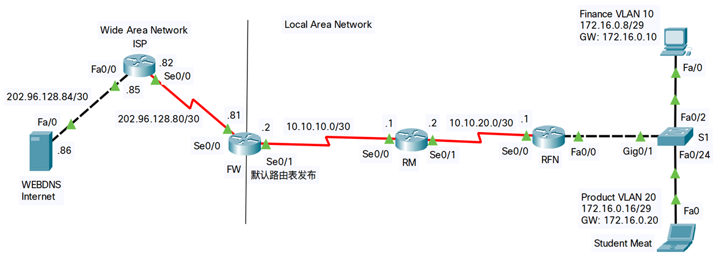
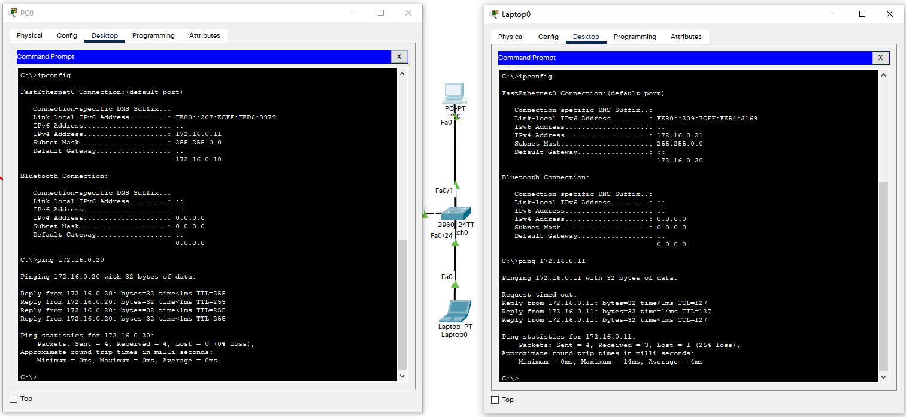
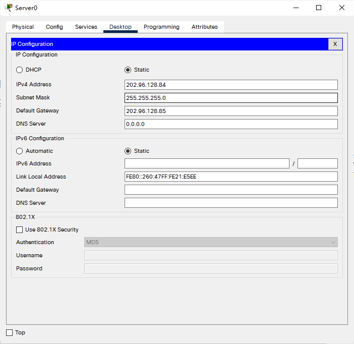
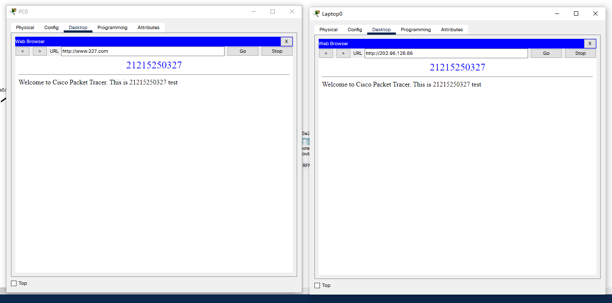

```
title: 静态路由&动态路由
date: 2022-05-19
tags:
  - Networking
  - Cisco
categories:
  - tech
```


# 静态路由+动态路由


## 拓扑

例图：



实际图（除出入端口外，其他与例图一致）：


### Switch0 配置

- 设置与路由连线的接口为trunk

```shell
Switch(config)#int g0/1
Switch(config-if)#switchport mode trunk 
```

- 划分VLAN

```shell
Switch(config)#VLAN 10
Switch(config-vlan)#name Finance
Switch(config-vlan)#VLAN 20
Switch(config-vlan)#name Student

Switch(config-if)#int fa 0/1
Switch(config-if)#switchport access vlan 10
% Access VLAN does not exist. Creating vlan 10
Switch(config-if)#switchport mode access 

Switch(config-if)#int fa0/24
Switch(config-if)#switchport access vlan 20
% Access VLAN does not exist. Creating vlan 20
Switch(config-if)#switchport mode access 
```

- 查看VLAN信息

```shell
Switch#show vlan

VLAN Name                             Status    Ports
---- -------------------------------- --------- -------------------------------
1    default                          active    Fa0/2, Fa0/3, Fa0/4, Fa0/5
                                                Fa0/6, Fa0/7, Fa0/8, Fa0/9
                                                Fa0/10, Fa0/11, Fa0/12, Fa0/13
                                                Fa0/14, Fa0/15, Fa0/16, Fa0/17
                                                Fa0/18, Fa0/19, Fa0/20, Fa0/21
                                                Fa0/22, Fa0/23, Gig0/1, Gig0/2
10   Finance                          active    Fa0/1
20   Student                          active    Fa0/24
1002 fddi-default                     active    
1003 token-ring-default               active    
1004 fddinet-default                  active    
1005 trnet-default                    active    

VLAN Type  SAID       MTU   Parent RingNo BridgeNo Stp  BrdgMode Trans1 Trans2
---- ----- ---------- ----- ------ ------ -------- ---- -------- ------ ------
1    enet  100001     1500  -      -      -        -    -        0      0
10   enet  100010     1500  -      -      -        -    -        0      0
20   enet  100020     1500  -      -      -        -    -        0      0
1002 fddi  101002     1500  -      -      -        -    -        0      0   
1003 tr    101003     1500  -      -      -        -    -        0      0   
1004 fdnet 101004     1500  -      -      -        ieee -        0      0   
1005 trnet 101005     1500  -      -      -        ibm  -        0      0   

VLAN Type  SAID       MTU   Parent RingNo BridgeNo Stp  BrdgMode Trans1 Trans2
---- ----- ---------- ----- ------ ------ -------- ---- -------- ------ ------

Remote SPAN VLANs
------------------------------------------------------------------------------

Primary Secondary Type              Ports
------- --------- ----------------- ------------------------------------------
```


### Router7 配置

- 启用到 S0 的端口

```shell
Router(config)#host R7
R7(config)#int fa0/0
R7(config-if)#no shut

R7(config-if)#
%LINK-5-CHANGED: Interface FastEthernet0/0, changed state to up

%LINEPROTO-5-UPDOWN: Line protocol on Interface FastEthernet0/0, changed state to up
```

- 回到 S0 检查 Trunk 状态

```shell
Switch#show interfaces trunk 
Port        Mode         Encapsulation  Status        Native vlan
Gig0/1      on           802.1q         trunking      1

Port        Vlans allowed on trunk
Gig0/1      1-1005

Port        Vlans allowed and active in management domain
Gig0/1      1,10,20

Port        Vlans in spanning tree forwarding state and not pruned
Gig0/1      none

Switch#show interfaces trunk 
Port        Mode         Encapsulation  Status        Native vlan
Gig0/1      on           802.1q         trunking      1

Port        Vlans allowed on trunk
Gig0/1      1-1005

Port        Vlans allowed and active in management domain
Gig0/1      1,10,20

Port        Vlans in spanning tree forwarding state and not pruned
Gig0/1      1,10,20
```

- 为 R7 子接口封装dot1q

```shell
R7(config)#int fa 0/0.10
R7(config-subif)#
%LINK-5-CHANGED: Interface FastEthernet0/0.10, changed state to up

%LINEPROTO-5-UPDOWN: Line protocol on Interface FastEthernet0/0.10, changed state to up

R7(config-subif)#encapsulation dot1Q 10
R7(config-subif)#ip add 172.16.0.10 255.255.255.248
R7(config-subif)#exit

R7(config)#int fa0/0.20
R7(config-subif)#
%LINK-5-CHANGED: Interface FastEthernet0/0.20, changed state to up

%LINEPROTO-5-UPDOWN: Line protocol on Interface FastEthernet0/0.20, changed state to up

R7(config-subif)#ip add 172.16.0.20 255.255.255.248
```

- 检测状态

```shell
R7#show ip interface brief
Interface              IP-Address      OK? Method Status                Protocol 
FastEthernet0/0        unassigned      YES unset  up                    up 
FastEthernet0/0.10     172.16.0.10     YES manual up                    up 
FastEthernet0/0.20     172.16.0.20     YES manual up                    up 
FastEthernet1/0        unassigned      YES unset  administratively down down 
Serial2/0              unassigned      YES unset  administratively down down 
Serial3/0              unassigned      YES unset  administratively down down 
FastEthernet4/0        unassigned      YES unset  administratively down down 
FastEthernet5/0        unassigned      YES unset  administratively down down
```

- 测试单臂路由

填好对应IP后，PC间互ping：



### Router4 配置


```shell
Router(config)#host R4
R4(config)#
R4(config)#int fa0/0
R4(config-if)#ip add 202.96.128.85
% Incomplete command.
R4(config-if)#ip add 202.96.128.85 255.255.255.252
R4(config-if)#no shut

R4(config-if)#
%LINK-5-CHANGED: Interface FastEthernet0/0, changed state to up

%LINEPROTO-5-UPDOWN: Line protocol on Interface FastEthernet0/0, changed state to up

R4(config-if)#int s2/0
R4(config-if)#ip add 202.96.128.82 255.255.255.252
R4(config-if)#no shut

R4(config-if)#
%LINK-5-CHANGED: Interface Serial2/0, changed state to up

R4(config-if)#
%LINEPROTO-5-UPDOWN: Line protocol on Interface Serial2/0, changed state to up

R4(config-if)#exit
R4(config)#
R4(config)#ip route 0.0.0.0 0.0.0.0 Seria0/0^Z
R4#
%SYS-5-CONFIG_I: Configured from console by console

```


- 此时 到 Router5 中启用对应端口

```shell
Router(config)#host R5
R5(config)#int s2/0
R5(config-if)#no shut

R5(config-if)#
%LINK-5-CHANGED: Interface Serial2/0, changed state to up

%LINEPROTO-5-UPDOWN: Line protocol on Interface Serial2/0, changed state to up
```

- Router4 中提示线路状态改变为 Up

```
%LINK-5-CHANGED: Interface Serial2/0, changed state to up

%LINEPROTO-5-UPDOWN: Line protocol on Interface Serial2/0, changed state to up
```

- Router4 配置缺省路由

```shell
R4(config)#ip route 0.0.0.0 0.0.0.0 S2/0
```

### Router5 配置

- 配置IP

```shell
R5(config)#int S2/0
R5(config-if)#ip add 202.96.128.81 255.255.255.252
R5(config-if)#int s3/0
R5(config-if)#ip add 10.10.10.2 255.255.255.252
R5(config-if)#no shut 

%LINK-5-CHANGED: Interface Serial3/0, changed state to down
```

- 配置缺省路由与OSPF

```shell
R5(config)#ip route 0.0.0.0 0.0.0.0 S2/0
```

- Server0 IP 配置



### Router6 配置

- IP 配置

```shell
Router(config-if)#int s2/0
Router(config-if)#ip add 10.10.10.2 255.255.255.252
Router(config-if)#no shut

Router(config-if)#
%LINK-5-CHANGED: Interface Serial2/0, changed state to up

%LINEPROTO-5-UPDOWN: Line protocol on Interface Serial2/0, changed state to up

Router(config-if)#int s3/0
Router(config-if)#ip add 10.10.20.2 255.255.255.252
Router(config-if)#no shut
Router(config-if)#
```

- OSPF配置

```shell
Router(config)#router ospf 1
Router(config-router)#network 10.10.10.0 0.0.0.3 area 0
Router(config-router)#
00:59:18: %OSPF-5-ADJCHG: Process 1, Nbr 202.96.128.81 on Serial2/0 from LOADING to FULL, Loading Done

Router(config-router)#network 10.10.20.0 0.0.0.3 area 0
```

### 继续配置 Router7

- IP配置

```shell
R7(config)#int s2/0
R7(config-if)#ip add 10.10.20.1 255.255.255.252
R7(config-if)#no shut

R7(config-if)#
%LINK-5-CHANGED: Interface Serial2/0, changed state to up

%LINEPROTO-5-UPDOWN: Line protocol on Interface Serial2/0, changed state to up
```

- OSPF配置

```shell
R7(config)#router ospf 1
R7(config-router)#network 10.10.20.0 0.0.0.3 area 0
R7(config-router)#network 172.16.0.8 0.0.0.7 area 0
R7(config-router)#network 172.16.0.16 0.0.0.7 area 0
R7(config-router)#
01:01:59: %OSPF-5-ADJCHG: Process 1, Nbr 10.10.20.2 on Serial2/0 from LOADING to FULL, Loading Done
```


## 测试

三台设备IP & 互ping


Server0 配置DNS


Server0 配置HTTP服务，并在PC0、Laptop0上分别以 IP 及 URL方式访问




