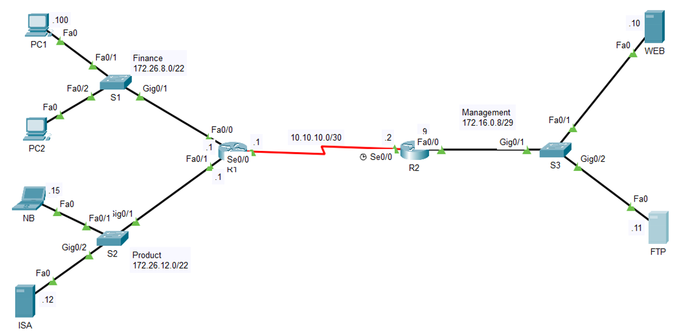
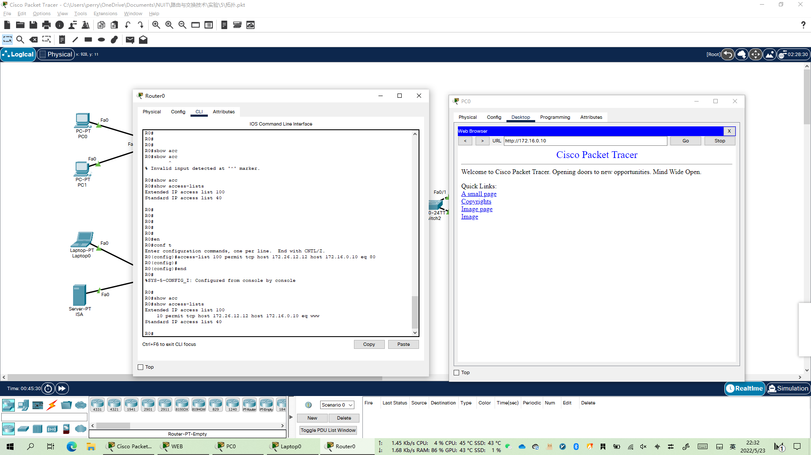
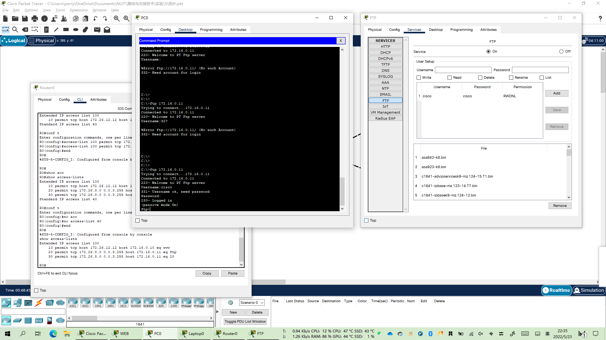
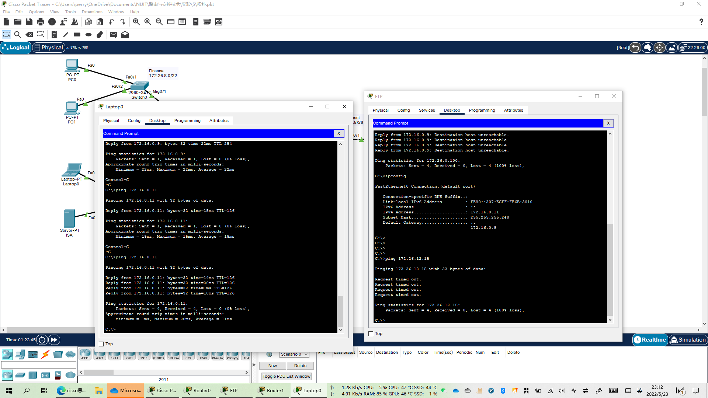

```
title: 扩展 ACL
date: 2022-05-23
tags:
  - Networking
  - Cisco
categories:
  - tech
```


# 拓展 ACL

## 拓扑与IP配置

参考拓扑：




实际拓扑（IP与上述保留一致）：


## Router0 配置

- 路由总结

```shell
R0(config)#ip route 172.26.8.0 255.255.248.0 s2/0 
或
R0(config)#ip route 172.26.8.0 255.255.248.0 10.10.10.1
```

- 配置IP

```shell
R0(config)#int f0/0
R0(config-if)#ip add 172.26.8.1 255.255.252.0
R0(config-if)#no shut

R0(config-if)#
%LINK-5-CHANGED: Interface FastEthernet0/0, changed state to up

%LINEPROTO-5-UPDOWN: Line protocol on Interface FastEthernet0/0, changed state to up


R0(config)#int f1/0
R0(config-if)#ip add 172.26.12.0 255.255.252.0
Bad mask /22 for address 172.26.12.0
R0(config-if)#no shut

R0(config-if)#
%LINK-5-CHANGED: Interface FastEthernet1/0, changed state to up

%LINEPROTO-5-UPDOWN: Line protocol on Interface FastEthernet1/0, changed state to up


R0(config)#int s2/0
R0(config-if)#ip add 10.10.10.1 255.255.255.252
R0(config-if)#no shut

%LINK-5-CHANGED: Interface Serial2/0, changed state to down
```


## Router1 配置

- IP 配置

```shell
R1(config)#int s2/0
R1(config-if)#ip add 10.10.10.2 255.255.255.252
R1(config-if)#no shut

R1(config-if)#
%LINK-5-CHANGED: Interface Serial2/0, changed state to up

%LINEPROTO-5-UPDOWN: Line protocol on Interface Serial2/0, changed state to up

R1(config-if)#int fa0/0
R1(config-if)#ip add 172.16.0.9 255.255.255.248
R1(config-if)#no shut

R1(config-if)#
%LINK-5-CHANGED: Interface FastEthernet0/0, changed state to up

%LINEPROTO-5-UPDOWN: Line protocol on Interface FastEthernet0/0, changed state to up
```


1. 




2. 




3. 




4. 


