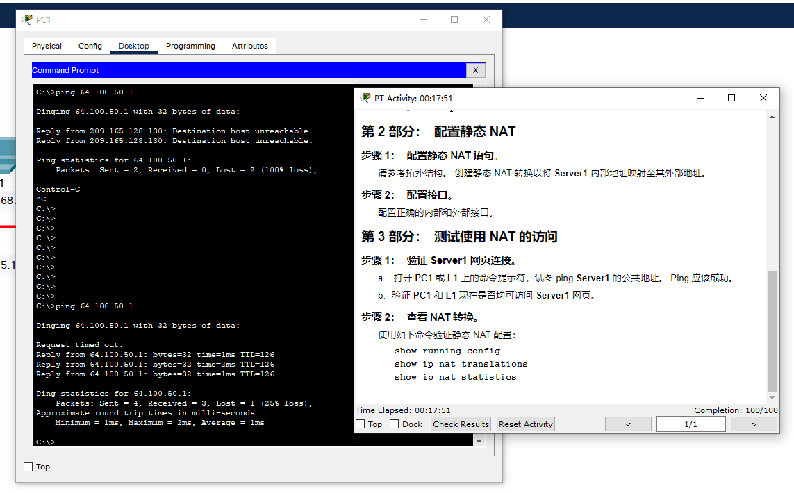
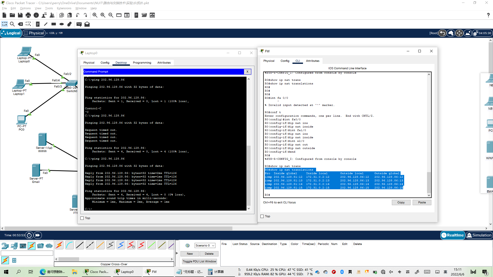

# 练手


```shell
R1>en
R1#conf t
R1(config)#ip nat inside source static 172.16.16.1 64.100.50.1
```

show run：


```shell
R1(config)#int s0/0/0
R1(config-if)#ip nat outside

R1(config)#int g0/0
R1(config-if)#ip nat ins
R1(config-if)#ip nat inside 
```





# NAT 网络地址转换

## 拓扑及IP配置


### S0 (FW)

```shell
Router(config)#host R0
R0(config)#int fa0/0
R0(config-if)#ip add 172.31.0.1 255.255.0.0 ?
  <cr>
R0(config-if)#ip add 172.31.0.1 255.255.0.0 
R0(config-if)#no shut

R0(config-if)#
%LINK-5-CHANGED: Interface FastEthernet0/0, changed state to up

%LINEPROTO-5-UPDOWN: Line protocol on Interface FastEthernet0/0, changed state to up

R0(config-if)#int fa1/0
R0(config-if)#ip add 172.16.16.17 255.255.255.248
R0(config-if)#no shut

R0(config-if)#
%LINK-5-CHANGED: Interface FastEthernet1/0, changed state to up

%LINEPROTO-5-UPDOWN: Line protocol on Interface FastEthernet1/0, changed state to up

R0(config-if)#int s2/0
R0(config-if)#ip add 202.96.128.85 255.255.255.248
R0(config-if)#no shut
R0(config-if)#clock rate 64000

%LINK-5-CHANGED: Interface Serial2/0, changed state to down
```

### S1 (ISP)

```shell
Router(config)#host R1
R1(config)#int se2/0 
R1(config-if)#ip add 202.96.128.86 255.255.255.248
R1(config-if)#no shut
R1(config-if)#clock rate 64000
R1(config-if)#int fa0/0
R1(config-if)#ip add 10.10.10.9 255.255.255.252
R1(config-if)#no shut
R1(config-if)#
%LINK-5-CHANGED: Interface FastEthernet0/0, changed state to up

%LINEPROTO-5-UPDOWN: Line protocol on Interface FastEthernet0/0, changed state to up

```


## 静态NAT配置

### S1 (ISP)

```shell
R1(config)#int fa0/0
R1(config-if)#ip nat inside
R1(config-if)#int s2/0
R1(config-if)#ip nat outside
R1(config-if)#exit
R1(config)#ip nat inside source static 10.10.10.10 202.96.128.86
R1(config)#end
```


**检测：**

从 S0 ping S1(202.96.128.86)，然后在 S1 show ip nat trasnslations

```shell
R1#show ip nat translations 
Pro  Inside global     Inside local       Outside local      Outside global
icmp 202.96.128.86:1   10.10.10.10:1      202.96.128.85:1    202.96.128.85:1
icmp 202.96.128.86:2   10.10.10.10:2      202.96.128.85:2    202.96.128.85:2
icmp 202.96.128.86:3   10.10.10.10:3      202.96.128.85:3    202.96.128.85:3
icmp 202.96.128.86:4   10.10.10.10:4      202.96.128.85:4    202.96.128.85:4
icmp 202.96.128.86:5   10.10.10.10:5      202.96.128.85:5    202.96.128.85:5
---  202.96.128.86     10.10.10.10        ---                ---
```


## 企业通过动态NAT上网

```shell
R0(config)#access-list 1 permit 172.31.0.0 0.0.255.255
R0(config)#ip nat pool ForInter 202.96.128.81 202.96.128.84 netmask 255.255.255.248
R0(config)#ip nat inside source list 1 pool ForInter
R0(config)#int fa0/0
R0(config-if)#ip nat inside 
R0(config-if)#int fa1/0
R0(config-if)#ip nat inside 
R0(config-if)#int s2/0
R0(config-if)#ip nat outside 
R0(config-if)#end
```

**检测**

在 Laptop0 ping ISP(202.96.128.86) ，然后到 FW 中 show ip nat translations

```shell
R0#show ip nat translations 
Pro  Inside global     Inside local       Outside local      Outside global
icmp 202.96.128.81:12  172.31.0.2:12      202.96.128.86:12   202.96.128.86:12
icmp 202.96.128.81:13  172.31.0.2:13      202.96.128.86:13   202.96.128.86:13
icmp 202.96.128.81:14  172.31.0.2:14      202.96.128.86:14   202.96.128.86:14
icmp 202.96.128.81:15  172.31.0.2:15      202.96.128.86:15   202.96.128.86:15
```




## 企业服务器的 PAT端口转发

```shell
R0(config)#ip nat inside source static tcp 172.16.16.18 80 202.96.128.85 80
R0(config)#ip nat inside source static tcp 172.16.16.18 443 202.96.128.85 443
R0(config)#ip nat inside source static tcp 172.16.16.18 8080 202.96.128.85 80
R0(config)#ip nat inside source static udp 172.16.16.18 53 202.96.128.85 53
R0(config)#ip nat inside source static tcp 172.16.16.21 21 202.96.128.85 21
R0(config)#ip nat inside source static tcp 172.16.16.21 20 202.96.128.85 20
R0(config)#ip nat inside source static tcp 172.16.16.22 25 202.96.128.85 25
R0(config)#ip nat inside source static tcp 172.16.16.22 110 202.96.128.85 110
```


**检测**

从 Laptop0 使用各种服务访问 202.96.128.86， 然后到FW查看 ip nat translations

```shell
R0#show ip nat translations 
Pro  Inside global     Inside local       Outside local      Outside global
udp 202.96.128.85:53   172.16.16.18:53    ---                ---
tcp 202.96.128.81:1028 172.31.0.2:1028    202.96.128.86:80   202.96.128.86:80
tcp 202.96.128.85:110  172.16.16.22:110   ---                ---
tcp 202.96.128.85:20   172.16.16.21:20    ---                ---
tcp 202.96.128.85:21   172.16.16.21:21    ---                ---
tcp 202.96.128.85:25   172.16.16.22:25    ---                ---
tcp 202.96.128.85:443  172.16.16.18:443   ---                ---
tcp 202.96.128.85:80   172.16.16.18:8080  ---                ---
```


