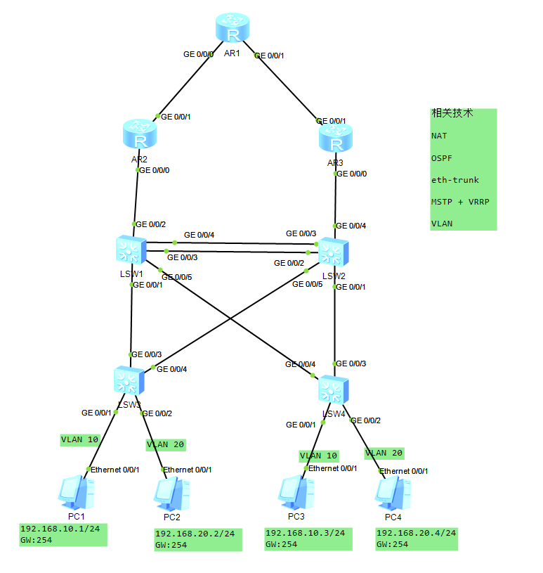

```
title: MSTP+VRRP+VLAN+OSPF+NAT 综合实验
date: 2025-04-23
tags:
  - Networking
  - Huawei
categories:
  - tech
```


## 拓扑




## 配置

### VLAN  配置

 以 LSW3 为例，LSW4同理

```sh
interface GigabitEthernet0/0/1
 port link-type access
 port default vlan 10
#
interface GigabitEthernet0/0/2
 port link-type access
 port default vlan 10
```


### 交换机捡链路打 Trunk

以 LSW1 为例，其他同理

```sh
#
interface GigabitEthernet0/0/1
 port link-type trunk
 port trunk allow-pass vlan 2 to 4094
#
interface GigabitEthernet0/0/2		# 和 AR 连接的接口，暂时不需要配置
#
interface GigabitEthernet0/0/3		# 要做 Eth-Trnk 的接口，暂时不配置
#
interface GigabitEthernet0/0/4		# 要做 Eth-Trnk 的接口，暂时不配置
#
interface GigabitEthernet0/0/5
 port link-type trunk
 port trunk allow-pass vlan 2 to 4094
```


### 配置 Eth-Trunk

以 LSW1 为例，其他同理

```sh
#
interface Eth-Trunk1
 port link-type trunk
 port trunk allow-pass vlan 2 to 4094	# port trunk allow-pass vlan all
 mode lacp-static						# 也可用在这里用 trunkport g0/0/0 将接口加入聚合组，但要保证接口下没有配置
#
interface GigabitEthernet0/0/3
 eth-trunk 1
#
interface GigabitEthernet0/0/4
 eth-trunk 1
#
```

### 配置 MSTP

以 LSW1为例，其他同理

```sh
#
stp region-configuration			# 华为设备中，STP 默认就是 MSTP
 region-name test
 instance 1 vlan 10
 instance 2 vlan 20
 active region-configuration		# 配置完之后一定要激活
#
```

查看 stp 信息

```sh
[LSW3]dis stp brief 
 MSTID  Port                        Role  STP State     Protection
   0    GigabitEthernet0/0/1        DESI  LEARNING        NONE
   0    GigabitEthernet0/0/2        DESI  LEARNING        NONE
   0    GigabitEthernet0/0/3        ROOT  FORWARDING      NONE
   0    GigabitEthernet0/0/4        ALTE  DISCARDING      NONE
   1    GigabitEthernet0/0/1        DESI  LEARNING        NONE
   1    GigabitEthernet0/0/3        ROOT  FORWARDING      NONE
   1    GigabitEthernet0/0/4        ALTE  DISCARDING      NONE
   2    GigabitEthernet0/0/2        DESI  LEARNING        NONE
   2    GigabitEthernet0/0/3        ROOT  FORWARDING      NONE
   2    GigabitEthernet0/0/4        ALTE  DISCARDING      NONE
[LSW3]dis stp instance 1 brief
 MSTID  Port                        Role  STP State     Protection
   1    GigabitEthernet0/0/1        DESI  FORWARDING      NONE
   1    GigabitEthernet0/0/3        ROOT  FORWARDING      NONE
   1    GigabitEthernet0/0/4        ALTE  DISCARDING      NONE
[LSW3]dis stp instance 2 brief
 MSTID  Port                        Role  STP State     Protection
   2    GigabitEthernet0/0/2        DESI  FORWARDING      NONE
   2    GigabitEthernet0/0/3        ROOT  FORWARDING      NONE
   2    GigabitEthernet0/0/4        ALTE  DISCARDING      NONE
```

MSTP 信息里，instance 1 以 LSW3 g0/0/3 为根端口合适，但 instance 2 以 LSW3 g0/0/3 为根端口不合适。

统一配置，确保永久性

```sh
[LSW1]stp instance 1 root primary 		# LSW1 成为 instance 1 的主根桥
[LSW1]stp instance 2 root secondary 	# LSW1 成为 instance 2 的备根桥
```

```sh
[LSW2]stp instance 1 root secondary 	# LSW2 成为 instance 1 的备根桥
[LSW2]stp instance 2 root primary 		# # LSW2 成为 instance 2 的主根桥
```

配置后到 LSW3 查看 stp 信息

```sh
<LSW3>dis stp instance 1 brief 
 MSTID  Port                        Role  STP State     Protection
   1    GigabitEthernet0/0/1        DESI  FORWARDING      NONE
   1    GigabitEthernet0/0/3        ROOT  FORWARDING      NONE
   1    GigabitEthernet0/0/4        ALTE  DISCARDING      NONE
   
<LSW3>dis stp instance 2 brief 
 MSTID  Port                        Role  STP State     Protection
   2    GigabitEthernet0/0/2        DESI  FORWARDING      NONE		# 指定端口
   2    GigabitEthernet0/0/3        ALTE  DISCARDING      NONE		# 阻塞端口
   2    GigabitEthernet0/0/4        ROOT  FORWARDING      NONE		# 根端口
```

| 端口角色      | 说明                                                         |
| ------------- | ------------------------------------------------------------ |
| 根端口        | 在非根桥上，离根桥最近的端口是本交换设备的根端口。根交换设备没有根端口。根端口负责向树根方向转发数据。如[图3](https://support.huawei.com/hedex/api/pages/EDOC1100333028/AZM1017P/06/resources/dc/dc_fd_stp_0012.html#ZH-CN_CONCEPT_0177103207__fig_dc_fd_stp_001205)所示，S1为根桥，CP1为S3的根端口，BP1为S2的根端口。 |
| 指定端口      | 对一台交换设备而言，它的指定端口是向下游交换设备转发BPDU报文的端口。如[图3](https://support.huawei.com/hedex/api/pages/EDOC1100333028/AZM1017P/06/resources/dc/dc_fd_stp_0012.html#ZH-CN_CONCEPT_0177103207__fig_dc_fd_stp_001205)所示，AP2和AP3为S1的指定端口，CP2为S3的指定端口。 |
| Alternate端口 | 从配置BPDU报文发送角度来看，Alternate端口就是由于学习到其它网桥发送的配置BPDU报文而阻塞的端口。从用户流量角度来看，Alternate端口提供了从指定桥到根的另一条可切换路径，作为根端口的备份端口。如[图3](https://support.huawei.com/hedex/api/pages/EDOC1100333028/AZM1017P/06/resources/dc/dc_fd_stp_0012.html#ZH-CN_CONCEPT_0177103207__fig_dc_fd_stp_001205)所示，BP2为Alternate端口。 |
| Backup端口    | 从配置BPDU报文发送角度来看，Backup端口就是由于学习到自己发送的配置BPDU报文而阻塞的端口。从用户流量角度来看，Backup端口作为指定端口的备份，提供了另外一条从根节点到叶节点的备份通路。如[图3](https://support.huawei.com/hedex/api/pages/EDOC1100333028/AZM1017P/06/resources/dc/dc_fd_stp_0012.html#ZH-CN_CONCEPT_0177103207__fig_dc_fd_stp_001205)所示，CP3为Backup端口。 |
| Master端口    | Master端口是MST域和总根相连的所有路径中最短路径上的端口，它是交换设备上连接MST域到总根的端口。Master端口是域中的报文去往总根的必经之路。Master端口是特殊域边缘端口，Master端口在CIST上的角色是Root Port，在其它各实例上的角色都是Master端口。如[图4](https://support.huawei.com/hedex/api/pages/EDOC1100333028/AZM1017P/06/resources/dc/dc_fd_stp_0012.html#ZH-CN_CONCEPT_0177103207__fig_dc_fd_stp_001206)所示，交换设备S1、S2、S3、S4和它们之间的链路构成一个MST域，S1交换设备的端口AP1在域内的所有端口中到总根的路径开销最小，所以AP1为Master端口。 |
| 域边缘端口    | 域边缘端口是指位于MST域的边缘并连接其它MST域或SST的端口。如[图4](https://support.huawei.com/hedex/api/pages/EDOC1100333028/AZM1017P/06/resources/dc/dc_fd_stp_0012.html#ZH-CN_CONCEPT_0177103207__fig_dc_fd_stp_001206)所示，MST域内的AP1、DP1和DP2都和其它域直接相连，它们都是本MST域的域边缘端口。 |
| 边缘端口      | 如果指定端口位于整个域的边缘，不再与任何交换设备连接，这种端口叫做边缘端口。边缘端口一般与用户终端设备直接连接。端口使能MSTP功能后，会默认启用边缘端口自动探测功能，当端口在（2 × Hello Timer + 1）秒的时间内收不到BPDU报文，自动将端口设置为边缘端口，否则设置为非边缘端口。 |