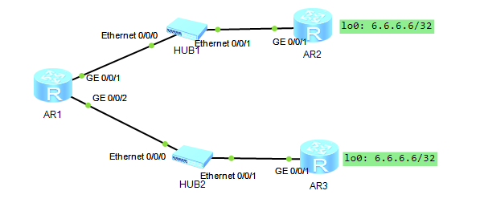

---
title: 华为 BFD 验证实验
date: 2025-06-22
tags:
  - Networking
  - Huawei
categories:
  - tech
---


## 拓扑



> 此处所有 AR 均为 AR2200


## 配置

### IP 规划 & 配置

AR1 ~ AR2 = 12.0.0.0/24

AR3 ~ AR3 = 13.0.0.0/24

> 省略配置过程


### 配置路由

```sh
[AR1]ip route-static 6.6.6.6 255.255.255.255 12.0.0.2
[AR1]ip route-static 6.6.6.6 255.255.255.255 12.0.0.3 preference 100
```

这时候把 AR2 G0/0/1 DOWN 掉，preference 100 的路由不会生效，

因为 AR 1 G0/0/1 还是 Up 状态，这时候无法与 6.6.6.6 连通。

这种情况下 需要利用 bfd 或 nqa 探测，确保浮动路由正常工作


### 配置 BFD

```sh
[AR1]bfd		# 启用 bfd
[AR1-bfd]quit

[AR1]bfd test bind peer-ip 12.0.0.2 interface GigabitEthernet 0/0/1 one-arm-echo	# 创建会话 test，从G 0/0/1 单向检测 12.0.0.2
[AR1-bfd-session-test]discriminator local 1		# 本地标识符，单向检测中无意义
[AR1-bfd-session-test]min-echo-rx-interval 100	# 每 100ms 检测一次
[AR1-bfd-session-test]commit	# 提交会话配置

[AR1]dis bfd session all 
--------------------------------------------------------------------------------
Local Remote     PeerIpAddr      State     Type        InterfaceName            
--------------------------------------------------------------------------------

1     -          12.0.0.2        Up        S_IP_IF     GigabitEthernet0/0/1     
--------------------------------------------------------------------------------
     Total UP/DOWN Session Number : 1/0
     
[AR1]ip route-static 6.6.6.6 32 12.0.0.2 track bfd-session test
```

这时候再把  AR2 G0/0/1 DOWN 掉，preference 100 的路由自动生效

```sh
[AR1]dis bfd session all 
--------------------------------------------------------------------------------
Local Remote     PeerIpAddr      State     Type        InterfaceName            
--------------------------------------------------------------------------------

1     -          12.0.0.2        Down      S_IP_IF     GigabitEthernet0/0/1     
--------------------------------------------------------------------------------
     Total UP/DOWN Session Number : 0/1

[AR1]dis ip routing-table 6.6.6.6
Route Flags: R - relay, D - download to fib
------------------------------------------------------------------------------
Routing Table : Public
Summary Count : 1
Destination/Mask    Proto   Pre  Cost      Flags NextHop         Interface

        6.6.6.6/32  Static  100  0          RD   12.0.0.3        GigabitEthernet0/0/1
```


## 配置汇总

### AR1

```
<AR1>dis current-configuration 
[V200R003C00]
#
 sysname AR1
#
 snmp-agent local-engineid 800007DB03000000000000
 snmp-agent 
#
 clock timezone China-Standard-Time minus 08:00:00
#
portal local-server load portalpage.zip
#
 drop illegal-mac alarm
#
 set cpu-usage threshold 80 restore 75
#
bfd
#
aaa 
 authentication-scheme default
 authorization-scheme default
 accounting-scheme default
 domain default 
 domain default_admin 
 local-user admin password cipher %$%$K8m.Nt84DZ}e#<0`8bmE3Uw}%$%$
 local-user admin service-type http
#
firewall zone Local
 priority 15
#
interface GigabitEthernet0/0/0
#
interface GigabitEthernet0/0/1
 ip address 12.0.0.1 255.255.255.0 
#
interface GigabitEthernet0/0/2
 ip address 13.0.0.1 255.255.255.0 
#
interface NULL0
#
bfd test bind peer-ip 12.0.0.2 interface GigabitEthernet0/0/1 one-arm-echo
 discriminator local 1
 min-echo-rx-interval 100
 commit
#
ip route-static 6.6.6.6 255.255.255.255 12.0.0.2 track bfd-session test
ip route-static 6.6.6.6 255.255.255.255 12.0.0.3 preference 100
#
user-interface con 0
 authentication-mode password
user-interface vty 0 4
user-interface vty 16 20
#
wlan ac
#
return
```

### AR2

```
<AR2>dis cur
[V200R003C00]
#
 sysname AR2
#
 snmp-agent local-engineid 800007DB03000000000000
 snmp-agent 
#
 clock timezone China-Standard-Time minus 08:00:00
#
portal local-server load portalpage.zip
#
 drop illegal-mac alarm
#
 set cpu-usage threshold 80 restore 75
#
aaa 
 authentication-scheme default
 authorization-scheme default
 accounting-scheme default
 domain default 
 domain default_admin 
 local-user admin password cipher %$%$K8m.Nt84DZ}e#<0`8bmE3Uw}%$%$
 local-user admin service-type http
#
firewall zone Local
 priority 15
#
interface GigabitEthernet0/0/0
#
interface GigabitEthernet0/0/1
 shutdown
 ip address 12.0.0.2 255.255.255.0 
#
interface GigabitEthernet0/0/2
#
interface NULL0
#
interface LoopBack0
 ip address 6.6.6.6 255.255.255.255 
#
user-interface con 0
 authentication-mode password
user-interface vty 0 4
user-interface vty 16 20
#
wlan ac
#
return
```

### AR3

```
<AR3>dis cur
[V200R003C00]
#
 sysname AR3
#
 snmp-agent local-engineid 800007DB03000000000000
 snmp-agent 
#
 clock timezone China-Standard-Time minus 08:00:00
#
portal local-server load portalpage.zip
#
 drop illegal-mac alarm
#
 set cpu-usage threshold 80 restore 75
#
aaa 
 authentication-scheme default
 authorization-scheme default
 accounting-scheme default
 domain default 
 domain default_admin 
 local-user admin password cipher %$%$K8m.Nt84DZ}e#<0`8bmE3Uw}%$%$
 local-user admin service-type http
#
firewall zone Local
 priority 15
#
interface GigabitEthernet0/0/0
#
interface GigabitEthernet0/0/1
 ip address 13.0.0.3 255.255.255.0 
#
interface GigabitEthernet0/0/2
#
interface NULL0
#
interface LoopBack0
 ip address 6.6.6.6 255.255.255.255 
#
user-interface con 0
 authentication-mode password
user-interface vty 0 4
user-interface vty 16 20
#
wlan ac
#
return
```


## 附录

### BFD vs NQA

| **特性**     | **BFD**                                                      | **NQA**                                                  |
| ------------ | ------------------------------------------------------------ | -------------------------------------------------------- |
| **核心目标** | 快速检测链路 / 邻居故障                                      | 全面分析网络性能与质量                                   |
| **检测周期** | 10ms-1s（可配置）                                            | 秒级或自定义（如 500ms）                                 |
| **支持协议** | 独立协议，与路由协议松耦合                                   | 支持 ICMP、TCP、UDP、DNS、HTTP 等多种协议                |
| **多跳支持** | 有限（需设备支持）                                           | 原生支持                                                 |
| **资源消耗** | 低（仅发送小尺寸 Hello 报文）                                | 中高（需生成测试流量，占用带宽和 CPU）                   |
| **典型配置** | `interface Ethernet0/0` `bfd interval 50 min_rx 50 multiplier 3` | `ip sla 1` `icmp-echo 1.1.1.1` `schedule start-time now` |
| **联动对象** | OSPF、BGP、VRRP 等协议                                       | ACL、QoS、SNMP、SD-WAN 等                                |

此案例情况下，通常使用 bfd 更适合


