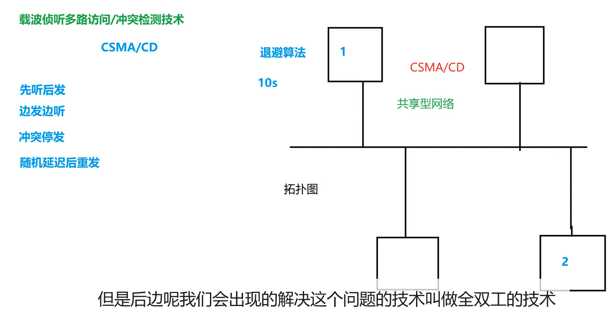
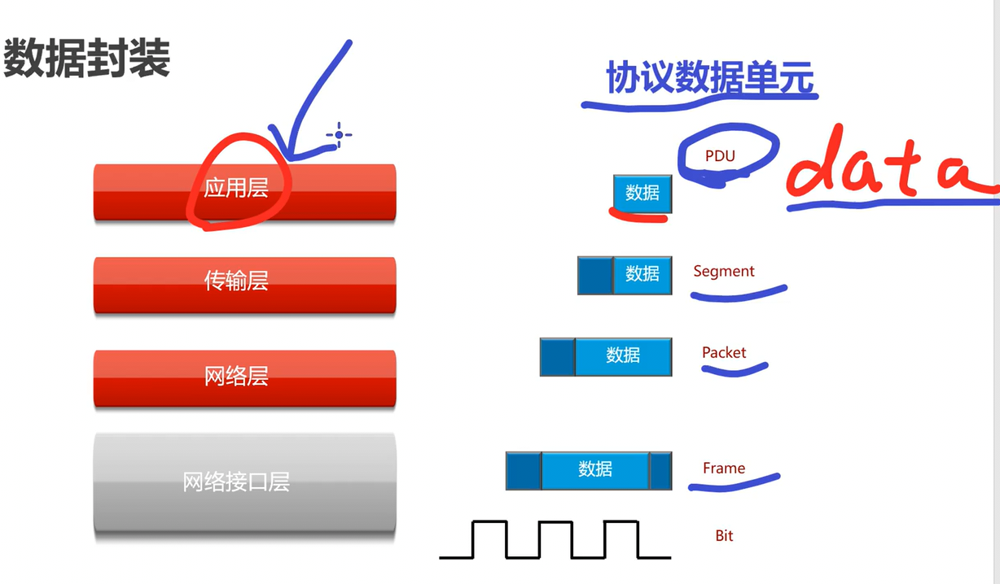
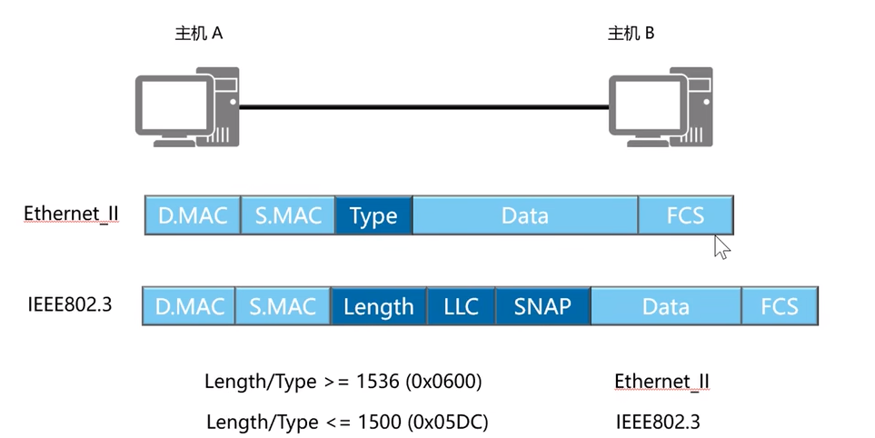
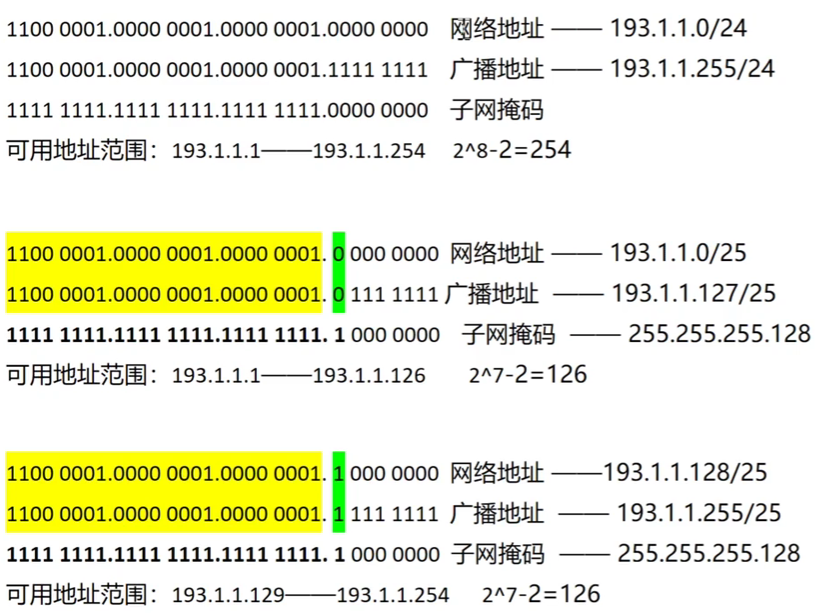
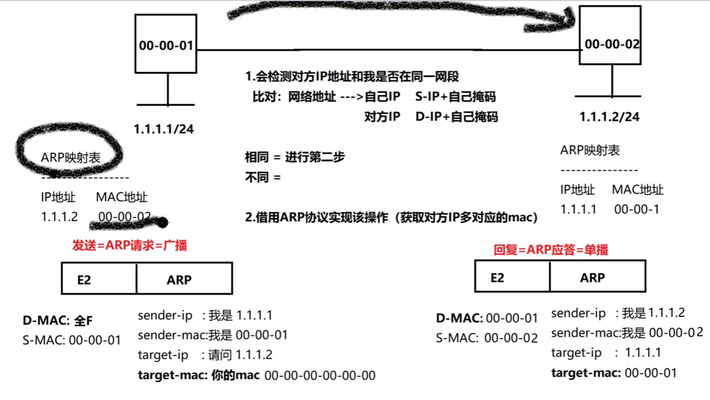
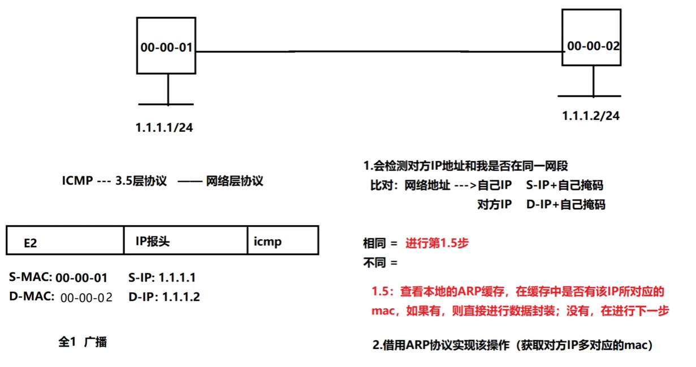
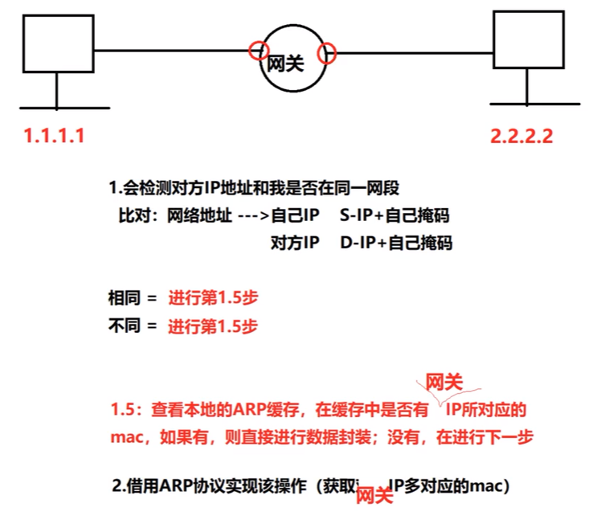
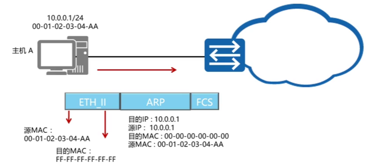
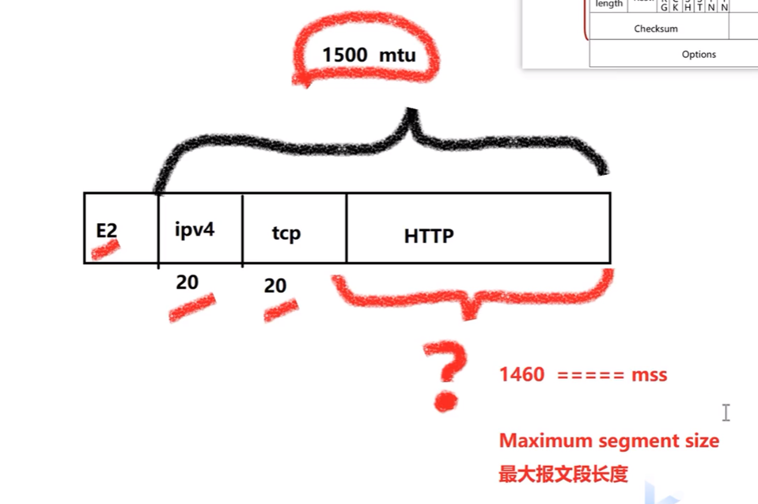

# 网络基础

## 一、两个参考模型

### OSI 模型

- 应用层
  - 作用：满足下面模型无法解决的问题、产生不同的数据、验证手段-加密手段

- 表示层
  - 作用：负责数据的解码、编译

- 会话层
  - 作用：实现应用级别不同服务的区分（Session）

- 传输层 (TCP-可以纠错 UDP-无法纠错)
  - 作用：实现一个设备上不同应用的区分、按不同的协议实现纠错
  - 无法实现：无法实现应用级别不同服务的区分、有可能无法实现纠错

- 网络层
  - 作用：从全局定位某一台设备(IP地址)、路由
  - 无法实现：纠错、无法实现一个设备不同应用的区分

- 数据链路层
  - 作用：差错检测 、提供链路上的地址信息 (mac地址)
  - 无法实现：纠错、无法从全局的角度分析地址信息

- 物理层
  - 作用：规范传输介质的标准-网线光纤(-设备的连接-数据的传输)
  - 无法实现：差错检测

### TCP/IP 模型

TCP/IP 模型与对应协议参考：[Info-Finder（在线工具） 报文格式](https://info.support.huawei.com/info-finder/tool/zh/enterprise/packetformat)

- 应用层：应用层 + 表示层 + 会话层
- 传输层：TCP / UDP
- 网络层：IP
- 网络接口层：数据链路层 + 物理层

## 二 & 三、数据封装 & 数据链路层

### 交换方式

 - 电路交换（电话）
 - 报文交换（在数据之外，加上能标识双方的信息）
 - 分组交换（互联网，依然进行报文交换，但规定每个数据的大小）

### 不太重要的 CSMA/CD

> 只在同轴电缆时使用，现在已经不用了

### 数据链路层 - 以太网帧结构

网络通信协议

数据封装

帧格式

> Type 字段的常见值：
>
> ARP - 0x0806
>
> IPv4 - 0x0800
>
> Ipv6 - 0x86dd

MTU：最大传输单元（指网络层及以上的封装）：存在于每条链路上的概念。如果报文的MTU过大，而链路所能承载的MTU值过小，则可能导致数据分片或者数据丢弃。

E2 封装完成后数据帧：最小为 64 最大为 1518 B

 

## 四、Mac地址 & 网络层

 mac 地址

1. 单播：通信形式上，点对点，单对单的通信，类似于私聊数据封装时，源mac和目的mac都是单播mac,则为单播通信。
   - 单播mac地址：从高位向低位（从左往右）第8位为0，且一定为0，其他任意。

2. 组播：通信形式上，点对多点，单对多的通信，类似于群聊
   - 组播mac地址：从高位向低位（从左往右）第8位为1，且一定为1，其他任意。
   - 数据封装时，因为组播代表的是一组的集合，面向一组的通信，此时组播mac不能成为数据的源地址，仅能充当目的地址。

3. 广播：通信形式上，点对所有，单对所有的通信。广而播之/强制的接受处理。
   - 数据封装时，因为广播代表的是所有人集合，面向所有人的通信，此时广播mac不能成为数据的源地址，仅能充当目的地址。
   - 广播mac地址：从高位向低位 48 位全部为1，且一定为1。

- 发送者的动作：
  - 有发送者填充源目mac信息，以及type字段标识上层协议，以及CRC检验，数值填充至FCS,信息都填充完毕之后，此时借助物理层，转变为二进制比特流，从链路中传递。

a场景：

- 数据抵达接收端接口以后，接收者的动作：

  - 首先看目的MAC,是否是自己的mac,如果不是丢弃，如果是，则进行下一步；（组播看是否加组，广播直接下一步）
  - 将数据也进行CRC检验，比对FCS字段，如果不同则丢弃，如果相同，则进行下一步；

  - 查看type字段，交由type字段标识的上层协议处理。数据链路层工作，结束。

##  五、IP 地址

以下是A类到E类IP地址以及几个特殊地址的列表：

### IP地址分类

| 类别        | 范围                                               | 二进制开头 | 网络位长度 | 主机位长度 | 默认子网掩码  | 主要用途                     |
| ----------- | -------------------------------------------------- | ---------- | ---------- | ---------- | ------------- | ---------------------------- |
| **A类地址** | (0.0.0.0~127.255.255.255)  1.0.0.0 到 126.0.0.0 | 0xxxxxxx   | 8位        | 24位       | 255.0.0.0     | 大型网络（约1600万台主机）   |
| **B类地址** | 128.0.0.0 到 191.255.0.0                           | 10xxxxxx   | 16位       | 16位       | 255.255.0.0   | 中型网络（约6.5万台主机）    |
| **C类地址** | 192.0.0.0 到 223.255.255.0                         | 110xxxxx   | 24位       | 8位        | 255.255.255.0 | 小型网络（约254台主机）      |
| **D类地址** | 224.0.0.0 到 239.255.255.255                       | 1110xxxx   | -          | -          | -             | 多播（Multicasting）         |
| **E类地址** | 240.0.0.0 到 255.255.255.255                       | 1111xxxx   | -          | -          | -             | 保留地址，预留未来或实验用途 |

### 特殊地址

| 地址类型       | 范围                                                         | 主要用途                                     |
| -------------- | ------------------------------------------------------------ | -------------------------------------------- |
| 未指定的地址   | 0.0.0.0~0.255.255.255                                        | 未指定的地址，或在路由层面表示全网的所有地址 |
| 环回地址       | 127.0.0.1 到 127.255.255.255                                 | 主机内部通信测试（通常使用127.0.0.1）        |
| 广播地址       | 每个子网有自己的广播地址                                     | 发送到子网内所有主机的消息                   |
| 私有地址       | A类: 10.0.0.0 到 10.255.255.255 B类: 172.16.0.0 到 172.31.255.255 C类: 192.168.0.0 到 192.168.255.255 | 用于局域网内部，不在公共互联网中路由         |
| 自动私有IP地址 | 169.254.0.0 到 169.254.255.255                               | 当主机无法从DHCP服务器获取IP地址时，自动分配 |

### 计算子网数量与主机数量

子网数量 =  2 ^ (可变网络位数)

主机数量 =  2 ^ (可变主机位数) - 2 

> 1100 0000 . 1010 1000 . 0000 0001 . 0110 1111 地址
> 1111 1111 . 1111 1111 . 1111 1111 . 0000 0000 掩码
> 1100 0000 . 1010 1000 . 0000 0001 . 0000 0000 网络地址（出现在路由表）192.168.1.0
> 1100 0000 . 1010 1000 . 0000 0001 . 1111 1111 广播地址（用于本网段所有主机通信）192.168.1.255

### VLSM 内部使用

### CIDR 向外通告

### ICMP ping 测试

1. 通信时，发送端的主机会使用对方的P地址+自己的掩码进行计算，算出对方的网络地址
2. 计算之后，将对方的网络地址和自己的网络地址进行对比，相同，则认为在同一网段；不同，则认为不在一个网段。

以下是ICMP（Internet Control Message Protocol）的消息类型及其编码类型的详细列表：

> ICMP 算 3.5 层协议

| 消息类型编号 | 消息类型                              | 编码类型                                                     | 描述                                                 |
| ------------ | ------------------------------------- | ------------------------------------------------------------ | ---------------------------------------------------- |
| 0            | 回送应答（Echo Reply）                | 0                                                            | 主机接收到回送请求时的响应消息，用于Ping命令的应答。 |
| 3            | 目标不可达（Destination Unreachable） | 0 - 网络不可达 1 - 主机不可达 2 - 协议不可达 3 - 端口不可达 4 - 需要分段但设置了DF标志 5 - 源路由失败 6 - 目的网络未知 7 - 目的主机未知 8 - 源主机被隔离 9 - 通信网络被禁止 10 - 通信主机被禁止 11 - 对网络的优先级控制范围外 12 - 对主机的优先级控制范围外 13 - 通信管理被禁止 14 - 主机超出允许访问限制 15 - 失踪的校验和错误 | 指示目标网络或主机不可达的错误消息。                 |
| 4            | 源抑制（Source Quench）               | 0                                                            | 通知发送方减少发送速率，已被弃用。                   |
| 5            | 重定向消息（Redirect Message）        | 0 - 网络重定向 1 - 主机重定向 2 - TOS和网络重定向 3 - TOS和主机重定向 | 指示主机重定向数据包的更好路径。                     |
| 8            | 回送请求（Echo Request）              | 0                                                            | 请求目标主机发送回送应答消息，用于Ping命令。         |
| 9            | 路由器通告（Router Advertisement）    | 0                                                            | 路由器定期通告其存在，便于主机发现路由器。           |
| 10           | 路由器请求（Router Solicitation）     | 0                                                            | 主机请求路由器发送路由器通告消息。                   |
| 11           | 超时（Time Exceeded）                 | 0 - 传输期间TTL超时 1 - 组装期间分段超时                  | 数据包在传输或组装过程中超时。                       |
| 12           | 参数问题（Parameter Problem）         | 0 - 错误指针 1 - 缺少必需选项 2 - 错误长度             | 数据包头部参数错误。                                 |
| 13           | 时间戳请求（Timestamp Request）       | 0                                                            | 请求时间戳信息。                                     |
| 14           | 时间戳应答（Timestamp Reply）         | 0                                                            | 时间戳请求的响应消息。                               |
| 15           | 信息请求（Information Request）       | 0                                                            | 主机请求网络地址，已被弃用。                         |
| 16           | 信息应答（Information Reply）         | 0                                                            | 信息请求的响应消息，已被弃用。                       |
| 17           | 地址掩码请求（Address Mask Request）  | 0                                                            | 请求子网掩码信息。                                   |
| 18           | 地址掩码应答（Address Mask Reply）    | 0                                                            | 地址掩码请求的响应消息。                             |

### ICMP 重定向

主机 A 想要跨网段通信访问 20.0.0.1/24 

RTB 会发送 ICMP 重定向报文给 主机 A，让他修改路由表，

下次要到 20.0.0.1/24 的时候，直接去找 10.0.0.200/24 会更快，不用来找网关。

### ARP

> ARP 算 2.5 层协议

> ENSP 中 target-mac 会显示 FFFF-FFFF-FFFF 这是错误的，用 EVE 或其他平台的就会有正确的 0000-0000-0000

#### 免费 ARP

> 接口获得 IP 后，自动向外发送 ARP 报文，自己发给自己
>
> 如果没有外界回应，代表 IP 可用，如果有外界回应，说明存在 IP 地址冲突。

### 传输层协议

端口 = port【逻辑端口】

基于应用级别的互访，就是端口到端口的互访。

传输层 = 0 ~ 65535【端口范围】===TCP/UDP

0~1023端口：知名端口提前保留出来的端口

TCP协议：FTP服务[20/21] SSH[22] Telnet服务[23] HTTP服务[80] HTTPS[443]

UDP协议：DNS服务[53] DHCP协议[67/68]

TCP协议：传输控制协议——面向连接的协议

- 只能适应于单播通信
- 可以给予建立好的连接灵活的对接下来的数据传递进行控制
- 无法很好地满足即时性的业务要求，传递一些文件稳定性支持性很好
- 自带分片功能（<u>一般会在这里就分片好，然后在网络层直接传输，无需在网络层分片</u>）

UDP协议：用户数据包协议——面向无连接的协议

- 保证数据进行传输但是UDP无法对于传递的数据进行控制，如果想对数据做控制，此时借用应用层实现。
- 可以很好地满足即时性的要求，对时间要求比较高
- 对于上层传递的数据，“全盘接收”【没有分片机制】用于相对比较小的流量

#### TCP 三次握手

大 SYN 在握手前两次置为 1，后面置为 0 

#### MTU

#### TCP 流量控制

