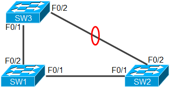

---
title: STP
date: 2022-03-02
tags:
  - Networking
categories:
  - tech
---

## 一、为什么需要STP

- 冗余拓扑：为了保证网络的可靠，网络中需要设置冗余链路。
- 冗余链路导致网络中存在环路。
- 环路会导致：
  - 广播风暴的形成
    - 广播风暴：三个交换机两两相连，互相广播，无限转发，产生广播风暴。
  - 多帧复制
    - PC1 发送的帧可以从SW1 经过 SW3 再到 SW2 传达给PC2，也可以从 SW1 到 SW2 再到PC2，导致 PC2 收到两次同一帧。
  - MAC 地址紊乱
    - 产生环路后，PC1 发送数据，SW1 向 SW3 进行广播使得 SW3 的 F0/1 记录下 PC1 的 MAC 地址，SW1 传到 SW2，SW2 再向 SW3 进行广播，导致 SW3 的 F0/2 又记录了 PC1 的MAC 地址，来回重复绑定 MAC 地址。

- STP - Spanning Tree Protocol（生成树协议）
- 逻辑上断开环路，防止广播风暴的产生
- 当线路故障时，阻塞接口被激活，恢复通信，起到备份作用。
- 如图，将 SW1 当成树根，数据从 SW1 向上传输，在 SW2 与 SW3 之间进行逻辑阻塞，SW3 不会广播 SW2 再广播到 SW1，SW1 不会广播到 SW2 再广播 SW3，防止了广播风暴的产生。
- 如果 SW1 与 SW2 之间的线路出现故障，会激活 SW2 与 SW3 之间的逻辑阻塞，使得 SW1 的数据可以经过 SW3 再传输至 SW2，恢复通信，起到备份作用。
- 如果是物理上进行阻塞，将线路断开或端口阻塞，当其他线路出现故障时就无法通信了

