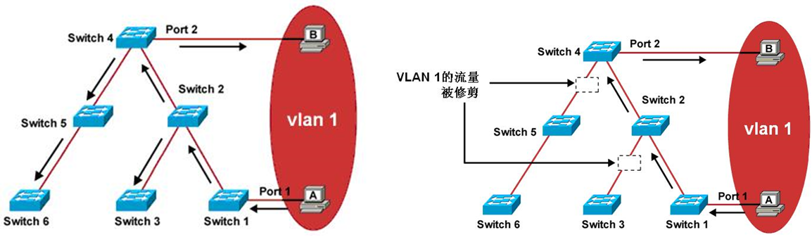

---
title: VIP
date: 2022-03-03
tags:
  - Networking
categories:
  - tech
---
VTP

全称：VLAN Trunking Protocol （VLAN Trunk 协议）

VTP(VLAN 中继协议)利用第 2 层中继帧，在一组交换机之间进行 VLAN 通信．VTP 从一个中心控制点开始，维护整个交换网上 VLAN 的添加和重命名工作，确保配置的一致性。

作用：

1. VTP 维护整个管理域 VLAN 信息的一致性
2. VTP 仅在 Trunk 端口上发送通告
3. 同步最新的 VLAN 信息


VTP三种模式

1. 服务器模式 (Server 缺省)：VTP 服务器控制着它们所在域中 VALN 的生成和修改．所有的 VTP 信息都被通告在本域中的其他交换机，而且，所有这些 VTP 信息都是被其他交换机同步接收的．
2. 客户机模式 (Client)：VTP 客户机不允许管理员创建、修改或删除 VLAN。它们监听本域中其他交换机的VTP 通告，并相应修改它们的 VTP 配置情况．
3. 透明模式 (Transparent)：VTP 透明模式中的交换机不参与 VTP．当交换机处于透明模式时，它不通告其VLAN 配置信息．而且，它的 VLAN 数据库更新与收到的通告也不保持同步．但它可以创建和删除本地的VLAN，不过，这些 VLAN 的变更不会传播到其他任何交换机上。


工作过程

- VTP 通告以组播帧发送
- VTP Server 和 Client 同步到最新的配置版本号
- VTP 通告在变化时，或者每 5 分钟发送


配置VTP

- 配置 Trunk 接口
- 配置 VTP 域名
- 指定 VTP 模式，默认是 Server 模式
- 配置 VTP 密码

```
Switch(config)#vtp domain TEST		// 配置域名
Changing VTP domain name from NULL to TEST
Switch(config)#vtp mode server		// 配置运行模式
Device mode already VTP SERVER.
Switch(config)#vtp password cisco	// 配置密码
Setting device VLAN database password to cisco
```

验证VTP配置

```
Switch#show vtp status 
VTP Version                     : 2
Configuration Revision          : 0
Maximum VLANs supported locally : 1005
Number of existing VLANs        : 7
VTP Operating Mode              : Server
VTP Domain Name                 : TEST
VTP Pruning Mode                : Disabled
VTP V2 Mode                     : Disabled
VTP Traps Generation            : Disabled
MD5 digest                      : 0x73 0x72 0xD0 0x06 0xA2 0x90 0x1D 0xFA 
Configuration last modified by 0.0.0.0 at 3-1-93 00:05:08
Local updater ID is 0.0.0.0 (no valid interface found)
```


VTP Pruning

- 引入 VTP 修剪功能的出发点是为了限制对于邻居交换机来说没有意义的广播、组播和未知单播流量在中继链路上传输，以节省中继链路的带宽，因为交换机上根本没有在这些 VLAN 中的设备，所以最终这些没有意义的泛洪流量也会在邻居交换机上被丢弃。
- VTP 修剪功能会自动计算哪些链路应该修剪哪些 VLAN 的包，管理员只需要启用该功能即可。




VLAN、TRUNK、EtherChannel和VTP 配置命令

- 创建 VLAN：

```
Switch(config)#vlan vlan-id
```

- 删除 VLAN：

```
Switch(config)#no vlan vlan-id
```

- 配置 VLAN状态：  active 表示活跃状态，这是创建 VLAN 后的默认状态；suspend 表示挂起状态。

```
Switch(config-vlan)#state [ active | suspend]
```

-  配置 VLAN 的 MTU：

```
Switch(config-vlan)#mtu size
```

- 关闭 VLAN：

```
Switch(config-vlan)#shutdown
```

- 配置 VLAN 名字：注意：VLAN 1的名字不能更改。

```
Switch(config-vlan)#name name
```

-  配置交换机端口为访问(access)模式：

```
Switch(config-if)#switchport mode access
```

- 将端口划分到指定VLAN：

```
Switch(config-if)#switchport access vlan vlan-id
```

- 默认情况下，交换机所有端口都被划分到VLAN 1，VLAN 1是不能删除的。


查看VLAN信息

- 查看VLAN的信息：

```
Switch#show vlan
```

- 查看VLAN的信息摘要：

```
Switch#show vlan brief
```

- 查看VLAN的汇总信息：

```
Switch#show vlan summary
```

- 查看接口做为交换端口的有关信息：

```
Switch#show interfaces interfaces switchport
```


Trunk 配置命令

(1) 配置Trunk链路的封装类型 

```
Switch(config-if)#switchport trunk encanpsulation   { negotiate | dot1q  |  isl }	
```

(2)把接口模式配置为trunk

```
Switch(config-if)#switch mode trunk	
```

(3)配置接口的Trunk动态协商模式

```
Switch(config-if)#switch mode dynamic { desirable | auto }
```

(4)Trunk链路上关闭自动DTP协商

```
Switch(config-if)#switchport nonegotiate
```

(5)配置Trunk链路上可以通过的VLAN流量

```
Switch(config-if)#switchport trunk allowed vlan { add | except | all | remove } vlan-id_list
```

(6)指定Trunk链路上的本征VLAN

```
Switch(config-if)#switchport trunk native vlan vlan-id
```

(7)查看Trunk信息：

```
Switch#show interfaces trunk
```


EtherChannel 配置命令

(1) 创建以太通道

```
Switch(config)#interface port-channel number	
```

(2)把接口加入到以太网通道中，并指明以太通道模式

```
Switch(config-if)#channel-group number mode on
```

(3)配置EtherChannel的负载平衡方式	

​	负载平衡的方式有：dst-ip、dst-mac、src-dst-ip、src-dst-mac、src-ip、src-mac。

```
Switch(config)#port-channel load-balance type	
```


(4)配置协商EtherChannel的协议类型

```
Switch(config-if)#channel-protocol { pagp | lacp }	
```

(5)把接口加入到以太网通道中，并指明以太通道模式

```
Switch(config-if)#channel-group number mode ｛desirable | auto | active | passive｝
```


查看 EtherChannel 信息

① 查看 Etherchannel 的简要信息

```
Switch#show etherchannel summary		
```

② 查看指定的 EtherChannel 包含的接口

```
Switch#show etherchannel port-channel	
```

③ 查看协商 EtherChannel 的协议

```
Switch#show etherchannel protocol	
```

④查看 Etherchannel 的负载平衡方式

```
Switch#show etherchannel load-balance
```


VTP 配置命令

(1)配置 VTP 域名：

```
Switch(config)#vtp domain domain_name
```

(2)配置交换机为 VTP 模式：

```
Switch(config)#vtp mode { server | client | transparent }	
```

(3)配置 VTP 的密码：

```
Switch(config)#vtp password password_string 
```

(4)启用 VTP 修剪：

```
Switch(config)#vtp pruning
```

(5)启用 VTP 版本：

```
Switch(config)#vtp version { 1 | 2 }
```

(6)查看 VTP 运行情况

① 查看 VTP 的密码：

```
Switch#show vtp password	
```

② 查看 VTP 的状态：

```
Switch#show vtp status
```

③ 查看 VLAN 信息同步情况：

```
Switch#show vlan brief
```

