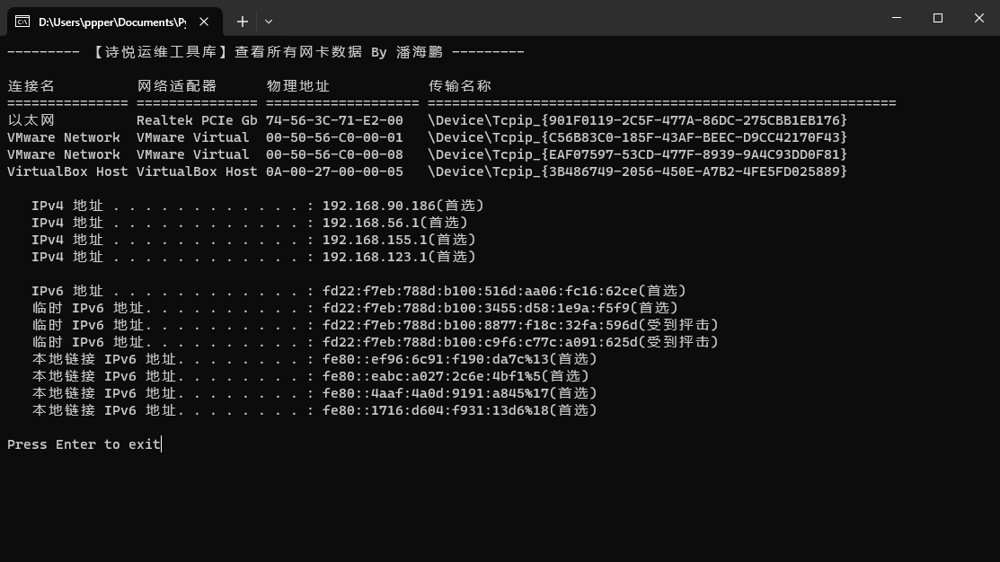
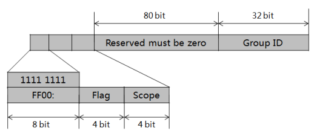
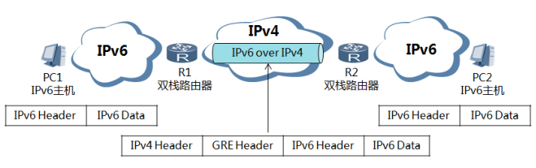
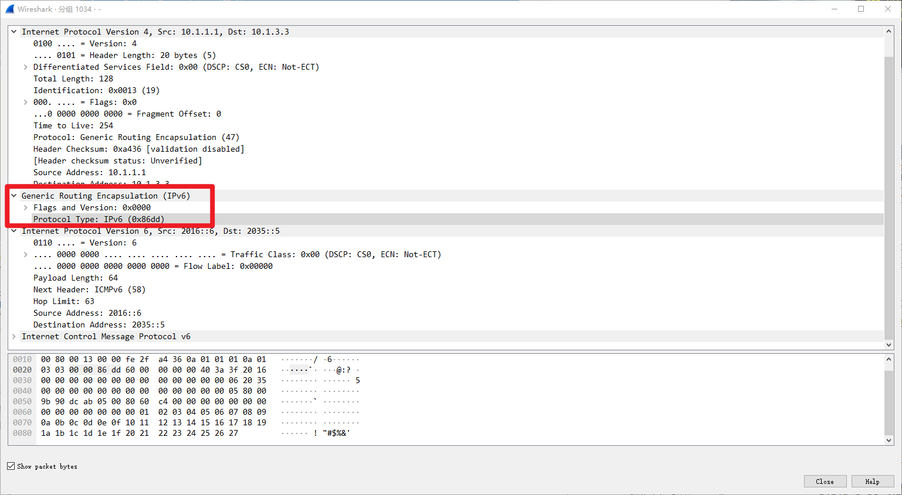
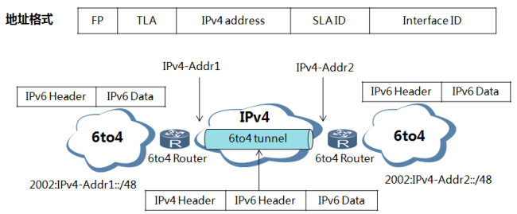
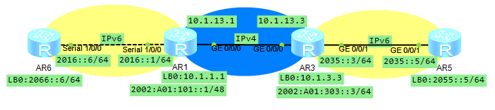
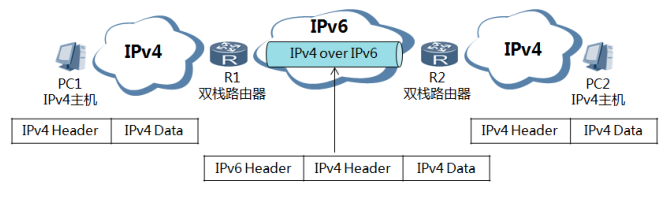

# 1. IPv6 基础

## 1.1 IPv6 特点

- 概要
  - 地址空间巨大
  - 精简报文结构
  - 实现自动配置和重新编址
  - 支持层次化网络结构
  - 支持端对端安全
  - 更好的支持 QoS
  - 支持移动特性

- 详细
  - 地址空间
    - 128 bits
    - 地址数量：43亿×43亿×43亿×43亿

  - 报文结构
  
    - 将 IPv4 报文头中的地址部分增加到 128 bits
  
      | 字段       | IPv4                | IPv6                |
      | ---------- | ------------------- | ------------------- |
      | 版本       | 4                   | 6                   |
      | 头部长度   | 20 字节             | 40 字节             |
      | 服务类型   | TOS                 | Traffic Class       |
      | 总长度     | 16 位               | Payload Length      |
      | 标识       | 16 位               | -                   |
      | 标志       | Flags               | Flow Label          |
      | 片段偏移   | Fragment Offset     | -                   |
      | 生存时间   | TTL                 | Hop Limit           |
      | 协议       | Protocol            | Next Header         |
      | 头部校验和 | Header Checksum     | -                   |
      | 源地址     | Source Address      | Source Address      |
      | 目标地址   | Destination Address | Destination Address |
      | 流标签     | -                   | Flow Label          |
  
    - 报文头包括固定头部、扩展头部，
      - 可选字段和非必要字段都放到了拓展协议头，拥有更高的效率
  
  - 实现自动配置、重新编址
  
    - 通过地址自动配置方式使主机自动发现网络并获取IPv6地址，大大提高了内部网络的可管理性。
  
  - 支持层次化网络结构
  
    - 巨大的地址空间使 IPv6 可以方便的进行层次化网络部署。
    - 层次化的网络结构可以方便的进行路由聚合，提高了路由转发效率。
  
  - 支持端对端安全：
  
    - IPv6 中，网络层支持IPSec的认证和加密，支持端到端的安全。
  
  - 更好的支持QoS
  
    - IPv6 在包头中新定义了一个叫做流标签的特殊字段
      - 流标签字段使得网络中的路由器可以对属于一个流的数据包进行识别并提供特殊处理。
      - 用这个标签，路由器可以不打开传送的内层数据包就可以识别流，这就使得即使数据包有效载荷已经进行了加密，仍然可以实现对 QoS 的支持。
    
  - 支持移动特性
  
    - 采用了 Routing header 和 Destinationoption header 等扩展报头，使 IPv6 提供了内置的移动性。
      - 在 IPv4 中，需要其他协议的支持，才能实现移动性
  

> 为什么要推 IPv6？ IPv4 发生了什么事情？
>
> - IPv4 公网地址耗尽。
> - 有更多人需要接入公网
> - IPv4 缺乏真正的端到端通信模型。NAT 确实能解决私有地址空间与公网互访的问题，但是却破坏了端到端通信的完整性。
> - IPv4 无法适应新技术的发展，如物联网等。所有行业都是 IPv6 的潜在客户。
> - 广播机制的存在，对 ARP 的依赖等，使得 IPv4 局域网的相关运作问题频发。
> - IPv4 对移动性的支持不够理想。


## 1.2 IP 地址表示法

**IPv6 地址表示方法**

IPv6 地址包括 128 比特，由冒号分割成 8 段，每段 4 个 16 进制数

​	 `2031:0000:130F:0000:0000:09C0:876A:130B`

**IPv6 地址压缩格式**

每组的前导 0 都可以忽略

​	`2031:0:130F:0:0:9C0:876A:130B`

地址中包含的连续两个或以上均为 0 的组，可用 :: 替代，

​	注：一个地址中只能使用一次，否则当计算机将压缩后的地址恢复成 128 位时无法确定段中 0 的个数

​	`2031:0:130F::9C0:876A:130B`


## 1.3 IPv6 地址结构

两部分：

- 网络前缀：相当于 IPv4 的网络位
  - 由 IANA 分配
- 接口标识：相当于 IPv4 的主机位
  - 生成方法：
    - 手动配置：网管手动配置
    - 随机生成（软件自动生成，无状态自动配置）
    - 基于 MAC 地址的 EUI-64 方法
      - 理解方法 1：
        - 将 MAC 地址的前三个字节（OUI）和后三个字节（NIC Specific）分开；
        - 在中间插入 16 位的填充字段 FFFE ；
        - 将MAC地址的第 7 位（通常是U/L位）取反，以区分全球唯一地址和本地管理地址。
          - 取反原因：使 EUI-64 地址的本地管理有更大的压缩性
      - 理解方法 2：
        - `/64` 后开始，把 MAC 地址抓换成二进制
        - 把第 7 位取反，然后在 MAC 地址中间插入二进制的 FFFE 
          - MAC地址：3C52-8249-7E9D
          - 转换二进制：00111100 10010010 - 10000010 01001001 - 01111110 1001 1101
          - 第七位取反，中间插入 FFEE (11111111 11111110)：
            - 001111**1**0 10010010 - 10000010 **11111111 11111110** 01001001 - 01111110 10011101
          - 转成 16 进制：`3E52:82FF:FE49:7E9D`

## 1.4 IPv6 地址分类

- 单播地址：标识一个接口或一台设备

- 组播地址：标识多个接口，目的为组播地址的保温会被送到这些接口

- 任播地址：标识多个个接口，目的为任播地址的报文会被送到最近的一个被标识接口，
  - 最近节点由路由协议定义
  - 任播和组播地址使用同一个地址空间
  
  > 上任播地址与单播地址使用同一个地址空间，即由路由器决定数据包是做任播转发还是单播转发。

> IPv6 没有广播地址，替代的则是任播地址。
>
> IPv4 用广播做地址的解析，IPv6中，用组播。

- 几个特殊的地址

  - 多播 / 组播

    - 分配的地址：`FF00::/8`
  
    - **被请求节点组播地址： `FE02::1:FF00:0000/104`**
  
      > 记 `FF02::1:FF/104` 即可
  
  - 单播
  
    - 未指定地址：`::/128`，
  
      >  跟 IPv4 的 DHCP 类似
  
    - 回环地址：`::1/128`
  
    - **链路本地地址：`FE80::/10` ~ `FEBF::/10`**
  
      > 跟 IPv4 获取到 IP 之前，自动分配的 `169.254.0.0/16` 类似，使用此地址时可以和链路上的其他通网络的主机进行通信
  
    - 全球单播地址：`2001::/16`、`2002::/16`...... `3FFF::/16`、（``2000::/3` ~ `3FFF::/3`）
  
      > `2001::/16` 目前 IPv6 基本都是用这个地址
      >
      > `2002::/16` IPv4 过渡到 IPv6 时使用
  
    - 本地站点地址（基本不使用）
  
      > 类似于 IPv4 的私有地址，但是现在已经不使用了，取而代之的是唯一本地地址；
  
    - 唯一本地地址：`fc00::/7`
  
      > 
  
    - 兼容地址


### 1.4.1 全球单播地址


- 作用类似 IPv4 公网地址，其允许路由前缀的聚合，以限制全球路由表项的数量。
- 由 <u>前缀、子网 ID、接口标识</u> 组成，
  - 路由前缀：由提供商（Provider）指定，**全球路由前缀至少 48 位**，目前已分配的全球路由，前三位均为 `001`
  - 子网 ID：可用于构建本地网络，最多分配到 64 位， 与 IPv4 的子网号类似
  - 接口标识：用于标识一台设备


### 1.4.2 链路本地地址


- 只能在连接到同意本地链路的节点之间使用
- 链路本地地址前缀：`FE80::/10`
- 其不具备全局意义，是不可路由地址，目的地址是本地链路地址的数据包，无法被转发出去
- 当在一个接口配置一个全球单播地址时，也会自动生成一个链路本地地址

- 链路本地地址是 IPv6 中的应用范围受限的地址类型，只能在连接到同一本地链路的节点间使用。

  - 它使用了特定的本地链路前缀 `FE80::/10`（最高10位值为1111111010），同时将接口标识添加在后面作为地址的低 64 bit。


  - 一个节点启动 IPv6 ，启动时节点的每个接口会自动配置一个链路本地地址（<u>固定的前缀 + EUI-64</u> 形成的接口标识）。这种机制使得两个连接到**同一链路的 IPv6 节点不需要做任何配置就可以通信**。所以链路本地地址**广泛应用于邻居发现，无状态地址配置**等应用。


  - 以链路本地地址为源地址或目的地址的IPv6报文不会被路由设备转发到其他链路。


### 1.4.3 唯一本地地址

- 类似 IPv4 的私网地址
- 唯一本地地址前缀：`FC00::/7`
- 因为 IPv6 要实现段对端的特性，导致此地址不会实施


### 1.4.4 其他单播地址

- 未指定地址
  - `::/128` 表示某个接口或节点没有 IP
  - 可作为某些报文的源地址，<u>如 NS 报文的重复地址检测时会出现</u>
- 环回地址
  - `::1/128` 跟 IPv4 的 127.0.0.1 一样，不能被作为源/目的地址


### 1.4.5 组播地址



- 类似 IPv4 的组播地址
- 由 前缀、标志字段、范围字段、组播组 ID 组成
  - 前缀：`FF00::/8`
  - 标志字段：目前只使用最后 1 bit，且前 3 位均为 0，
    - 当最后一位为 0，表示当前组播地址是永久地址
    - 当最后一位为 1，表示当前组播地址是临时地址
  - 范围字段：4 bit，用于限制组播数据的发送范围
  - 组播组 ID：112 bit，用于表示组播组，目前建议前 80 位填 0，后 32 位作为组播组 ID


#### IPv6 VS IPv4 发包过程

- **IPv4** ARP
  - 10.1 发包给 10.2：
    - 10.1 用广播形式，发送 ARP 请求，到达所有主机；
    - 10.2 收到 ARP 请求，回应 ARP；
    - 10.1 得到 10.2 的 MAC 地址，开始传输包
- **IPv4** ND
  - 2000:1 发包给 2000:2
    - 当某个接口配置了单播 IPv6 地址，会自动加入和这个单播地址相关的组播组
    - 请求 MAC 地址时，不需要发送广播包，而是发送组播包
    - 组播地址针对和这个单播地址相关的组播组，叫做被请求节点组播地址


### 1.4.6 预定义组播地址

- Node-local 本地节点地址
  - 所有节点的组播地址：`FF01::1`
  - 所有路由器的组播地址：`FF01::2`
- Link-Local 链路本地地址
  - 所有节点的组播地址：`FF02::1`
  - 所有路由器的组播地址：`FF02::2`
  - Solicited-Node 组播地址：`FF02::1:FFXX:XXXX`
  - 所有 OSPF 的 DR 路由器组播地址：`FF02::6`
  - 所有 RIP 路由器组播地址：`FF02::9`
  - 所有 RIM 路由器组播地址：`FF02::D`


### 1.4.7 任播地址 (v6 特有) 


- 用于 标识一组网络接口（通常属于不同节点）。
  - **目标地址是任播地址的数据包将发送给其中路由意义上最近的一个网络接口。**
    - 类似 CDN，实现通过最短路径访问
  - 适合于“One-to-One-of-Many”（一对组中的一个）的通讯场合。
  - 接收方只需要是一组接口中的一个即可，如移动用户上网就需要因地理位置的不同，而接入离用户最近的一个接收站，这样才可以使移动用户在地理位置上不受太多的限制。
- 任播地址 & 单播地址使用相同的地址空间
  - 配置时需标明是哪类，以此来区分
  - 任播地址仅用作 目标地址，且仅分配给路由器
- 子网路由器任播地址：其接口 ID 为全 0，发送到子网路由器任播地址的报文会被发送到该地址标识的子网中路由意义上最近的一个路由器
- 发往该任播地址的报文会被发送到任播地址所代表子网（子网路由器任播地址的前缀）内的某一台路由器，该路由器是离得最“近”的一台。


### 1.4.8 请求节点组播地址

- IPv6 中特有的组播地址
  - 每个节点必须为分配给它的每个单播和任播地址加入的一个组播地址，用于 DAD 地址重复检测（RFC2373）和地址解析

- Solicited-Node 组播地址生成过程

  - IPV6地址的后24位：``XX:XXXX`
  - 前缀 `FF02:0:0:0:0:1:FF`

  * `FF02:0:0:0:0:1:FFXX:XXXX`

> 例：主机的MAC地址为 00-02-b3-1e-83-29
>
> ​	IPv6 地址：`fe80::0202:b3ff:fe1e:8329`
>
> ​	请求节点组播地址：`ff01::1:ff1e:8329`


### 1.4.9 IPv6 组播 MAC 地址映射

**例子：**

- IPV6地址：`FF12::1234:5678/64`
  - 对应的组播MA C地址为：`3333:1234:5678`
  - `0x3333` 为固定前缀

- 所有节点的组播地址：`FF02::0001`
  - 对应的组播MAC地址：`3333:0000:0001`


# 3. IPv6 过渡技术

## 3.1 过渡技术概述

- **双栈**
  - 同时址池 IPv4 和 v6
- v6 over IPv4 隧道
  - 过渡初期使用
  - 利用隧道技术，使 IPv6 报文 在 IPv4 网络中传输
    - 手动隧道： IPv6 over IPv4 手动隧道、v4 over IPv4 GRE 隧道
    - 自动隧道：v4 兼容 IPv6 自动隧道、 6to4 隧道、 ISATAP 隧道


## 3.2 双栈协议

- 使用须知：
  - 所有设备必须支持 IPv4/IPv6 协议栈
  - 连接双栈网络的接口必须同时配置 IPv4 地址和 IPv6 地址


> 在以上拓扑中，所有设备均支持双协议，主机系统发送A类查询，则向DNS服务器请求对应的IPv4地址；系统发送AAAA查询，则向DNS服务器请求对应的IPv6地址。


- 双栈技术是 IPv4 向 IPv6 过渡的一种有效的技术。
  - 网络中的节点同时支持 IPv4 和 IPv6 协议栈，源节点根据目的节点的不同选用不同的协议栈，而网络设备根据报文的协议类型选择不同的协议栈进行处理和转发。
  - 双栈可以在一个单一的设备上实现，也可以是一个双栈骨干网。
  - 对于双栈骨干网，其中的所有设备必须同时支持 IPv4/IPv6 协议栈，连接双栈网络的接口必须同时配置 IPv4 地址和 IPv6 地址。

## 3.3 IPv6 over IPv4隧道

### 3.3.1 概述

- 通过隧道技术，使IPv6报文在IPv4网络中传输，实现IPv6网络之间的孤岛互连
- IPv6 over IPv4 隧道分类：
  - 手动隧道： IPv6 over IPv4 手动隧道、v4 over IPv4 GRE 隧道
  - 自动隧道：v4 兼容 IPv6 自动隧道、 6to4 隧道、 ISATAP 隧道


- 在过渡初期，IPv4 网络已经大量部署甚至耗尽，而 IPv6 网络还是散落的孤岛，

  iPv4 over IPv6 隧道就是通过隧道技术，使 IPv6 报文在 IPv4 网络中传输，实现 IPv6 网络之间的孤岛互联。


**原理描述**

- 边界路由设备启动 IPv4/IPv6 双协议栈，并配置 IPv6 over IPv4 隧道。

- 边界路由设备在收到从 IPv6 网络侧发来的报文
  - 如果报文的目的地址不是自身且下一跳出接口为 Tunnel 接口，就要把收到的 IPv6 报文作为数据部分，加上 IPv4 报文头，封装成 IPv4 报文。
- 在 IPv4 网络中，封装后的报文被传递到对端的边界路由设备。
  - 对端边界路由设备对报文解封装，去掉 IPv4 报文头，然后将解封装后的 IPv6 报文发送到 IPv6 网络中。


- IPv6 over IPv4 隧道的起点的 IPv4 地址必须为手工配置，而终点的确定有手工配置和自动获取两种方式。根据隧道终点的 IPv4 地址的获取方式不同可以将 IPv6 over IPv4 隧道分为手动隧道和自动隧道。
  - 手动隧道：手动隧道即边界设备不能自动获得隧道终点的 IPv4 地址，需要手工配置隧道终点的 IPv4 地址，报文才能正确发送至隧道终点。
  - 自动隧道：自动隧道即边界设备可以自动获得隧道终点的 IPv4 地址，所以不需要手工配置终点的 IPv4 地址，一般的做法是隧道的两个接口的 IPv6 地址采用内嵌 IPv4 地址的特殊 IPv6 地址形式，这样路由设备可以从 IPv6 报文中的目的 IPv6 地址中提取出 IPv4 地址。

### 3.3.2 手动隧道

- IPv6 over IPv4 隧道手动隧道中的一种
- 源地址和目的地址均需要手工指定
- 用于边界路由器与边界路由器，或主机与边界路由器之间


- 若一个边界设备要与多个设备建立手动隧道，就要在多个设备上配置多个隧道，相对麻烦，所以通常只用于两个边界路由器之间，为两个 IPv6 网络提供了连接


- 手动隧道优缺点：
  - 优点：可以用于配置任何 IPv6 穿越 IPv4 的环境，通用性好，可以运行 IGP 协议。
  - 缺点：必须手工配置。


- 转发机制
  - 当隧道边界设备的 IPv6 侧收到一个 IPv6 报文后， 
  - 根据 IPv6 报文的目的地址查找 IPv6 路由转发表，
  - 如果该报文是从此虚拟隧道接口转发出去，则根据隧道接口配置的隧道源端和目的端的 IPv4 地址进行封装。
  - 封装后的报文变成一个 IPv4 报文，交给 IPv4 协议栈处理。报文通过 IPv4 网络转发到隧道的终点。
  - 隧道终点收到一个隧道协议报文后，进行隧道解封装。并将解封装后的报文交给 IPv6 协议栈处理。


#### 实验示例


**隧道配置**

```bash
# 进入隧道接口配置模式
[AR1]interface Tunnel 0/0/100

# 设置隧道协议为IPv6 over IPv4
[AR1-Tunnel0/0/100]tunnel-protocol ipv6-ipv4

# 指定隧道的源地址为LoopBack 0接口
[AR1-Tunnel0/0/100]source LoopBack 0

# 指定隧道的目标地址为IPv4地址 10.1.3.3
[AR1-Tunnel0/0/100]destination 10.1.3.3

# 启用IPv6功能
[AR1-Tunnel0/0/100]ipv6 enable

# 为隧道接口分配IPv6地址 2013::1，子网掩码为/64
[AR1-Tunnel0/0/100]ipv6 add 2013::1/64
```

```bash
[AR3]interface Tunnel 0/0/100
[AR3-Tunnel0/0/100]tunnel-protocol ipv6-ipv4
[AR3-Tunnel0/0/100]source 10.1.3.3 
[AR3-Tunnel0/0/100]destination 10.1.1.1
[AR3-Tunnel0/0/100]ipv6 enable
[AR3-Tunnel0/0/100]ipv6 add 2013::3/64
```

- OSPF 配置

```bash
# 进入 OSPFv3 进程，并设置 OSPFv3 进程的 Router ID 为 6.6.6.6
[AR6]ospfv3 1
[AR6-ospfv3-1]router-id 6.6.6.6

# 进入 Serial1/0/0 接口配置模式，并将该接口纳入 OSPFv3 进程 1，区域号为 0
[AR6]int s1/0/0
[AR6-Serial1/0/0]ospfv3 1 area 0

# 进入 LoopBack0 接口配置模式，并将该接口纳入 OSPFv3 进程 1，区域号为 0
[AR6-Serial1/0/0]int l0
[AR6-LoopBack0]ospfv3 1 area 0

[AR1]ospfv3 1
[AR1-ospfv3-1]router-id 1.1.1.1
[AR1-ospfv3-1]int s1/0/0
[AR1-Serial1/0/0]ospfv3 1 a 0
[AR1]int Tunnel 0/0/100
[AR1-Tunnel0/0/100]ospfv3 1 a 0

[AR3]ospfv3 1
[AR3-ospfv3-1]router-id 3.3.3.3
[AR3]int g0/0/1
[AR3-GigabitEthernet0/0/1]ospfv3 1 a 0
[AR3]int Tunnel 0/0/100
[AR3-Tunnel0/0/100]ospfv3 1 a 0

[AR5]ospfv3 1
[AR5-ospfv3-1]router-id 5.5.5.5
[AR5-ospfv3-1]int g0/0/1
[AR5-GigabitEthernet0/0/1]ospfv3 1 a 0
[AR5-GigabitEthernet0/0/1]int l0
[AR5-LoopBack0]ospfv3 1 a 0
```

- 连通性测试

```
<AR6>ping ipv6 2035::5
  PING 2035::5 : 56  data bytes, press CTRL_C to break
    Reply from 2035::5 
    bytes=56 Sequence=1 hop limit=62  time = 40 ms
    Reply from 2035::5 
    bytes=56 Sequence=2 hop limit=62  time = 30 ms
    Reply from 2035::5 
    bytes=56 Sequence=3 hop limit=62  time = 40 ms
    Reply from 2035::5 
    bytes=56 Sequence=4 hop limit=62  time = 20 ms
    Reply from 2035::5 
    bytes=56 Sequence=5 hop limit=62  time = 40 ms

  --- 2035::5 ping statistics ---
    5 packet(s) transmitted
    5 packet(s) received
    0.00% packet loss
    round-trip min/avg/max = 20/34/40 ms
```


### 3.3.3 GRE 隧道

> GRE（Generic Routing Encapsulation）是一种用于封装各种协议的隧道协议。它主要用于在 IP 网络上创建点对点连接，允许通过公共网络传输其他协议的数据包。
>
> **GRE 隧道的用途：**
>
> 1. **跨越不同网络的连接：** GRE 隧道可以用于连接位于不同物理网络的两个站点，形成虚拟的点对点连接。
> 2. **私有网络互连：** 在企业网络中，GRE 隧道可以用于连接两个私有网络，使它们在逻辑上成为一个网络。
> 3. **IPv6 转发：** GRE 隧道可用于在 IPv4 网络上传输 IPv6 数据包，实现 IPv6 数据包的封装和传递。
>
> **GRE 隧道的创建：**
>
> 例如，假设有两个路由器 R1 和 R2，它们通过公共网络（如互联网）连接。要在它们之间创建 GRE 隧道，可以按照以下步骤操作：
>
> **R1 配置：**
>
> ```
> [R1]interface Tunnel0
> [R1-Tunnel0]tunnel-protocol gre
> [R1-Tunnel0]source GigabitEthernet0/0/0
> [R1-Tunnel0]destination 203.0.113.2
> [R1-Tunnel0]commit
> ```
>
> - `tunnel-protocol gre`: 指定隧道协议为 GRE。
> - `source GigabitEthernet0/0/0`: 指定本端隧道的出口接口。
> - `destination 203.0.113.2`: 指定对端隧道的目的 IP 地址。
>
> **R2 配置：**
>
> ```
> [R2]interface Tunnel0
> [R2-Tunnel0]tunnel-protocol gre
> [R2-Tunnel0]source GigabitEthernet0/0/0
> [R2-Tunnel0]destination 198.51.100.1
> [R2-Tunnel0]commit
> ```
>
> 以上配置将在 R1 和 R2 之间创建一个 GRE 隧道，允许它们通过隧道传递数据。GRE 隧道不加密数据，仅提供了封装和传输的功能。


- IPv6 over IPv4 隧道手动隧道的一种
- 需要手工指定隧道的断点地址
- GRE 承载 IPv6 协议



- IPv6 over IPv4 GRE 隧道使用标准的 GRE 隧道技术提供了点到点连接服务，需要手工指定隧道的端点地址。
- GRE 隧道本身不限制被封装的协议和传输协议，一个 GRE 隧道中被封装的协议可以是协议中允许的任意协议（可以是 IPv4、IPv6、OSI、MPLS 等）。

- IPv6 over IPv4 GRE 隧道在边界路由器上的传输机制和 IPv6 over IPv4 手动隧道相同。


#### 实验示例

- 在实验中，只需要将 Tunnel-Protocal 改成 GRE 即可，
  - 另外需要注意的是，更换协议后，隧道源和目的地址需要重新配置




### 3.3.4 IPv4 兼容 IPv6

- IPv6 over IPv4 隧道自动隧道的一种
- 采用 IPv4 兼容地址，即：::IPv4/96
- 每台主机须有合法的 IPv4 地址


- IPv4 兼容 IPv6 自动隧道，其承载的 IPv6 报文的目的地址（即自动隧道所使用的特殊地址）是 IPv4 兼容 IPv6 地址。
  - IPv4 兼容 IPv6 地址的前 96 位全部为 0，后 32 位为 IPv4 地址。

- IPv4 兼容 IPv6 缺点：
  - 由于 IPv4 兼容 IPv6 隧道要求每一个主机都要有一个合法的 IPv4 地址，而且**通讯的主机要支持双栈**、支持 IPv4 兼容 IPv6 隧道，不适合大面积部署。目前该技术已经被 6to4 隧道所代替；
  - 它限于在隧道的两端点进行通信，隧道两端点后的网络不能通过隧道通信；


- 转发过程
  - 需要经过 R1 发给 R2 的 IPv6 报文到达 R1 后，以目的地址 `::2.1.1.1` 查找 IPv6 路由，发现路由的下一跳为虚拟的 Tunnel 口。
  - 由于 R1 上的配置的隧道的类型是 IPv4 兼容 IPv6 自动隧道。于是 R1 对 IPv6 报文进行了封装。
    - 封装的时候，IPv6 报文被封装为 IPv4 报文，
    - IPv4 报文中的源地址为隧道的起始点地址 1.1.1.1，
    - 目的 IP 地址直接从 IPv4 兼容 IPv6 地址 `::2.1.1.1` 的后 32 位拷贝过来，即 2.1.1.1。
  - 这个报文被路由器从隧道口发出后，在 IPv4 的网络中被路由转发到目的地 2.1.1.1，也就是 R2。
  - R2 收到报文后，进行解封装，把其中的 IPv6 报文取出，**送给 IPv6 协议栈进行处理**。
  - R2 返回 R1 的报文也按照这个过程来进行。


### 3.3.5 6to4 隧道（1）

- 6to4 隧道也属于一种自动隧道，隧道也是使用内嵌在 IPv6 地址中的 IPv4 地址建立的。
  - 与 IPv4 兼容 IPv6 自动隧道不同，6to4 自动隧道支持 Router到 Router、Host 到 Router、Router 到 Host、Host 到 Host。
- 采用 6to4 专用地址，即 `2002:IPv4::/48`



- 地址格式
  - FP：可聚合全球单播地址的格式前缀（Format Prefix），其值为 001。
  - TLA：顶级聚合标识符（Top Level Aggregator），其值为 0x0002。
  - SLA：站点级聚合标识符（Site Level Aggregator）。


- 6to4 地址可以表示为 `2002::/16`，而一个 6to4 网络可以表示为 `2002:IPv4地址::/48`。
- 6to4 地址的网络前缀长度为 64bit，其中前 48bit（2002:a.b.c.d）被分配给路由器上的 IPv4 地址决定了，用户不能改变，而后 16 位（SLA）是由用户自己定义的。


> 示例配置代码
>
> ```
> int tunnel 0/0/100
> ipv6 enable
> ipv6 address 2002:A01:101::1/64
> tunnel-protocol ipv6-ipv4 6to4
> source LookBack0
> ipv6 route-static 2002::16 Tunnel 0/0/100
> ```
>
> ```
> int tunnel 0/0/100
> ipv6 enable
> ipv6 address 2002:A01:303:3/64
> tunnel-protocol ipv6-ipv4 6to4
> source LookBack0
> ipv6 route-static 2002::16 Tunnel 0/0/100
> ```


#### 实验示例



```bash
[AR1]int Tunnel 0/0/100
[AR1-Tunnel0/0/100]dis this
[V200R003C00]
#
interface Tunnel0/0/100
 ipv6 enable 
 ipv6 address 2002:A01:101::1/48
 ospfv3 1 area 0.0.0.0
 tunnel-protocol ipv6-ipv4 6to4
 source 10.1.1.1
#
return

# 添加静态路由
[AR1-Tunnel0/0/100]quit 
[AR1]ipv6 route-static 2002:: 16 Tunnel 0/0/100
```

```bash
[AR3]int Tunnel 0/0/100
[AR3-Tunnel0/0/100]dis this
[V200R003C00]
#
interface Tunnel0/0/100
 ipv6 enable 
 ipv6 address 2002:A01:303::3/48
 ospfv3 1 area 0.0.0.0
 tunnel-protocol ipv6-ipv4 6to4
 source 10.1.3.3
#
return

# 添加静态路由
[AR3-Tunnel0/0/100]quit 
[AR3]ipv6 route-static 2002:: 16 Tunnel 0/0/100
```

- 与上面其他隧道协议不同的是， 6to4 只需要指定源，不需要指定目的
  - 因为它可以通过目的 IPv6 地址提取出用于隧道目的地的 IPv4 地址，即这里的 10.1.3.3；
  - 同时也就意味着，在两个站点进行地址规划时，需要严格按照6to4的IPv6地址格式进行规划（即建立隧道的地址），否则两站点没有办法进行正常通信；


此时，AR1 ping AR3

```bash
<AR1>ping ipv6 2002:A01:303::3
  PING 2002:A01:303::3 : 56  data bytes, press CTRL_C to break
    Reply from 2002:A01:303::3 
    bytes=56 Sequence=1 hop limit=64  time = 20 ms
    Reply from 2002:A01:303::3 
    bytes=56 Sequence=2 hop limit=64  time = 20 ms
    Reply from 2002:A01:303::3 
    bytes=56 Sequence=3 hop limit=64  time = 20 ms
    Reply from 2002:A01:303::3 
    bytes=56 Sequence=4 hop limit=64  time = 30 ms
    Reply from 2002:A01:303::3 
    bytes=56 Sequence=5 hop limit=64  time = 20 ms

  --- 2002:A01:303::3 ping statistics ---
    5 packet(s) transmitted
    5 packet(s) received
    0.00% packet loss
    round-trip min/avg/max = 20/22/30 ms
```


### 3.3.6 6to4隧道（2）【不重要，待补充】

### 3.3.7 6to4隧道（3）

- 实现 6to4 网络和 IPv6 普通网络互通


- 普通 IPv6 网络需要与 6to4 网络通过 IPv4 网络互通，这可以通过 6to4 中继路由器方式实现。
- 6to4 中继，就是**通过 6to4 隧道转发的 IPv6 报文的目的地址不是 6to4 地址，但转发的下一跳是 6to4 地址**，该下一跳路由器我们称之为 6to4 中继。**隧道的 IPv4 目的地址依然从下一跳的 6to4 地址中获得**。


- 如果 6to4 网络 2 中的主机要与 IPv6 网络互通，在其边界路由器上配置路由指向的下一跳为 6to4 中继路由器的 6to4 地址，中继路由器的 6to4 地址是与中继路由器的 6to4 隧道的源地址相匹配的。6to4 网络 2 中去往普通 IPv6 网络的报文都会按照路由表指示的下一跳发送到 6to4 中继路由器。6to4 中继路由器再将此报文转发到纯 IPv6 网络中去。当报文返回时，6to4 中继路由器根据返回报文的目的地址（为 6to4 地址）进行 IPv4 报文头封装，数据就能够顺利到达 6to4 网络中了。


### 3.3.8 ISATAP隧道【待补充】

## 3.4 IPv4 over IPv6隧道

- 通过隧道技术，使 IPv4 报文 在 IPv6 网络中传输，实现 IPv4 网络之间的孤岛互联



- 在 IPv4 Internet 向 IPv6 Internet 过渡后期，IPv6 网络被大量部署，IPv4 网络只是散布在世界各地的一些孤岛时。利用隧道技术可以在IPv6网络上创建隧道，从而实现 IPv4 孤岛的互联，IPv4 孤岛能通过 IPv6 公网访问其他 IPv4 网络。

```bash
# 配置示例 1
int Tunnel 0/0/100
ip add 10.1.31.1 255.255.255.0
tunnel-protocol ipv4-ipv6
source LoopBack0
destionation 2033::3
```

```bash
# 配置示例 2
int Tunnel 0/0/100
ip add 10.1.31.3 255.255.255.0
tunnel-protocol ipv4-ipv6
source LoopBack0
destionation 2011::1
```

- 转发过程描述：
  - 边界路由设备启动 IPv4/IPv6 双协议栈，配置 IPv4 over IPv6 隧道。
  - 边界路由设备在收到从 IPv4 网络侧发来的报文后，如果报文的目的地址不是自身，就要把收到的 IPv4 报文作为负载，加上 IPv6 报文头，封装到 IPv6 报文里。
  - 在 IPv6 网络中，封装后的报文被传递到对端的边界路由设备。
  - 对端边界路由设备对报文解封装，去掉 IPv6 报文头，然后将解封装后的 IPv4 报文发送到 IPv4 网络。

