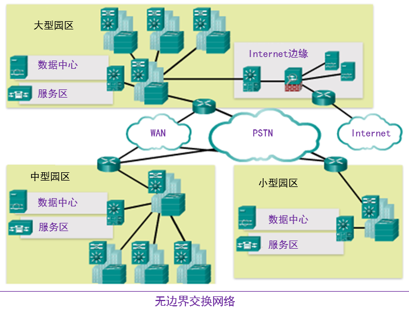
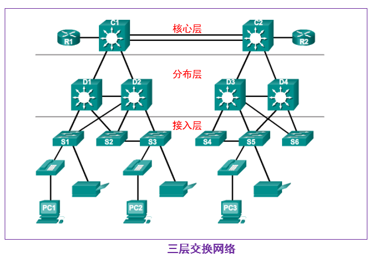
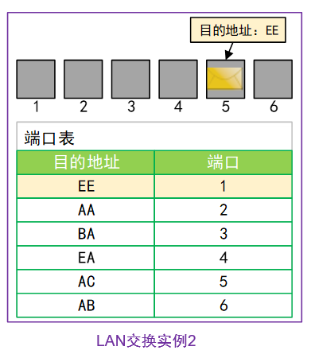

---
title: 交换网络简介
date: 2022-03-01
tags:
  - Networking
  - Cisco
categories:
  - tech
---

# 交换网络简介

**目标：**

1. 描述交换网络中数据、语音和视频的融合。
2. 描述中小型企业中的交换网络。
3. 解释交换网络中的帧转发过程。
4. 比较冲突域与广播域。

## 1.0 简介

## 1.1 LAN 设计

### 1.1.1 融合网络

**网络复杂性不断增加**

- 我们的数字世界正在发生变革
- 必须在世界的任何地方都可以访问信息
- 网络必须安全、可靠且高度可用

#### 1.1.1.2 融合网络的组成元素

为了支持协作，网络采用融合解决方案

- 语音系统
- IP 电话
- 语音网关
- 视频支持
- 视频会议
- 呼叫控制
- 语音消息
- 移动性
- 自动话务员

融合网络的优点包括：

- 多种流量；只需管理一个物理网络
- 节省安装和管理独立语音、视频和数据网络的大量费用
- 集成 IT 管理

#### 1.1.1.3 无边界交换网络

- 思科无边界网络是一种允许组织随时随地在任何设备上与任何人实现安全、可靠、无缝连接的网络架构。
- 它旨在应对IT和业务方面的挑战，例如支持融合网络和改变工作模式。 

#### 1.1.1.4 无边界交换网络的层次结构

无边界交换网络设计的指导原则是根据以下原则建立的：

- 分层
- 模块化
- 恢复能力
- 灵活性

无边界交换网络的创建要求使用合理的网络设计原理来确保可用性、灵活性、安全性和可管理性的最大化。无边界交換网络必须能够满足当前需求以及未来所需的服务和技术。无边界交换网络设计的指导原则是根据以下原理建立的。

- 分层:有助于理解各层中每个设备的作用,简化部署、运营和管理,并减小各层的故障域。
- 模块化:允许根据需求实现无缝网络扩展和集成服务支持。
- 恢复能力:满足用户对始终保持网络运行的期望。
- 灵活性:使用所有网络资源来支持智能流量负载共享。

以分层方式设计无边界交换网络,可以使网络的安全性、移动性与统一通信功能更好。

这两个图常用、且已被证明的园区网络分层设计框架分别是三层和两层折叠核心分层模型。

#### 1.1.1.5 核心、分布、访问

三层架构：
构建一个从中心大楼位置通往所有同一园区其他大楼的扩展星型物理网络拓扑。

接入层：接入层代表网络边缘,流量将从这里进出园区网。传统上,接入层交换机的主要功能是为用户提供网络访问。接入层交换机与分布层交换机连接,分布层交换机将实施网络基础技术(如路由、服务质量和安全)。
为了满足网络应用程序和最终用户的需求,现在下一代交换平台在网络边缘向各种类型的端点提供更多融合、集成和智能服务。接入层交换机中智能的构建使应用程序能够在网络上更加安全有效地运行。
分布层：接入层和核心层之间的分布层接口可以提供很多重要功能,包括：

- 聚合大规模的配线间网络;
- 聚合第2层广播域和第3层路由边界;
- 提供智能交换、路由和网络访问策略功能来访问网络的其余部分;
- 提供连向最终用户的冗余分布层交换机和通往核心层的等价路径的高可用性
- 在网络边缘为各种类别的服务应用程序提供区别服务。

核心层：核心层是网络主干。它连接园区网的多个层。核心层充当所有其他园区分区的整合者,并将园区和网络的其余部分连接起来。核心层的主要用途是提供错误隔离和高速主干连接。

图中显示了组织的三层园区网络设计,其中接入层、分布层和核心层分别为单独的层。要策划一个简化的、可扩展、经济且高效的物理电缆布局设计,可以构建一个从中心大厦位置通往所有同一园区其他大厦的扩展星型物理网络拓扑。

#### 1.1.2.1 交换网络的作用

交换网络的作用不断演进
交换 LAN 允许更高的灵活性和流量管理
它还支持如服务质量、安全性、无线、 IP 电话和移动服务

## 1.2 交换环境

选择交换机考虑因素：

- 成本  
- 端口密度
- 电源
- 可靠性 
- 端口速度 
- 帧缓冲区 
- 可扩展性

外形

- 模块化
- 堆叠式

#### 1.2.1.1 作为网络与通信基本概念的交换

- 交换机根据入口和目的端口做出决策
- LAN 交换机保留了用于确定如何通过交换机转发流量的表。
- 思科 LAN 交换机根据帧的目的 MAC 地址转发以太网帧。

帧从端口 5 进入交换机且目的地址是EE，交换机查表得到EA的传出端口，从端口 1 转发出去。

## 1.3 总结