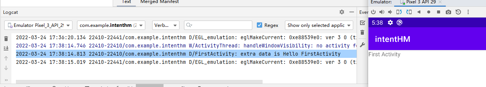
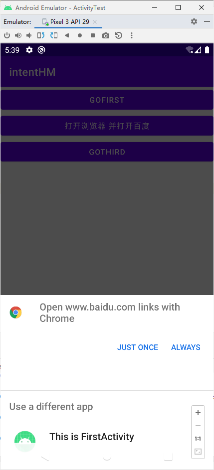

**1、实现从MainActivity显式切换到FirstActivity**

- MainActivity.kt

```kotlin
package com.example.intenthm

import android.content.Intent
import androidx.appcompat.app.AppCompatActivity
import android.os.Bundle
import android.widget.Button

class MainActivity : AppCompatActivity() {
    override fun onCreate(savedInstanceState: Bundle?) {
        super.onCreate(savedInstanceState)
        setContentView(R.layout.activity_main)

        val button1:Button = findViewById(R.id.goFirst)
        button1.setOnClickListener {
            val intent =
                Intent(this, FirstActivity::class.java)
            startActivity(intent)
        }
    }
}
```

- activity_main.xml

```xml
<?xml version="1.0" encoding="utf-8"?>
<LinearLayout xmlns:android="http://schemas.android.com/apk/res/android"
    android:orientation="vertical"
    android:layout_width="match_parent"
    android:layout_height="match_parent">

    <Button
        android:id="@+id/goFirst"
        android:layout_width="match_parent"
        android:layout_height="wrap_content"
        android:text="@string/gofirst"
        />
</LinearLayout>
```

- FirstActivity.kt

```kotlin
package com.example.intenthm

import androidx.appcompat.app.AppCompatActivity
import android.os.Bundle

class FirstActivity : AppCompatActivity() {
    override fun onCreate(savedInstanceState: Bundle?) {
        super.onCreate(savedInstanceState)
        setContentView(R.layout.activity_first)
    }
}
```

- activity_first.xml

```xml
<?xml version="1.0" encoding="utf-8"?>
<LinearLayout xmlns:android="http://schemas.android.com/apk/res/android"
    android:orientation="vertical"
    android:layout_width="match_parent"
    android:layout_height="match_parent">

    <TextView
        android:layout_width="wrap_content"
        android:layout_height="wrap_content"
        android:text="First Activity"/>
</LinearLayout>
```

- AndroidManifest.xml

```xml
<?xml version="1.0" encoding="utf-8"?>
<manifest xmlns:android="http://schemas.android.com/apk/res/android"
    xmlns:tools="http://schemas.android.com/tools"
    package="com.example.intenthm">

    <application
        android:allowBackup="true"
        android:icon="@mipmap/ic_launcher"
        android:label="@string/app_name"
        android:roundIcon="@mipmap/ic_launcher_round"
        android:supportsRtl="true"
        android:theme="@style/Theme.IntentHM">
        <activity
            android:name=".FirstActivity"
            android:exported="true">
            <intent-filter>
                <action android:name="android.intent.action.VIEW"/>
                <category android:name="android.intent.category.HOME"/>
            </intent-filter>
        </activity>
        <activity
            android:name=".MainActivity"
            android:exported="true">
            <intent-filter>
                <action android:name="android.intent.action.MAIN" />
                <category android:name="android.intent.category.LAUNCHER" />
            </intent-filter>
        </activity>
    </application>

</manifest>
```

**2、实现从MainActivity隐式切换到FirstActivity，并携带数据“hello FirstActivity,i am MainActivity”**

- MainActivity.kt

```kotlin
package com.example.intenthm

import android.content.Intent
import androidx.appcompat.app.AppCompatActivity
import android.os.Bundle
import android.widget.Button

class MainActivity : AppCompatActivity() {
    override fun onCreate(savedInstanceState: Bundle?) {
        super.onCreate(savedInstanceState)
        setContentView(R.layout.activity_main)

        val button1:Button = findViewById(R.id.goFirst)
        button1.setOnClickListener {
            val data = "Hello FirstActivity"
            val intent = Intent("com.example.intent.ACTION_START")
            intent.putExtra("extra_data", data)
            startActivity(intent)
        }
    }
}
```

- activity_first.xml

```xml
<?xml version="1.0" encoding="utf-8"?>
<LinearLayout xmlns:android="http://schemas.android.com/apk/res/android"
    android:orientation="vertical"
    android:layout_width="match_parent"
    android:layout_height="match_parent">

    <TextView
        android:layout_width="wrap_content"
        android:layout_height="wrap_content"
        android:text="First Activity"/>
</LinearLayout>
```

- FirstActivity.kt

```kotlin
package com.example.intenthm

import androidx.appcompat.app.AppCompatActivity
import android.os.Bundle
import android.util.Log

class FirstActivity : AppCompatActivity() {
    override fun onCreate(savedInstanceState: Bundle?) {
        super.onCreate(savedInstanceState)
        setContentView(R.layout.activity_first)
        val extraData = intent.getStringExtra("extra_data")
        Log.d("FirstActivity","extra data is $extraData")
    }
}
```

- activity_first.xml

```xml
<?xml version="1.0" encoding="utf-8"?>
<LinearLayout xmlns:android="http://schemas.android.com/apk/res/android"
    android:orientation="vertical"
    android:layout_width="match_parent"
    android:layout_height="match_parent">

    <TextView
        android:layout_width="wrap_content"
        android:layout_height="wrap_content"
        android:text="First Activity"/>
</LinearLayout>
```

- AndroidManifest.xml

```xml
<?xml version="1.0" encoding="utf-8"?>
<manifest xmlns:android="http://schemas.android.com/apk/res/android"
    xmlns:tools="http://schemas.android.com/tools"
    package="com.example.intenthm">

    <application
        android:allowBackup="true"
        android:icon="@mipmap/ic_launcher"
        android:label="@string/app_name"
        android:roundIcon="@mipmap/ic_launcher_round"
        android:supportsRtl="true"
        android:theme="@style/Theme.IntentHM">
        <activity
            android:name=".FirstActivity"
            android:exported="true">
            <intent-filter>
                <action android:name="com.example.intent.ACTION_START"/>
                <category android:name="android.intent.category.DEFAULT"/>
            </intent-filter>
        </activity>
        <activity
            android:name=".MainActivity"
            android:exported="true">
            <intent-filter>
                <action android:name="android.intent.action.MAIN" />
                <category android:name="android.intent.category.LAUNCHER" />
            </intent-filter>
        </activity>
    </application>

</manifest>
```

**3、实现从MainActivity点击按钮打开浏览器浏览百度网址**

- MainActivity.kt

```kotlin
package com.example.intenthm

import android.content.Intent
import android.net.Uri
import androidx.appcompat.app.AppCompatActivity
import android.os.Bundle
import android.widget.Button

class MainActivity : AppCompatActivity() {
    override fun onCreate(savedInstanceState: Bundle?) {
        super.onCreate(savedInstanceState)
        setContentView(R.layout.activity_main)

        val button1:Button = findViewById(R.id.goFirst)
        button1.setOnClickListener {
            val data = "Hello FirstActivity"
            val intent = Intent("com.example.intent.ACTION_START")
            intent.putExtra("extra_data", data)
            startActivity(intent)
        }
        val button2:Button = findViewById(R.id.goBaidu)
        button2.setOnClickListener {
            val intent = Intent(Intent.ACTION_VIEW)
            intent.data = Uri.parse("https://www.baidu.com")
            startActivity(intent)
            }
        }
}
```

- activity_main.xml

```xml
<?xml version="1.0" encoding="utf-8"?>
<LinearLayout xmlns:android="http://schemas.android.com/apk/res/android"
    android:orientation="vertical"
    android:layout_width="match_parent"
    android:layout_height="match_parent">

    <Button
        android:id="@+id/goFirst"
        android:layout_width="match_parent"
        android:layout_height="wrap_content"
        android:text="@string/gofirst"/>
    <Button
        android:id="@+id/goBaidu"
        android:layout_width="match_parent"
        android:layout_height="wrap_content"
        android:text="打开浏览器 并打开百度" />
</LinearLayout>
```

- AndroidManifest.xml （无改动）

```xml
<?xml version="1.0" encoding="utf-8"?>
<manifest xmlns:android="http://schemas.android.com/apk/res/android"
    xmlns:tools="http://schemas.android.com/tools"
    package="com.example.intenthm">

    <application
        android:allowBackup="true"
        android:icon="@mipmap/ic_launcher"
        android:label="@string/app_name"
        android:roundIcon="@mipmap/ic_launcher_round"
        android:supportsRtl="true"
        android:theme="@style/Theme.IntentHM">
        <activity
            android:name=".FirstActivity"
            android:exported="true">
            <intent-filter>
                <action android:name="com.example.intent.ACTION_START"/>
                <category android:name="android.intent.category.DEFAULT"/>
            </intent-filter>
        </activity>
        <activity
            android:name=".MainActivity"
            android:exported="true">
            <intent-filter>
                <action android:name="android.intent.action.MAIN" />
                <category android:name="android.intent.category.LAUNCHER" />
            </intent-filter>
        </activity>
    </application>

</manifest>
```

**4、实现从MainActivity有回传数据形式切换到ThirdActivity,并在ThirdActivity回传数据“我回传一本给你”**

- MainActivity.kt

```kotlin
package com.example.intenthm

import android.content.Intent
import android.net.Uri
import androidx.appcompat.app.AppCompatActivity
import android.os.Bundle
import android.util.Log
import android.widget.Button

@Suppress("DEPRECATION")
class MainActivity : AppCompatActivity() {
    override fun onCreate(savedInstanceState: Bundle?) {
        super.onCreate(savedInstanceState)
        setContentView(R.layout.activity_main)

        val button1:Button = findViewById(R.id.goFirst)
        button1.setOnClickListener {
            val data = "Hello FirstActivity"
            val intent = Intent("com.example.intent.ACTION_START")
            intent.putExtra("extra_data", data)
            startActivity(intent)
        }

        val button2:Button = findViewById(R.id.goBaidu)
        button2.setOnClickListener {
            val intent = Intent(Intent.ACTION_VIEW)
            intent.data = Uri.parse("https://www.baidu.com")
            startActivity(intent)
            }

        val button3:Button = findViewById(R.id.goThird)
        button3.setOnClickListener {
            val intent = Intent(this, ThirdActivity::class.java)
            startActivityForResult(intent, 1)   // 需要 @Suppress("DEPRECATION")
//            startActivity(intent)
        }
    }
    override fun onActivityResult(requestCode: Int, resultCode: Int, data: Intent?) {
        super.onActivityResult(requestCode, resultCode, data)
        when (requestCode) {
            1 -> if (resultCode == RESULT_OK) {
                val returnData = data?.getStringExtra("data_return")
                Log.d("FirstActivity", "$returnData")
            }
        }
    }
}
```

- activity_main.xml

```xml
<?xml version="1.0" encoding="utf-8"?>
<LinearLayout xmlns:android="http://schemas.android.com/apk/res/android"
    android:orientation="vertical"
    android:layout_width="match_parent"
    android:layout_height="match_parent">

    <Button
        android:id="@+id/goFirst"
        android:layout_width="match_parent"
        android:layout_height="wrap_content"
        android:text="@string/gofirst"/>
    <Button
        android:id="@+id/goBaidu"
        android:layout_width="match_parent"
        android:layout_height="wrap_content"
        android:text="打开浏览器 并打开百度" />
    <Button
        android:id="@+id/goThird"
        android:layout_width="match_parent"
        android:layout_height="wrap_content"
        android:text="goThird"/>
</LinearLayout>
```

- activity_first.xml （无改动）

```xml
<?xml version="1.0" encoding="utf-8"?>
<LinearLayout xmlns:android="http://schemas.android.com/apk/res/android"
    android:orientation="vertical"
    android:layout_width="match_parent"
    android:layout_height="match_parent">

    <TextView
        android:layout_width="wrap_content"
        android:layout_height="wrap_content"
        android:text="First Activity"/>
</LinearLayout>
```

- ThirdActivity.kt

```kotlin
package com.example.intenthm

import android.content.Intent
import androidx.appcompat.app.AppCompatActivity
import android.os.Bundle
import android.widget.Button

class ThirdActivity : AppCompatActivity() {
    override fun onCreate(savedInstanceState: Bundle?) {
        super.onCreate(savedInstanceState)
        setContentView(R.layout.activity_third)

        val button1:Button = findViewById(R.id.backFirst)
        button1.setOnClickListener {
            val intent = Intent()
            intent.putExtra("data_return", "我回传一本给你")
            setResult(RESULT_OK, intent)
            finish()
        }
    }
}
```

- activity_third.xml

```xml
<?xml version="1.0" encoding="utf-8"?>
<LinearLayout xmlns:android="http://schemas.android.com/apk/res/android"
    android:orientation="vertical"
    android:layout_width="match_parent"
    android:layout_height="match_parent">


    <Button
        android:id="@+id/backFirst"
        android:layout_width="match_parent"
        android:layout_height="wrap_content"
        android:text="backFirst"/>
    <TextView
        android:layout_width="wrap_content"
        android:layout_height="wrap_content"
        android:text="Third Activity" />
</LinearLayout>
```

- AndroidManifest.xml

```xml
<?xml version="1.0" encoding="utf-8"?>
<manifest xmlns:android="http://schemas.android.com/apk/res/android"
    xmlns:tools="http://schemas.android.com/tools"
    package="com.example.intenthm">

    <application
        android:allowBackup="true"
        android:icon="@mipmap/ic_launcher"
        android:label="@string/app_name"
        android:roundIcon="@mipmap/ic_launcher_round"
        android:supportsRtl="true"
        android:theme="@style/Theme.IntentHM">
        <activity
            android:name=".ThirdActivity"
            android:exported="false" />
        <activity
            android:name=".FirstActivity"
            android:exported="true">
            <intent-filter>
                <action android:name="com.example.intent.ACTION_START" />

                <category android:name="android.intent.category.DEFAULT" />
            </intent-filter>
        </activity>
        <activity
            android:name=".MainActivity"
            android:exported="true">
            <intent-filter>
                <action android:name="android.intent.action.MAIN" />

                <category android:name="android.intent.category.LAUNCHER" />
            </intent-filter>
        </activity>
    </application>

</manifest>
```


**运行预览**






