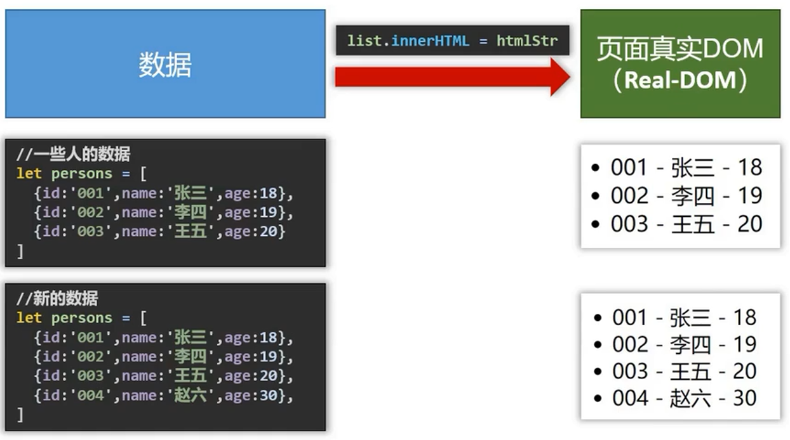
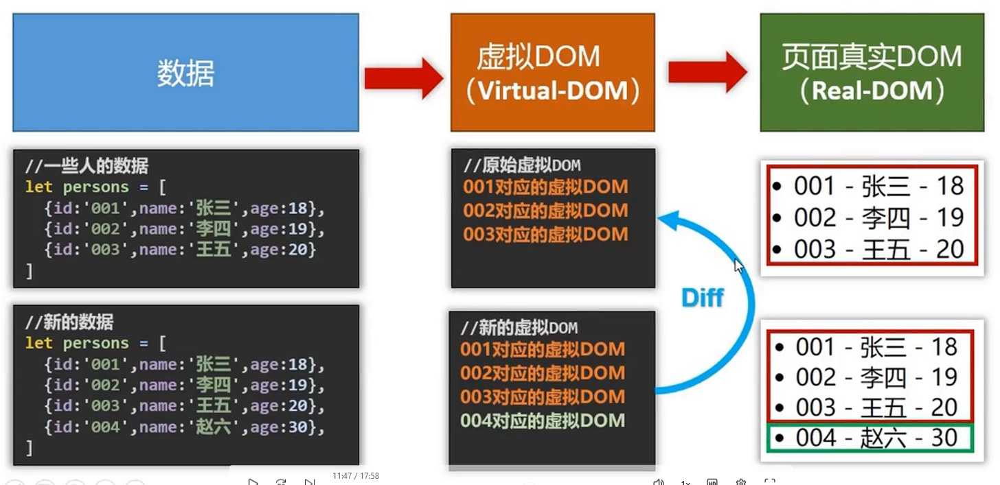


# Vue 简介

## Vue 特点

1. 采用组件化模式，提高代码复用率、且让代码更好维护。
2. 声明式编码，让编码人员无需直接操作DOM，提高开发效率。

需求：展示字符串

- JavaScript  命令式编码

```js
// 准备HTML字符串
let htmlStr = ''

// 遍历数据拼接HTML字符串
person.forEach( p => {
   htmlStr += '<li>${p.id} - ${p.name} - &{p.age}</li>' 
});

// 获取list元素
let list = document.getElementById('list')

// 修改内容 （操作DOM）
list.innerHTML = htmlStr
```

- Vue  声明式编码

```vue
<ul id = "list">
	<li v-for = "p in persons">
		{{p.id}} - {{p.name}} - {{p.age}}
	</li>
</ul>
```

3. 使用 虚拟DOM + Diff算法，尽量服用DOM节点。 

- 原生Javascript实现
  - 每次数据更新都会抹除旧数据，然后重新写入



- Vue
  - 通过虚拟DOM，仅添加新数据




