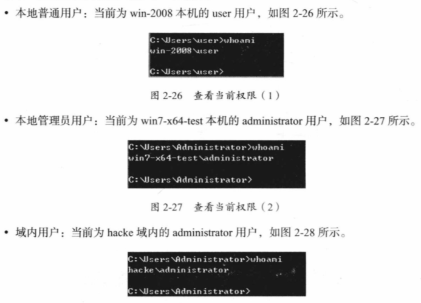
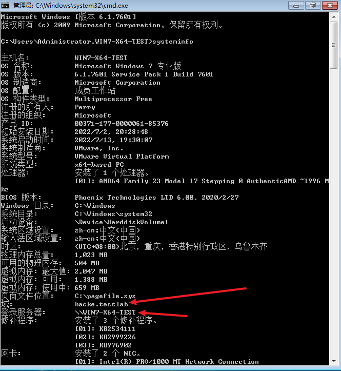
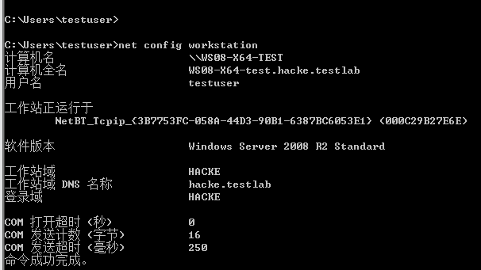
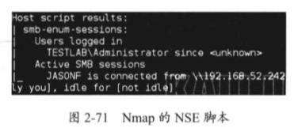
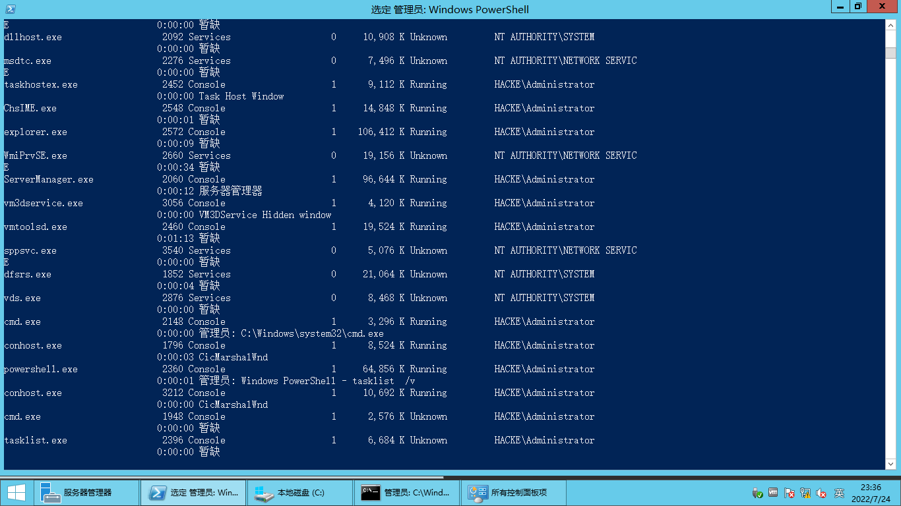

# 内网信息收集

## 收集本机信息

**查询网络配置信息**

```
ipconfig /all
```


### 手动收集信息

**查询操作系统及软件信息**

查看系统详细信息：`systeminfo`

CMD 查询操作系统和版本信息：`systeminfo | findstr /B /C:"OS Name" /C:"OS Version"` 或 `systeminfo | findstr /B /C:"OS 名称" /C:"OS 版本"`

```
Microsoft Windows [版本 10.0.19044.1706]
(c) Microsoft Corporation。保留所有权利。

C:\Users\perry>systeminfo | findstr /B /C:"OS 名称" /C:"OS 版本"
OS 名称:          Microsoft Windows 10 专业版
OS 版本:          10.0.19044 暂缺 Build 19044
```


**查看安装的软件及版本、路径**等：`wmic product get name,version`

```
Microsoft Windows [版本 6.1.7601]
版权所有 (c) 2009 Microsoft Corporation。保留所有权利。

C:\Users\testuser>wmic product get name,version
Name                                                            Version

Microsoft Visual C++ 2019 X86 Minimum Runtime - 14.20.27508     14.20.27508

Microsoft Visual C++ 2019 X64 Minimum Runtime - 14.20.27508     14.20.27508

Microsoft Visual C++ 2019 X86 Additional Runtime - 14.20.27508  14.20.27508

Microsoft Visual C++ 2019 X64 Additional Runtime - 14.20.27508  14.20.27508

VMware Tools                                                    11.0.6.15940789
```


利用 PowerShell 命令，收集软件的版本信息：`powershell "Get-WmiObject -class Win32_Product |Select-Object -Property name,version"`

```powershell
PS C:\Users\testuser> Get-WmiObject -class Win32_Product |Select-Object -Property name,version

name                                                        version
----                                                        -------
Microsoft Visual C++ 2019 X86 Minimum Runtime - 14.20.27508 14.20.27508
Microsoft Visual C++ 2019 X64 Minimum Runtime - 14.20.27508 14.20.27508
Microsoft Visual C++ 2019 X86 Additional Runtime - 14.20... 14.20.27508
Microsoft Visual C++ 2019 X64 Additional Runtime - 14.20... 14.20.27508
VMware Tools                                                11.0.6.15940789
```


**查询本机访问信息**：`wmic service list brief`

```
C:\Users\testuser>wmic service list brief
ExitCode  Name                            ProcessId  StartMode  State    Status

0         AeLookupSvc                     808        Manual     Running  OK

1077      ALG                             0          Manual     Stopped  OK

1077      AppIDSvc                        0          Manual     Stopped  OK

1077      Appinfo                         0          Manual     Stopped  OK

1077      AppMgmt                         0          Manual     Stopped  OK
......
```


**进查询程信息**

查询进程列表：`tasklist`

查看进程信息：`wmic process list brief`

常见杀软进程

| 软件                    | 进程                                                         | 服务                                                         |
| ----------------------- | ------------------------------------------------------------ | ------------------------------------------------------------ |
| 金山毒霸                | kxescore.exe、kupdata.exe、kxetray.exe、kwsprotect64.exe     |                                                              |
| 360                     | 360sd.exe、360tray.exe、360rp.exe、LiveUpdate360.exe、zhudongfangyu.exe、360Safe.exe、360Tray.exe、LiveUpdate360.exe、ZhuDongFangYu.exe、360skylarsvc.exe | ZhuDongFangYu、360 Skylar Service                            |
| 腾讯电脑管家            | QQPCRTP.exe、QQPCTray.exe、QQPCNetFlow.exe、QQPCRealTimeSpeedup.exe | QQPCRTP                                                      |
| 火绒                    | HipsDaemon.exe、HipsTray.exe、HipsLog.exe、HipsMain.exe、usysdiag.exe、wsctrl.exe | HipsDaemon                                                   |
| AVG                     | avg.exe、avgwdsvc.exe                                        |                                                              |
| Avast                   | AvastUI.exe、ashDisp.exe                                     |                                                              |
| McAfee                  | Tbmon.exe、shstat.exe、McTray.exe、mfeann.exe、mfevtps.exe、UdaterUI.exe、naPrdMgr.exe、VsTskMgr.exe、McShield.exe、EngineServer.exe、FrameworkService.exe | McTaskManager、McShield、mfevtp、McAfeeEngineService、McAfeeFramework |
| 卡巴斯基企业版/服务器版 | avp.exe、kavfs.exe（Kaspersky Anti-Virus Service）、klnagent.exe（Kaspersky Administraton Kit Network Agent）、kavtray.exe（Kaspersky Anti-Virus tray app“主进程”）、kavfswp.exe（Kaspersky Anti-Virus worker process） | AVP                                                          |
| MS Defender             | MsMpEng.exe、NisSrv.exe、MsSense.exe、msseces.exe、MpCmdRun.exe、MSASCui.exe、MSASCuiL.exe、SecurityHealthService.exe | WinDefend、MsMpSvc                                           |

参考链接：

[gh0stkey/avList: avList - 杀软进程对应杀软名称 (github.com)](https://github.com/gh0stkey/avList)

[3had0w/Antivirus-detection: Show AV Processes list (github.com)](https://github.com/3had0w/Antivirus-detection)

[r00tSe7en/get_AV: Windows杀软在线对比辅助 (github.com)](https://github.com/r00tSe7en/get_AV)

[uknowsec/SharpAVKB: Windows杀软对比和补丁号对比 (github.com)](https://github.com/uknowsec/SharpAVKB)

[ars3n11/Aggressor-Scripts: Cobalt Strike aggressor scripts (github.com)](https://github.com/ars3n11/Aggressor-Scripts)


**查看自启动程序信息**：`wmic startup get command, caption`

```
C:\Users\testuser>wmic startup get command, caption
Caption                     Command

VMware VM3DService Process  "C:\Windows\system32\vm3dservice.exe" -u

VMware User Process         "C:\Program Files\VMware\VMware Tools\vmtoolsd.exe"
```


**查看计划任务**：`schtasks /query /fo LIST /v`


**查看主机开机时间**：`net statistics workstation`


**查询用户信息**

查询用户列表：`net user`

通过分析用户列表，可找出内网机器的命名规则。个人机器的名称可以用来推测整个域的用户命名方式


获取本地管理员(包含域用户)信息：`net localgroup administrators`

```
Microsoft Windows [版本 6.1.7601]
版权所有 (c) 2009 Microsoft Corporation。保留所有权利。

C:\Users\testuser>net view /domain:hacke
服务器名称            注解

-------------------------------------------------------------------------------
\\DC
\\WS08-X64-TEST
命令成功完成。


C:\Users\testuser>net localgroup administrators
别名     administrators
注释     管理员对计算机/域有不受限制的完全访问权

成员

-------------------------------------------------------------------------------
Administrator
HACKE\Domain Admins
命令成功完成。
```


查看当前用户：`whoami`


查看当前在线用户：`query user || qwinsta`

```
C:\Users\testuser>query user || qwinsta
 用户名                会话名             ID  状态    空闲时间   登录时间
>testuser              console             1  运行中      无     2022/7/13 16:38

 会话名            用户名                   ID  状态    类型        设备
 services                                    0  断开
>console           testuser                  1  运行中
```


**列出或断开本地计算机域所连接的客户端之间的会话**：`net session`


**查询端口列表**：`netstat -ano`


**查看补丁列表**：`systeminfo` 或 `wmic qfe get Caption,Description,HotFixID,InstalledOn`

```
C:\Users\testuser>wmic qfe get Caption,Description,HotFixID,InstalledOn
Caption                                     Description  HotFixID   InstalledOn

http://support.microsoft.com/?kbid=2999226  Update       KB2999226  7/2/2022

http://support.microsoft.com/?kbid=976902   Update       KB976902   11/21/2010
```


**查询本机共享列表**：`net share`

```
C:\Users\testuser>net share

共享名       资源                            注解

-------------------------------------------------------------------------------
C$           C:\                             默认共享
IPC$                                         远程 IPC
ADMIN$       C:\Windows                      远程管理
命令成功完成。
```


利用wmic命令查找共享列表：`wmic share get name,path,status`


**查询路由表及所有可用接口的ARP缓存表**：

```
route print
arp -a
```


**防火墙相关**

关闭防火墙 ：

Server 2003- ：`netsh firewall set opmode disable`

Server 2008+ ：`netsh firewall set allprofiles state off`


查看防火墙配置：`netsh firewall show config`


修改防火墙配置：

Server2003- 

​	允许指定该程序全部连接：`netsh firewalld add allowedprogram c:\nc.exe "allow nc" enable`

Server2008+ 

​	允许指定程序进入：`netsh advfirewall firewall add rule name="pass nc" dir=in action=allow`

​	允许指定程序退出：`netsh advfirewall firewall add rule name="Allow nc" dir=not action=allow program="C:\nc.exe"`

​	允许3389端口放行：`netsh advfirewall firewall add rule name="Remote Desktop" protocal=TCP dir=in localport=3389 action=allow`

​	自定义防火墙日志的存储位置：`netsh advfirewall set current profile logging filename "C:\Windows\temp\fw.log"`


**查看代理配置情况**：`reg query "HKEY_CURRENT_USER\Software\Microsoft \Windows\CurrentVersion\Internet Settings"`


**查询并开启远程连接服务**：

查看远程连接端口：

在命令行环境中执行注册表查询语句，命令如下。连接的端口为0xd3d，转换后为3389。

```
REG QUERY"HKEY_LOCAL_MACHINE\SYSTEM\CurrentControlSet\Control\Terminal Server\WinStations\RDP-Tcp"/V PortNumber
```

在Windows Server 2003中开启3389端口

```
wmic path win32 terminalservicesetting where(CLASS!="") call setallowtsconnections 1
```

在Windows Server 2008和Windows Server2012中开启3389端口

```
wmic/namespace:\\root\cimv2\terminalservices path win32 terminalservicesetting where(CLASS!="") call setallowtsconnections 1

wmic/namespace:\\root\cimv2\terminalservices path win32 tsgeneralsetting where(TerminalName='RDP-Tcp') call setuserauthenticationrequired 1

reg add"HKLM\SYSTEM\CURRENT\CONTROLSET\CONTROL\TERMINAL SERVER" /v  fSingleSessionPerUser/t REG DWORD/d 0/f
```


### 自动收集信息

为了简化操作，可以创建一个脚本，在目标机器上完成流程、服务、用户账号、用户组、网络接口、硬盘信息、网络共享信息、操作系统、安装的补丁、安装的软件、启动时运行的程序、时区等信息的查询工作。

如，使用WMIC脚本实现*，执行该脚本后，会将所有结果写入一个HTML文件

*：http://www.fuzzysecurity.com/scripts/files/wmic_info.rar

*：OneDrive - Business\Documents\NUIT\内网安全攻防\wmic_info.bat


### Empire下的主机信息收集 （待补充）

Empire提供了用于收集主机信息的模块。输入命令 `usemodule situational_awareness/host/winenum` ，即可查看本机用户、域组成员、密码设置时间、剪贴板内容、系统基本信息、网络适配器信息、共享信息等。

参考链接：[BC-SECURITY/Empire: Empire is a PowerShell and Python 3.x post-exploitation framework. (github.com)](https://github.com/BC-SECURITY/Empire)


## 查询当前权限

**查看当前权限**：`whoami`

一般有三种情况：



如果当前内网中存在域，那么本地普通用户只能查询本机相关信息，不能查询域内信息，而本地管理员用户和域内用户可以查询域内信息。

其原理是：域内的所有查询都是通过域控制器实现的（基于LDAP协议），而这个查询需要经过权限认证，所以，只有域用户才拥有这个权限；当域用户执行查询命令时，会自动使用 Kerberos 协议进行认证，无须额外输入账号和密码。

本地管理员Administrator 权限可以直接提升为Ntauthority或System权限，因此，在域中，除普通用户外，所有的机器都有一个机器用户（用户名是机器名加上“$”）。在本质上，机器的system用户对应的就是域里面的机器用户。所以，使用System权限可以运行域内的查询命令。


**获取域 SID**：`whoami /all`

```
C:\Users\Administrator>whoami /all

用户信息
----------------

用户名              SID
=================== =============================================
hacke\administrator S-1-5-21-4114729402-1436421223-1667956922-500
```


**查询指定用户的详细信息**：`net user [user] /domain`

```
C:\Users\Administrator>net user testuser /domain
用户名                 testuser
全名                   test
注释
用户的注释
国家/地区代码          000 (系统默认值)
帐户启用               Yes
帐户到期               从不

上次设置密码           2022/7/11 16:31:15
密码到期               2022/8/22 16:31:15
密码可更改             2022/7/12 16:31:15
需要密码               No
用户可以更改密码       Yes

允许的工作站           All
登录脚本
用户配置文件
主目录
上次登录               2022/7/13 19:33:27

可允许的登录小时数     All

本地组成员
全局组成员             *Domain Users
命令成功完成。
```


## 判断是否存在域

1. **使用 `ipconfig` 命令**

执行如下命令，可以查看**网关**IP地址、**DNS**的**IP**地址、**域名**、**本机**是否和DNS服务器处于**同一网段**等信息。

```
C:\Users\testuser>ipconfig /all

Windows IP 配置

   主机名  . . . . . . . . . . . . . : WS08-X64-test
   主 DNS 后缀 . . . . . . . . . . . : hacke.testlab
   节点类型  . . . . . . . . . . . . : 混合
   IP 路由已启用 . . . . . . . . . . : 否
   WINS 代理已启用 . . . . . . . . . : 否
   DNS 后缀搜索列表  . . . . . . . . : hacke.testlab

以太网适配器 本地连接:

   连接特定的 DNS 后缀 . . . . . . . :
   描述. . . . . . . . . . . . . . . : Intel(R) PRO/1000 MT Network Connection
   物理地址. . . . . . . . . . . . . : 00-0C-29-B2-7E-6E
   DHCP 已启用 . . . . . . . . . . . : 否
   自动配置已启用. . . . . . . . . . : 是
   本地链接 IPv6 地址. . . . . . . . : fe80::ec50:c18:6e02:c641%11(首选)
   IPv4 地址 . . . . . . . . . . . . : 192.168.1.2(首选)
   子网掩码  . . . . . . . . . . . . : 255.255.255.0
   默认网关. . . . . . . . . . . . . :
   DHCPv6 IAID . . . . . . . . . . . : 234884137
   DHCPv6 客户端 DUID  . . . . . . . : 00-01-00-01-2A-51-D6-81-00-0C-29-8B-6E-2F

   DNS 服务器  . . . . . . . . . . . : 192.168.1.1
   TCPIP 上的 NetBIOS  . . . . . . . : 已启用
```


然后使用 `nslookup` 来解析域名的IP地址，用解析得到的IP地址进行对比，判断域控制器和DNS服务器是否在同一台服务器上。

```
C:\Users\testuser>nslookup hacke.testlab
DNS request timed out.
    timeout was 2 seconds.
服务器:  UnKnown
Address:  192.168.1.1

名称:    hacke.testlab
Address:  192.168.1.1
```


2. **查看系统详细信息**

“域”即域名（当前域名为hacke.testlab），“登录服务器”为域控制器。如果“域”为“WORKGROUP”，表示当前服务器不在域内。





3. **查询当前登录域及登录用户信息**

执行如下命令，如图2-34所示，“工作站域DNS名称”为域名（如果为“WORKGROUP”，表示当前为非域环境），“登录域”用于表示当前登录的用户是域用户还是本地用户，此处表示当前登录的用户是域用户。

```
net config workstation
```




4. **判断主域**：`net time /domain`

通常有三种情况


## 探测域内主机

### 2.5.1 利用NetBIOS快速探测内网

NetBIOS是局域网程序使用的一种应用程序编程接口（API），为程序提供了请求低级别服务的统一的命令集，为局域网提供了网络及其他特殊功能。几乎所有的局域网都是在NetBIOS协议的基础上工作的。NetBIOS也是计算机的标识名，主要用于局域网中计算机的互访。

官网：[nbtscan - NETBIOS nameserver scanner (unixwiz.net)](http://www.unixwiz.net/tools/nbtscan.html#download)


帮助列表：

```
C:\Users\Perry>nbtscan-1.0.35.exe
nbtscan 1.0.35 - 2008-04-08 - http://www.unixwiz.net/tools/

usage: nbtscan-1.0.35.exe [options] target [targets...]

   Targets are lists of IP addresses, DNS names, or address
   ranges. Ranges can be in /nbits notation ("192.168.12.0/24")
   or with a range in the last octet ("192.168.12.64-97")

   -V        show Version information
   -f        show Full NBT resource record responses (recommended)
   -H        generate HTTP headers
   -v        turn on more Verbose debugging
   -n        No looking up inverse names of IP addresses responding
   -p <n>    bind to UDP Port <n> (default=0)
   -m        include MAC address in response (implied by '-f')
   -T <n>    Timeout the no-responses in <n> seconds (default=2 secs)
   -w <n>    Wait <n> msecs after each write (default=10 ms)
   -t <n>    Try each address <n> tries (default=1)
   -1        Use Winsock 1 only
   -P        generate results in perl hashref format
```


使用方法：直接输入IP地址范围即可

```
C:\Users\Perry>nbtscan-1.0.35.exe 192.168.1.0/20
192.168.1.1     HACKE\DC                        SHARING DC
192.168.1.2     HACKE\WS08-X64-TEST             SHARING
192.168.1.3     HACKE\WIN7-X64-TEST             SHARING
^C
```

参数含义

| Token    | Meaning                                                   |
| -------- | --------------------------------------------------------- |
| SHARING  | 存在正在运行的文件和打印共享服务，但不一定有内容共享      |
| DC       | 可能是域控制器                                            |
| U=*user* | 有登录名为User的用户（不太准确）                          |
| IIS      | 可能安装了IIS服务器                                       |
| EXCHANGE | 可能安装了Exchange                                        |
| NOTES    | 可能安装了Lotus Notes电子邮件客户端                       |
| ?        | 没有识别出该机器的NetBIOS资源（可以使用 -F 选项再次扫描） |


### 2.5.2 利用ICMP协议快速探测内网

依次对内网中的每个IP地址执行ping命令：`for /L %I in (1,1,254) Do @ ping -w1-n 1 192.168.1.%I | findstr "`

```
C:\Users\Perry>for /L %I in (1,1,254) Do @ ping -w1-n 1 192.168.1.%I | findstr "
TTL="
来自 192.168.1.1 的回复: 字节=32 时间=2ms TTL=128
来自 192.168.1.1 的回复: 字节=32 时间<1ms TTL=128
来自 192.168.1.1 的回复: 字节=32 时间=6ms TTL=128
来自 192.168.1.1 的回复: 字节=32 时间<1ms TTL=128
来自 192.168.1.2 的回复: 字节=32 时间=2ms TTL=128
来自 192.168.1.2 的回复: 字节=32 时间<1ms TTL=128
来自 192.168.1.2 的回复: 字节=32 时间<1ms TTL=128
来自 192.168.1.2 的回复: 字节=32 时间<1ms TTL=128
来自 192.168.1.3 的回复: 字节=32 时间<1ms TTL=128
来自 192.168.1.3 的回复: 字节=32 时间<1ms TTL=128
来自 192.168.1.3 的回复: 字节=32 时间<1ms TTL=128
来自 192.168.1.3 的回复: 字节=32 时间<1ms TTL=128
^C
```


vbs脚本：

```vb
strSubNet = "192.168.1."
Set objFSO= CreateObject("Scripting.FileSystemObject")
Set objTS = objfso.CreateTextFile("C:\PingResult.txt")

For i = 1 To 254
strComputer = strSubNet & i
blnResult = Ping(strComputer)
If blnResult = True Then
objTS.WriteLine "Ping " & strComputer & " success!"
End If
Next

objTS.Close
WScript.Echo "Done!"

Function Ping(strComputer)
Set objWMIService = GetObject("winmgmts:\\.\root\cimv2")
Set colItems = objWMIService.ExecQuery("Select * From Win32_PingStatus Where Address='" & strComputer & "'")
For Each objItem In colItems
Select case objItem.StatusCode
Case 0
Ping = True
Case Else
Ping = False
End select
Exit For
Next
End Function
```


### 2.5.3 通过ARP扫描探测内网

1. arp-scan工具

直接把 arp.exe 上传到目标机器中并运行，可以自定义掩码、指定扫描范围等，命令如下

```
C:\Users\Perry>arp-scan.exe -t 192.168.1.0/20
Reply that 00:0C:29:75:33:21 is 192.168.1.1 in 15.845100
Reply that 00:0C:29:B2:7E:6E is 192.168.1.2 in 14.348600
Reply that 00:0C:29:78:B1:53 is 192.168.1.3 in 0.088400
Reply that 00:0C:29:78:B1:53 is 192.168.1.255 in 0.112500
Enter Ctrl-C to Abort. Please waiting...
```

*：[QbsuranAlang/arp-scan-windows-: send arp request to whole specific LAN (github.com)](https://github.com/QbsuranAlang/arp-scan-windows-)

*：OneDrive - Business\Documents\NUIT\内网安全攻防\arp-scan.exe


2. Empire中的arpscan模块（待补充） PDF65


3. Nishang中的Invoke-ARPScan.ps1脚本（待补充）PDF66

使用Nishang中的Invoke-ARPScan.ps1脚本，可以将脚本上传到目标主机中运行，也可以直接远程加载脚本、自定义掩码和扫描范围，命令如下。

```
powershell.exe -exec bypass -Command "& {Import-Module C:\windows\temp\Invoke-ARPScan.ps1; Invoke-ARPScan -CIDR 192.168.1.0/20}" >> C:\windows\temp\log.txt
```


### 2.5.4 通过常规TCP/UDP端口扫描探测内网

ScanLine 是一款经典的端口扫描工具，可以在所有版本的Windows操作系统中使用，体积小，仅使用单个文件，同时支持TCP/UDP端口扫描，命令如下

```
ScanLine.exe -h -t 22,80-89,110,389,445,3389,1099,1433,2049,6379,7001,8080,1521,3306,3389,5432-u53,161,137,139 -O c:\windows\temp\log.txt -p 192.168.1.1-254 /b
```


```
C:\Users\Perry\Hacke>ScanLine.exe -h -t 22,80-89,110,389,445,3389,1099,1433,2049,6379,7001,8080,1521,3306,3389,5432-u53,161,137,139 -O c:\windows\temp\log.txt -p 192.168.1.1-254 /b
ScanLine (TM) 1.01
Copyright (c) Foundstone, Inc. 2002
http://www.foundstone.com

Scan of 254 IPs started at Thu Jul 14 20:50:24 2022
```


## 2.6 扫描域内端口

### 2.6.1 Telnet扫描

PS: 需要启用 Telnet 功能


语法：`telnet [PC Name] [Port]`

实例：

```
telnet DC 22
```

```
telnet DC 1443
```

### 2.6.2 S扫描器 (略)

### 2.6.3 Metasploit端口扫描 (略)

### 2.6.4 PowerSploit 的 Invoke-portscan.ps1 脚本 (略)

### 2.6.5 Nishang的Invoke-PortScan模块 (略)

### 2.6.6 端口Banner信息

#### 文件共享

| 端口       | 说明             | 利用                           |
| ---------- | ---------------- | ------------------------------ |
| 21、22、69 | FTP/TFTP         | 允许匿名上传、下载、爆破、嗅探 |
| 2049       | NFS              | 配置不当                       |
| 139        | SAMBA            | 爆破、未授权访问、远程代码执行 |
| 389        | LDAP目录访问协议 | 注入、允许匿名访问、弱口令     |

#### 远程连接

| 端口 | 说明           | 利用                                  |
| ---- | -------------- | ------------------------------------- |
| 22   | SSH            | 爆破、SSH隧道及内网代理转发、文件传输 |
| 23   | Telnet         | 爆破、嗅探、弱口令                    |
| 3389 | RDP            | Shift后门(Win Server 2003-)、爆破     |
| 5900 | VNC            | 弱口令爆破                            |
| 5632 | PcAnyWhere服务 | 抓取密码、代码执行                    |

#### Web应用

| 端口          | 说明                      | 利用                              |
| ------------- | ------------------------- | --------------------------------- |
| 80、443、8080 | 常见Web服务端口           | Web攻击、爆破、对应服务器版本漏洞 |
| 7001、7002    | WebLogic控制台            | Java反序列化、弱口令              |
| 8080、8089    | JBoss/Resin/Jetty/Jenkins | 反序列化、控制台弱口令            |
| 9090          | WebSphere控制             | Java反序列化、弱口令              |
| 4848          | GlassFish控制台           | 弱口令                            |
| 1352          | Lotus Domino邮件服务      | 弱口令、信息泄露、爆破            |
| 10000         | webmin控制面板            | 弱口令                            |

#### 数据库服务

| 端口         | 说明               | 利用                         |
| ------------ | ------------------ | ---------------------------- |
| 3306         | MySQL数据库        | 注入、提权、爆破             |
| 1433         | MySQL数据库        | 注人、提权、SA弱口令、爆破   |
| 1522         | Pracle数据库       | TNS爆破、注人、反弹Shell     |
| 5432         | PostgreSQL数据库   | 爆破、注入、弱口、           |
| 27017、27018 | MongoDB数据库      | 爆破、未授权访问             |
| 6379         | Redis数据库        | 可尝试未授权访问、弱口令爆破 |
| 5000         | Sysbase/DB2 数据库 | 爆破、注人                   |

#### 邮件服务

| 端口 | 说明 | 利用       |
| ---- | ---- | ---------- |
| 25   | SMTP | 邮件伪造   |
| 110  | POP3 | 爆破、嗅探 |
| 143  | IMAP | 爆破       |

#### 网络协议

| 端口   | 说明 | 利用                                  |
| ------ | ---- | ------------------------------------- |
| 53     | DNS  | 允许区域传送、DNS劫持、缓存投毒、欺骗 |
| 67、68 | DHCP | 劫持、欺骗                            |
| 161    | SNMP | 爆破、收集目标内网信息                |

#### 特殊服务

| 端口          | 说明                   | 利用                |
| ------------- | ---------------------- | ------------------- |
| 2181          | ZooKeeper服务          | 未授权访问          |
| 8069          | Zabbix服务             | 远程执行、SQL注入   |
| 9200、9300    | Elasticsearch服务      | 远程执行            |
| 11211         | Memcached服务          | 未授权访问          |
| 521、513、514 | Linux rexec服务        | 爆破、远程登陆      |
| 873           | rsync服务              | 匿名访问、文件上传  |
| 3690          | SVN访问                | SVN泄露、未授权访问 |
| 50000         | SAP Management Console | 远程执行            |


## 2.7 收集域内信息


**查询域**

```
net view /domain
```


**查询域内所有计算机**

若查询时出现：

​		dev 可能是开发服务器

​		web, app 可能是Web服务器

​		NAS 可能是存储服务器

​		fileserver 可能是文件服务器

```
net view /domain:HACKE
```


**查询域内所有用户组列表**

```
net group /domain
```

```
C:\Users\Administrator>net group /domain

\\DC 的组帐户

-------------------------------------------------------------------------------
*Cloneable Domain Controllers
*DnsUpdateProxy
*Domain Admins			# 域管理员
*Domain Computers		# 域内机器
*Domain Controllers		# 域控制器
*Domain Guests			# 域访客（权限低）
*Domain Users			# 域用户
*Enterprise Admins		# 企业系统管理员
*Enterprise Read-only Domain Controllers
*Group Policy Creator Owners
*Protected Users
*Read-only Domain Controllers
*Schema Admins
命令成功完成。
```

在默认情况下，Domain Admins和Enterprise Admins对域内所有域控制器有完全控制权限。


**查询所有域成员计算机列表**

```
net group "domain computers" /domain
```

```
C:\Users\Administrator>net group "domain computers" /domain
组名     Domain Computers
注释     加入到域中的所有工作站和服务器

成员

-------------------------------------------------------------------------------
WIN7-X64-TEST$           WS08-X64-TEST$
命令成功完成。
```


**获取域密码信息**

```
net accounts /domain
```

```
C:\Users\Administrator>net accounts /domain
强制用户在时间到期之后多久必须注销?:     从不
密码最短使用期限(天):                    1
密码最长使用期限(天):                    42
密码长度最小值:                          7
保持的密码历史记录长度:                  24
锁定阈值:                                从不
锁定持续时间(分):                        30
锁定观测窗口(分):                        30
计算机角色:                              PRIMARY
命令成功完成。
```


**获取域信任信息**

```
nltest /domain_trusts
```

```
C:\Users\Administrator>nltest /domain_trusts
域信任的列表:
    0: HACKE hacke.testlab (NT 5) (Forest Tree Root) (Primary Domain) (Native)
此命令成功完成
```


## 2.8 查找域控制器

**查看域控制器的机器名**

```
nltest /DCLIST:hacke
```

```
C:\Users\Administrator>nltest /DCLIST:hacke
获得域“hacke”中 DC 的列表(从“\\DC”中)。
    DC.hacke.testlab [PDC]  [DS] 站点: Default-First-Site-Name
此命令成功完成
```

可以看到，域控制器的机器名为“DC”。


**查看域控制器主机名**

```
Nslookup -type=SRV _ldap._tcp
```

```
C:\Windows\system32>Nslookup -type=SRV _ldap._tcp
DNS request timed out.
    timeout was 2 seconds.
服务器:  UnKnown
Address:  192.168.1.1

_ldap._tcp.hacke.testlab        SRV service location:
          priority       = 0
          weight         = 100
          port           = 389
          svr hostname   = dc.hacke.testlab
dc.hacke.testlab        internet address = 192.168.1.1
```

可见，主机名为"dc"


**查看当前时间**

```
net time /domain
```

```
C:\Users\testuser>net time /domain
\\DC.hacke.testlab 的当前时间是 2022/7/23 15:38:15

命令成功完成。
```

通常，时间服务器为主域控制器，即上述中的"DC"


**查看域控制器组**

在实际网络中，一个域内一般存在两台或两台以上的域控制器；

目的：一旦主域控制器发生故障，备用的域控制器可以保证域内的服务和验证工作正常进行。

```
net group "Domain Controllers" /domain
```

```
C:\Users\testuser>net group "Domain Controllers" /domain
这项请求将在域 hacke.testlab 的域控制器处理。

组名     Domain Controllers
注释     域中所有域控制器

成员

-------------------------------------------------------------------------------
DC$
命令成功完成。
```

查看域控制器组，有一台机器名为“DC”的域控制器。


## 2.9 获取域内用户和管理员信息

### 2.9.1 查询所有域用户列表

**向域控制器进行查询**

```
C:\Users\testuser>net user /domain
这项请求将在域 hacke.testlab 的域控制器处理。


\\DC.hacke.testlab 的用户帐户

-------------------------------------------------------------------------------
Administrator            Guest                    krbtgt
testuser
命令成功完成。
```

**获取域内用户的详细信息**

```
wmic useraccount get /all
```


**查看存在的用户**

*：Windows 2012+

```
dsquery user
```

```
C:\Users\Administrator>dsquery user
"CN=Administrator,CN=Users,DC=hacke,DC=testlab"
"CN=Guest,CN=Users,DC=hacke,DC=testlab"
"CN=krbtgt,CN=Users,DC=hacke,DC=testlab"
"CN=test,CN=Users,DC=hacke,DC=testlab"
```

**查询本地管理员组用户**

```
net localgroup administrators
```

Domain Admins组中的用户默认为域内机器的本地管理员用户。在实际应用中，为了方便管理，会有域用户被设置为域机器的本地管理员用户。

```
C:\Users\Administrator>net localgroup administrators
别名     administrators
注释     管理员对计算机/域有不受限制的完全访问权

成员

-------------------------------------------------------------------------------
Administrator
Domain Admins
Enterprise Admins
命令成功完成。
```


### 2.9.2 查询域管理员用户组

**查询域管理员用户**

```
net group "domain admins" /domain
```

```
C:\Users\Administrator>net group "domain admins" /domain
组名     Domain Admins
注释     指定的域管理员

成员

-------------------------------------------------------------------------------
Administrator
命令成功完成。
```

**查询管理员用户组**

```
net group "Enterprise Admins" /domain
```

```
C:\Users\Administrator>net group "Enterprise Admins" /domain
组名     Enterprise Admins
注释     企业的指定系统管理员

成员

-------------------------------------------------------------------------------
Administrator
命令成功完成。
```


## 2.10 定位域管理员

假设已经在Windows域中取得了普通用户权限，希望在域内横向移动，需要知道域内用户登录的位置、他是否是任何系统的本地管理员、他所属的组、他是否有权访问文件共享等。枚举主机、用户和组，有助于更好地了解域的布局。


### 2.10.2 常用域管理员定位工具

常用的域管理员定位工具有psloggedon.exe、PVEFindADUser.exe、netsess.exe、以及hunter、NetView等。在PowerShell 中，常用的工具是PowerView。


**psloggedon.exe**

在Windows平台上，可以执行命令"`net session`”来查看谁使用了本机资源，但是没有命令可以用来查看谁在使用远程计算机资源、谁登录了本地或远程计算机。

使用psloggedon.exe，可以查看本地登录的用户和通过本地计算机或远程计算机的资源登录的用户。如果指定的是用户名而不是计算机名，psloggedon.exe会搜索网上邻居中的计算机，并显示该用户当前是否已经登录。其原理是通过检查注册表HKEY_USERS项的key值来查询谁登录过（需要调用NetSessionEnum API），但某些功能需要管理员权限才能使用。

语法：

```
psloggedon [-] [-l] [-x] [\\computername | username]
```

说明：

```
-：显示支持的选项和用于输出值的单位。
-l：仅显示本地登录，不显示本地和网络资源登录。
-x：不显示登录时间。
\\computername：指定要列出登录信息的计算机的名称。
username：指定用户名，在网络中搜索该用户登录的计算机。
```

实例：

```
C:\Users\testuser\Downloads\2>PsLoggedon.exe \\DC

PsLoggedon v1.35 - See who's logged on
Copyright (C) 2000-2016 Mark Russinovich
Sysinternals - www.sysinternals.com

Users logged on locally:
     <unknown time>             HACKE\Administrator

Users logged on via resource shares:
     2022/7/23 20:36:01         HACKE\testuser
```


**PVEFindADUser.exe**

PVEFindADUser.exe可用于查找活动目录用户登录的位置、枚举域用户，以及查找在特定计算机上登录的用户，包括本地用户、通过RDP登录的用户、用于运行服务和计划任务的用户。运行该工具的计算机需要配置.NET Framework 2.0环境，并且需要具有管理员权限。

语法：

```
PVEFindADUser.exe <参数>
```

说明：

```
-h：显示帮助信息。
-u：检查程序是否有新版本。
-current["username"]：如果仅指定了-current参数，将获取目标计算机上当前登录的所有用户。如果指定了用户名（DomainUsername），则显示该用户登录的计算机。
-last["username"]：如果仅指定了-last参数，将获取目标计算机的最后一个登录用户。如果指定了用户名（DomainUsername），则显示此用户上次登录的计算机。根据网络的安全策略，可能会隐藏最后一个登录用户的用户名，此时使用该工具可能无法得到该用户名。
-noping：阻止该工具在尝试获取用户登录信息之前对目标计算机执行ping命令。
-target：可选参数，用于指定要查询的主机。如果未指定此参数，将查询当前域中的所有主机。如果指定了此参数，则后跟一个由逗号分隔的主机名列表。
```

若直接运行“pveadfinduser.exe-current”命令，则可显示域中所有计算机（计算机、服务器、域控制器等）上当前登录的所有用户。查询结果将被输出到report.csv文件中。

实例：

```
C:\Users\testuser\Downloads\2>PVEFindADUser.exe -current
 -----------------------------------------
  PVE Find AD Users
  Peter Van Eeckhoutte
  (c) 2009 - http://www.corelan.be:8800
  Version : 1.0.0.12
 -----------------------------------------
 [+] Finding currently logged on users ? true
 [+] Finding last logged on users ? false

 [+] Enumerating all computers...
 [+] Number of computers found : 3
 [+] Launching queries
     [+] Processing host : DC.hacke.testlab (Windows Server 2012 R2 Standard)
         - Logged on user : hacke\administrator
     [+] Processing host : WIN7-X64-TEST.hacke.testlab (Windows 7 专业版;Service Pack 1)
     [+] Processing host : WS08-X64-TEST.hacke.testlab (Windows Server 2008 R2 Standard;Service Pack 1)
         - Logged on user : hacke\testuser
 [+] Report written to report.csv
```


**netview.exe**

netview.exe是一个枚举工具，使用WinAPI枚举系统，利用NetSessionEnum找寻登录会话，利用NetShareEnum找寻共享，利用NetWkstaUserEnum枚举登录的用户。同时，netview.exe能够查询共享人口和有价值的用户。（绝大部分功能不需要管理员权限就可以使用）

语法：

```
netview.exe <参数>
```

说明：

```
-h：显示帮助信息。
-f filename.txt：指定要提取主机列表的文件。-e filename.txt：指定要排除的主机名的文件。
-o filename.txt：将所有输出重定向到指定的文件。
-d domain：指定要提取主机列表的域。如果没有指定，则从当前域中提取主机列表。
-g group：指定搜索的组名。如果没有指定，则在Domain Admins组中搜索。
-c：对已找到的共享目录/文件的访问权限进行检查。
```


**Nmap 的NSE 脚本**

[smb-enum-sessions NSE script — Nmap Scripting Engine documentation](https://nmap.org/nsedoc/scripts/smb-enum-sessions.html)

如果存在域账户或者本地账户，就可以使用Nmap的smb-enum-sessions.nse引擎获取远程机器的登录会话（不需要管理员权限）。



说明：

smb-enum-domains.nse：对域控制器进行信息收集，可以获取主机信息、用户、可使用密码策略的用户等。
smb-enum-users.nse：在进行域渗透测试时，如果获得了域内某台主机的权限，但是权限有限，无法获取更多的域用户信息，就可以借助这个脚本对域控制器进行扫描。

smb-enum-shares.nse：遍历远程主机的共享目录。
smb-enum-processes.nse：对主机的系统进程进行遍历。通过这些信息，可以知道目标主机上正在运行哪些软件。
smb-enum-sessions.nse：获取域内主机的用户登录会话，查看当前是否有用户登录。
smb-os-discovery.nse：收集目标主机的操作系统、计算机名、域名、域林名称、NetBIOS机器名、NetBIOS域名、工作组、系统时间等信息。


**PowerView 脚本**

[PowerTools/PowerView at master · PowerShellEmpire/PowerTools (github.com)](https://github.com/PowerShellEmpire/PowerTools/tree/master/PowerView)

PowerView是一款PowerShell脚本，提供了辅助定位关键用户的功能。


说明：

```
Invoke-StealthUserHunter：只需要进行一次查询，就可以获取域里面的所有用户。使用方法为，从user.HomeDirectories中提取所有用户，并对每台服务器进行Get-NetSessions获取。
因为不需要使用Invoke-UserHunter对每台机器进行操作，所以这个方法的隐蔽性相对较高
（但涉及的机器不一定全面）。PowerView默认使用Invoke-StealthUserHunter，如果找不到需要的信息，就使用Invoke-UserHunter Invoke-UserHunter：找到域内特定的用户群，接收用户名、用户列表和域组查询，接收一个主机列表或查询可用的主机域名。它可以使用Get-NetSessions和Get-NetLoggedon（调用NetSessionEnum 和 NetWkstaUserEnum API）扫描每台服务器并对扫描结果进行比较，从而找出目标用户集，在使用时不需要管理员权限。
```

实例：

```
C:\Users\Administrator\Downloads>powershell.exe -exec bypass -Command "& {Import-Module C:\PowerView.ps1; Invoke-UserHunter}"


UserDomain   : HACKE
UserName     : Administrator
ComputerName : DC.hacke.testlab
IP           : 192.168.1.1
SessionFrom  :
LocalAdmin   :
```


**Empire user_hunter 模块**

在Empire中也有类似Invoke-UserHunter的模块--user_hunter。这个模块用于查找域管理员登录的机器。

使用 usemodule situational_awareness/network/powerview/user_hunter 模块，可以清楚地看到哪个用户登录了哪台主机。在本实验中，域管理员曾经登录机器名为WIN7-64.shuteer.testlab、IP地址为192.168.31.251的主机。


## 2.11 查找域管理进程

### 2.11.1 获取域管理员列表

**获取域管理员列表**

```
net group "Domain Admins" /domain
```

实例：

先到域管理中将testuser添加为Domain Admins，以便后续查询


执行命令：

```
C:\Users\Administrator\Downloads>net group "Domain Admins" /domain
组名     Domain Admins
注释     指定的域管理员

成员

-------------------------------------------------------------------------------
Administrator            testuser
命令成功完成。
```


**列出本机所有进程及进程用户**

```
tasklist /v
```




**寻找进程所有者为域管理员的进程**

通过上述操作可以看出，当前存在域管理员进程。

使用以上方法，如果能顺便找到域管理员进程是最好的。（但现实中一般找不到）


### 2.11.2 查询域控制器的域用户会话

**查询域控制器列表**

```
net group "Domain Controllers" /domain
```


**收集域管理员列表**

```
net gtoup "Domain Admins" /domain
```


**收集所有活动域的会话列表**

[NetSess (joeware.net)](https://www.joeware.net/freetools/tools/netsess/index.htm)

使用 netsess.exe 查询每个域控制器，收集所有活动域会话列表。

```
NetSess -h
```


**交叉引用域管理员列表域活动会话列表**

对域管理员列表和活动会话列表进行交叉引用，可以确定哪些IP地址有活动域令牌。

将域控制器列表添加到dcs.txt中，将域管理员列表添加到admins.txt中，并与netsess.exe放在同一目录下。运行以下脚本，会在当前目录下生成一个文本文件sessions.txt。

```
FOR /F %i in (dcs.txt) do @echo [+] Querying DC %i && @netsecc -h %i 2>nul >sessions.txt && FOR /F %a in (admins.txt) Do @type sessions.txt| @findstr /I %a
```


网上也有类似的脚本。例如，Get Domain Admins（GDA）批处理脚本，可以自动完成整个过程。

*：https://raw.githubusercontent.com/nullbind/Other-Projects/master/GDA/GDA.bat


### 2.11.3 查询远程系统中运行的任务

首先，从Domain Admins组中收集域管理员列表

```
net group "Domain Admins" /domain
```

然后，运行脚本，将目标域系统列表添加到ips.txt文件中，将收集的域管理员列表添加到names.txt文件中

```
FOR /F %i in <ips. txt> DO @echo [+] %i && @tasklist /V /S %i /U user /P pass word 2>NUL > output.txt && FOR /F %n in (names.txt) DO @type output.txt findstr %n > NUL && echo [!] %n was found running a process on %i && pause
```


### 2.11.4 扫描远程系统的NetBIOS信息

*：非所有Windows版本可用

收集域管理员列表，运行如下脚本，将目标域系统列表添加到ips.txt文件中，将收集的域管理员列表添加到admins.txt文件中，并置于同一目录下。

```
for /F %i in (ips.txt) do @echo [+] Checking %i && nbtstat -A %i 2>NUL >nbsessions.txt && FOR /F %n in (admins.txt) DO @type nbsessions.txt | findstr /I %n > NUL && echo [!] %n was found logged into %i
```


在本实验中也可以使用nbtscan工具。收集域管理员列表，运行如下脚本，将目标域系统列表添加到ips.txt文件中，将收集的域管理员列表添加到admins.txt文件中，和nbtscan工具置于同一目录下。

```
for /F %i in (ips. txt) do @ echo [+] Checking %i && nbtscan -f %i 2>NUL >nbsessions.txt && FOR /F %n in (admins. txt) DO @type nbsessions.txt | findstr /I %n > NUL && echo [!] %n was found logged into %i
```


## 2.12 域管理员模拟方法简介

在渗透测试中，如果已经拥有一个meterpreter会话，就可以使用Incognito来模拟域管理员或者添加一个域管理员，通过尝试遍历系统中所有可用的授权令牌来添加新的管理员。具体操作方法将在第4章详细讲解。


## 2.13 利用PowerShell收集信息

**PowerShell 的四种执行权限**

**查看当前执行权限**：`Get-ExecutionPolicy`

**更改执行权限**：`Set-ExecutionPolicy [arguments]`

参数说明：

```
Restricted： 默认设置，不允许执行任何脚本。
Allsigned： 只能运行经过证书验证的脚本。
Unrestricted： 权限最高，可以执行任意脚本。
RemoteSigned： 对本地脚本不进行限制；对来自网络的脚本必须验证其签名。
```


**PowerView.ps1**

https://raw.githubusercontent.com/PowerShellMafia/PowerSploit/master/Recon/PowerView.ps1

PowerView是一款依赖PowerShell 和WMI对内网进行查询的常用渗透测试脚本，它集成在PowerSploit 工具包中。


将PowerView导入PowerShell：

```
Import-Module .\powerview.ps1
```

常用命令：

```
Get-NetDomain：获取当前用户所在域的名称。
Get-NetUser：获取所有用户的详细信息。
Get-NetDomainController：获取所有域控制器的信息。
Get-NetComputer：获取域内所有机器的详细信息。
Get-NetOU：获取域中的OU信息。
Get-NetGroup：获取所有域内组和组成员的信息。
Get-NetFileServer：根据SPN获取当前域使用的文件服务器信息。
Get-NetShare：获取当前域内所有的网络共享信息。
Get-NetSession：获取指定服务器的会话。
Get-NetRDPSession：获取指定服务器的远程连接。
Get-NetProcess：获取远程主机的进程。
Get-UserEvent：获取指定用户的日志。
Get-ADObject：获取活动目录的对象。
Get-NetGPO：获取域内所有的组策略对象。
Get-DomainPolicy：获取域默认策略或域控制器策略。
Invoke-UserHunter：获取域用户登录的计算机信息及该用户是否有本地管理员权限。
Invoke-ProcessHunter：通过查询域内所有的机器进程找到特定用户。
Invoke-UserEventHunter：根据用户日志查询某域用户登录过哪些域机器。
```


## 2.14 域分析工具 BloodHound

BloodHound通过图与线的形式，将域内用户、计算机、组、会话、ACL，以及域内所有的相关用户、组、计算机、登录信息、访问控制策略之间的关系，直观地展现在Red Team成员面前，为他们更便捷地分析域内情况、更快速地在域内提升权限提供条件。

BloodHound可以帮助Blue Team成员更好地对己方网络系统进行安全检查，以及保证域的安全性。

BloodHound使用图形理论，在活动目录环境中自动理清大部分人员之间的关系和细节。

使用BloodHound，可以快速、深入地了解活动目录中用户之间的关系，获取哪些用户具有管理员权限、哪些用户对所有的计算机都具有管理员权限、哪些用户是有效的用户组成员等信息

详情：PDF 89-100


