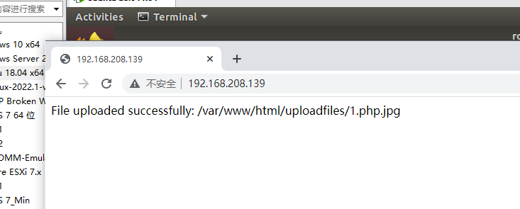

## 使用Vulhub一键搭建漏洞测试靶场

安装`docker`和`docker-compose`后即可开始使用vulhub：

```shell
# If you don't have a docker installed, you'll need to install docker
curl -s https://get.docker.com/ | sh

# Use pip to install docker-compose
pip install docker-compose

# Verify install
pip install docker-compose

# Download Vulhub
git clone https://github.com/vulhub/vulhub.git

# Entry vulnerability directory
cd /[path]/flask/ssti
# 注：此步有坑，应按照漏洞目录进入，具体参考下图

# Compile (optional)
docker-compose build

# Run
docker-compose up -d
```


# 上传

1. 构造 1.php 文件

   ```php
   <?php phpinfo();?>
   ```

2. 先直接上传 1.php  失败


3. 将文件名改为 1.php.jpg，上传成功



4. 构造访问链接 http://192.168.208.139/uploadfiles/1.php.jpg

   成功运行

   


## 常见问题

[imageio requires Python ‘＞=3.5‘ but the running Python is 2.7.13_L'herbe的博客-CSDN博客](https://blog.csdn.net/weixin_44877226/article/details/108400628)

[pip3 install pyqt5出现Command “python setup.py egg_info“ failed with error code 1 in /tmp/pip-build*_ζั͡ޓއއ的博客-CSDN博客](https://blog.csdn.net/qq_44781688/article/details/115025666)
