## 基于表单的暴力破解

### 分析

随便输点东西抓包看看


没什么特殊的防护，直接爆破即可


### 利用

发送到 Intruder


设置两个变量，并适用组合爆破


设置好 Payload 和字典，开始攻击。

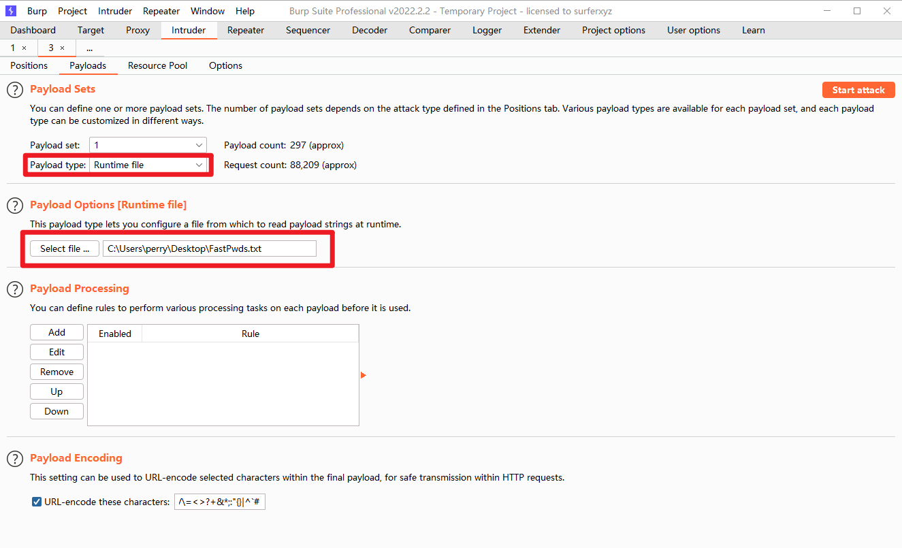


发现两条返回 Length 不一致的 条目，即为账号密码

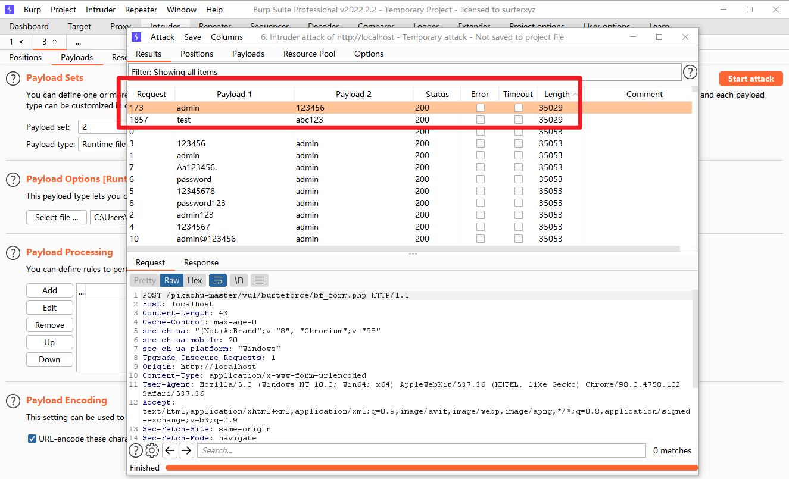


成功登录，查看提示，也确实是有这两个用户存在。

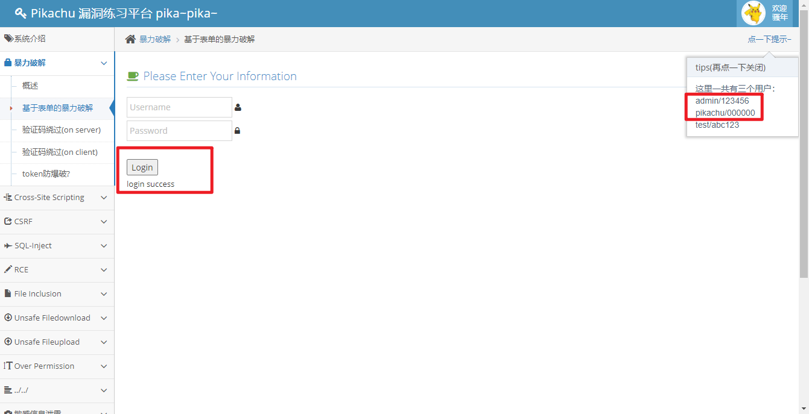


## 验证码绕过(on server)

在以上基础上新增了验证码


### 源代码

```php
if (empty($_POST['vcode'])) {
    $html .= "<p class='notice'>验证码不能为空哦！</p>";
} else {
//              验证验证码是否正确
    if (strtolower($_POST['vcode']) != strtolower($_SESSION['vcode'])) {
        $html .= "<p class='notice'>验证码输入错误哦！</p>";
        //应该在验证完成后,销毁该$_SESSION['vcode']
    }else{

        $username = $_POST['username'];
        $password = $_POST['password'];
        $vcode = $_POST['vcode'];

        $sql = "select * from users where username=? and password=md5(?)";
        $line_pre = $link->prepare($sql);

        $line_pre->bind_param('ss',$username,$password);

        if($line_pre->execute()){
            $line_pre->store_result();
            //虽然前面做了为空判断,但最后,却没有验证验证码!!!
            if($line_pre->num_rows()==1){
                $html.='<p> login success</p>';
            }else{
                $html.= '<p> username or password is not exists～</p>';
            }
        }else{
            $html.= '<p>执行错误:'.$line_pre->errno.'错误信息:'.$line_pre->error.'</p>';
        }
    }
}
```


### 分析

看 Line 7 的提示和上下文，发现验证码在判断完之后不会立刻销毁，看起来是要网页刷新后才会刷新验证码。


另外，比较有意思的一点是，验证码放在浏览器 Cookie 里存着

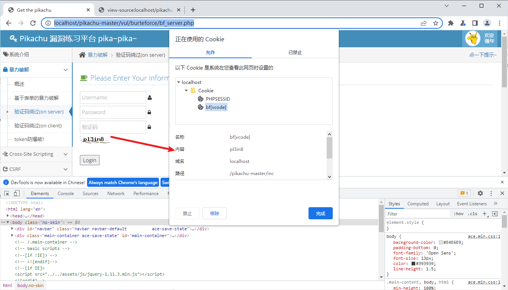


### 利用

使用 BP 的重放攻击，页面不会刷新，一直用同一个验证码即可。


随便输入点东西，提交。

页面刷新后，将刚才的包 Send to Intruder；

Cluster bomb 攻击模式，两个变量，验证码改成页面当前显示的验证码。

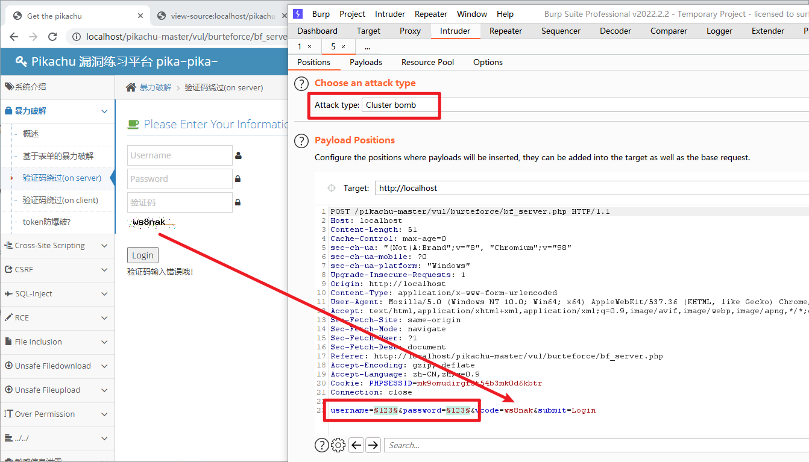


Payload设置跟上面一样，开始攻击。


搞定

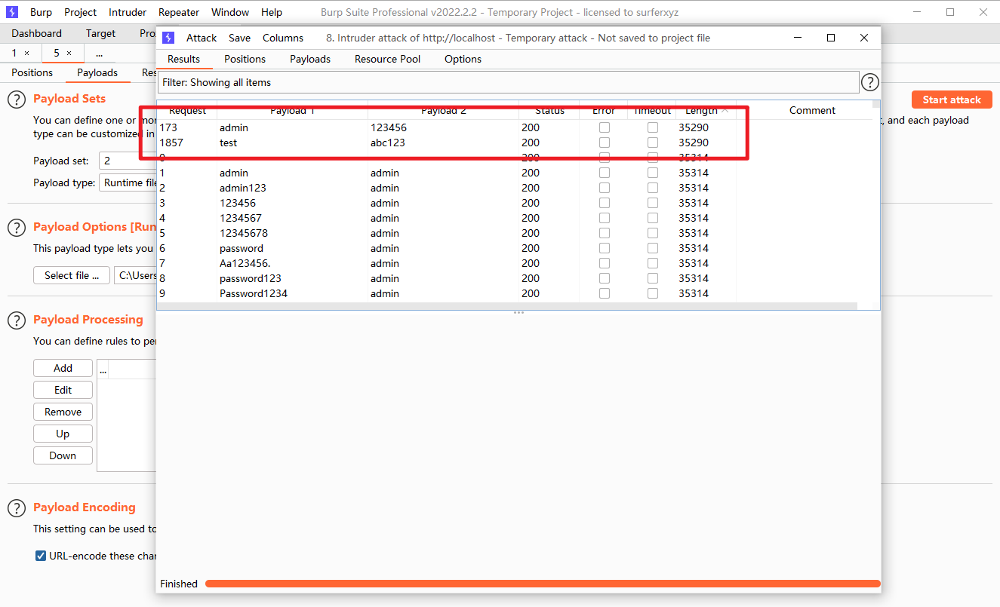


## 验证码绕过(on client)

### 分析

随便输点东西，Login，发现他直接没网络请求，直接提示验证码错误


那就把验证码输对提交试试，有包了


稍加思考，就可以想到大致登录步骤：本地验证验证码是否正确，正确才会把用户名和密码发到后端验证。

那有没有一种可能，后端不会验证验证码，所以直接发包验证码乱填，就能爆破出来？


### 利用

把刚才的包发到 Intruder，一样的攻击类型，一样的变量，一样的字典

> 与前面不同的是，验证码是在前端判断的，理论上后端应该也是不会再次验证的，所以他在这里发到后端毫无意义。

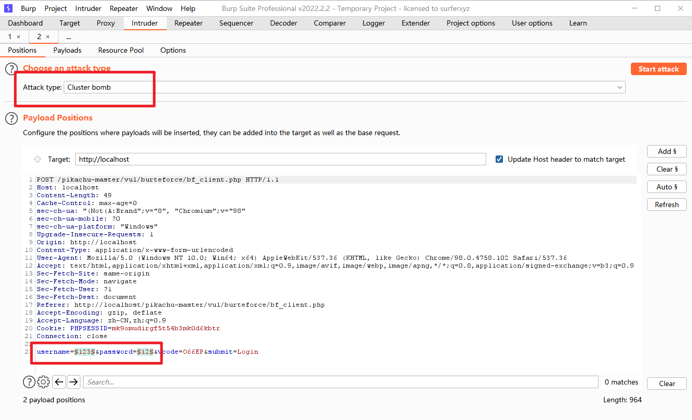


当然，Payload 设置都一样。


开始攻击，搞定。


## token防爆破?

### 分析

粗略看了一下，感觉和 DVWA 的一个道理，每次提交 token 都会发生改变


### 利用

攻击类型 Pitchfork ，两个变量

> 当然，可以把 username 也加上。

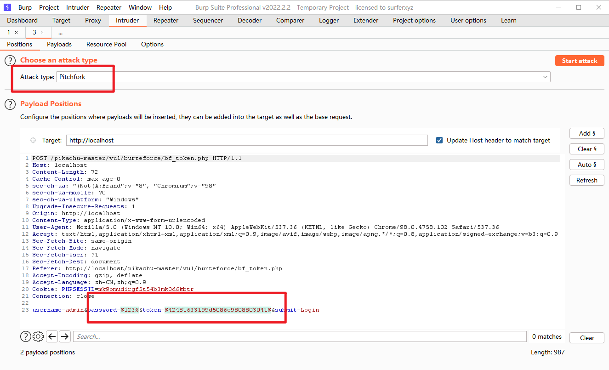


变量1配置：

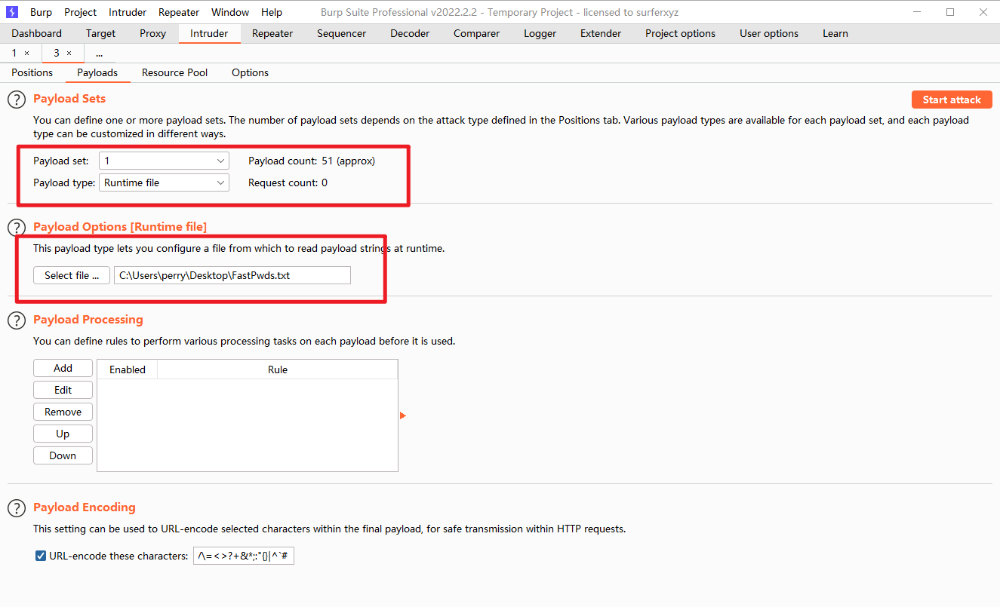


变量2配置递归查询：

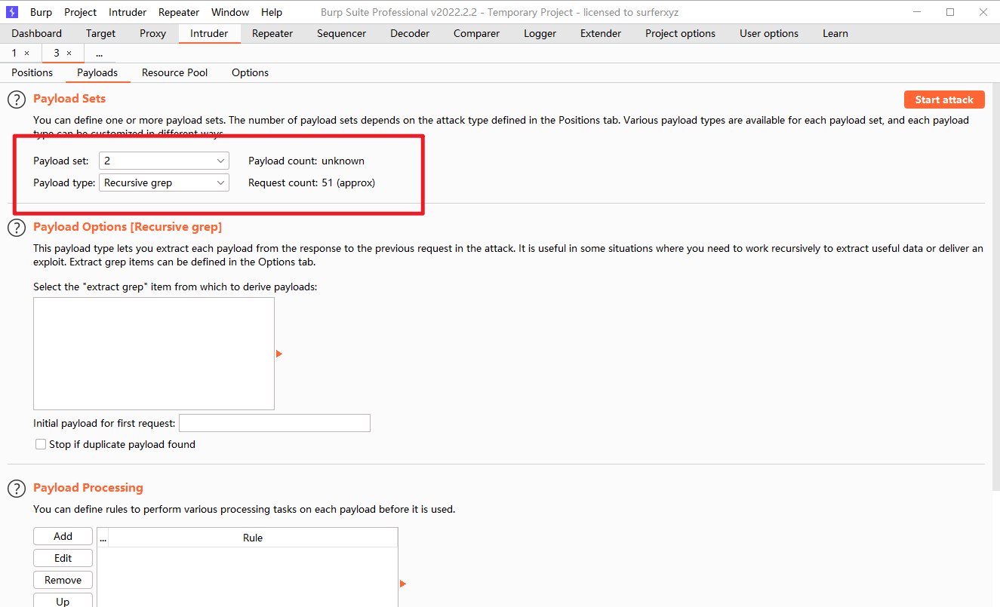


设置最高线程为 1


开始攻击，找返回 Length 不同的条目，其中一个就是密码

> 如果上面设置变量还有 username 的话 就多一个 Payload。
>
> 这里为了节省时间就不加了


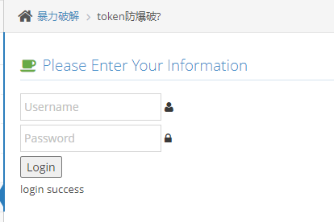


## 参考资料

[Attack types - PortSwigger](https://portswigger.net/burp/documentation/desktop/tools/intruder/attack-types)

