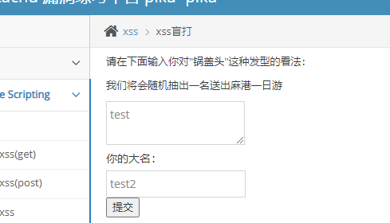
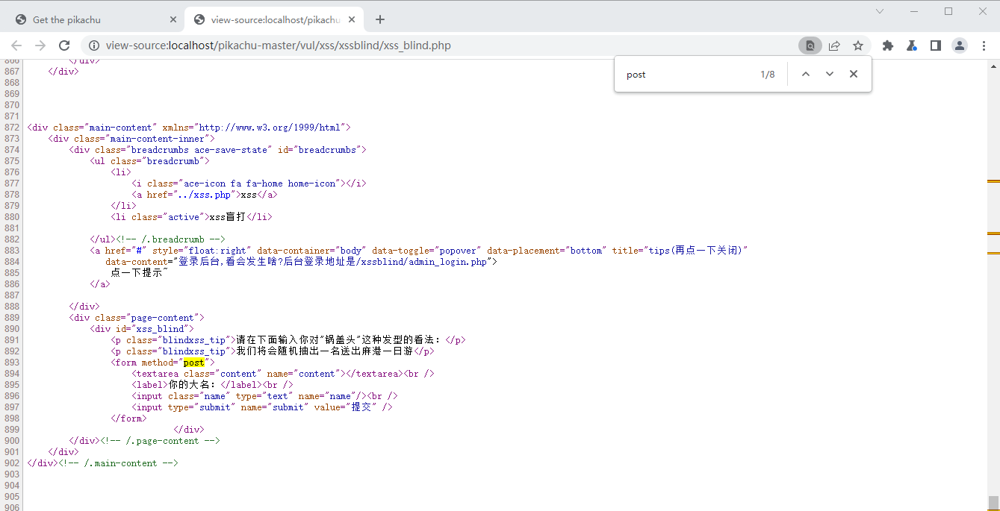
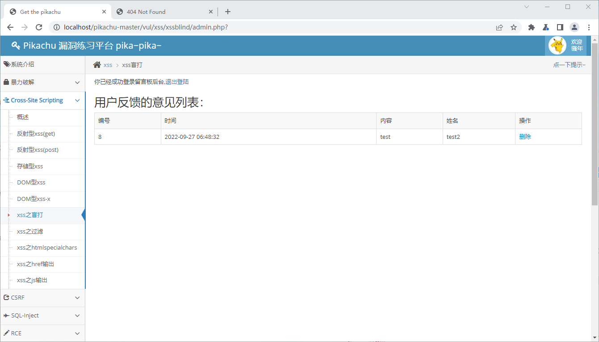
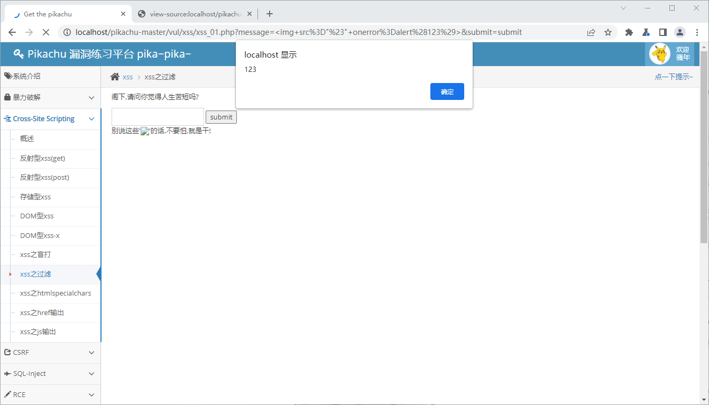
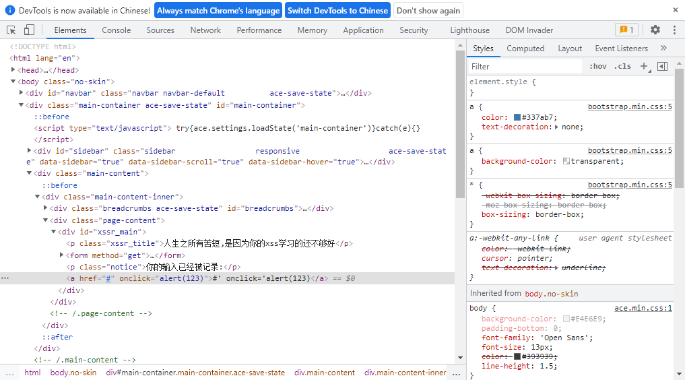
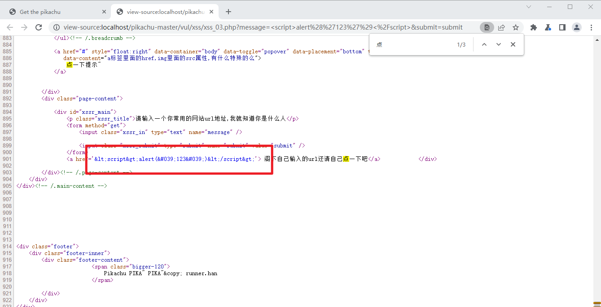
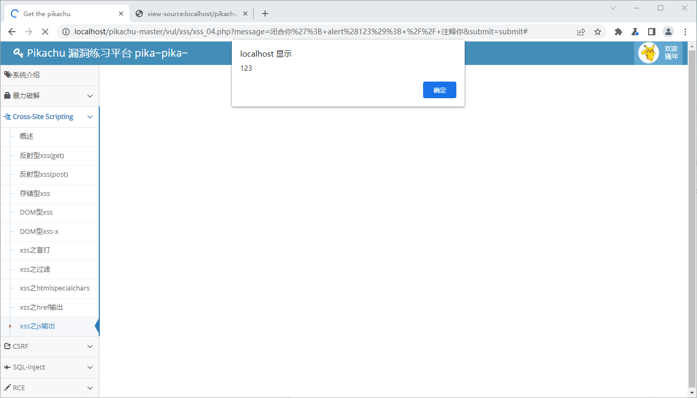

# XSS

## 反射型xss(get)

### 分析

先随便输入试试 `<script>alert("123")</script>`

发现输不完，前端限制了输入长度


### 利用

maxlength 改大点即可


当然，也可以直接改URL，Messenger字段改成 `<script>alert("123")</script>` 即可（如上图）


## 反射性xss(post)

### 分析

开始还以为漏洞就在登录框里，看了下提示，好吧原来是要先登录进去


### 利用

根据提示，要求 XSS 获取 Cookie，那就： `<script>alert( "Cookie:\n" + document.cookie)</script>`


## 存储型xss

### 分析

一样的道理，不过存储型 XSS 的危害相对更大，每次页面加载或刷新都会被执行，且其他用户访问也会。


### 利用

 `<script>alert( "Cookie:\n" + document.cookie)</script>`


## DOM型xss

### 分析

先弹个123试试 `<script>alert("123")</script>`，不行：


查看源代码，发现a标签拼接。


### 利用

把a标签闭合掉即可，同时可以利用 img 标签进行XSS 

```html
' onclick="alert('123')">
```

```
// a href='"+str+"'
// a href='' onclick="alert('123')">'
```

提交后点击 what do you see，成功alert


## DOM型xss-x

### 利用

与上面同理

```html
' onclick="alert('123')">
```


## xss盲打

### 分析


先随便提交点东西，发现没什么变化




看一下源代码，发现提交方式是post




按照提示登陆后台


发现刚才提交的数据




### 利用

回去试一下 `<script>alert("123")</script>`


然后登陆后台


两个 XSS 都正常执行


## xss之过滤

### 分析

先随便提交点数据看看


猜测一下会被过滤的内容：" < > ' on / ` () script img src href 


直接整段提交：


感觉可以用 img οnerrοr


### 利用

构造Payload：

```html

```




## xss之htmlspecialchars

### 分析

htmlspecialchars() 函数把一些预定义的字符转换为HTML 实体。

```
被转换的预定义的字符有：
&：转换为&amp;
"：转换为&quot;
'：转换为成为 '
<：转换为&lt;
>：转换为&gt;
```

单引号没有被转换


### 利用

```
#' onclick='alert(123)
```




## xss之href输出

### 分析

随便输个alert，点也不生效


看一下源码，都被HTML编码了




看一下提示，查一下a标签的href属性：

> ## [定义和用法](https://www.w3school.com.cn/tags/att_a_href.asp)
>
> \<a\> 标签的 href 属性用于指定超链接目标的 URL。
>
> href 属性的值可以是任何有效文档的相对或绝对 URL，包括片段标识符和 JavaScript 代码段。如果用户选择了 \<a\> 标签中的内容，那么浏览器会尝试检索并显示 href 属性指定的 URL 所表示的文档，或者执行 JavaScript 表达式、方法和函数的列表


注意最后一句 “或者执行JS表达式......”


### 利用

```js
javascript:alert("123")
```


## xss之js输出

### 分析

先试试上面的 `javascript:alert("123")`，无效，看源代码，被包进变量里了


可以直接闭合掉来利用


### 利用

```js
闭合你'; alert(123); // 注释你
```

组合后就只剩下中间的 alert 了：

```js
$ms='闭合你'; alert(123); // 注释你';
```




