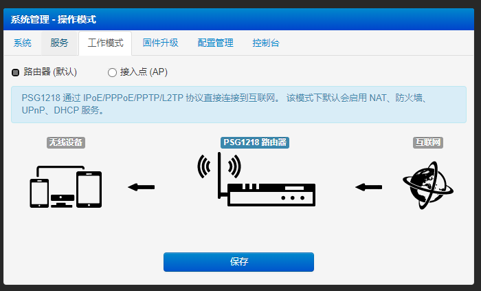
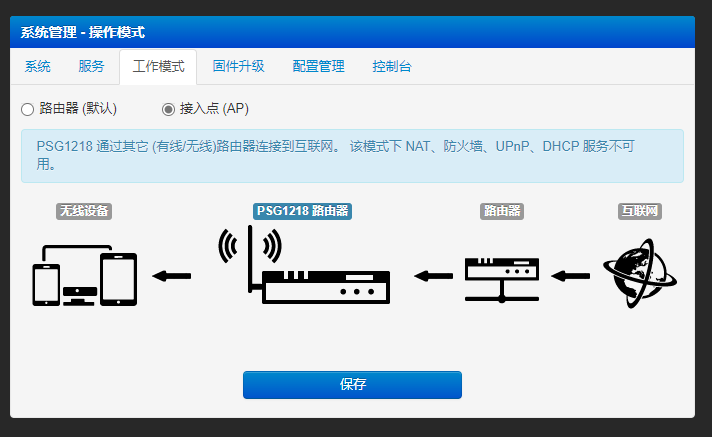
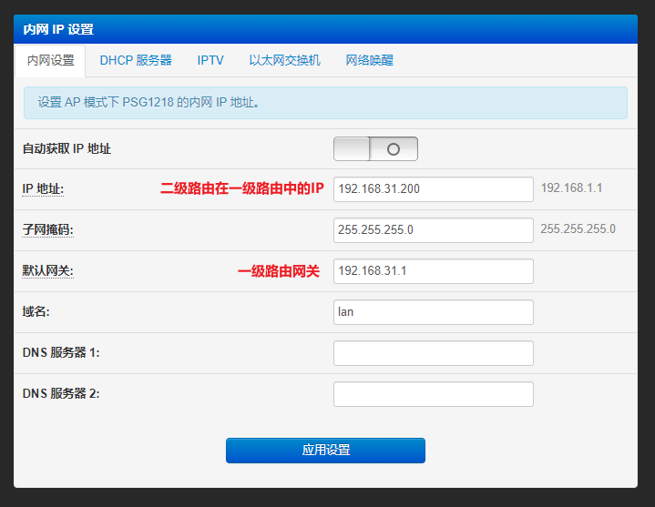
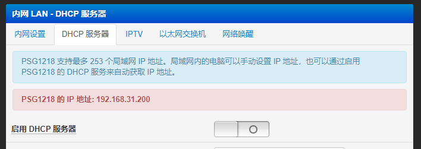
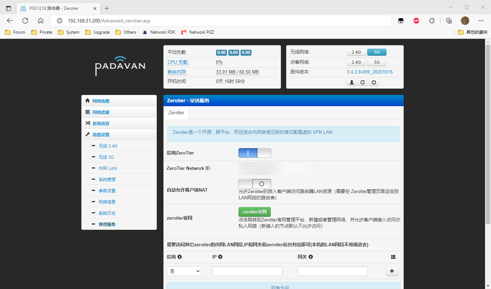
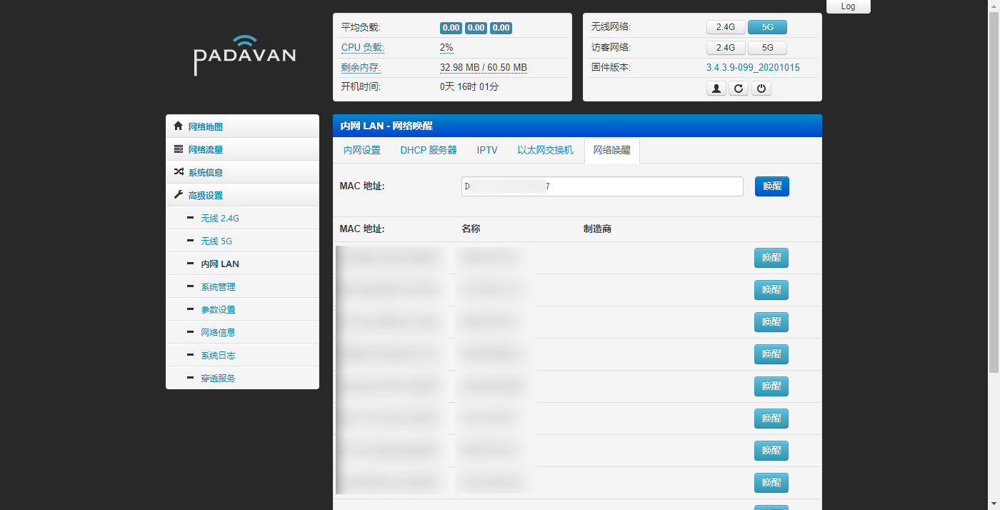
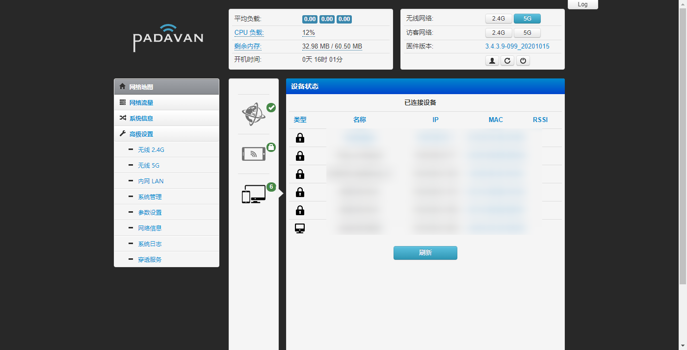
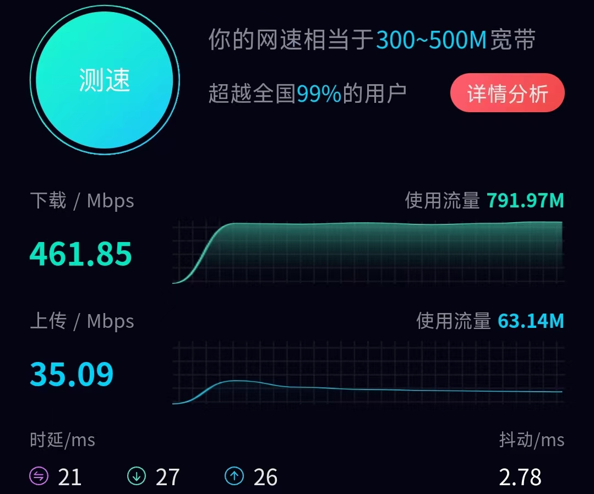
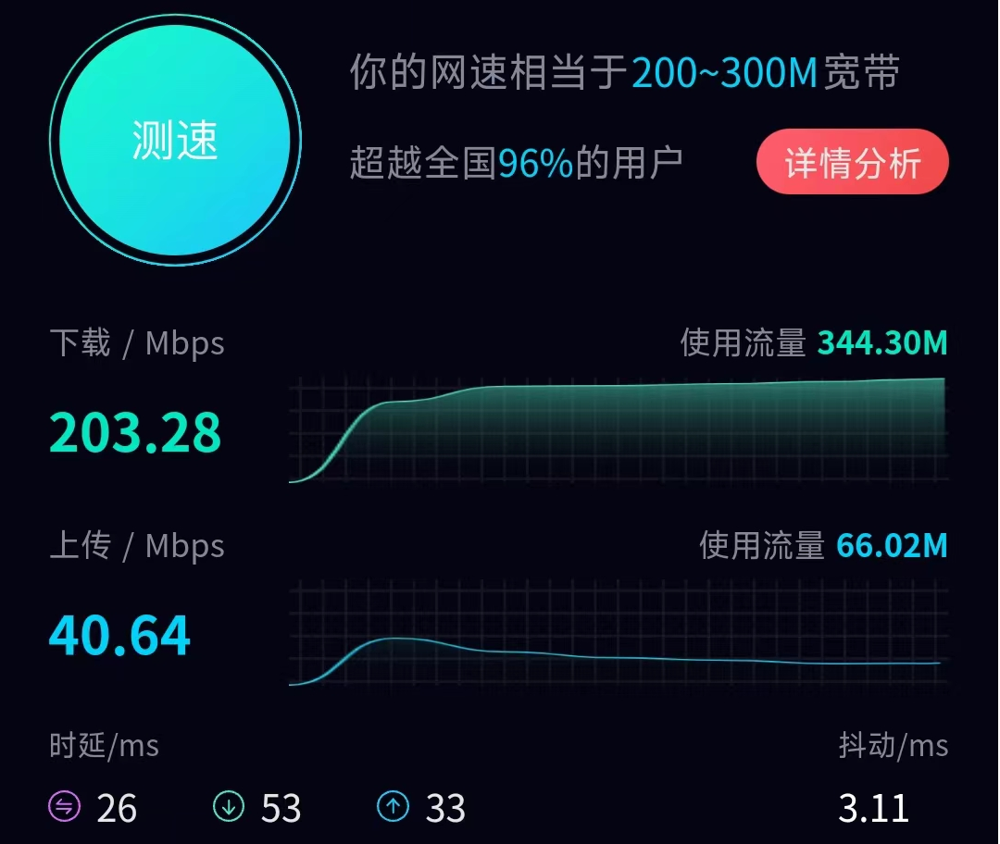
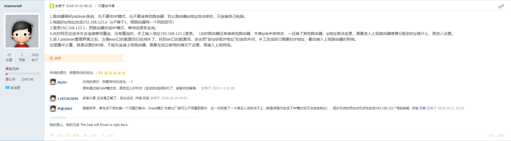

# Padavan配置无线桥接

## 需求分析

家里两个路由，一个光猫。

需要两个路由放出 SSID 不一样的 WiFi，并要求所有WiFi接入设备在同一网段下。

二级路由需要无线桥接。且系统必须为 OpenWrt 或 Padavan，并需要内网穿透和WOL 。

## 方案设计

最简单的方案肯定是组Mesh。。。但是我只有两个方便用的路由，不方便组Mesh。

一级路由：Redmi AX6（小米原厂固件）

二级路由：PhiComm K2（Padavan固件）

考虑到WiFi6路由温度普遍较高，且光猫无论是否改桥接都是一样的速度（300Mbps宽带，跑满460Mbps），故使用光猫拨号~~分摊一下AX6的热量~~，一级路由自动获取IP。二级路由无线桥接。

## 方案选择

二级路由无线桥接有两套方案，一套是网上能搜到的，能执行的，工作模式为“路由器”的，但这套方案不完美。

另一套方案则是AP模式，个人比较倾向用这个模式。

## 常见问题

按照以往习惯，一般都是在无线配置中配置好桥接，然后再到工作模式中直接改AP模式，但这样做会产生一个很严重的问题：改AP模式之后二级路由的管理页面就再也进不去了。

> 你以为去主路由看看副路由的IP，然后访问就能过去？想多了！！有些是不行的！！
>
> 后来去Google，Bing，Baidu 上搜了一下，结果基本全是这样说的，一堆废物。。。
>
> 然后去恩山上也翻了几个帖子，还是这样说的，也是一堆废话。。。

## 可行方案

查了下资料，也研究了下，正确的方案感觉应该是先配置好二级路由的其他部分，最后再到无线设置里配置桥接。

不然二级路由的管理页面的 IP 在部分 ROM 中可能不会更新，导致二级路由的管理页面无法再次访问。

1. 重置二级路由，进后台，内网IP设置中关掉自动获取，并手动配置

2. 把电脑IP静态配置成和二级同一网段，重新进入二级路由后台，关DHCP

   ~~（好像改AP模式会自动关来着，我忘了是自动的还是手动的了，反正保险起见就手动关了吧）~~

3. 最后再配置无线桥接

   

4. 重启，等待二级路由桥接上一级路由，然后输入第一步中配置的IP地址，即可访问二级路由的管理页面，同时 穿透服务和WOL服务也一切正常

   

   同时，WOL页面也可见连接一级路由的设备，网络地图中也可见。

   

   

## 细节补充

- Redmi AX6："千兆路由，千兆网口"，

  - “运营商给你分配的宽带都是达不到的”，早已是过时的说法。。。~~（部分偏远地区可能除外）~~
  - 300Mbps的宽带在大多数情况下都能跑到超过300Mbps，如果超不过，大部分问题都在自己的设备身上（网站服务器限速/满载除外）。

  

- PhiComm K2：**“千兆路由，百兆网口”**

  - 如果用有线桥接，K2下的设备上天只能到 100Mbps

    

  - 但如果用5GHz无线桥接，K2下的设备网速就不一样了

    
  
    

 

最后。。。把恩山的帖子翻多了几条，翻多了几页，发现有个思路基本一样的：

