## VCSA 快速入门指引

### 下载安装

以 VCSA 7 为例：

下载链接: https://pan.baidu.com/s/1OvKfB0YHb1mJmy18PZfPYg?pwd=fuxq

安装好两个 ESXi + 一个 WinServer，打开 vCenter Server Installer

> 本例网络规划：
>
> ESXi：192.168.123.201 ~ 202   ESXi0123
>
> VCSA：192.168.123.200   vSphere.0123

按指引安装

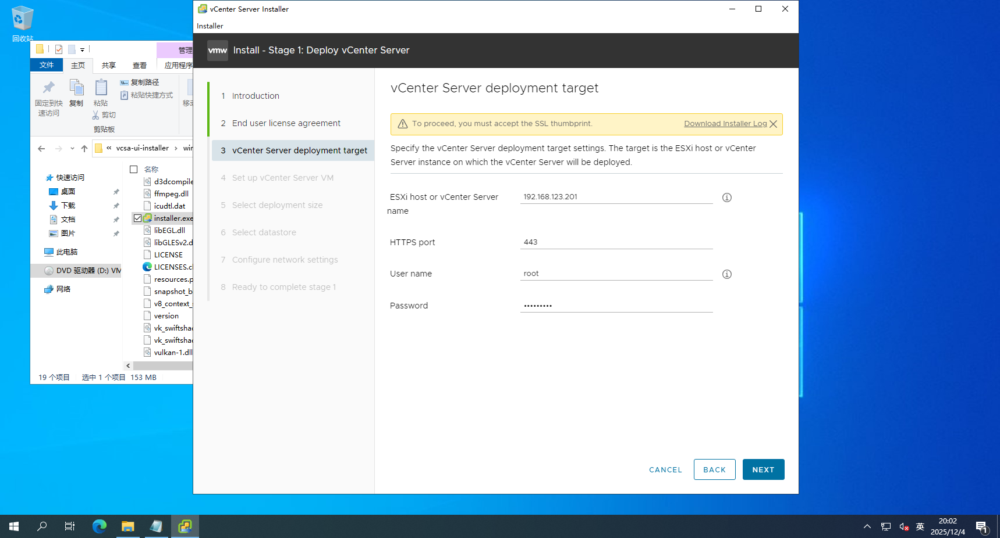

根据实际情况选择

装好后第二步，有域的话可以加域，没有就随便创一个专用域

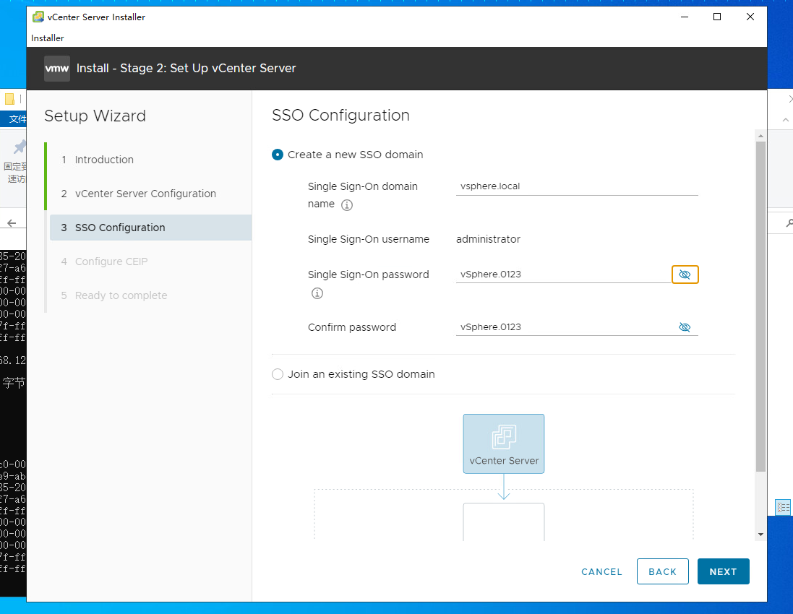

装好之后，在所属的 ESXi ，能查看到 VCSA 的机器，打开可以看到刚才安装过程配置的 IP

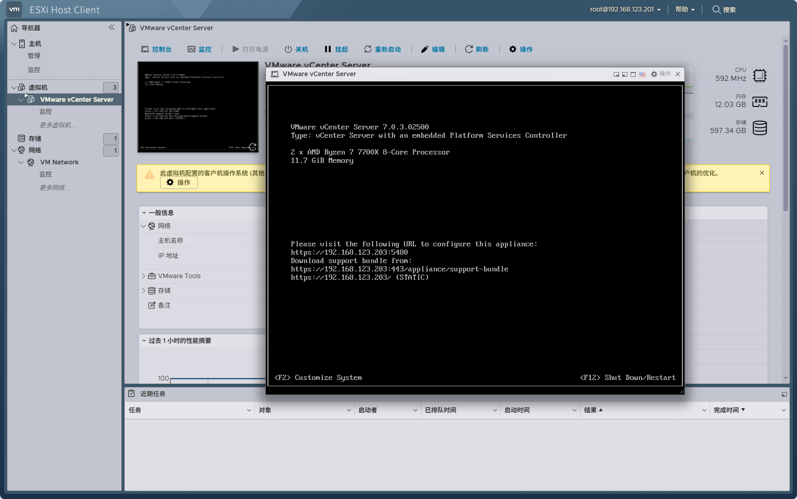

### VCSA Web 入门

装好之后就能用设置的 IP 访问 VCSA Web 了，

进来先新建数据中心

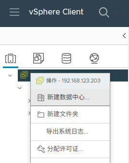

然后再建集群

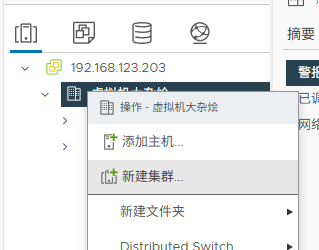

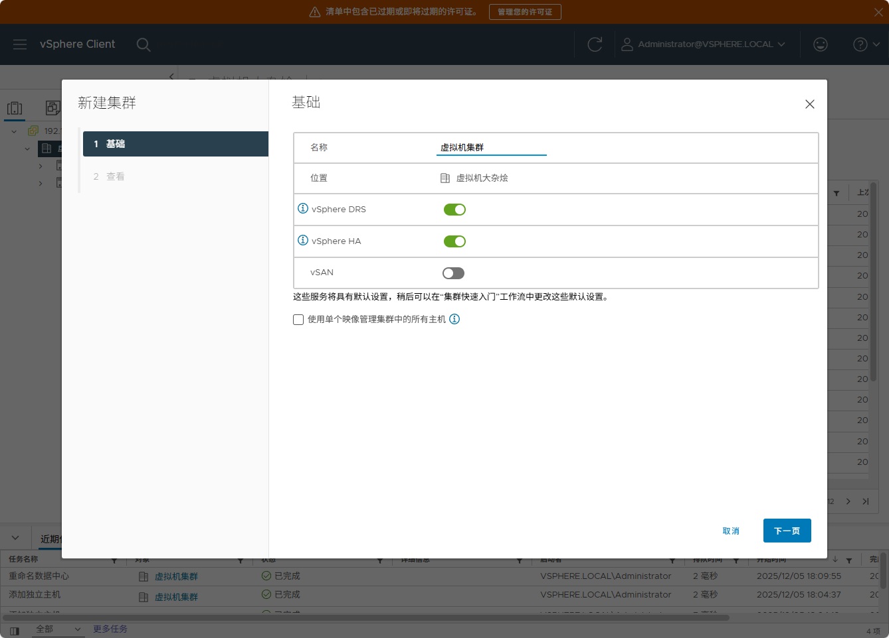

> **DRS (Distributed Resource Scheduler)**   vSphere 的分布式资源调度功能。
>
> - 它会根据集群中各主机的负载情况，自动把虚拟机在不同主机之间迁移（vMotion），以实现负载均衡和资源优化。
>
> **HA (High Availability)**   高可用功能。
>
> - 当某个主机发生故障时，HA 会在集群中其他可用主机上自动重启受影响的虚拟机，从而减少停机时间，保证业务连续性。
>
> 一句话总结：**DRS 负责智能调度和负载均衡，HA 负责故障恢复和业务连续性。**

集群中添加主机

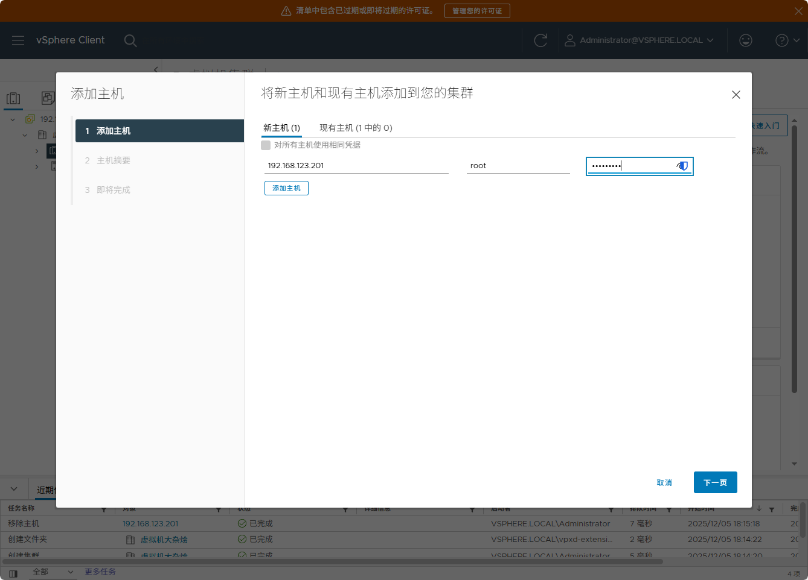

如果从外面将宿主机移进去，会弹窗提醒

> 这个弹窗其实是 **把一台独立主机（192.168.123.201）加入到 vSphere 集群时的选择提示**。因为主机上可能已经存在虚拟机和资源池，系统需要你决定这些对象在集群中的归属方式。
>
> **📌 弹窗内容解释**
>
> **“将此主机的所有虚拟机置于集群的根目录资源池中”**   → 把主机上的所有虚拟机直接放到集群的默认资源池里。这样做会删除主机原有的资源池层次结构，只保留虚拟机。
>
> **“为此主机的虚拟机和资源池创建一个新资源池”**   → 在集群里自动生成一个新的资源池（名字默认是“移植自 192.168.123.201”），把主机原有的虚拟机和资源池层次结构完整保留下来。这样不会丢失原有的资源池划分。
>
> **“取消 / 确定”**   → 取消就是不继续迁入，确定就是按你选择的方式把主机加入集群。
>
> 
>
> **✅ 总结**
>
> 这个弹窗的意思是：**当你把主机加入集群时，系统需要你决定主机上的虚拟机和资源池是直接并入集群的根资源池，还是保留原有层次结构并新建一个对应的资源池。**

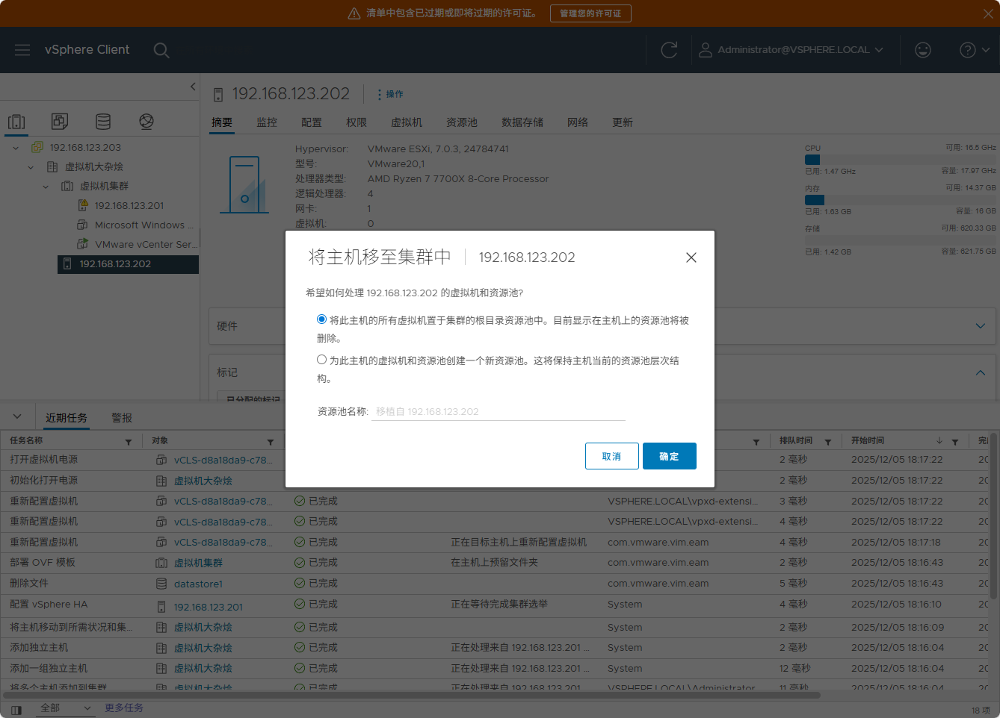

进来之后，顺手把存储池命名标记一下

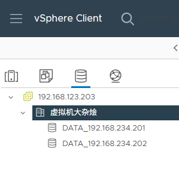

“能用” 的 VCSA 就安装完成了。

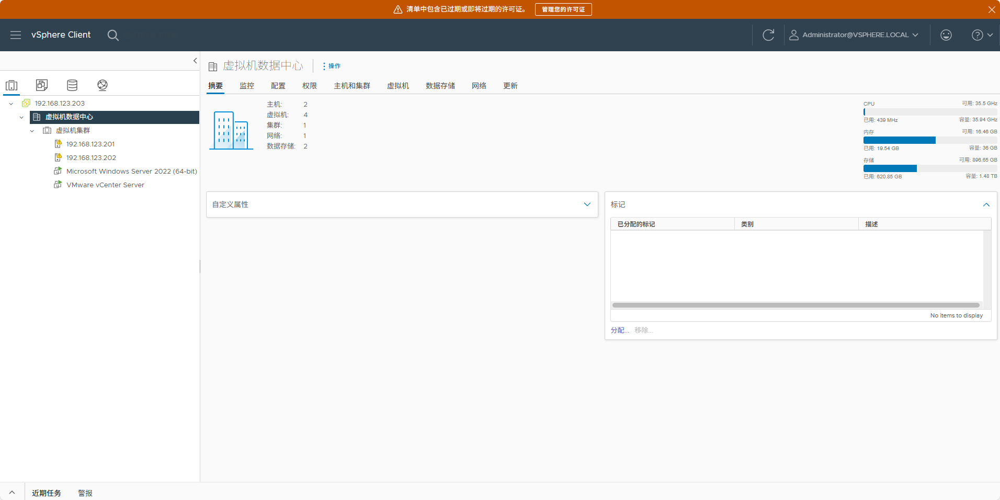

可以看到，自动创建了少量 vCLS 虚拟机。

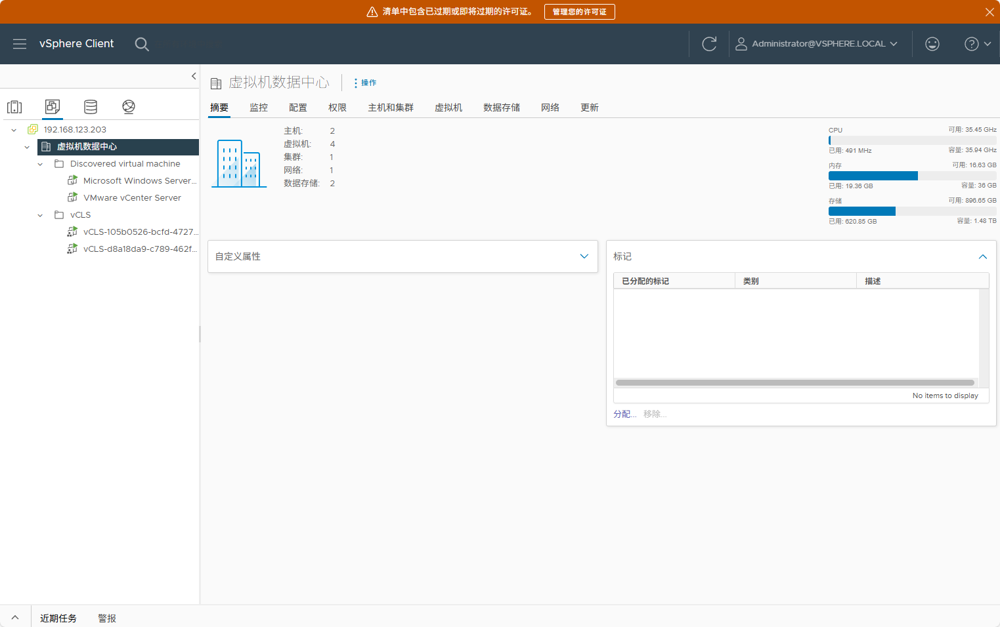

