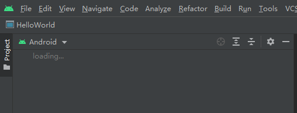
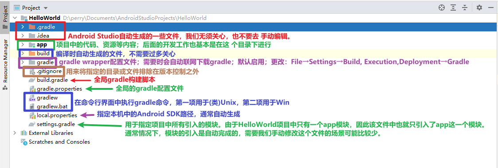
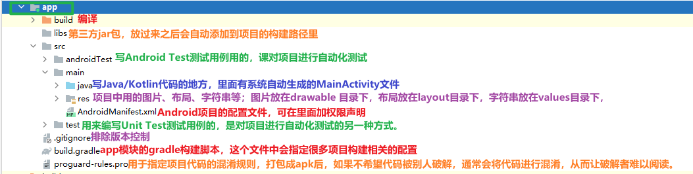
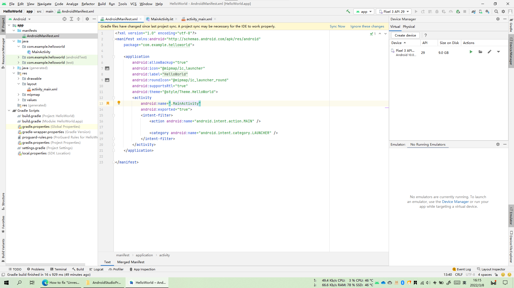
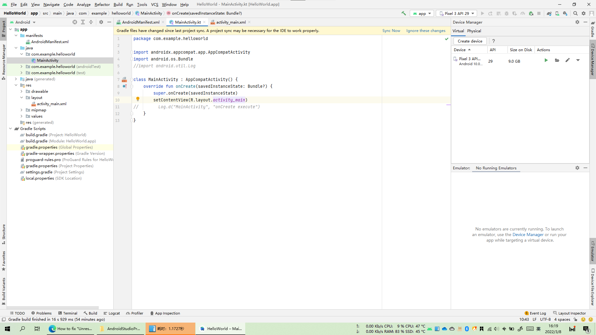
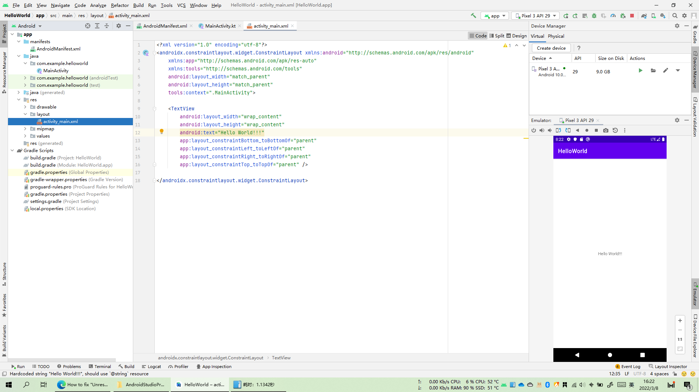
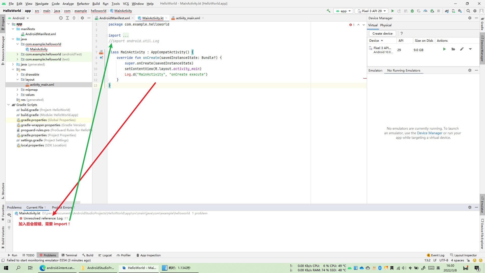
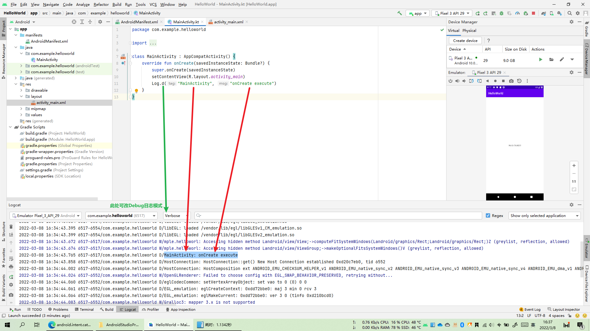

## Android系统架构

## Android系统特点

- 四大组件
  - 活动（Activity）：门面，应用中能看到的东西都放这
  - 服务（Service）：无法看到，后台默默运行
  - 广播接收器（Broadcast Receiver）：允许应用接收来自各处的广播消息（如电话、短信），向发出广播消息
  - 内容提供器（Content Provider）：应用程序之间共享数据（如读取系统电话簿中联系人），需通过其实现

- 丰富的系统控件
  - 系统自带丰富控件，也可自定义控件

- SQLite数据库
  - 自带这种轻量级、运算速度极快的嵌入式关系型数据库，支持标准
  - SQL语法，还可通过封装好的API进行操作
- 强大的多媒体
  - 音乐、视频、录音、拍照、闹铃等，都可通过代码控制
- 传感器
  - 如加速度、方向、重力传感器等
  - 地理位置定位
    - 手机都内置有GPS,结合功能强大的地图功能，潜力无限

## Android开发环境

- 装JDK
- 装Android Studio
  - 自定义安装记得选上Android SDK

## 创建第一个Android项目

- 创建空项目

- 项目配置

- 切换到Android标签，等待初始化

  

### 目录结构

### 模拟器配置

- 锤子按钮：编译
- 播放按钮：运行
- Device Manager：模拟器管理

### HelloWorld详解

- app --> manifests --> AndroidManifest.xml

  

  - Activity(当前前台活跃) 内高亮处 `MainActivity` 可 Ctrl + 鼠标 定位
    - android.intent.action.MAIN决定应用程序最先启动的Activity ，
    - android.intent.category.LAUNCHER决定应用程序是否显示在程序列表里。 
    - Main和LAUNCHER同时设定才有意义，

- app --> java --> com.example.helloworld --> MainActivity

  

  - `activity_main` 可 Ctrl + 鼠标定位

- app --> res --> activity_main.xml

  

- 可见，HelloWorld已成功跑起来，中间文字也在源代码中定位。

### 日志工具Log

- Android中的日志工具类是Log（android.util.Log），这个类中提供了如下5个方法来供我们打印日志。
  - **Log.v()**。用于打印那些最为琐碎的、意义最小的日志信息。对应级别verbose，是 Android日志里面级别最低的一种。 
  - **Log.d()**。用于打印一些调试信息，这些信息对你调试程序和分析问题应该是有帮助的。 对应级别debug，比verbose高一级。
  - **Log.i()**。用于打印一些比较重要的数据，这些数据应该是你非常想看到的、可以帮你分 析用户行为的数据。对应级别info，比debug高一级。
  - **Log.w()**。用于打印一些警告信息，提示程序在这个地方可能会有潜在的风险，最好去修 复一下这些出现警告的地方。对应级别warn，比info高一级。 
  - **Log.e()**。用于打印程序中的错误信息，比如程序进入了catch语句中。当有错误信息打 印出来的时候，一般代表你的程序出现严重问题了，必须尽快修复。对应级别error，比warn高一级。

- 测试：

  

  

- 过滤器使用：
  - 略
- 为什么使用Log而不使用println() ？
  - 我相信很多的Java新手会非常喜欢使用System.out.println()方法来打印日志，在Kotlin 中与之对应的是println()方法，不知道你是不是也喜欢这么做。不过在真正的项目开发中， 是极度不建议使用System.out.println()或println()方法的，如果你在公司的项目中经 常使用这两个方法来打印日志的话，就很有可能要挨骂了。
  - 为什么System.out.println()和println()方法会这么不受待见呢？经过我仔细分析之 后，发现这两个方法除了使用方便一点之外，其他就一无是处了。方便在哪儿呢？在Android Studio中你只需要输入“sout”，然后按下代码提示键，方法就会自动出来了，相信这也是很多 Java新手对它钟情的原因。那缺点又在哪儿了呢？这个就太多了，比如日志开关不可控制、不 能添加日志标签、日志没有级别区分……
  - 听我说了这些，你可能已经不太想用System.out.println()和println()方法了，那么Log就把上面所说的缺点全部改好了吗？虽然谈不上全部，但我觉得Log已经做得相当不错了。
