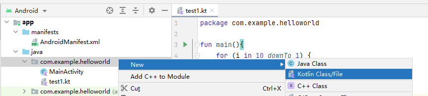
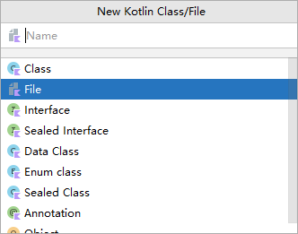
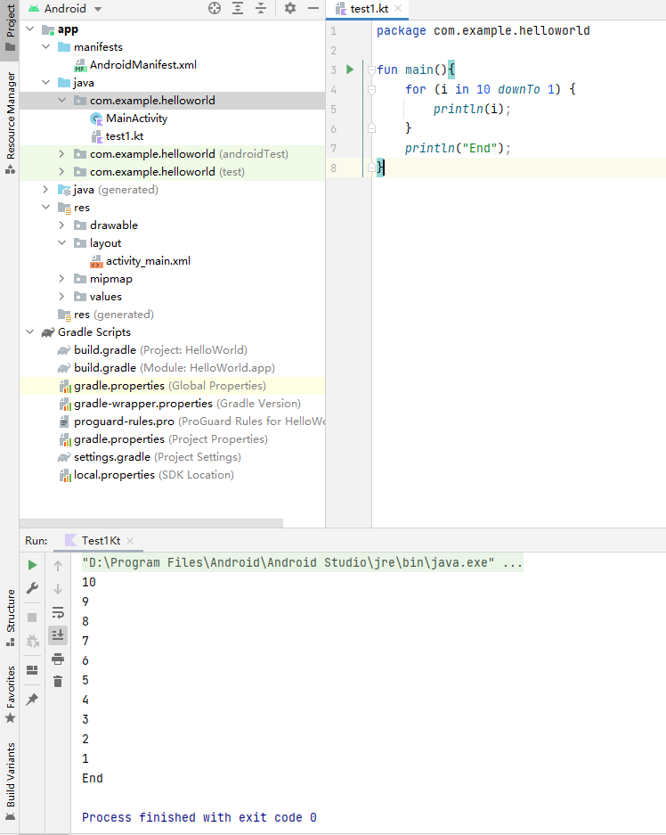
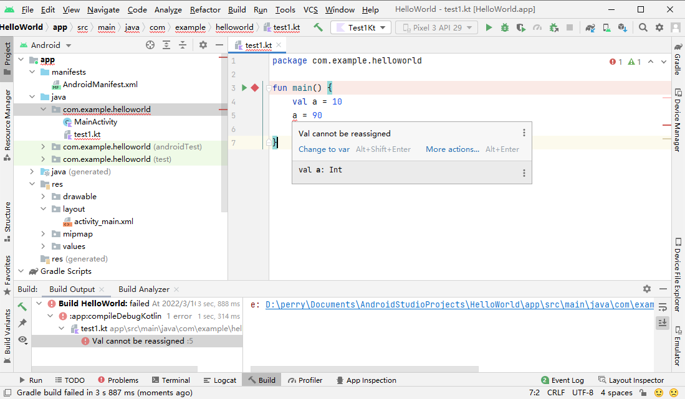
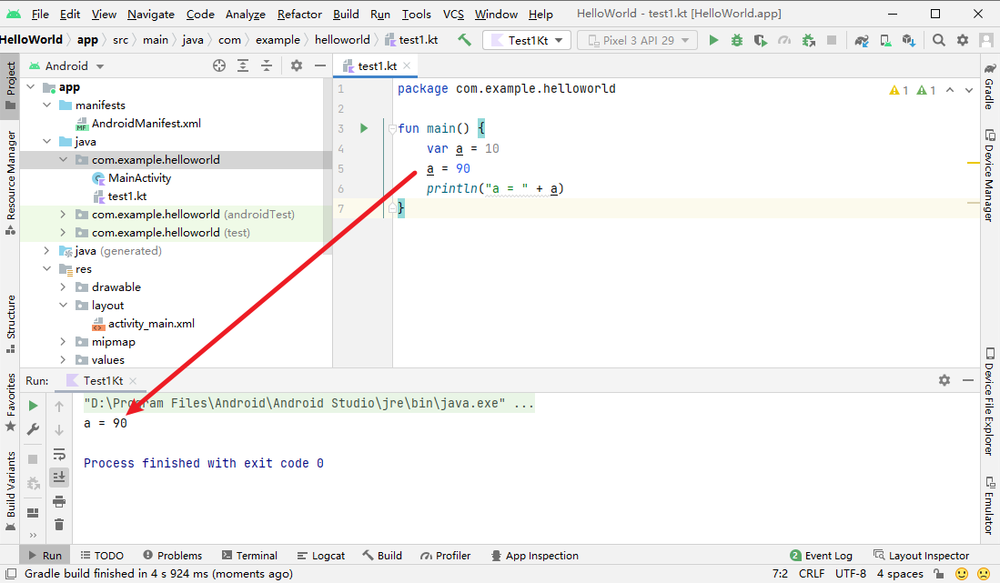

## 2.2 如何运行Kotlin代码

- 新建文件





- 点击fun main() 左侧的播放按钮，可进行运行测试
  - 注：末尾可不打分号



## 2.3 变量与函数

### 2.3.1 变量

- val（value的简写）用来声明一个不可变的变量，这种变量在初始赋值之后就再也不能重新赋值，对应Java中的final变量。

  

  - val关键字用来声明一个不可变的变量，而 var关键字用来声明一个可变的变量，所以这里只需要把val改成var即可

- var（variable的简写）用来声明一个可变的变量，这种变量在初始赋值之后仍然可以再被重新赋值，对应Java中的非final变量。

  

#### 数据类型

- Kotlin的类型推导机制并不总是可以正常工作的，比如说如果我们对一个变量延迟赋值的 话，Kotlin就无法自动推导它的类型了。这时候就需要显式地声明变量类型才行

  

### 2.3.2 函数

- 注：建议代码补全功能：Android Studio不仅会帮我们补全代码，还会帮我们自动导包。

```kotlin
fun methodName(param1: Int, param2: Int): Int { 
	return 0
}
```

- 首先fun（function的简写）是定义函数的关键字，无论你 定义什么函数，都一定要使用fun来声明。
- 紧跟在fun后面的是函数名
- 函数名后面紧跟着一对括号，里面可以声明该函数接收什么参数，参数的数量可以是任意多个，例如上述示例就表示该函数接收两个Int类型的参数。
  - 参数的声明格式是“参数名:参数类型”，其中参数名也是可以随便定义的，这一点和函数名类似。如果不想接收任何参数，那么写一对空括号就可以了。
- 参数括号后面的那部分是可选的，用于声明该函数会返回什么类型的数据，上述示例就表示该 函数会返回一个Int类型的数据。
  - 如果你的函数不需要返回任何数据，这部分可以直接不写。
- 最后两个大括号之间的内容就是函数体了，我们可以在这里编写一个函数的具体逻辑。
  - 由于上述示例中声明了该函数会返回一个Int类型的数据，因此在函数体中我们简单地返回了一个0。

#### 简写

- 使用这种语法，return关键字也可以省略了，等号足以表达返回值的意思。

```kotlin
fun largerNumber(num1: Int, num2: Int): Int = max(num1, num2)
```

- Kotlin可 以推导出largerNumber()函数返回的必然也是一个Int值，这样就不用再显式地声明返回值类型了

```kotlin
fun largerNumber(num1: Int, num2: Int) = max(num1, num2)
```

## 2.4 程序的逻辑控制

### 2.4.1 if条件语句

- Kotlin中的条件语句主要有两种实现方式：**if** 和 **when** 。

```kotlin
fun largerNumber(num1: Int, num2: Int): Int { 
	var value = 0 if (num1 > num2) { 
		value = num1
	} 
	else { 
		value = num2 
	} 
	return value
}
```

- Kotlin中的if语句相比于Java有一个额外的功能，它是可以有返回值的，返回值就是 if语句 每一个条件中最后一行代码的返回值。因此，上述代码就可以简化成如下形式：

```kotlin
fun largerNumber(num1: Int, num2: Int): Int { 
	val value = if (num1 > num2) { 
		num1
	} 
	else { 
		num2
	} 
	return value
}
// if语句 使用每个条件的最后一行代码作为返回值，并将返回值赋值给了 value变量 。由于现在没有重新赋值的情况了，因此可以使用 val关键字 来声明value变量，最终将 value变量 返回。
```

```kotlin
// 甚至 value 都是多余的
fun largerNumber(num1: Int, num2: Int): Int { 
    return if (num1 > num2) { 
        num1
	} 
    else {
        num2
	}
}
```

```kotlin
// 当一个函数只有一行代码时，可以省略函数体部分，直接将这一行代码使用等号串连在函数定义的尾部
fun largerNumber(num1: Int, num2: Int) = if (num1 > num2) { 
    num1
} 
else { 
    num2
}

```

```kotlin
// 甚至还能继续压缩成一行
fun largerNumber(num1: Int, num2: Int) = if (num1 > num2) num1 else num2
```


### 2.4.2 when条件语句

#### 语法

when语句允许传入一个任意类型的参数，然后可以在when的结构体中定义一系列的条件，格式是： `匹配值 -> { 执行逻辑 }` ，当你的执行逻辑只有一行代码时，`{ }` 可以省略

#### 基本用法

**实现一个成绩查询功能**

- If 语句写法

  ```kotlin
  fun getScore(name: String) = if (name == "Tom") {
      86
  } else if (name == "Jim") {
      77
  } else if (name == "Jack") {
      95
  } else if (name == "Lily") {
      100
  } else {
      0
  }
  ```

- When 语句写法

  ```kotlin
  fun getScore(name: String) = when (name) {
      "Jom" -> 86
      "Jim" -> 77
      "Jack" -> 95
      "lily" -> 100
      else -> 0
  }
  ```


**除了精确匹配之外，when语句还允许进行类型匹配。**

```kotlin
fun checkNumber (num: Number) {
    when (num) {
        is Int -> println("number is Int")
        is Double -> println("number is Double")
        else -> println("number not support")
    }
}
```

is关键字就是类型匹配的核心，它相当于Java中的instanceof关键字。由于 checkNumber()函数接收一个Number类型的参数，这是Kotlin内置的一个抽象类，像Int、Long、Float、Double等与数字相关的类都是它的子类，所以这里就可以使用类型匹配来判断传入的参数到底属于什么类型，如果是Int型或Double型，就将该类型打印出来，否则就打印不支持该参数的类型。

测试：

```kotlin
fun main(){
    checkNumber(3)
}

// 输出为：number is Int
```

```kotlin
fun main() { 
	val num = 10L 
	checkNumber(num)
}

// 输出为： number not support
```


**when语句还有一种不带参数的用法，虽然这种用法可能 不太常用，但有的时候却能发挥很强的扩展性。**

刚才的getScore()函数举例，如果我们不在when语句中传入参数的话，还可以这么写：

```kotlin
fun getScore(name: String) = when () {
    name == "Jom" -> 86
    name == "Jim" -> 77
    name == "Jack" -> 95
    name == "lily" -> 100
    else -> 0
}
```

这种用法是将判断的表达式完整地写在when的结构体当中。注意，Kotlin中判断字 符串或对象是否相等可以直接使用==关键字，而不用像Java那样调用equals()方法。可能你会觉得这种无参数的when语句写起来比较冗余，但有些场景必须使用这种写法才能实现。

举个例子，假设所有名字以Tom开头的人，他的分数都是86分，这种场景如果用带参数的when语句来写就无法实现，而使用不带参数的when语句就可以这样写：

```kotlin
fun getScore(name: String) = when {
    name.startsWith("Tom") -> 86 
    name == "Jim" -> 77 
    name == "Jack" -> 95 
    name == "Lily" -> 100
    else -> 0
}
```


### 2.4.3 循环语句

#### While

其中while循环不管是在语法还是使用技巧上都和Java中的 while循环没有任何区别，因此我们就直接跳过不进行讲解了。

如果你没有学过Java也没有关系，只要你学过C、C++ 或其他任何主流的编程语言，它们的while循环用法基本是相同的。

#### For

Kotlin在for循环方面做了很大幅度的修改，Java中最常用的for-i循环在Kotlin中直接被舍弃 了，而Java中另一种for-each循环则被Kotlin进行了大幅度的加强，变成了for-in循环

##### 区间

在开始学习for-in循环之前，还得先向你普及一个区间的概念，因为这也是Java中没有的东西。我们可以使用如下Kotlin代码来表示一个区间：

```kotlin
var range = 0..10
```

上述代码表示创建了一个0到10的闭区间，并且**两端都是闭区间**，这意味着**0到10这两个端点都是包含在区间中**的，用数学的方式表达出来就是[0, 10]。


- 通过for-in循环来遍历这个区间

  ```kotlin
  fun main(){
      for (i in 0..10){
          print(i)
      }
  }
  
  // 输出：012345678910
  ```


Kotlin中可以使用until关键字来创建一个**左闭右开**的区间

```kotlin
val range = 0 until 10
```

上述代码表示创建了一个0到10的左闭右开区间，它的数学表达方式是[0, 10)。修改main()函 数中的代码，使用until替代..关键字，你就会发现最后一行10不会再打印出来了。


如果你想跳过其中的一些元素，可以使用step关键字：

```kotlin
fun main() {
    for (i in 0 until 10 step 2) {
        println(i)
    }
}
// 输出：
//0
//2
//4
//6
//8
```


前面我们所学习的..和until关键字都要求区间的左端必须小于等于区间的右端，也就 是这两种关键字创建的都是一个升序的区间。如果你想创建一个降序的区间，可以使用 **downTo** 关键字

```kotlin
fun main() {
    for (i in 10 downTo 1) {
        print(i)
    }
}

// 输出：10987654321
```

另外，降序区间也是可以结合step关键字跳过区间中的一些元素的

```kotlin
fun main() {
    for (i in 10 downTo 1 step 2) {
        print(i)
    }
}

// 输出：108642
```

for-in循环除了可以对区间进行遍历之外，还可以用于遍历数组和集合，关于集合这部分内 容，后面的部分就会学到，到时候再延伸for-in循环的相关用法。


## 2.5 面向对象

### 2.5.1 类和对象

首先创建一个Person类。右击 com.example.helloworld包→New→Kotlin File/Class，在弹出的对话框中输入“Person”。 

​	对话框在默认情况下自动选中的是创建一个File，File通常是用于编写Kotlin顶层函数和扩展函数的，我们可以点击展开下拉列表进行切换


加入 name, age 字段，以及一个 eat() 函数

```kotlin
class Person {
    var name = ""
    var age = 0

    fun eat() {
        println(name + " is eating. He is " + age + " years old.")
    }
}
```

实例化并对其进行操作：

```kotlin
fun main(){
    val p = Person()
    p.name = "Jack"
    p.age = 19
    p.eat()
}
```

运行输出：

```
Jack is eating. He is 19 years old.
```

以上是面向对象编程最基本的用法

- 先将事物封装成具体的类，
- 然后将事物所拥有的属性和能力分别定义成类中的字段和函数，
- 接下来对类进行实例化，
- 再根据具体的编程需求调用类中的字段和方法即可。


### 2.5.2 继承与构造函数

右击com.example.helloworld包→New→Kotlin File/Class，在弹出的对话框中输 入“Student”，并选择创建一个Class，加入 学号、年级 两个字段

```kotlin
class Student {
    var sno = ""
    var grade = 0
}
```

现在Student和Person这两个类之间是没有任何继承关系的，想要让Student类继承Person 类，我们得做两件事

- 使Person类可以被继承。

  - 在Kotlin中任何一个非抽象类默认都是不可以被继承的，之所以这么设计，其实和val关键字的原因是差不多的，因为类和变量一样，最好都是不可变的，而一个类允许被继承的话，它无法预知子类会如何实现，因此可能就会存在一些未知的风险。

  - 返回 Person 类，加上 open 字段即可

    ```kotlin
    open class Person {
        ...
    }
    ```

- 让Student类继承Person类。在Java中继承的关键字是extends，而在Kotlin中变成了一个冒号（注意后面还有小括号）

  ```kotlin
  class Student : Person() {
      ...
  }
  ```

#### 两种构造函数

Kotlin将构造函数分成了两种：主构造函数和次构造函数。

##### 主构造函数

主构造函数将会是你最常用的构造函数，每个类默认都会有一个不带参数的主构造函数，当然 你也可以显式地给它指明参数。主构造函数的特点是没有函数体，直接定义在类名的后面即可。比如下面这种写法：

```kotlin
// 由于构造函数中的参数是在创建实例的时候传入的，不像之前的写法那样还得重新赋值，因此我们可以将参数全部声明成val。
class Student(val sno: String, val grade: Int) : Person(){
}
```

这里我们将学号和年级这两个字段都放到了主构造函数当中，这就表明在对Student类进行实 例化的时候，必须传入构造函数中要求的所有参数。

```kotlin
val s = Student("2101",21)
```

Kotlin给我们提供了一个init结构体，所有主构造函数中的逻辑都可以写在里面：

```kotlin
class Student(val sno: String, val grade: Int) : Person() {
    init{
        println("sno is" + sno)
        println("grade is" + grade)
    }
}
```


回头看一下Student类，现在我们声明了一个主构造函数，根据继承特性的规定，子类的构造函数必须调用父类的构造函数，可是主构造函数并没有函数体，我们怎样去调用父类的构造函数呢？你可能会说，在init结构体中去调用不就好了。这或许是一种办法，但绝对不是一 种好办法，因为在绝大多数的场景下，我们是不需要编写init结构体的。

Kotlin 用了另外一种简单但是可能不太好理解的设计方式：括号。 子类的主构造函数调用父类中的哪个构造函数，在继承的时候通过括号来指定；

Person类后面的一对空括号表示Student类的主构造函数在初始化的时候会调用 Person类的无参数构造函数，即使在无参数的情况下，这对括号也不能省略：

```kotlin
class Student(val sno: String, val grade: Int) : Person() {
	...
}
```


如果我们将Person改造一下，将姓名和年龄都放到主构造函数：

```kotlin
open class Person(val name: String, val age: Int) {
	...
}
```

此时你的Student类一定会报错，当然，如果你的main()函数还保留着之前创建Person实例的代码，那么这里也会报错


**解决 Student 类报错**

想解决这个错误的话，就必须给Person类的构造函数传入name和age字段，可是Student类中也没有这两个字段。

我们可以在Student类的主构造函数中加上name和age这两个参数，再将这两个参数传给Person类的构造函数

```kotlin
class Student(val sno: String, val grade: Int, name: String, age: Int) : Person(name, age) {
	...
}
```

我们在Student类的主构造函数中增加name和age这两个字段时，不能再将它们声明成 val，因为在主构造函数中声明成val或者var的参数将自动成为该类的字段，这就会导致和父 类中同名的name和age字段造成冲突。因此，这里的name和age参数前面我们不用加任何关键
字，让它的作用域仅限定在主构造函数当中即可。


##### 次构造函数

在Kotlin中，任何一个类只能有一个主构造函数，但是可以有多个次构造函数。次构造函数也可 以用于实例化一个类，这一点和主构造函数没有什么不同，只不过它是有函数体的。当一个类既有主构造函数又有次构造函数时，所有的次构造函数都必须调用主构造函数（包括间接调用）。

```kotlin
class Student(val sno: String, val grade: Int, name: String, age: Int) : Person(name, age) {
    constructor(name: String, age: Int) : this("", 0, name, age){
    }
    constructor() : this("", 0){
    }
}
```

次构造函数是通过constructor关键字来定义的，这里我们定义了两个次构造函数：

- 第一个次 构造函数接收name和age参数，然后它又通过this关键字调用了主构造函数，并将sno和 grade这两个参数赋值成初始值；
- 第二个次构造函数不接收任何参数，它通过this关键字调用 了我们刚才定义的第一个次构造函数，并将name和age参数也赋值成初始值，
  - 由于第二个次构造函数间接调用了主构造函数，因此这仍然是合法的。


**此时，在本例中，共有三种方式来对 Student 进行实例化**

```kotlin
// 通过不带参数的构造函数
val student1 = Student()

// 通过带两个参数的构造函数
val student2 = Student("Jack", 19)

// 通过带4个参数的构造函数
val student3 = Student("a123", 5, "Jack", 19)
```


##### 特殊情况

类中只有次构造函数，没有主构造函数。这种情况真的十分少见，但在Kotlin中是允许的。当一个类没有显式地定义主构造函数且定义了次构
造函数时，它就是没有主构造函数的。

```kotlin
class Student : Person { 
	constructor(name: String, age: Int) : super(name, age) { 
	}
}
```

Student类的后面没有显式地定义主构造函数，同时又因为定义了次构造函数，所以现在Student类是没有主构造函数的。那么既然没有主构造函数，继承
Person类的时候也就不需要再加上括号了。

另外，由于没有主构造函数，次构造函数只能直接调用父类的构造函数，上述代码也是将this 关键字换成了super关键字


### 2.5.3 接口

### 2.5.4 数据类与单例类

## 2.6 Lambda编程

## 2.7 空指针检查

## 2.8 Kotlin中的小魔术


------------------------废弃草稿部分------------------------

值对比： ==

比较对象地址： ===


包装类

装箱过程：变量 = 对象

拆箱过程：对象 = 变量

| int  | interger | b = new interger(5) |
| ---- | -------- | ------------------- |
|      |          |                     |
|      |          |                     |
|      |          |                     |


