Activity是一种可以包含用户界面的组件，主要用于和用户进行交 互。

## 3.2 Activity的基本用法

### 手动创建Acticity

- 创建 Add No Activity

- 在 app/src/main/java/com.example.activitytest 中创建 Empty Activity，取消勾选Generate a Layout File、Launcher Activity。

  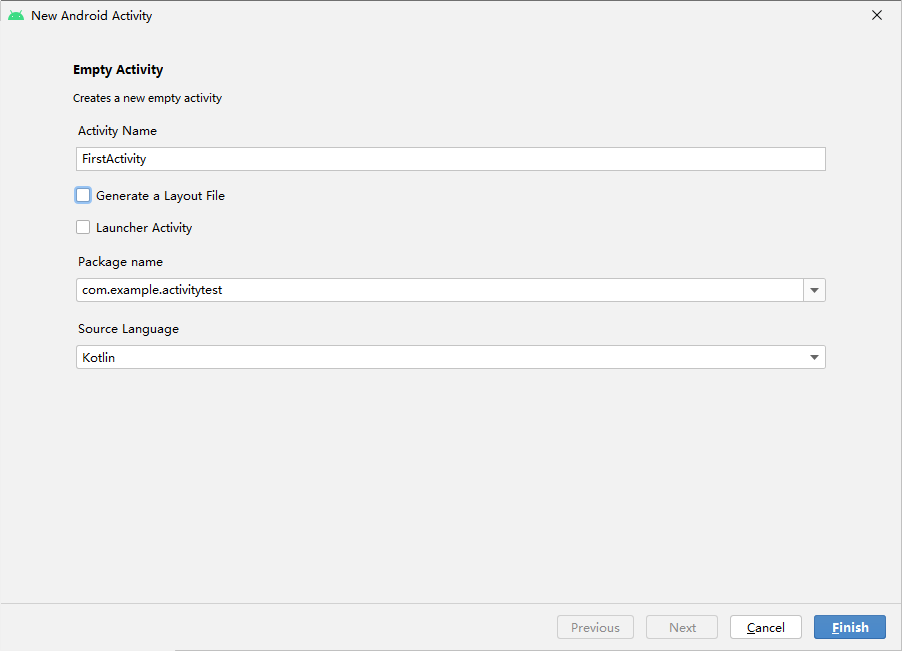

### 创建和加载布局

- 创建 layout 文件夹，并创建 first_layout 布局资源文件

  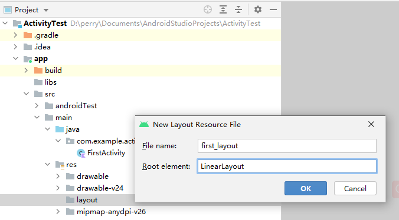

- 在新建布局资源文件中更改内容

  ```xml
  <!-- first_layout.xml -->
  <?xml version="1.0" encoding="utf-8"?>
  <LinearLayout xmlns:android="http://schemas.android.com/apk/res/android"
      android:orientation="vertical"
      android:layout_width="match_parent"
      android:layout_height="match_parent">
  
      <Button
  		android:id="@+id/button1"
          android:layout_width="match_parent"
          android:layout_height="wrap_content"
          android:text="Button 1"
      />
  
  </LinearLayout>
  ```

  - 这里添加了一个Button元素，并在Button元素的内部增加了几个属性。
    - android:id是给当前 的元素定义一个唯一的标识符，之后可以在代码中对这个元素进行操作。
      - 你可能会对 @+id/button1这种语法感到陌生，但如果把加号去掉，变成@id/button1，你就会觉得有些 熟悉了吧。这不就是在XML中引用资源的语法吗？只不过是把string替换成了id。是的，如果 你需要在XML中引用一个id，就使用@id/id_name这种语法，而如果你需要在XML中定义一 个id，则要使用@+id/id_name这种语法。
    - android:layout_width指定了当前元素的 宽度，这里使用match_parent表示让当前元素和父元素一样宽。
    - android:layout_height 指定了当前元素的高度，这里使用wrap_content表示当前元素的高度只要能刚好包含里面的
      内容就行。
    - android:text指定了元素中显示的文字内容。

- 回到 `FirstActivity` ，onCreate() 如下代码：

  ```kotlin
  // FirstActivity.kt
  package com.example.activitytest
  
  import androidx.appcompat.app.AppCompatActivity
  import android.os.Bundle
  
  class FirstActivity : AppCompatActivity() {
      override fun onCreate(savedInstanceState: Bundle?) {
          super.onCreate(savedInstanceState)
          setContentView(R.layout.first_layout)
      }
  }
  ```

  - 这里调用了setContentView()方法来给当前的Activity加载一个布局，而在 setContentView()方法中，我们一般会传入一个布局文件的id。
  - 在第1章介绍项目资源的时 候我曾提到过，项目中添加的任何资源都会在R文件中生成一个相应的资源id，因此我们刚才创建的first_layout.xml布局的id现在已经添加到R文件中了。
  - 在代码中引用布局文件的方法 你也已经学过了，只需要调用R.layout.first_layout就可以得到first_layout.xml布局的id，然后将这个值传入setContentView()方法即可。

### 在AndroidManifest文件中注册

- 第1章我们学过，所有的Activity都要在AndroidManifest.xml中进行注册才能生效。实际上 FirstActivity已经在AndroidManifest.xml中注册过了，我们打开app/src/main/AndroidManifest.xml文件瞧一瞧

  ```xml
  <!-- AndroidManifest.xml -->
  <?xml version="1.0" encoding="utf-8"?>
  <manifest xmlns:android="http://schemas.android.com/apk/res/android"
      package="com.example.activitytest">
  
      <application
          android:allowBackup="true"
          android:icon="@mipmap/ic_launcher"
          android:label="@string/app_name"
          android:roundIcon="@mipmap/ic_launcher_round"
          android:supportsRtl="true"
          android:theme="@style/Theme.ActivityTest">
          <activity
              android:name=".FirstActivity"
              android:exported="false" />
      </application>
  
  </manifest>
  ```

  - Activity的注册声明要放在\<application>标签内，这里是通过\<activity>标签 来对Activity进行注册的。Android Studio自动完成了对FirstActivity的注册。

#### 运行

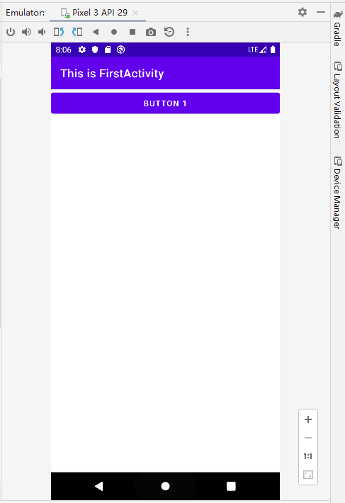

### 在Activity中使用Toast

- 通过findViewById()方法获取在布局文件中定义的元素，传入 R.id.button1来得到按钮的实例，这个值是刚才在first_layout.xml中通过android:id属性指定的。
- findViewById()方法返回的是一个继承自View的泛型对象，因此Kotlin无法自动 推导出它是一个Button还是其他控件，所以我们需要将button1变量显式地声明成Button类型。
- 得到按钮的实例之后，调用setOnClickListener()方法为按钮注册一个监听器，点击按钮时就会执行监听器中的onClick()方法。

```kotlin
val button1: Button = findViewById(R.id.button1)
```

- 通过静态方法makeText()创建出一个Toast对象，然后调用show() 将Toast显示出来。
- makeText()方法需要传入3个参数。
  - 第一个参数是Context，也就是Toast要求的上下文，由于Activity本身就是一个Context对象，因此这里直接传入this即可。
  - 第二个参数是Toast显示的文本内容。
  - 第三个参数是Toast显示的时长

```kotlin
button1.setOnClickListener {
    Toast.makeText(this,"You clicked Button 1", Toast.LENGTH_LONG).show()
}
```

- 总览

```kotlin
// first_layout.xml
package com.example.activitytest

import androidx.appcompat.app.AppCompatActivity
import android.os.Bundle
import android.widget.Button
import android.widget.Toast

class FirstActivity : AppCompatActivity() {
    override fun onCreate(savedInstanceState: Bundle?) {
        super.onCreate(savedInstanceState)
        setContentView(R.layout.first_layout)
        val button1: Button = findViewById(R.id.button1)
        button1.setOnClickListener {
            Toast.makeText(this,"You clicked Button 1", Toast.LENGTH_LONG).show()
        }
    }
}
```

#### 运行并点击按钮

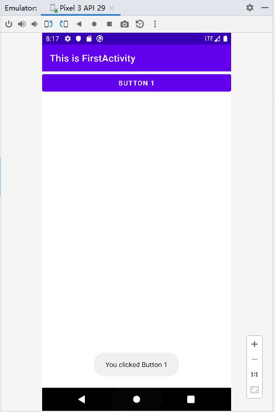


### 在Activity中使用Menu

- 在res目录下新建一个menu文件夹，右击res目录→New→Directory，输入文件夹 名“menu”，点击“OK”。

- 接着在这个文件夹下新建一个名叫“main”的菜单文件，右击menu文件夹→New→Menu resource file，命名为main.xml

- 创建两个菜单项，

  - 其中\<item>标签用来创建具体的某一个菜单项，
  - 通过 android:id给这个菜单项指定一个唯一的标识符，
  - 通过android:title给这个菜单项指定一个名称。

  ```xml
  <?xml version="1.0" encoding="utf-8"?>
  <menu xmlns:android="http://schemas.android.com/apk/res/android">
      <item
          android:id="@+id/add_item"
          android:title="Add"/>
      <item
          android:id="@+id/remove_item"
          android:title="Remove"/>
  </menu>
  ```

- FirstActivity.kt 中重写onCreateOptionsMenu()方法，

  - 重写方法可以使用Ctrl + O 快捷键（MacOS：control + O）

  ```kotlin
  override fun onCreateOptionsMenu(menu: Menu?): Boolean {
      menuInflater.inflate(R.menu.main, menu)
      return true
  }
  ```

- 重写onOptionsItemSelected()方法

  - 将item.itemId的结果传入when语句当中，然后给每个菜单项加入自己的逻辑处理，弹出一个刚刚学会的Toast。

  ```kotlin
  override fun onOptionsItemSelected(item: MenuItem): Boolean {
      when (item.itemId){
          R.id.add_item -> Toast.makeText(this, "You Clicked Add", Toast.LENGTH_SHORT).show()
          R.id.remove_item -> Toast.makeText(this,"You Clicked Remove", Toast.LENGTH_LONG).show()
      }
      return true
  }
  ```

#### 运行并点击菜单中的选项

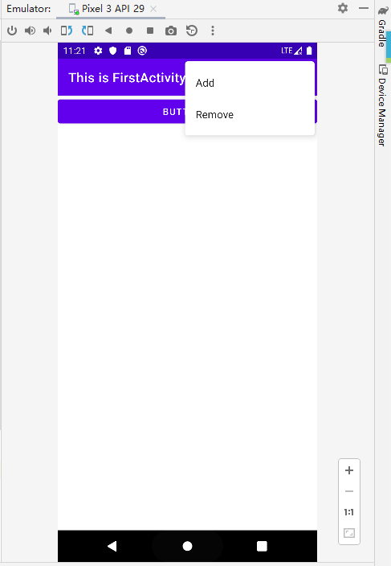

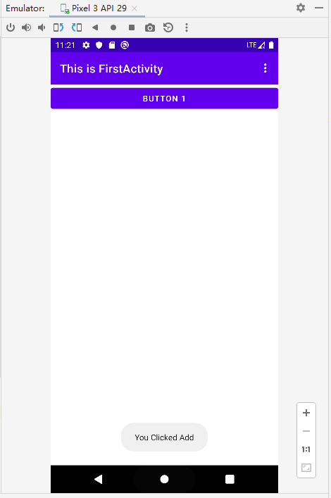

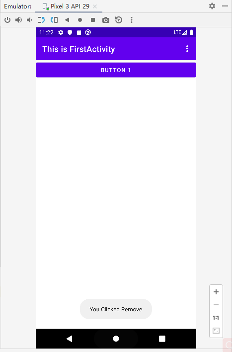

### 摧毁Activity

- 除了点击返回键，应用内还应有返回按钮来摧毁Activity

- 在 first_layout.xml 中创建按钮

  ```kotlin
  <Button
  android:id="@+id/button2"
  android:layout_width="match_parent"
  android:layout_height="wrap_content"
  android:text="Exit" />
  ```

- 在 FirstActivity.kt 中创建监听器，执行 finish() 方法

  ```kotlin
  val button2: Button = findViewById(R.id.button2)
  button2.setOnClickListener {
  finish()
  }
  ```

  

## 3.3 使用Intent在Activity之间穿梭

### 3.3.1 使用显式Intent

com.example.activitytest包→New→Activity→Empty Activity，会弹出一个创建 Activity的对话框，这次我们命名为SecondActivity，并勾选Generate Layout File，给布局文件起名为second_layout，但不要勾选Launcher Activity选项

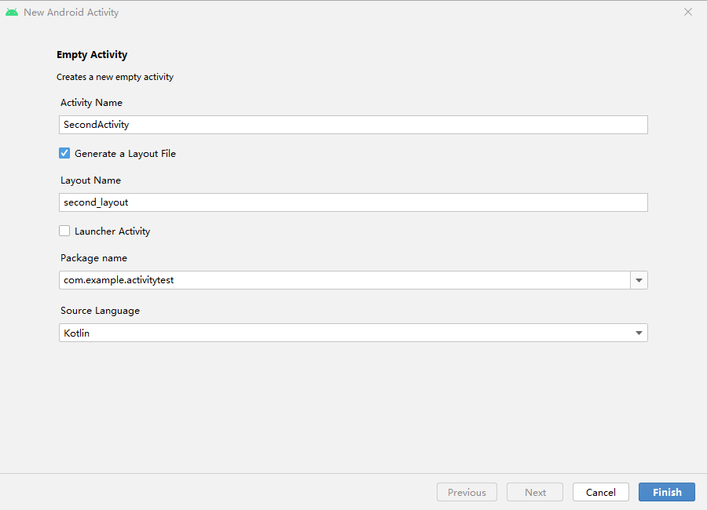

点击“Finish”完成创建，Android Studio会为我们自动生成SecondActivity.kt和 second_layout.xml这两个文件。

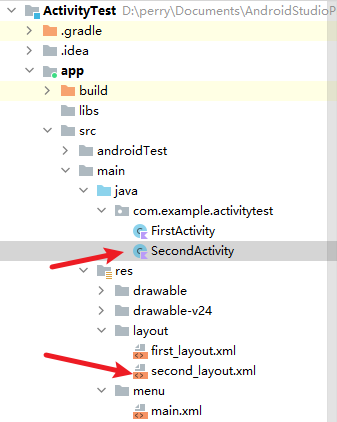

不过自动生成的布局代码目前对你来说可能有些难以理解， 这里我们还是使用比较熟悉的LinearLayout，编辑second_layout.xml，将里面的代码替换成
如下内容：

```xml
<?xml version="1.0" encoding="utf-8"?>
<LinearLayout xmlns:android="http://schemas.android.com/apk/res/android"
    android:orientation="vertical"
    android:layout_width="match_parent"
    android:layout_height="match_parent">

    <Button
        android:id="@+id/button2"
        android:layout_width="match_parent"
        android:layout_height="wrap_content"
        android:text="Button 2"
    />

    <TextView
        android:id="@+id/textView"
        android:layout_width="match_parent"
        android:layout_height="wrap_content"
        android:text="Welcome to Second Activity" />

</LinearLayout>
```


SecondActivity中的代码已经自动生成了一部分，保持默认不变

```kotlin
package com.example.activitytest

import androidx.appcompat.app.AppCompatActivity
import android.os.Bundle

class SecondActivity : AppCompatActivity() {
    override fun onCreate(savedInstanceState: Bundle?) {
        super.onCreate(savedInstanceState)
        setContentView(R.layout.second_layout)
    }
}
```


另外不要忘记，任何一个Activity都是需要在AndroidManifest.xml中注册的（Android Studio已自动完成）

由于SecondActivity不是主Activity，因此不需要配置\<intent-filter>标签里的内容，注 册Activity的代码也简单了许多。

```xml
<?xml version="1.0" encoding="utf-8"?>
<manifest xmlns:android="http://schemas.android.com/apk/res/android"
    package="com.example.activitytest">

    <application
        android:allowBackup="true"
        android:icon="@mipmap/ic_launcher"
        android:label="@string/app_name"
        android:roundIcon="@mipmap/ic_launcher_round"
        android:supportsRtl="true"
        android:theme="@style/Theme.ActivityTest">
        <activity
            android:name=".SecondActivity"
            android:exported="false" />
        <activity
            android:name=".FirstActivity"
            android:exported="true">
            <intent-filter>
                <action android:name="android.intent.action.MAIN" />

                <category android:name="android.intent.category.LAUNCHER" />
            </intent-filter>
        </activity>
    </application>

</manifest>
```


**Intent**

Intent是Android程序中各组件之间进行交互的一种重要方式，它不仅可以指明当前组件想要执 行的动作，还可以在不同组件之间传递数据。

Intent一般可用于启动Activity、启动Service以 及发送广播等场景，由于Service、广播等概念你暂时还未涉及，那么本章我们的目光无疑就锁 定在了启动Activity上面。

Intent大致可以分为两种：显式Intent和隐式Intent。我们先来看一下显式Intent如何使用。

Intent有多个构造函数的重载，其中一个是`Intent(Context packageContext, Class<? > cls)`。

- 这个构造函数接收两个参数：第一个参数Context要求提供一个启动Activity的上下文；第二个参数Class用于指定想要启动的目标Activity，通过这个构造函数就可以构建出 Intent的“意图”。
- 那么接下来我们应该怎么使用这个Intent呢？Activity类中提供了一个 startActivity()方法，专门用于启动Activity，它接收一个Intent参数，这里我们将构建好 的Intent传入startActivity()方法就可以启动目标Activity了。

- 新增**FirstActivity**中Button3按钮的点击事件，代码如下所示：

  ```kotlin
  val button3: Button = findViewById(R.id.button3)
      button3.setOnClickListener {
          val intent = Intent(this, SecondActivity::class.java)   // 需要 import android.content.Intent
          startActivity(intent)
      }
  ```

  ```kotlin
  // 完整版：
  package com.example.activitytest
  
  import android.content.Intent
  import androidx.appcompat.app.AppCompatActivity
  import android.os.Bundle
  import android.view.Menu
  import android.view.MenuItem
  import android.widget.Button
  import android.widget.Toast
  
  class FirstActivity : AppCompatActivity() {
      override fun onCreate(savedInstanceState: Bundle?) {
          super.onCreate(savedInstanceState)
          setContentView(R.layout.first_layout)
  //      不安全写法：
          val button1: Button = findViewById(R.id.button1)
          button1.setOnClickListener {
              Toast.makeText(this,"You clicked Button 1", Toast.LENGTH_LONG).show()
          }
          val button2: Button = findViewById(R.id.button2)
          button2.setOnClickListener {
              finish()
          }
  
          val button3: Button = findViewById(R.id.button3)
          button3.setOnClickListener {
              val intent = Intent(this, SecondActivity::class.java)   // 需要 import android.content.Intent
              startActivity(intent)
          }
  
  //      新写法：这样写不用再调用findViewByID()
  //       https://developer.android.com/topic/libraries/view-binding#kotlin
  
  
      }
  
      override fun onCreateOptionsMenu(menu: Menu?): Boolean {
          menuInflater.inflate(R.menu.main, menu)
          return true
      }
  
      override fun onOptionsItemSelected(item: MenuItem): Boolean {
          when (item.itemId){
              R.id.add_item -> Toast.makeText(this, "You Clicked Add", Toast.LENGTH_SHORT).show()
              R.id.remove_item -> Toast.makeText(this,"You Clicked Remove", Toast.LENGTH_LONG).show()
          }
          return true
      }
  }
  ```

我们首先构建了一个Intent对象，第一个参数传入this也就是FirstActivity作为上下文，第二 个参数传入`SecondActivity::class.java`作为目标Activity，这样我们的“意图”就非常明显了，即在FirstActivity的基础上打开SecondActivity。

注意，Kotlin中 `SecondActivity::class.java`的写法就相当于Java中`SecondActivity.class`的写法。接下来再通过`startActivity()`方法执行这个Intent就可以了。

运行：

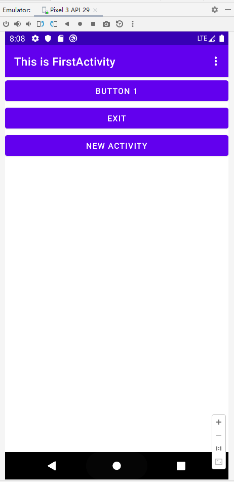

点击“NEW ACTIVITY”

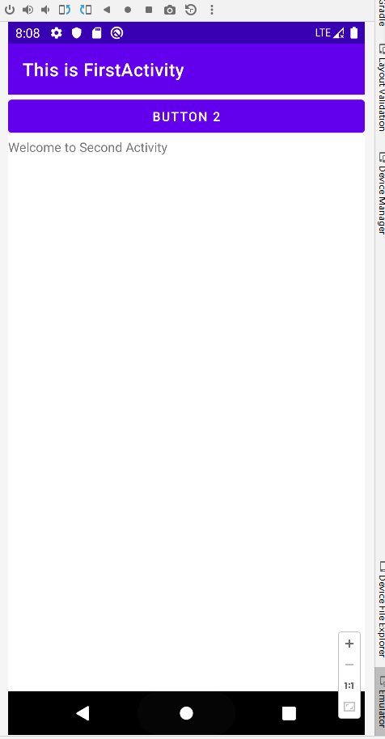

可以看到，我们已经成功启动SecondActivity了。如果你想要回到上一个Activity怎么办呢？ 很简单，按一下Back键就可以销毁当前Activity，从而回到上一个Activity了。
使用这种方式来启动Activity，Intent的“意图”非常明显，因此我们称之为显式Intent。

### 3.3.2 使用隐式Intent

相比于显式Intent，隐式Intent则含蓄了许多，它并不明确指出想要启动哪一个Activity，而是 指定了一系列更为抽象的action和category等信息，然后交由系统去分析这个Intent，并帮我们找出合适的Activity去启动。

通过在\<activity>标签下配置\<intent-filter>的内容，可以指定当前Activity能够响应的 action和category，**打开AndroidManifest.xml，添加如下代码：**

```xml
<activity
    android:name=".SecondActivity"
    android:exported="false">
    <intent-filter>
        <action android:name="com.example.activitytest.ACTION_START"/>
        <category android:name="android.intent.category.DEFAULT"/>
    </intent-filter>
</activity>
```

```xml
<!-- 完整版 -->
<?xml version="1.0" encoding="utf-8"?>
<manifest xmlns:android="http://schemas.android.com/apk/res/android"
    package="com.example.activitytest">

    <application
        android:allowBackup="true"
        android:icon="@mipmap/ic_launcher"
        android:label="@string/app_name"
        android:roundIcon="@mipmap/ic_launcher_round"
        android:supportsRtl="true"
        android:theme="@style/Theme.ActivityTest">
        <activity
            android:name=".SecondActivity"
            android:exported="false">
            <intent-filter>
                <action android:name="com.example.activity.test.ACTION_START"/>
                <category android:name="android.intent.category.DEFAULT"/>
            </intent-filter>
        </activity>


        <activity
            android:name=".FirstActivity"
            android:exported="true">
            <intent-filter>
                <action android:name="android.intent.action.MAIN" />

                <category android:name="android.intent.category.LAUNCHER" />
            </intent-filter>
        </activity>
    </application>

</manifest>
```

在\<action>标签中我们指明了当前Activity可以响应 com.example.activitytest.ACTION_START这个action，而\<category>标签则包含了 一些附加信息，更精确地指明了当前Activity能够响应的Intent中还可能带有的category。只 有\<action>和\<category>中的内容同时匹配Intent中指定的action和category时，这个
Activity才能响应该Intent。

**修改FirstActivity中按钮的点击事件，代码如下所示：**

```kotlin
button3.setOnClickListener {
    val intent = Intent("com.example.activitytest.ACTION_START")
    startActivity(intent)
}
```

```kotlin
// 完整版
package com.example.activitytest

import android.content.Intent
import androidx.appcompat.app.AppCompatActivity
import android.os.Bundle
import android.view.Menu
import android.view.MenuItem
import android.widget.Button
import android.widget.Toast

class FirstActivity : AppCompatActivity() {
    override fun onCreate(savedInstanceState: Bundle?) {
        super.onCreate(savedInstanceState)
        setContentView(R.layout.first_layout)
//      不安全写法：
        val button1: Button = findViewById(R.id.button1)
        button1.setOnClickListener {
            Toast.makeText(this,"You clicked Button 1", Toast.LENGTH_LONG).show()
        }
        val button2: Button = findViewById(R.id.button2)
        button2.setOnClickListener {
            finish()
        }

        val button3: Button = findViewById(R.id.button3)
        button3.setOnClickListener {
            val intent = Intent("com.example.activitytest.ACTION_START")
            startActivity(intent)
        }

//      新写法：这样写不用再调用findViewByID()
//       https://developer.android.com/topic/libraries/view-binding#kotlin


    }

    override fun onCreateOptionsMenu(menu: Menu?): Boolean {
        menuInflater.inflate(R.menu.main, menu)
        return true
    }

    override fun onOptionsItemSelected(item: MenuItem): Boolean {
        when (item.itemId){
            R.id.add_item -> Toast.makeText(this, "You Clicked Add", Toast.LENGTH_SHORT).show()
            R.id.remove_item -> Toast.makeText(this,"You Clicked Remove", Toast.LENGTH_LONG).show()
        }
        return true
    }
}
```

重新运行程序，在FirstActivity的界面点击一下按钮，你同样成功启动SecondActivity了。不 同的是，这次你是使用隐式Intent的方式来启动的，说明我们在\<activity>标签下配置的 action和category的内容已经生效了！


每个Intent中只能指定一个action，但能指定多个category。**修改FirstActivity中按钮的点击事件，代码如下所示：**

```kotlin
button3.setOnClickListener {
    val intent = Intent("com.example.activitytest.ACTION_START")
    intent.addCategory("com.example.activitytest.MY_CATEGORY")	// 调用Intent中的addCategory()方法来添加一个category，这里我们指定了一个自定义 的category，值为com.example.activitytest.MY_CATEGORY。
    startActivity(intent)
}

```

此时让程序跑起来，点击 NEW  ACTIVITY 程序闪退，打开 Logcat 查看错误报告

```
2022-03-22 16:34:27.292 11536-11536/com.example.activitytest D/AndroidRuntime: Shutting down VM
    --------- beginning of crash
2022-03-22 16:34:27.294 11536-11536/com.example.activitytest E/AndroidRuntime: FATAL EXCEPTION: main
    Process: com.example.activitytest, PID: 11536
    android.content.ActivityNotFoundException: No Activity found to handle Intent { act=com.example.activitytest.ACTION_START cat=[com.example.activitytest.MY_CATEGORY] }
        at android.app.Instrumentation.checkStartActivityResult(Instrumentation.java:2051)
        at android.app.Instrumentation.execStartActivity(Instrumentation.java:1709)
        at android.app.Activity.startActivityForResult(Activity.java:5192)
        at androidx.activity.ComponentActivity.startActivityForResult(ComponentActivity.java:597)
        at android.app.Activity.startActivityForResult(Activity.java:5150)
        at androidx.activity.ComponentActivity.startActivityForResult(ComponentActivity.java:583)
        at android.app.Activity.startActivity(Activity.java:5521)
        at android.app.Activity.startActivity(Activity.java:5489)
        at com.example.activitytest.FirstActivity.onCreate$lambda-2(FirstActivity.kt:29)
        at com.example.activitytest.FirstActivity.$r8$lambda$3AEi-3PA0H_t4TpI4M_2wDdrv8E(Unknown Source:0)
        at com.example.activitytest.FirstActivity$$ExternalSyntheticLambda1.onClick(Unknown Source:2)
        at android.view.View.performClick(View.java:7125)
        at com.google.android.material.button.MaterialButton.performClick(MaterialButton.java:1131)
        at android.view.View.performClickInternal(View.java:7102)
        at android.view.View.access$3500(View.java:801)
        at android.view.View$PerformClick.run(View.java:27336)
        at android.os.Handler.handleCallback(Handler.java:883)
        at android.os.Handler.dispatchMessage(Handler.java:100)
        at android.os.Looper.loop(Looper.java:214)
        at android.app.ActivityThread.main(ActivityThread.java:7356)
        at java.lang.reflect.Method.invoke(Native Method)
        at com.android.internal.os.RuntimeInit$MethodAndArgsCaller.run(RuntimeInit.java:492)
        at com.android.internal.os.ZygoteInit.main(ZygoteInit.java:930)
2022-03-22 16:34:27.312 11536-11536/com.example.activitytest I/Process: Sending signal. PID: 11536 SIG: 9
```

可以看到 `android.content.ActivityNotFoundException: No Activity found to handle Intent { act=com.example.activitytest.ACTION_START cat=[com.example.activitytest.MY_CATEGORY] }`

错误信息提醒我们，没有任何一个Activity可以响应我们的Intent。这是因为我们刚刚在Intent 中新增了一个category，而SecondActivity的\<intent-filter>标签中并没有声明可以响 应这个category，所以就出现了没有任何Activity可以响应该Intent的情况。**现在我们打开AndroidManifest.xml，在\<intent-filter>中再添加一个category的声明**

```xml
<intent-filter>
    <action android:name="com.example.activitytest.ACTION_START"/>
    <category android:name="android.intent.category.DEFAULT"/>
    <category android:name="com.example.activitytest.MY_CATEGORY"/>
</intent-filter>
```

```xml
<!--完整版-->
<?xml version="1.0" encoding="utf-8"?>
<manifest xmlns:android="http://schemas.android.com/apk/res/android"
    package="com.example.activitytest">

    <application
        android:allowBackup="true"
        android:icon="@mipmap/ic_launcher"
        android:label="@string/app_name"
        android:roundIcon="@mipmap/ic_launcher_round"
        android:supportsRtl="true"
        android:theme="@style/Theme.ActivityTest">
        <activity
            android:name=".SecondActivity"
            android:exported="false">
            <intent-filter>
                <action android:name="com.example.activitytest.ACTION_START"/>
                <category android:name="android.intent.category.DEFAULT"/>
                <category android:name="com.example.activitytest.MY_CATEGORY"/>
            </intent-filter>
        </activity>


        <activity
            android:name=".FirstActivity"
            android:exported="true">
            <intent-filter>
                <action android:name="android.intent.action.MAIN" />

                <category android:name="android.intent.category.LAUNCHER" />
            </intent-filter>
        </activity>
    </application>

</manifest>
```

此时重新运行哦程序，一切恢复正常。

### 3.3.3 更多隐式Intent的用法

比如你的应用程序中需要展示一个网页，这时你没有必要自己去实现一个浏览器，只需要调用系统的浏览器来打开这个 网页就行了。
**first_layuot中新增按钮**

```xml
<Button
    android:id="@+id/button4"
    android:layout_width="match_parent"
    android:layout_height="wrap_content"
    android:text="打开浏览器 并打开百度" />
```

**FirstActivity中创建监听器**

```kotlin
val button4: Button = findViewById(R.id.button4)
button4.setOnClickListener {
    val intent = Intent(Intent.ACTION_VIEW)
    intent.data = Uri.parse("https://www.baidu.com")
    startActivity(intent)
}
```

测试     ~~（模拟器没网，懒得修了，以后在修）~~

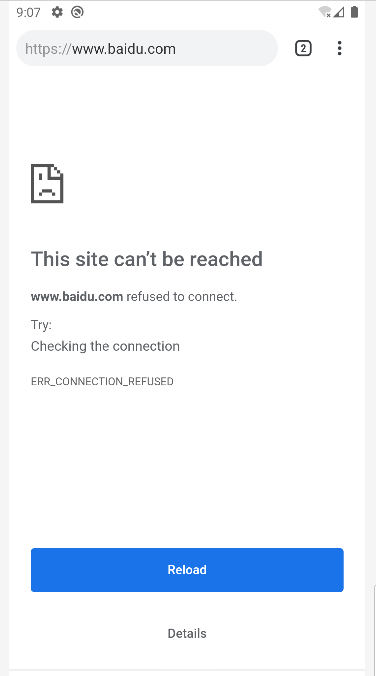

在上述代码中，可能你会对setData()方法部分感到陌生，这是我们前面没有讲到的。这个方法其实并不复杂，它接收一个Uri对象，主要用于指定当前Intent正在操作的数据，而这些数据 通常是以字符串形式传入Uri.parse()方法中解析产生的。
与此对应，我们还可以在\<intent-filter>标签中再配置一个\<data>标签，用于更精确地指 定当前Activity能够响应的数据。\<data>标签中主要可以配置以下内容。

- android:scheme。用于指定数据的协议部分，如上例中的https部分。 android:host。用于指定数据的主机名部分，如上例中的www.baidu.com部分。 android:port。用于指定数据的端口部分，一般紧随在主机名之后。 android:path。用于指定主机名和端口之后的部分，如一段网址中跟在域名之后的内 容。
- android:mimeType。用于指定可以处理的数据类型，允许使用通配符的方式进行指定。
- 只有当\<data>标签中指定的内容和Intent中携带的Data完全一致时，当前Activity才能够响应 该Intent。不过，在\<data>标签中一般不会指定过多的内容。例如在上面的浏览器示例中，其 实只需要指定android:scheme为https，就可以响应所有https协议的Intent了。


为了让你能够更加直观地理解，我们来自己建立一个Activity，让它也能响应打开网页的Intent。

右击com.example.activitytest包→New→Activity→Empty Activity，新建ThirdActivity， 并勾选Generate Layout File，给布局文件起名为third_layout，点击“Finish”完成创建。然后**编辑third_layout.xml**

```xml
<?xml version="1.0" encoding="utf-8"?>
<LinearLayout xmlns:android="http://schemas.android.com/apk/res/android"
    android:orientation="vertical"
    android:layout_width="match_parent"
    android:layout_height="match_parent">

    <Button
        android:id="@+id/button5"
        android:layout_width="match_parent"
        android:layout_height="wrap_content"
        android:text="Test!"
        />
</LinearLayout>
```

**修改AndroidManifest.xml**

```xml
<activity
    android:name=".ThirdActivity"
    android:exported="true">
    <intent-filter tools:ignore="AppLinkUrlError">
        <action android:name="android.intent.action.VIEW"/>
        <category android:name="android.intent.category.DEFAULT"/>
        <data android:scheme="https"/>
    </intent-filter>
</activity>
```

注：

- android:exported="true"

- 使用tools 需要新建命名空间：

  ```xml
  <manifest xmlns:android="http://schemas.android.com/apk/res/android"
      xmlns:tools="http://schemas.android.com/tools"
      package="com.example.activitytest">
  ```

我们在ThirdActivity的\<intent-filter>中配置了当前Activity能够响应的action是 Intent.ACTION_VIEW的常量值，而category则毫无疑问地指定了默认的category值，另 外在\<data>标签中，我们通过android:scheme指定了数据的协议必须是https协议，这样 ThirdActivity应该就和浏览器一样，能够响应一个打开网页的Intent了。另外，由于Android Studio认为所有能够响应ACTION_VIEW的Activity都应该加上BROWSABLE的category，否 则就会给出一段警告提醒。加上BROWSABLE的category是为了实现deep link功能，和我们 目前学习的东西无关，所以这里直接在\<intent-filter>标签上使用tools:ignore属性将
警告忽略即可。


**运行**

点击第四个按钮

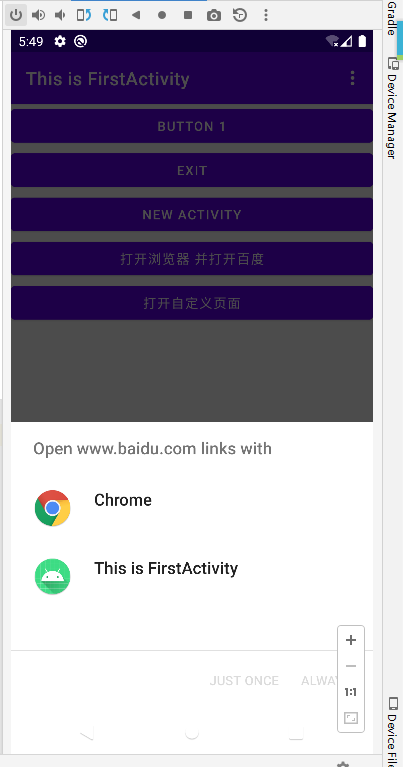


除了https协议外，我们还可以指定很多其他协议，比如geo表示显示地理位置、tel表示拨打电 话。下面的代码展示了如何在我们的程序中调用系统拨号界面。

```xml
<Button
    android:id="@+id/button6"
    android:layout_width="match_parent"
    android:layout_height="wrap_content"
    android:text="打开拨号盘 传递10086" />
```

```kotlin
val button6: Button = findViewById(R.id.button6)
button6.setOnClickListener {
    val intent = Intent(Intent.ACTION_DIAL)   // 需要 import android.content.Intent
    intent.data = Uri.parse("tel:10086")
    startActivity(intent)
}
```

### 3.3.4 向下一个Activity传递数据

Intent中提供了一系列putExtra()方法的重载，可以把我们想要传递的数据暂存在Intent中，在启动另一个Activity后，只需要把这些数据从 Intent中取出就可以了。比如说FirstActivity中有一个字符串，现在想把这个字符串传递到SecondActivity中，你就可以这样编写：

```kotlin
button3.setOnClickListener {
    val data = "Hello SecondActivity"
    val intent = Intent(this, SecondActivity::class.java)
    intent.putExtra("extra_data", data)
    startActivity(intent)
}
```

然后在SecondActivity中将传递的数据取出并打印：

```kotlin
class SecondActivity : AppCompatActivity() {
    override fun onCreate(savedInstanceState: Bundle?) {
        super.onCreate(savedInstanceState)
        setContentView(R.layout.second_layout)
        val extraData = intent.getStringExtra("extra_data")
        Log.d("SecondActivity","extra data is $extraData")
    }
}
```

运行并点击 Button3，查看Logcat，可以看到，我们在SecondActivity中成功得到了从FirstActivity传递过来的数据

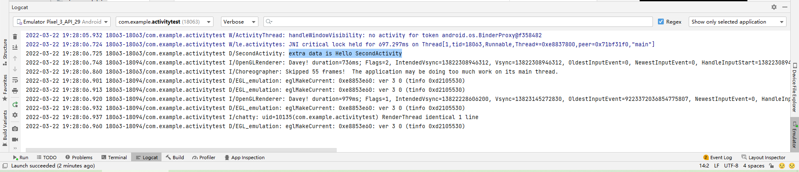

### 3.3.5 返回数据给上一个Activity

返回上一个Activity只需要按一下Back键就可以了，并没有一个用于启动 Activity的Intent来传递数据，这该怎么办呢？其实Activity类中还有一个用于启动Activity的startActivityForResult()方法，但它期望在Activity销毁的时候能够返回一个结果给上 一个Activity。

startActivityForResult()方法接收两个参数：第一个参数还是Intent；第二个参数是请求码，用于在之后的回调中判断数据的来源。

```kotlin
// FirstActivity.kt
button3.setOnClickListener {
    val intent = Intent(this, SecondActivity::class.java)
    startActivityForResult(intent, 1)   // 需要 @Suppress("DEPRECATION")
}
```

这里我们使用了startActivityForResult()方法来启动SecondActivity，请求码只要是一 个唯一值即可，这里传入了1。接下来我们在SecondActivity中给按钮注册点击事件，并在点击事件中添加返回数据的逻辑

```kotlin
// SecondActivity.kt
class SecondActivity : AppCompatActivity() {
    override fun onCreate(savedInstanceState: Bundle?) {
        super.onCreate(savedInstanceState)
        setContentView(R.layout.second_layout)
//        val extraData = intent.getStringExtra("extra_data")
//        Log.d("SecondActivity","extra data is $extraData")
        val button2: Button = findViewById(R.id.button2)
        button2.setOnClickListener {
            val intent = Intent()
            intent.putExtra("data_return", "Hello FirstActivity")
            setResult(RESULT_OK, intent)
            finish()
        }
    }
}
```

构建了一个Intent，只不过这个Intent仅仅用于传递数据而已，它没有指定 任何的“意图”。紧接着把要传递的数据存放在Intent中，然后调用了setResult()方法。这个 方法非常重要，专门用于向上一个Activity返回数据。setResult()方法接收两个参数：第一 个参数用于向上一个Activity返回处理结果，一般只使用RESULT_OK或RESULT_CANCELED这 两个值；第二个参数则把带有数据的Intent传递回去。最后调用了finish()方法来销毁当前 Activity。

由于我们是使用startActivityForResult()方法来启动SecondActivity的，在 SecondActivity被销毁之后会回调上一个Activity的onActivityResult()方法，因此我们
需要在FirstActivity中重写这个方法来得到返回的数据，

```kotlin
override fun onActivityResult(requestCode: Int, resultCode: Int, data: Intent?) {
    super.onActivityResult(requestCode, resultCode, data)
    when (requestCode) {
        1 -> if (resultCode == RESULT_OK) {
            val returnData = data?.getStringExtra("data_return")
            Log.d("FirstActivity", "return data is $returnData")
        }
    }
}
```

onActivityResult()方法带有3个参数：第一个参数requestCode，即我们在启动Activity 时传入的请求码；第二个参数resultCode，即我们在返回数据时传入的处理结果；第三个参 数data，即携带着返回数据的Intent。由于在一个Activity中有可能调用 startActivityForResult()方法去启动很多不同的Activity，每一个Activity返回的数据都 会回调到onActivityResult()这个方法中，因此我们首先要做的就是通过检查 requestCode的值来判断数据来源。确定数据是从SecondActivity返回的之后，我们再通过 resultCode的值来判断处理结果是否成功。最后从data中取值并打印出来，这样就完成了向上一个Activity返回数据的工作。


**运行 打开SecondActivity 然后点击Button2 并查看Logcat**

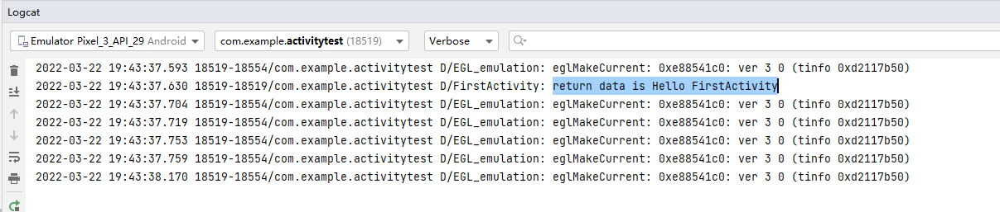


如果用户在SecondActivity中并不是通过点击按钮，而是通过按下Back键回到 FirstActivity，这样数据不就没法返回了吗？没错，不过这种情况还是很好处理的，我们可以通过在SecondActivity中重写onBackPressed()方法来解决这个问题

```kotlin
// SecondActivity.kt
override fun onBackPressed() {
//  super.onBackPressed()
    var intent = Intent()
    intent.putExtra("data_return", "Hello FirstActivity")
    setResult(RESULT_OK, intent)
    finish()
}
```

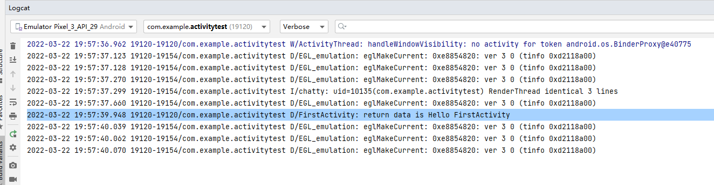


## 3.4 Activity的生命周期

### 3.4.1 返回栈

我们每启动一个 新的Activity，就会覆盖在原Activity之上，然后点击Back键会销毁最上面的Activity，下面的一个Activity就会重新显示出来。

其实Android是使用任务（task）来管理Activity的，一个任务就是一组存放在栈里的Activity 的集合，这个栈也被称作返回栈（back stack）。

- 每当我们启动了一个新的Activity，它就会在返回栈中入栈，并处于栈顶的位置。
- 而每当我 们按下Back键或调用finish()方法去销毁一个Activity时，处于栈顶的Activity就会出栈，
- 前一个入栈的Activity就会重新处于栈顶的位置。系统总是会显示处于栈顶的Activity给用户。

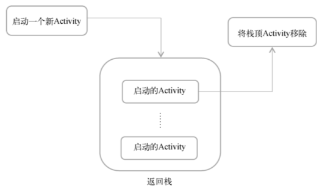

**Activity状态**

- 运行
- 暂停
- 停止
- 销毁

### 3.4.2 生存期

**七个回调方法**

- **onCreate()**。
  - 此前写的每个Activity中都重写了这个方法，在Activity第一次被创建的时候调用。
  - 用于完成Activity的初始化操作，比如加载布局、绑定事件等。 
- **onStart()**。
  - Activity由不可见变为可见的时候调用。
- **onResume()**。
  - Activity准备好和用户进行交互的时候调用。
  - 此时的Activity一 定位于返回栈的栈顶，并且处于运行状态。 
- **onPause()**。
  - 系统准备去启动或者恢复另一个Activity的时候调用。
  - 通常会释放资源，只保存关键数据，
  - 时间复杂度要低，不然会影响到新的栈顶Activity的使用。 
- **onStop()**。
  - Activity完全不可见的时候调用。
  - 它和onPause()方法的主要区别：启动新Activity是一个对话框式的Activity，onPause()方法会得到执行，而onStop()方法并不会执行。 
- **onDestroy()**。
  - Activity被销毁之前调用，之后Activity的状态将变为销毁状态。
- **onRestart()**。
  - Activity由停止状态变为运行状态之前调用，也就是Activitity被重新启动了。


**三种生存期**

- 完整生存期。
  - Activity在onCreate()方法和onDestroy()方法之间所经历的就是完整生存期。
- 可见生存期。
  - Activity在onStart()方法和onStop()方法之间所经历的就是可见生存期。
  - 在可见生存期内，Activity对于用户总是可见的，即便有可能无法和用户进行交互。
  - 通过这两个方法可以管理对用户可见的资源。
- 前台生存期。Activity在onResume()方法和onPause()方法之间所经历的就是前台生存 期。在前台生存期内，Activity总是处于运行状态，此时的Activity是可以和用户进行交互的，我们平时看到和接触最多的就是这个状态下的Activity。


**总结**

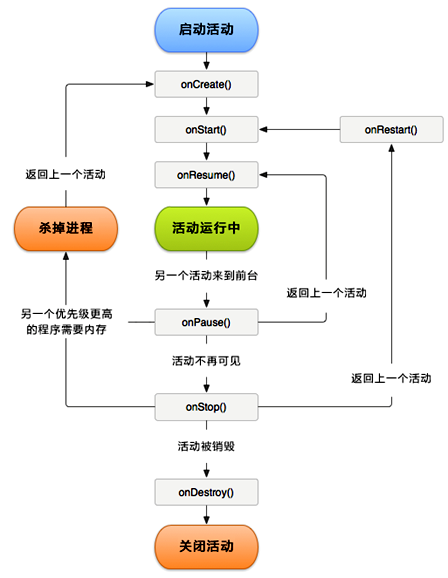

### 3.4.3 体验Activity的生命周期

略，见《第一行代码...》书PDF_144


## 3.5 Activity的启动模式

## 3.6 Activity的最佳实践

## 3.7 Kotlin课堂：标准函数和静态方法


?：用于杜绝空指针异常


