## 4.2 常用控件

**TextView**：文字

```xml
<!-- activity_main.xml -->
<?xml version="1.0" encoding="utf-8"?>
<androidx.constraintlayout.widget.ConstraintLayout xmlns:android="http://schemas.android.com/apk/res/android"
    xmlns:app="http://schemas.android.com/apk/res-auto"
    xmlns:tools="http://schemas.android.com/tools"
    android:layout_width="match_parent"
    android:layout_height="match_parent"
    tools:context=".MainActivity">

    <TextView
        android:orientation="vertical"
        android:gravity="center"
        android:layout_width="match_parent"
        android:layout_height="match_parent"
        android:textColor="#00ff00" 
        android:textSize="24sp"
        android:text="This is TextView"/>

</androidx.constraintlayout.widget.ConstraintLayout>
```

- `android:id`给当前控件定义了一个唯一标识符，

- `android:layout_width`和`android:layout_height`指定了控件的宽度和高度。
  - Android中所有的控件都具有这两个属 性，可选值有3种，
    - `match_parent`表示让当前 控件的大小和父布局的大小一样，也就是由父布局来决定当前控件的大小。
    - `wrap_content`表示让当前控件的大小能够刚好包含住里面的内容，也就是由控件内容决定当前控件的大小。
    - 固定值 表示表示给控件指定一个固定的尺寸，单位一般用dp，这是一种屏幕密度无关的尺寸单位，可以保证在不同分辨率的手机上显示效果尽可能地一致，如50 dp就是一个有效的固定值。

- `android:gravity`指定文字的对齐方式，可选值有top、bottom、start、 end、center等，可以用“|”来同时指定多个值，这里我们指定的是"center"，效果等同于`center_vertical|center_horizontal`，表示文字在垂直和水平方向都居中对齐。
- `android:textSize`控制文字大小
- `android:textColor`控制文字颜色

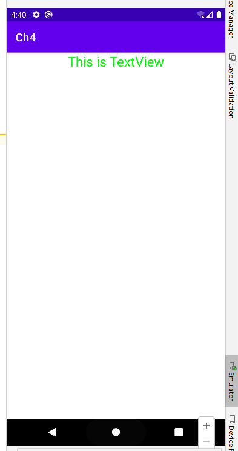


**Button**：按钮

```xml
<!-- activity_main.xml -->
<LinearLayout xmlns:android="http://schemas.android.com/apk/res/android"
    android:layout_width="match_parent"
    android:layout_height="match_parent"
    android:orientation="vertical">

    <Button
        android:id="@+id/button"
        android:layout_width="match_parent"
        android:layout_height="wrap_content"
        android:text="Button" />

</LinearLayout>
```

```kotlin
// MainActivity.kt
package com.example.ch4

import androidx.appcompat.app.AppCompatActivity
import android.os.Bundle
import android.widget.Button

class MainActivity : AppCompatActivity() {
    override fun onCreate(savedInstanceState: Bundle?) {
        super.onCreate(savedInstanceState)
        setContentView(R.layout.activity_main)

        var button:Button = findViewById(R.id.button)
        button.setOnClickListener {
            // 在此处添加逻辑
        }
    }
}
```

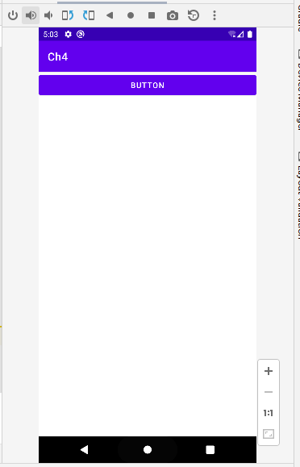


**EditText**：输入框

```xml
<!-- activity_main.xml -->
<LinearLayout xmlns:android="http://schemas.android.com/apk/res/android"
    android:layout_width="match_parent"
    android:layout_height="match_parent"
    android:orientation="vertical">

    <EditText
        android:id="@+id/editText"
        android:layout_width="match_parent"
        android:layout_height="wrap_content"
        android:hint="Please input what you want."
		android:maxLines="2"/>
     />	
    
</LinearLayout>
```

- `android:hint`输入框内提示语
- `android:maxLines`控制最高显示行数；随着输入的内容不断增多，EditText会被不断地拉长。是由于EditText的高度指定的是 wrap_content。

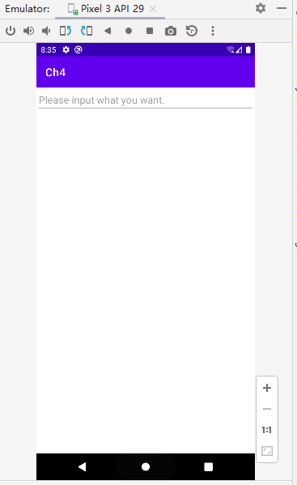


**获取EditText中输 入的内容**

在新版语法中无法通过接口方式实现，只能使用监听器方式实现：

```kotlin
// MainActivity.kt
......
binding.button.setOnClickListener {
// 在此处添加逻辑
Log.d("input:", "test")
val inputText = binding.editText.text.toStrisng()s
Toast.makeText(this, inputText, Toast.LENGTH_SHORT).show()
}
......
```

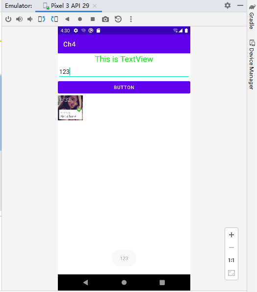

**ImageView**：

ImageView是用于在界面上展示图片的一个控件，它可以让我们的程序界面变得更加丰富多彩。

图片通常放在以drawable开头的目录下，并要带上具体的分辨率。

现在最主流的手机屏幕分辨率大多是xxhdpi的，

在res目录下 再新建一个`drawable-xxhdpi`目录，然后将事先准备好的图片复制到该目录当中。

```xml
<!-- activity_main.xml -->
<LinearLayout xmlns:android="http://schemas.android.com/apk/res/android"
    xmlns:tools="http://schemas.android.com/tools"
    android:layout_width="match_parent"
    android:layout_height="match_parent"
    android:orientation="vertical">

......

    <ImageView
        android:id="@+id/imageView"
        android:layout_width="wrap_content"
        android:layout_height="wrap_content"
        android:src="@drawable/img_1" />
<!--    @drawable：src/main/res/drawable-xxhdpi    -->

</LinearLayout>
```

android:src：给ImageView指定图片。由于图片的宽和高都是未知的，所以将ImageView的宽和高都设定为wrap_content，这样就保证了不管图片的尺寸是多少，都可以完整地展示出来。

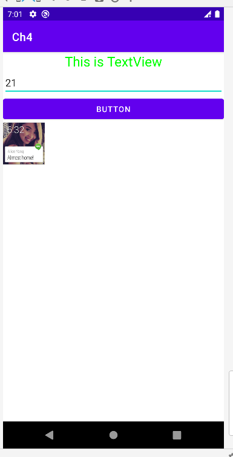

通过代码动态地更改ImageView中的图片：

```xml
<!-- activity_main.xml -->
......
    <Button
        android:id="@+id/button2"
        android:layout_width="match_parent"
        android:layout_height="wrap_content"
        android:text="Button" />
......
```

```kotlin
// MainActivity.kt
......
binding.button2.setOnClickListener {
	binding.imageView.setImageResource(R.drawable.img_2)
	}
}
......
```

运行程序后，点击Button2：

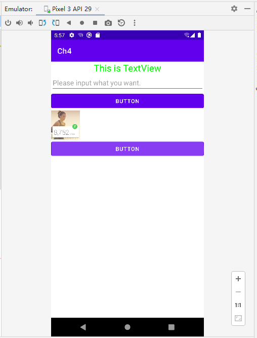


**ProgressBar**：进度条

进度条，有多种样式可选，如；

显示 “加载中” 小圆圈

```xml
<!-- activity_main.xml -->
<LinearLayout xmlns:android="http://schemas.android.com/apk/res/android"
    xmlns:tools="http://schemas.android.com/tools"
    android:layout_width="match_parent"
    android:layout_height="match_parent"
    android:orientation="vertical">

......

    <ProgressBar
        android:id="@+id/progressBar"
        android:layout_width="match_parent"
        android:layout_height="wrap_content" />

</LinearLayout>
```

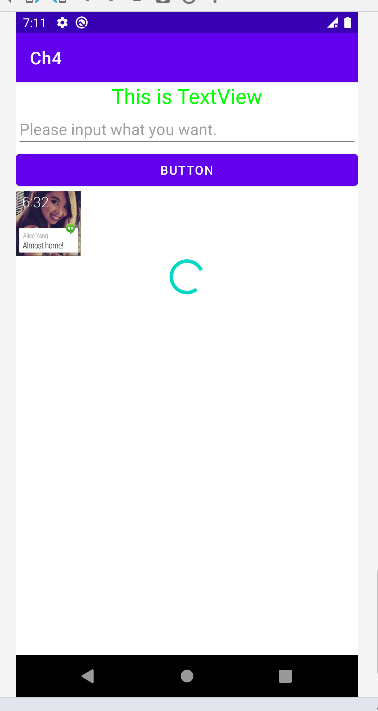

显示 “加载中” 进度条

```xml
<!-- activity_main.xml -->
......
	<ProgressBar
        android:id="@+id/progressBar"
        android:layout_width="match_parent"
        android:layout_height="wrap_content"
        style="?android:attr/progressBarStyleHorizontal"
        android:max="100"
        />

    <Button
        android:id="@+id/button3"
        android:layout_width="match_parent"
        android:layout_height="wrap_content"
        android:text="进度条+10%" />
......
```

```kotlin
// MainActivity.kt
......
binding.button3.setOnClickListener {
    binding.progressBar.progress = binding.progressBar.progress + 10
}
......
```

运行，并点三次按钮：

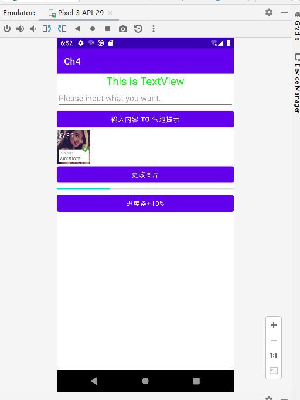


Android控件的可见属性：所有的Android控件都具有这个属性，可通过 `android:visibility`指定

- visible：可见（默认）
- invisible：透明（不可见） 但占据空间
- gone：不可见 不占据空间


重写Onclick（在新版语法中）暂时无法生效，故使用其他方法实现

```xml
<!-- activity_main.xml -->

......
<ProgressBar
    android:id="@+id/progressBar"
    android:layout_width="match_parent"
    android:layout_height="wrap_content" />

<Button
    android:id="@+id/button3"
    android:layout_width="match_parent"
    android:layout_height="wrap_content"
    android:text="更换小圈圈可见性" />
......
```

```kotlin
// MainActivity.kt

......
binding.button3.setOnClickListener {

if (binding.progressBar.visibility == View.VISIBLE) {
	binding.progressBar.visibility = View.GONE
} else {
	binding.progressBar.visibility = View.VISIBLE
}
......
```


**AlertDialog**：弹出提示框

```xml
<!-- activity_main.xml -->
    <Button
        android:id="@+id/button4"
        android:layout_width="match_parent"
        android:layout_height="wrap_content"
        android:text="弹出提示框" />
```

```kotlin
// MainActivity.kt
......
        binding.button4.setOnClickListener {
            AlertDialog.Builder(this).apply {
                setTitle("This is Dialog")
                setMessage ("Something important.")
                setCancelable (false)
                setPositiveButton("OK") { dialog, which -> }
                setNegativeButton("Cancel") { dialog, which -> }
                show()
            }
        }
......
```


### 全项目代码

```groovy
// build.gradle
android {
    ...
    viewBinding {
        enabled = true
    }
}  
```

```kotlin
// MainActivity.kt
package com.example.ch4

import android.os.Bundle
import android.util.Log
import android.view.View
import android.widget.Toast
import androidx.appcompat.app.AlertDialog
import androidx.appcompat.app.AppCompatActivity
import com.example.ch4.databinding.ActivityMainBinding

private lateinit var binding: ActivityMainBinding

class MainActivity : AppCompatActivity() {
    override fun onCreate(savedInstanceState: Bundle?) {
        super.onCreate(savedInstanceState)
        setContentView(R.layout.activity_main)
        binding = ActivityMainBinding.inflate(layoutInflater)
        val view = binding.root
        setContentView(view)

        binding.button.setOnClickListener {
//         在此处添加逻辑
//            Log.d("input:", "test")
            val inputText = binding.editText.text.toString()
//            Log.d("input:", inputText)234
            Toast.makeText(this, inputText, Toast.LENGTH_SHORT).show()
        }

        binding.button2.setOnClickListener {
            binding.imageView.setImageResource(R.drawable.img_2)
        }

        binding.button3.setOnClickListener {
            binding.progressBar.progress = binding.progressBar.progress + 10
        }

        binding.button4.setOnClickListener {
            AlertDialog.Builder(this).apply {
                setTitle("This is Dialog")
                setMessage ("Something important.")
                setCancelable (false)
                setPositiveButton("OK") { dialog, which -> }
                setNegativeButton("Cancel") { dialog, which -> }
                show()
            }
        }
    }


//    override fun onClick(var1: View?){
//        Toast.makeText(this,"脚后跟开卷考拮抗剂", Toast.LENGTH_SHORT).show()
//        override fun onClick(v: View?) {
//        when (v) {
//            binding.button -> {
//                val inputText = binding.editText.text.toString()
//                Log.d("input:", inputText)
//                Toast.makeText(this, inputText, Toast.LENGTH_SHORT).show()
//            }
//        }
//    }

//    override fun onClick(v: View?) {
//        Log.d("test","Override2")
//        when (v?.id) {
//            R.id.button -> {
//                binding.imageView.setImageResource(R.drawable.img_2)
//            }
//        }
//    }
}
```

```xml
<!-- activity_main.xml -->
<LinearLayout xmlns:android="http://schemas.android.com/apk/res/android"
    xmlns:tools="http://schemas.android.com/tools"
    android:layout_width="match_parent"
    android:layout_height="match_parent"
    android:orientation="vertical">

    <TextView
        android:id="@+id/textView"
        android:layout_width="match_parent"
        android:layout_height="wrap_content"
        android:gravity="center"
        android:text="This is TextView"
        android:textColor="#00ff00"
        android:textSize="24sp" />

    <EditText
        android:id="@+id/editText"
        android:layout_width="match_parent"
        android:layout_height="wrap_content"
        android:hint="Please input what you want."
        android:maxLines="2"
        tools:text="1223" />

    <Button
        android:id="@+id/button"
        android:layout_width="match_parent"
        android:layout_height="wrap_content"
        android:text="输入内容 to 气泡提示" />

    <ImageView
        android:id="@+id/imageView"
        android:layout_width="wrap_content"
        android:layout_height="wrap_content"
        android:src="@drawable/img_1" />
    <!--    @drawable：src/main/res/drawable-xxhdpi  -->
    <Button
        android:id="@+id/button2"
        android:layout_width="match_parent"
        android:layout_height="wrap_content"
        android:text="更改图片" />

    <ProgressBar
        android:id="@+id/progressBar"
        android:layout_width="match_parent"
        android:layout_height="wrap_content"
        style="?android:attr/progressBarStyleHorizontal"
        android:max="100"
        />

    <Button
        android:id="@+id/button3"
        android:layout_width="match_parent"
        android:layout_height="wrap_content"
        android:text="进度条+10%" />

    <Button
        android:id="@+id/button4"
        android:layout_width="match_parent"
        android:layout_height="wrap_content"
        android:text="弹出提示框" />

</LinearLayout>
```

**完整运行预览**

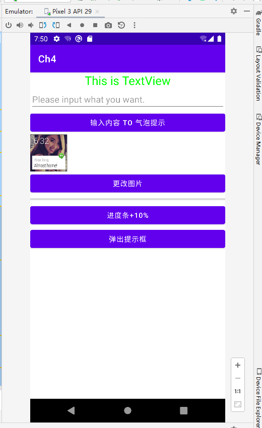


## 4.3 三种基本布局

**LinearLayout**

又称线性布局，所包含的控件在线性方向上依次排列，当然，线性排列，不只有一个方向。

- android:orientation="vertical"

```xml
<!-- activity_main.xml -->
<LinearLayout xmlns:android="http://schemas.android.com/apk/res/android"
    android:layout_width="match_parent"
    android:layout_height="match_parent"
    android:orientation="vertical">

    <Button
        android:id="@+id/button1"
        android:layout_width="wrap_content"
        android:layout_height="wrap_content"
        android:text="Button 1" />

    <Button
        android:id="@+id/button2"
        android:layout_width="wrap_content"
        android:layout_height="wrap_content"
        android:text="Button 2" />

    <Button
        android:id="@+id/button3"
        android:layout_width="wrap_content"
        android:layout_height="wrap_content"
        android:text="Button 3" />
</LinearLayout>
```

```kotlin 
// MainActivity.kt (此处·保持不变)
package com.example.uilayout

import androidx.appcompat.app.AppCompatActivity
import android.os.Bundle

class MainActivity : AppCompatActivity() {
    override fun onCreate(savedInstanceState: Bundle?) {
        super.onCreate(savedInstanceState)
        setContentView(R.layout.activity_main)
    }
}
```

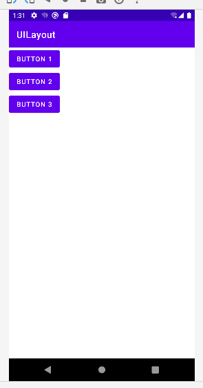

- android:orientation="horizontal"

```xml
<!-- activity_main.xml -->
<LinearLayout xmlns:android="http://schemas.android.com/apk/res/android"
    android:layout_width="match_parent"
    android:layout_height="match_parent"
    android:orientation="horizontal">
......
</LinearLayout>
```

```kotlin
// MainActivity.kt (此处·保持不变)
......
```

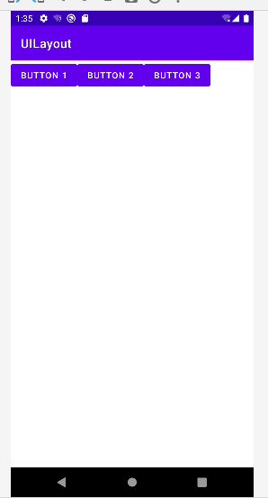

- 注意事项：

如果`LinearLayout`的排列方向是**横向**`horizontal`，内部的控件就绝对不能将**宽度**指定为`android:layout_width="match_parent"`，

如果`LinearLayout`的排列方向是**纵向**`vertical`，内部的控件就不能将**高度**指定为`android:layout_height="match_parent"`。

否则，单独一个控件就会将整个水平方向占满。

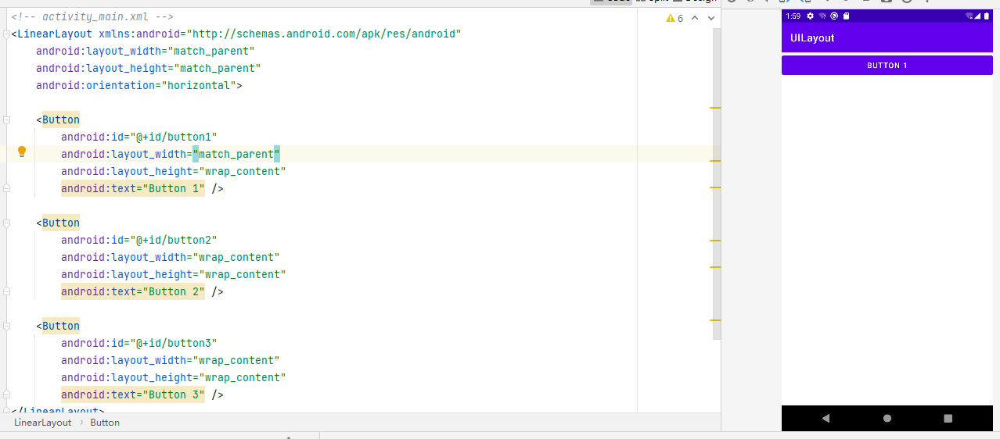


- 以下两者的可选值类似，当`LinearLayout`的**排列方向是水平**`horizontal`时，**只有垂直方向上的对齐方式生效**。因为此时水平方向上的长度是不固定的，每添加一个控件，水平方向上的长度都会改变，因而无法指定该方向上的对齐方式；当`LinearLayout`的排列方向是**垂直**`vertical`时，**只有水平方向上的对齐方式生效**。
- `android:gravity`：文字在控件中的对齐方式，
- `android:layout_gravity`：控件在布局中的对齐方式。

```xml
<!-- strings.xml -->
<resources>
    <string name="app_name">UILayout</string>
    <string name="button_1">Button 1</string>
    <string name="button_2">Button 2</string>
    <string name="button_3">Button 3</string>
</resources>
```

```xml
<!-- activity_main.xml -->
<LinearLayout xmlns:android="http://schemas.android.com/apk/res/android"
    android:layout_width="match_parent"
    android:layout_height="match_parent"
    android:orientation="horizontal">

    <Button
        android:id="@+id/button1"
        android:layout_width="wrap_content"
        android:layout_height="wrap_content"
        android:layout_gravity="top"			<!-- 对齐方式 -->
        android:text="Button 1" />

    <Button
        android:id="@+id/button2"
        android:layout_width="wrap_content"
        android:layout_height="wrap_content"
        android:layout_gravity="center"			<!-- 对齐方式 -->
        android:text="Button 2" />

    <Button
        android:id="@+id/button3"
        android:layout_width="wrap_content"
        android:layout_height="wrap_content"
        android:layout_gravity="bottom"			<!-- 对齐方式 -->
        android:text="Button 3" />
</LinearLayout>
```

```kotlin
// MainActivity.kt (此处·保持不变)
......
```

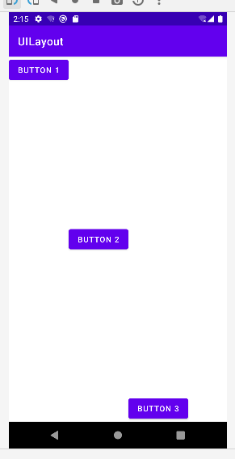

```xml
<!-- strings.xml -->
......
```

```xml
<!-- activity_main.xml -->
<LinearLayout xmlns:android="http://schemas.android.com/apk/res/android"
    android:layout_width="match_parent"
    android:layout_height="match_parent"
    android:orientation="vertical">

    <Button
        android:id="@+id/button1"
        android:layout_width="wrap_content"
        android:layout_height="wrap_content"
        android:layout_gravity="top"				<!-- 对齐方式 -->
        android:text="@string/button_1"/>

    <Button
        android:id="@+id/button2"
        android:layout_width="wrap_content"
        android:layout_height="wrap_content"
        android:layout_gravity="center"				<!-- 对齐方式 -->
        android:text="@string/button_2"/>

    <Button
        android:id="@+id/button3"
        android:layout_width="wrap_content"
        android:layout_height="wrap_content"
        android:layout_gravity="end"				<!-- 对齐方式 -->
        android:text="@string/button_3"/>
</LinearLayout>
```

```kotlin
// MainActivity.kt
......
```

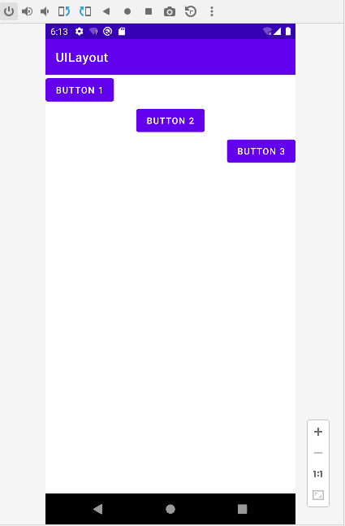


**RelativeLayout**

又称相对布局和LinearLayout的排列规则不同，RelativeLayout显得更加随意，它可以通过相对定位的方式让控件出现在布局的任何位置。

```xml
<!-- activity_main.xml -->
<RelativeLayout xmlns:android="http://schemas.android.com/apk/res/android"
    android:layout_width="match_parent"
    android:layout_height="match_parent"
    android:orientation="vertical">

    <Button
        android:id="@+id/button1"
        android:layout_width="wrap_content"
        android:layout_height="wrap_content"
        android:layout_alignParentLeft="true"		<!-- 在父元素左边 -->
        android:layout_alignParentTop="true"		<!-- 在父元素上边 -->
        android:text="@string/button_1" />

    <Button
        android:id="@+id/button2"
        android:layout_width="wrap_content"
        android:layout_height="wrap_content"
        android:layout_alignParentTop="true"
        android:layout_alignParentRight="true"		<!-- 在父元素右边 -->
        android:text="@string/button_2" />

    <Button
        android:id="@+id/button3"
        android:layout_width="wrap_content"
        android:layout_height="wrap_content"
        android:layout_centerInParent="true"		<!-- 在父元素中间 -->
        android:text="@string/button_3" />

    <Button
        android:id="@+id/button4"
        android:layout_width="wrap_content"
        android:layout_height="wrap_content"
        android:layout_alignParentLeft="true"
        android:layout_alignParentBottom="true"		<!-- 在父元素下边 -->
        android:text="@string/button_4" />

    <Button
        android:id="@+id/button5"
        android:layout_width="wrap_content"
        android:layout_height="wrap_content"
        android:layout_alignParentRight="true"
        android:layout_alignParentBottom="true"
        android:text="@string/button_5" />


</RelativeLayout>
```

```xml
<!-- strings.xml -->
<resources>
    <string name="app_name">UILayout</string>
    <string name="button_1">Button 1</string>
    <string name="button_2">Button 2</string>
    <string name="button_3">Button 3</string>
    <string name="button_4">Button 4</string>
    <string name="button_5">Button 5</string>
</resources>
```

```kotlin
// MainActivity.kt
......
```

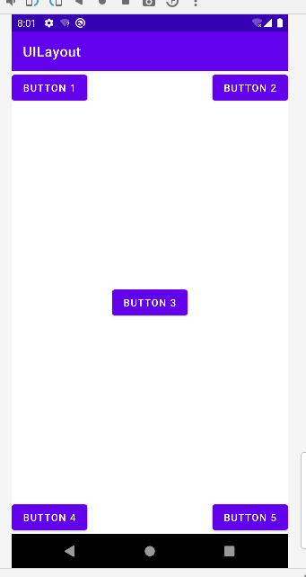


相对于控件定位

```xml
<!-- activity_main.xml -->
<RelativeLayout xmlns:android="http://schemas.android.com/apk/res/android"
    android:layout_width="match_parent"
    android:layout_height="match_parent"
    android:orientation="vertical">

    <Button
        android:id="@+id/button3"
        android:layout_width="wrap_content"
        android:layout_height="wrap_content"
        android:layout_centerInParent="true"	<!-- 在父元素中间 -->
        android:text="@string/button_3" />

    <Button
        android:id="@+id/button1"
        android:layout_width="wrap_content"
        android:layout_height="wrap_content"
        android:layout_above="@id/button3"		<!-- 在id=button3元素的上边 -->
        android:layout_toLeftOf="@id/button3"	<!-- 在id=button3元素的左边 -->
        android:text="@string/button_1" />

    <Button
        android:id="@+id/button2"
        android:layout_width="wrap_content"
        android:layout_height="wrap_content"
        android:layout_above="@id/button3"
        android:layout_toRightOf="@id/button3"
        android:text="@string/button_2" />

    <Button
        android:id="@+id/button4"
        android:layout_width="wrap_content"
        android:layout_height="wrap_content"
        android:layout_below="@id/button3"
        android:layout_toLeftOf="@id/button3"
        android:text="@string/button_4" />

    <Button
        android:id="@+id/button5"
        android:layout_width="wrap_content"
        android:layout_height="wrap_content"
        android:layout_below="@id/button3"		<!-- 在id=button3元素的下边 -->
        android:layout_toRightOf="@id/button3"	<!-- 在id=button3元素的右边 -->
        android:text="@string/button_5" />


</RelativeLayout>
```

```xml
<!-- strings.xml -->
......
```

```kotlin
// MainActivity.kt
......
```

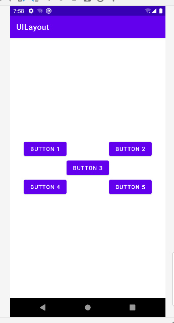

**FrameLayout**

又称作帧布局，所有的控件都会默认摆放在布局的左上角。

```xml
<!-- activity_main.xml -->
<FrameLayout xmlns:android="http://schemas.android.com/apk/res/android"
    android:layout_width="match_parent"
    android:layout_height="match_parent"
    android:orientation="vertical">

    <TextView
        android:layout_width="wrap_content"
        android:layout_height="wrap_content"
        android:layout_gravity="left"
        android:text="This is FrameLayout"/>

    <Button
        android:id="@+id/button1"
        android:layout_width="wrap_content"
        android:layout_height="wrap_content"
        android:layout_gravity="right"
        android:text="@string/button_1" />

</FrameLayout>
```

```xml
<!-- strings.xml -->
<resources>
    <string name="app_name">UILayout</string>
    <string name="button_1">Button 1</string>
</resources>
```

```kotlin
// MainActivity.kt
......
```

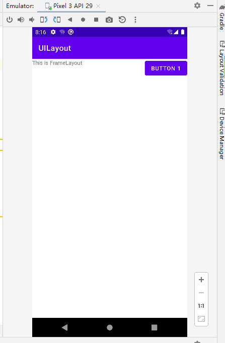


## 4.4 自定义控件

### 4.4.1 引入布局

**素材准备**

将素材放到 app/src/main/res/drawable-xxhdpi （Project视图）

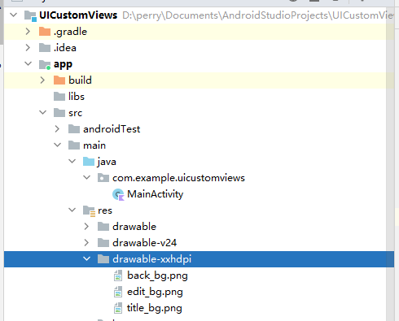


```xml
<!-- app/src/main/res/layout/title.xml -->
<?xml version="1.0" encoding="utf-8"?>
<LinearLayout xmlns:android="http://schemas.android.com/apk/res/android"
    android:orientation="vertical"
    android:layout_width="match_parent"
    android:layout_height="wrap_content"
    android:background="@drawable/title_bg">			<!-- 设置背景 -->

    <Button
        android:layout_width="wrap_content"
        android:layout_height="wrap_content"
        android:id="@+id/titleBack"
        android:layout_gravity="center"					<!-- 对于其parent（父视图）的对齐方式 -->
        android:layout_margin="5dp"						<!-- 设置上下左右外边距 -->
        android:background="@drawable/back_bg"	
        android:text="Back"
        android:textColor="#fff"/>

    <TextView
        android:layout_width="0dp"
        android:layout_height="wrap_content"
        android:id="@+id/titleText"
        android:layout_gravity="center"					<!-- 对于其parent（父视图）的对齐方式 -->
        android:layout_weight="1"						<!-- 宽度 = 整体 - 其他控件占用的控件 -->
        android:gravity="center"						<!-- 对控件自身内容对自己的限定 -->
        android:text="Title Text"
        android:textColor="#fff"
        android:textSize="24sp"/>

    <Button
        android:layout_width="wrap_content"
        android:layout_height="wrap_content"
        android:id="@+id/titleEdit"
        android:layout_gravity="center"					<!-- 对于其parent（父视图）的对齐方式 -->
        android:layout_margin="5dp"						<!-- 设置上下左右外边距 -->
        android:background="@drawable/edit_bg"
        android:text="Edit"
        android:textColor="#fff"/>
</LinearLayout>
```

```xml
<!-- app/src/main/java/com/example/uicustomviews/MainActivity.kt -->
<LinearLayout xmlns:android="http://schemas.android.com/apk/res/android"
    android:layout_width="match_parent"
    android:layout_height="match_parent">

    <include layout="@layout/title" />
</LinearLayout>
```

```kotlin
// app/src/main/java/com/example/uicustomviews/MainActivity.kt
package com.example.uicustomviews

import androidx.appcompat.app.AppCompatActivity
import android.os.Bundle

class MainActivity : AppCompatActivity() {
    override fun onCreate(savedInstanceState: Bundle?) {
        super.onCreate(savedInstanceState)
        setContentView(R.layout.activity_main)
//        隐藏默认的标题栏
        supportActionBar?.hide()
    }
}
```

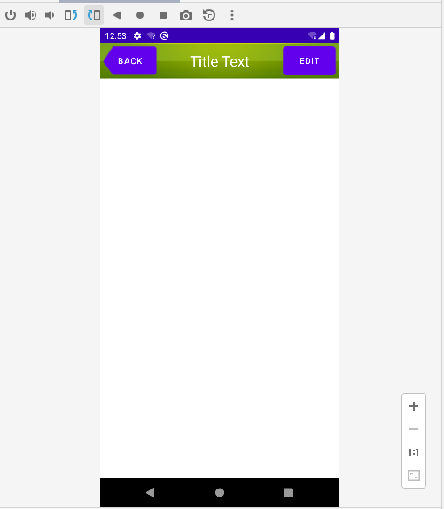

按钮不生效问题，修改 app/src/main/res/values/themes.xml

将

```xml
<style name="Theme.UICustomViews" parent="Theme.MaterialComponents.DayNight.DarkActionBar">
```

改为：

```xml
<style name="Theme.UICustomViews" parent="Theme.MaterialComponents.DayNight.Bridge">
```

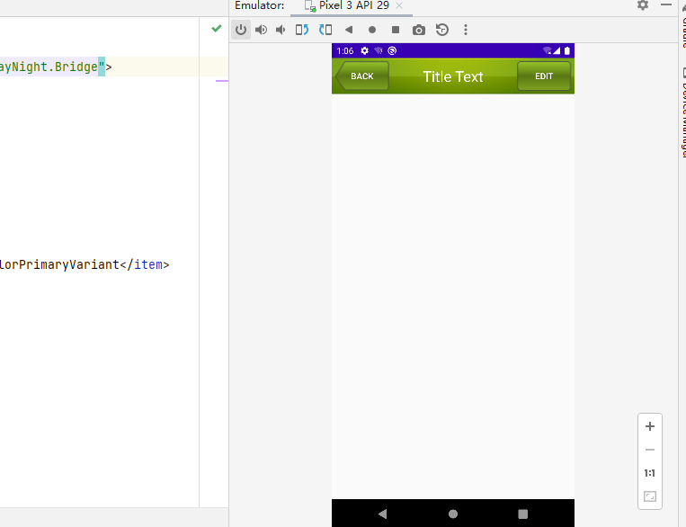


### 4.4.2 创建自定义控件

引入布局的技巧确实解决了重复编写布局代码的问题，但是如果布局中有一些控件要求能够响应事件，我们还是需要在每个Activity中为这些控件单独编写一次事件注册的代码。

比如标题栏中的返回按钮，不管是在哪一个Activity中，这个按钮的功能都是相同的，即销毁当前 Activity。

而如果在每一个Activity中都需要重新注册一遍返回按钮的点击事件，无疑会增加很多重复代码，这种情况最好是使用自定义控件的方式来解决。


新建TitleLayout类继承自LinearLayout，让它成为我们自定义的标题栏控件

```kotlin
package com.example.uicustomviews

import android.content.Context
import android.util.AttributeSet
import android.view.LayoutInflater
import android.widget.LinearLayout

class TitleLayout(context: Context, attrs: AttributeSet) : LinearLayout(context, attrs) {
    init {
        LayoutInflater.from(context).inflate(R.layout.title, this)
    }
}
```

这里我们在TitleLayout的主构造函数中声明了Context和AttributeSet这两个参数，在布局中引入TitleLayout控件时就会调用这个构造函数。

然后在init结构体中需要对标题栏布局进行动态加载，这就要借助LayoutInflater来实现了。

通过LayoutInflater的from()方法可以构建出 一个LayoutInflater对象，然后调用inflate()方法就可以动态加载一个布局文件。 

inflate()方法接收两个参数：第一个参数是要加载的布局文件的id，这里我们传入 R.layout.title；第二个参数是给加载好的布局再添加一个父布局，这里我们想要指定为TitleLayout，于是直接传入this。


在布局中添加自定义控件（此前编写的 include 此时可删除）

```xml
<!-- app/src/main/java/com/example/uicustomviews/MainActivity.kt -->
<LinearLayout xmlns:android="http://schemas.android.com/apk/res/android"
    android:layout_width="match_parent"
    android:layout_height="match_parent">

    <!--    <include layout="@layout/title" />-->
    <com.example.uicustomviews.TitleLayout
        android:layout_width="match_parent"
        android:layout_height="wrap_content" />
    
</LinearLayout>	

```

重新运行程序，此时的效果和使用引入布局方式的效果是一样的

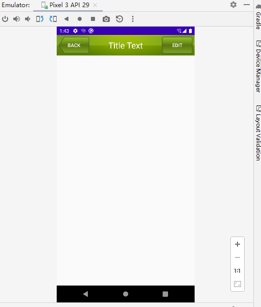


PDF214 - 目前新版语法中，由于kotlin-android-extensions弃用，暂时没有找到其他实现自定义控件的setOnClickListener功能，以后再写。


## 4.5 ListView 最常用和最难用的控件

### 4.5.1 简单用法

- 新版语法（未完成）

  ```xml
  <!-- src/main/res/layout/activity_main.xml -->
  <LinearLayout xmlns:android="http://schemas.android.com/apk/res/android"
      android:layout_width="match_parent"
      android:layout_height="match_parent">
  
      <ListView
          android:id="@+id/listView"
          android:layout_width="match_parent"
          android:layout_height="match_parent" />
  </LinearLayout>
  ```

  ```kotlin
  // 将 viewBinding 元素添加到其 build.gradle 文件中
  android {
  	...
      viewBinding {
      	enabled = true
      }
  }
  ```

- 旧版语法

  新建ListViewTest项目
  
  ```xml
  <!-- layout/activity_main.xml -->
  <LinearLayout xmlns:android="http://schemas.android.com/apk/res/android"
      android:layout_width="match_parent"
      android:layout_height="match_parent">
  
      <ListView
          android:id="@+id/listView"
          android:layout_width="match_parent"
          android:layout_height="match_parent" />
      	<!-- 将宽度和高度都设 置为match_parent，这样ListView就占满了整个布局的空间。 -->
  </LinearLayout>
  ```
  
  ```kotlin
  // layout/activity_main.xml
  package com.example.listviewtest
  
  import androidx.appcompat.app.AppCompatActivity
  import android.os.Bundle
  import android.widget.ArrayAdapter
  import kotlinx.android.synthetic.main.activity_main.*
  
  class MainActivity : AppCompatActivity() {
  	
      // 使用data 集合来进行测试，里面包含了很多水果的名称，初始化集合的方式使用的是之前在第2章学过的listOf()函数。
      private val data = listOf(
          "Apple", "Banana", "Orange", "Watermelon",
          "Pear", "Grape", "Pineapple", "Strawberry", "Cherry", "Mango",
          "Apple", "Banana", "Orange", "Watermelon", "Pear", "Grape",
          "Pineapple", "Strawberry", "Cherry", "Mango"
      )
  	
      override fun onCreate(savedInstanceState: Bundle?) {
          super.onCreate(savedInstanceState)
          setContentView(R.layout.activity_main)
          
          // 集合中的数据无法直接传递给ListView，需要借助适配器来完成。
          // Android 中提供了很多适配器的实现类，最好用的就是ArrayAdapter。它可以通过泛型来指定要适配的数据类型，然后在构造函数中把要适配的数据传入。
          // ArrayAdapter有多个构造函数的重载，由于我们这里提供的数据都是字符串，因此 将ArrayAdapter的泛型指定为String，
          // 在ArrayAdapter的构造函数中依次传入Activity的实例、ListView子项布局的id，以及数据源。
          // 此处使用android.R.layout.simple_list_item_1作为ListView子项布局的id，这是Android内置的布局文件，里面只有一个TextView，可用于简单地显示一段文本。这样适配器对象就构建好了。
          val adapter = ArrayAdapter<String>(this, android.R.layout.simple_list_item_1, data)
          listView.adapter = adapter
      }
  }
  ```
  
  运行效果：
  
  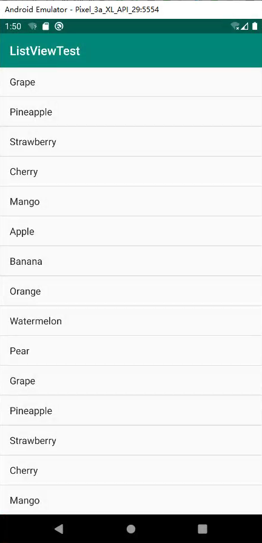

### 4.5.2 定制界面

- 旧版语法

  图片资源准备

  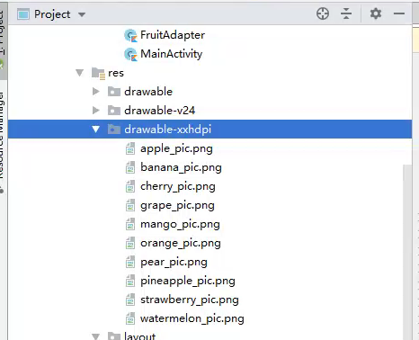

  新建Fruit类，作为ListView适配器的适配类型。

  Fruit类中只有两个字段：name表示水果的名字，imageId表示水果对应图片的资源id。

  ```kotlin
  // com/example/listviewtest/Fruit.kt
  package com.example.listviewtest
  
  class Fruit(val name:String, val imageId: Int)
  ```

  

  为ListView的子项指定自定义布局，layout目录下新建 fruit_item.xml

  mageView用于显示水果的图片，TextView用于 显示水果的名称，

  ```xml
  <LinearLayout xmlns:android="http://schemas.android.com/apk/res/android"
      android:layout_width="match_parent"
      android:layout_height="60dp">
  
      <ImageView
          android:id="@+id/fruitImage"
          android:layout_width="40dp"
          android:layout_height="40dp"
          android:layout_gravity="center_vertical"	<!-- 垂直方向上居中 -->
          android:layout_marginLeft="10dp" />
  
      <TextView
          android:id="@+id/fruitName"
          android:layout_width="wrap_content"
          android:layout_height="wrap_content"
          android:layout_gravity="center_vertical"	<!-- 垂直方向上居中 -->
          android:layout_marginLeft="10dp" />
  </LinearLayout>
  ```

  创建自定义适配器：类FruitAdapter，继承ArrayAdapter，并将泛型指定为 Fruit类。

  ```kotlin
  package com.example.listviewtest
  
  import android.app.Activity
  import android.view.LayoutInflater
  import android.view.View
  import android.view.ViewGroup
  import android.widget.ArrayAdapter
  import android.widget.ImageView
  import android.widget.TextView
  
  class FruitAdapter(activity: Activity, val resurceID: Int, data: List<Fruit>) :
  	// FruitAdapter定义了一个主构造函数，用于将Activity的实例、ListView子项布局的id和数 据源传递进来
      ArrayAdapter<Fruit>(activity, resurceID, data) {
  		// 重写getView()方法，在每个子项被滚动到屏幕内的时候会被调用
          override fun getView(position: Int, convertView: View?, parent: ViewGroup): View {
              
              // LayoutInflater为这个子项加载我们传入的布局。 
              // LayoutInflater的inflate()方法接收3个参数，前两个参数我们已经知道是什么意思了， 
              // 第三个参数指定成false，表示只让我们在父布局中声明的layout属性生效，但不会为这个View添加父布局。
              // 因为一旦View有了父布局之后，它就不能再添加到ListView中了
              val view = LayoutInflater.from(context).inflate(resurceID, parent, false)
              
              // 调用View的findViewById()方法分别获取到ImageView和 TextView的实例，
              // 通过getItem()方法得到当前项的Fruit实例
              val fruitImage: ImageView = view.findViewById(R.id.fruitImage)
              val fruitName: TextView = view.findViewById(R.id.fruitName)
              
              // // 获取当前项的Fruit实例
              var fruit = getItem(position)   
              
              // 分别调用它们的setImageResource()和setText()方法设置显示的图片和文字
              if (fruit != null) {
                  fruitImage.setImageResource(fruit.imageId)
                  fruitName.text = fruit.name
              }
  
              // 最后将布局返回
              return view
          }
  }
  ```

  最后：

  initFruits()方法，用于初始化所有的水果数据。

  Fruit类的构造函数中将水果的名字和对应的图片id传入，然后把创建好的对象添加到水果列表中

  repeat函数将所有的水果数据添加了两遍，这是因为如果只添加一遍的话，数 据量还不足以充满整个屏幕。

  repeat函数是Kotlin中另外一个非常常用的标准函数，它允许 传入一个数值n，然后会把Lambda表达式中的内容执行n遍。

  接着在onCreate()方法中创建FruitAdapter对象，并将它作为适配器传递给ListView，这样定制ListView界面的任务就完成了

  ```kotlin
  //com/example/listviewtest/MainActivity.kt
  package com.example.listviewtest
  
  import androidx.appcompat.app.AppCompatActivity
  import android.os.Bundle
  import android.widget.ArrayAdapter
  import kotlinx.android.synthetic.main.activity_main.*
  
  class MainActivity : AppCompatActivity() {
  
      private val data = listOf(
          "Apple", "Banana", "Orange", "Watermelon",
          "Pear", "Grape", "Pineapple", "Strawberry", "Cherry", "Mango",
          "Apple", "Banana", "Orange", "Watermelon", "Pear", "Grape",
          "Pineapple", "Strawberry", "Cherry", "Mango"
      )
  
      private val fruitList = ArrayList<Fruit>()
  
      override fun onCreate(savedInstanceState: Bundle?) {
          super.onCreate(savedInstanceState)
          setContentView(R.layout.activity_main)
          initFruits()    // 初始化水果数据
          val adapter = FruitAdapter(this, R.layout.fruit_item, fruitList)
          listView.adapter = adapter
      }
  
      private fun initFruits() {
          repeat(2) {
              fruitList.add(Fruit("Apple", R.drawable.apple_pic))
              fruitList.add(Fruit("Banana", R.drawable.banana_pic))
              fruitList.add(Fruit("Orange", R.drawable.orange_pic))
              fruitList.add(Fruit("Watermelon", R.drawable.watermelon_pic))
              fruitList.add(Fruit("Pear", R.drawable.pear_pic))
              fruitList.add(Fruit("Grape", R.drawable.grape_pic))
              fruitList.add(Fruit("Pineapple", R.drawable.pineapple_pic))
              fruitList.add(Fruit("Strawberry", R.drawable.strawberry_pic))
              fruitList.add(Fruit("Cherry", R.drawable.cherry_pic))
              fruitList.add(Fruit("Mango",R.drawable.mango_pic))
          }
      }
  }
  
  ```

  运行：

  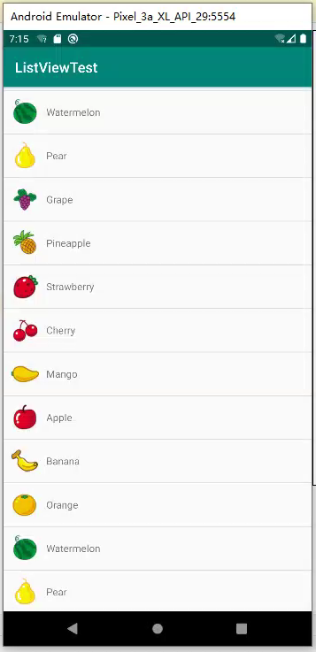

### 4.5.3 优化性能

**优化快速滚动性能**

```kotlin
// com/example/listviewtest/FruitAdapter.kt
package com.example.listviewtest

import android.app.Activity
import android.view.LayoutInflater
import android.view.View
import android.view.ViewGroup
import android.widget.ArrayAdapter
import android.widget.ImageView
import android.widget.TextView

class FruitAdapter(activity: Activity, val resurceID: Int, data: List<Fruit>):
    ArrayAdapter<Fruit>(activity, resurceID, data) {

        override fun getView(position: Int, convertView: View?, parent: ViewGroup): View {
			
            // 在getView()方法中进行了判断：
            // 如果convertView为null，则使用 LayoutInflater去加载布局；
            val view : View
            if (convertView == null) {
                view = LayoutInflater.from(context).inflate(resurceID, parent, false)
            } 
            // 如果不为null，则直接对convertView进行重用。
            else {
                view = convertView
            }
            val fruitImage: ImageView = view.findViewById(R.id.fruitImage)
            val fruitName: TextView = view.findViewById(R.id.fruitName)
            var fruit = getItem(position)   // 获取当前项的Fruit实例
            if (fruit != null) {
                fruitImage.setImageResource(fruit.imageId)
                fruitName.text = fruit.name
            }
            return view
        }
    }
```


还可以继续优化，虽然现在已经不会再重复去加载布局，但每次在getView()方法中仍然会调用View的findViewById()方法来获取一次控件的实例。

我们可以借助ViewHolder来对这部分性能进行优化

这样所有控件的实例都缓存在了ViewHolder里， 就没有必要每次都通过findViewById()方法来获取控件实例了

```kotlin
// com/example/listviewtest/FruitAdapter.kt
package com.example.listviewtest

import android.app.Activity
import android.view.LayoutInflater
import android.view.View
import android.view.ViewGroup
import android.widget.ArrayAdapter
import android.widget.ImageView
import android.widget.TextView

class FruitAdapter(activity: Activity, val resourceID: Int, data: List<Fruit>):
    ArrayAdapter<Fruit>(activity, resourceID, data) {

        // 借助ViewHolder来对这部分性能进行优化；内部类ViewHolder，用于对ImageView和TextView的控件实例进行缓存
        inner class ViewHolder(val fruitImage: ImageView, val fruitName: TextView)

        override fun getView(position: Int, convertView: View?, parent: ViewGroup): View {

            val view : View
            // 定义变量viewHolder
            val viewHolder: ViewHolder

            // 当convertView为null的时候，创建ViewHolder对象，并将控件的实例存放在ViewHolder里，
            // 然后调用View的setTag()方法，将ViewHolder对象存储在View中。
            if (convertView == null) {
                // 当convertView为null的时候，创建ViewHolder对象，并将控件的实例存放在ViewHolder里，
                view = LayoutInflater.from(context).inflate(resourceID, parent, false)
                val fruitImage: ImageView = view.findViewById(R.id.fruitImage)
                val fruitName: TextView = view.findViewById(R.id.fruitName)
                viewHolder = ViewHolder(fruitImage, fruitName)
                // 然后调用View的setTag()方法，将ViewHolder对象存储在View中。
                view.tag = viewHolder

            } else {
                // 当convertView不为null的时候，则调用View的getTag()方法，把ViewHolder重新取出。
                view = convertView
                viewHolder = view.tag as ViewHolder
            }

            var fruit = getItem(position)   // 获取当前项的Fruit实例
            if (fruit != null) {
                viewHolder.fruitImage.setImageResource(fruit.imageId)
                viewHolder.fruitName.text = fruit.name
            }
            return view
        }
    }
```

### 添加点击事件

在OnClick()中添加监听器

当用户点击ListView中的任何一个子项时，就会回调到Lambda表达式中。

通过 position参数判断用户点击的是哪一个子项，然后获取到相应的水果，并通过Toast将水果的名字显示出来。

```kotlin
// com/example/listviewtest/MainActivity.kt

......

    override fun onCreate(savedInstanceState: Bundle?) {
        ......
        
        listView.setOnItemClickListener { parent, view, position, id ->
            val fruit = fruitList[position]
            Toast.makeText(this, fruit.name, Toast.LENGTH_SHORT).show()
        }
    }

......

}
```

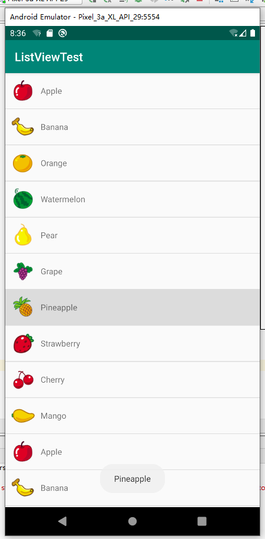


## 附录

- Logcat一直打印 `E/GnssHAL_GnssInterface: gnssSvStatusCb: a: input svInfo.flags is 8`
  - 关闭定位服务即可
- match_parent和wrap_content的区别
  - match_parent表示让当前控件的大小和父布局的大小一样，也就是由父布局来决定当前控件的大小
  - wrap_content表示让当前的控件大小能够刚好包含里面的内容，也就是由控件内容决定当前控件的大小


