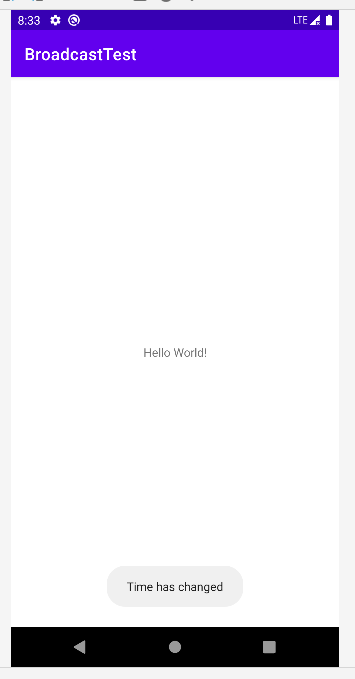
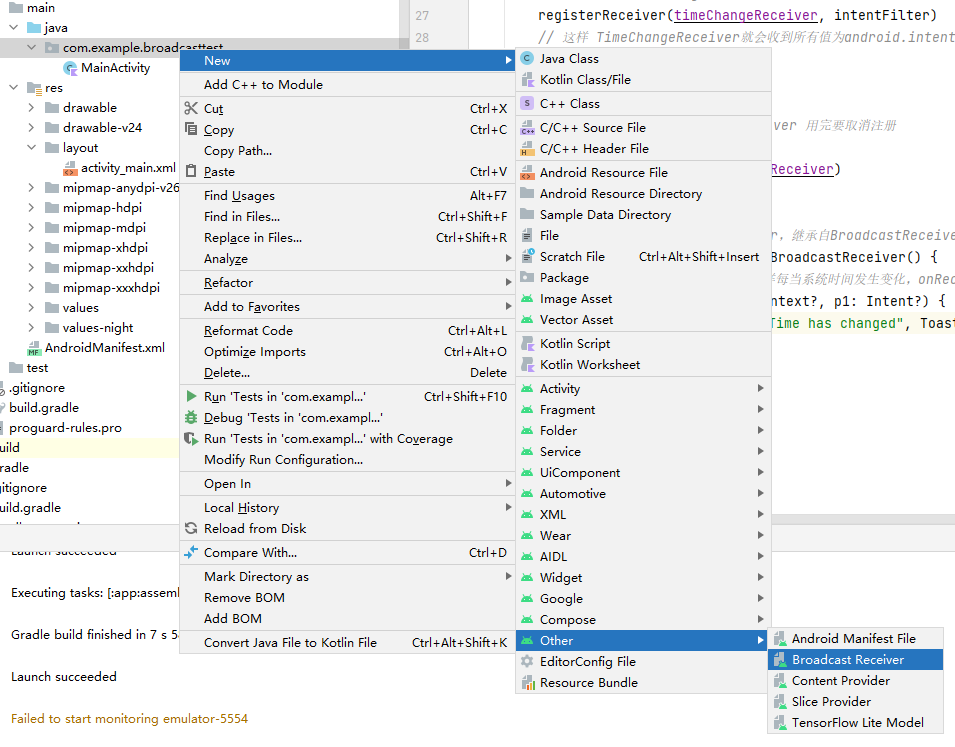
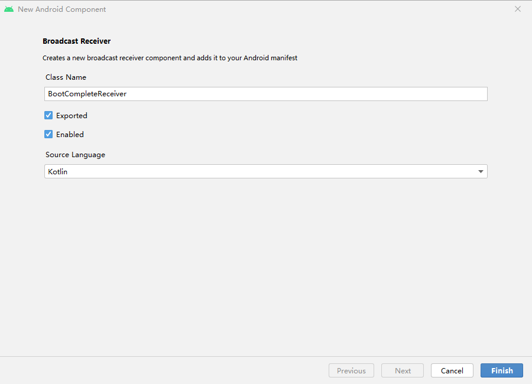
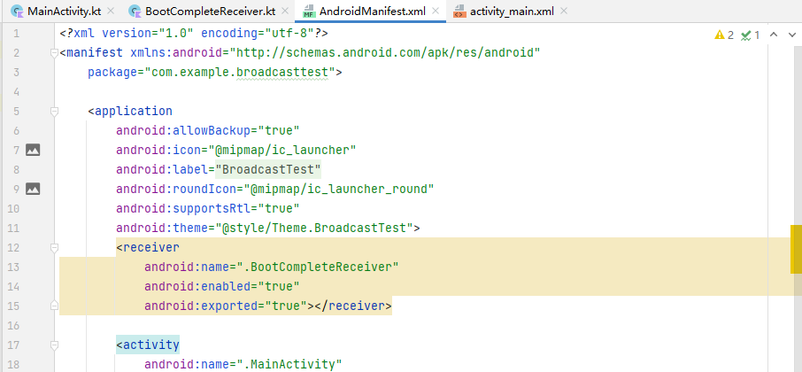
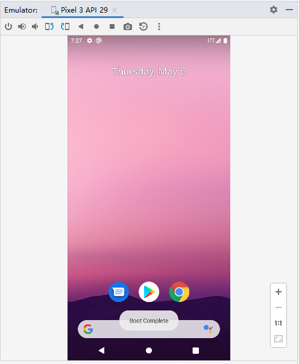
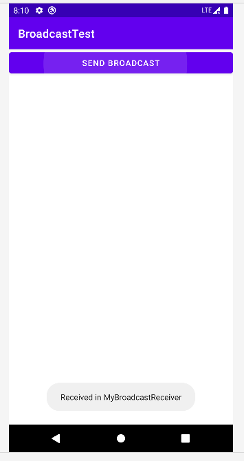
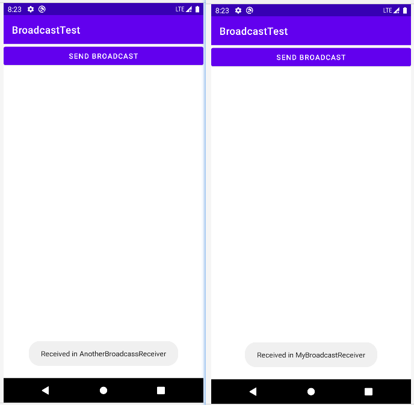

# 广播

发送广播的方法：借助`Intent`和`BroadcastReceiver`。


**广播的类型**

- 标准广播
  - 标准广播（normal broadcasts）是一种完全异步执行的广播，在广播发出之后，所有的 BroadcastReceiver几乎会在同一时刻收到这条广播消息，因此它们之间没有任何先后顺序可言。这种广播的效率会比较高，但同时也意味着它是无法被截断的。
- 有序广播
  - 有序广播（ordered broadcasts）则是一种同步执行的广播，在广播发出之后，同一时刻 只会有一个BroadcastReceiver能够收到这条广播消息，当这个BroadcastReceiver中的 逻辑执行完毕后，广播才会继续传递。所以此时的BroadcastReceiver是有先后顺序的， 优先级高的BroadcastReceiver就可以先收到广播消息，并且前面的BroadcastReceiver还可以截断正在传递的广播，这样后面的BroadcastReceiver就无法收到广播消息了。


## 接收系统广播

### **动态注册 监视时间变化**

创建项目 BroadcastTest

```kotlin
package com.example.broadcasttest

import android.content.BroadcastReceiver
import android.content.Context
import android.content.Intent
import android.content.IntentFilter
import androidx.appcompat.app.AppCompatActivity
import android.os.Bundle
import android.widget.Toast

class MainActivity : AppCompatActivity() {

    lateinit var timeChangeReceiver: TimeChangeReceiver

    override fun onCreate(savedInstanceState: Bundle?) {
        super.onCreate(savedInstanceState)
        setContentView(R.layout.activity_main)

        // 创建 IntentFilter 的实例
        val intentFilter = IntentFilter()
        // 系统时间发生变化时，系统会发出 android.intent.action.TIME_TICK 广播
        // 故添加 android.intent.action.TIME_TICK 的 action
        intentFilter.addAction("android.intent.action.TIME_TICK")
        // 调用TimeChangeReceiver()方法，以便下面的注册
        timeChangeReceiver = TimeChangeReceiver()
        // 注册：将将TimeChangeReceiver的实例和IntentFilter的实例都传进去
        registerReceiver(timeChangeReceiver, intentFilter)
        // 这样 TimeChangeReceiver就会收到所有值为android.intent.action.TIME_TICK的广播，也就实现了监听系统时间变化的功能
    }

    override fun onDestroy() {
        // 注：动态注册的 BroadcastReceiver 用完要取消注册
        super.onDestroy()
        unregisterReceiver(timeChangeReceiver)
    }

    // 定义了一个内部类TimeChangeReceiver，继承自BroadcastReceiver
    inner class TimeChangeReceiver : BroadcastReceiver() {
        // 重写了父类的 onReceive()，这样每当系统时间发生变化，onReceive()方法就会得到执行
        override fun onReceive(p0: Context?, p1: Intent?) {
            Toast.makeText(p0, "Time has changed", Toast.LENGTH_LONG).show()
        }
    }
}
```

onCreate()方法，首先我们创建了一个IntentFilter的实例，并给它添加了一个 值为android.intent.action.TIME_TICK的action，为什么要添加这个值呢？因为当系统 时间发生变化时，系统发出的正是一条值为android.intent.action.TIME_TICK的广播， 也就是说我们的BroadcastReceiver想要监听什么广播，就在这里添加相应的action。接下 来创建了一个TimeChangeReceiver的实例，然后调用registerReceiver()方法进行注 册，将TimeChangeReceiver的实例和IntentFilter的实例都传了进去，这样 TimeChangeReceiver就会收到所有值为android.intent.action.TIME_TICK的广播， 也就实现了监听系统时间变化的功能。
最后要记得，动态注册的BroadcastReceiver一定要取消注册才行，这里我们是在
onDestroy()方法中通过调用unregisterReceiver()方法来实现的。


运行后，等待时间变化（默认每分钟系统回广播一次）。




**完整的系统广播列表位于以下路径**

```
<Android SDK>/platforms/<任意android api版本>/data/broadcast_actions.txt
```


### 静态注册 实现开机自启

动态注册的 BroadcastReceiver 可以自由地控制注册与注销，在灵活性方面有很大的优势。

但必须在程序启动之后才能接收广播，因为注册的逻辑是写在 onCreate() 方法中的。

程序在未启动的情况下也能接收广播，则需要使用静态注册的方式了。


在Android 8.0系统之后，所有隐式广播都不允许使用静态注册的方式来接收了。

隐式广播指的是那些没有具体指定发送给哪个应用程序的广播，大多数系统广播属于隐式广播，但是少数特 殊的系统广播目前仍然允许使用静态注册的方式来接收。

这些特殊的系统广播列表详见 https://developer.android.google.cn/guide/components/broadcast-exceptions.html。


**例：例用静态注册，实现开机自启：**

在上一个例子中，使用静态类的方法创建的 BroadcasReceiver ，其实也可以通过AS提供的快捷方式来创建：






广播接收器配置

```kotlin
// src/main/java/com/example/broadcasttest/BootCompleteReceiver.kt
package com.example.broadcasttest

import android.content.BroadcastReceiver
import android.content.Context
import android.content.Intent
import android.widget.Toast

class BootCompleteReceiver : BroadcastReceiver() {

    override fun onReceive(context: Context, intent: Intent) {
        Toast.makeText(context, "Boot Complete", Toast.LENGTH_LONG).show()
    }
}
```

注：静态的BroadcastReceiver一定要在AndroidManifest.xml文件中注册才可以使用。不 过，由于我们是使用Android Studio的快捷方式创建的BroadcastReceiver，因此注册这一步已经自动完成了：



\<application>标签内出现了一个新的标签\<receiver>，所有静态的 BroadcastReceiver都是在这里进行注册的。

它的用法其实和\<activity>标签非常相似，也是通过android:name指定具体注册哪一个BroadcastReceiver，而enabled和exported属 性则是根据我们刚才勾选的状态自动生成的。

不过目前的BootCompleteReceiver是无法收到开机广播的，因为我们还需要对AndroidManifest.xml文件进行修改才行，如下所示：

```xml
<?xml version="1.0" encoding="utf-8"?>
<manifest xmlns:android="http://schemas.android.com/apk/res/android"
    package="com.example.broadcasttest">
    
	<!-- 申请权限 -->
    <uses-permission android:name="android.permission.RECEIVE_BOOT_COMPLETED" />

    <application
        android:allowBackup="true"
        android:icon="@mipmap/ic_launcher"
        android:label="@string/app_name"
        android:roundIcon="@mipmap/ic_launcher_round"
        android:supportsRtl="true"
        android:theme="@style/Theme.BroadcastTest">
        <receiver
            android:name=".BootCompleteReceiver"
            android:enabled="true"
            android:exported="true">
            
            <!-- Android系统启动完成后会发出一条值为android.intent.action.BOOT_COMPLETED 的广播，-->
            <!-- 因此我们在<receiver>标签中又添加了一个<intent-filter>标签，并在里面声明了相应的action。  -->
            <intent-filter>
                <action android:name="android.intent.action.BOOT_COMPLETED"/>
            </intent-filter>
            
        </receiver>

        <activity
            ......
        </activity>
    </application>
</manifest>
```

运行后，重启手机：




## 发送自定义广播

### 发送标准广播

在发送广播之前，先定义一个BroadcastReceiver来准备接收此广播：新建一个MyBroadcastReceiver

```kotlin
// src/main/java/com/example/broadcasttest/MyBroadcastReceiver.kt
package com.example.broadcasttest

import android.content.BroadcastReceiver
import android.content.Context
import android.content.Intent
import android.widget.Toast

class MyBroadcastReceiver : BroadcastReceiver() {

    override fun onReceive(context: Context, intent: Intent) {
        // This method is called when the BroadcastReceiver is receiving an Intent broadcast.
        Toast.makeText(context, "Received in MyBroadcastReceiver",Toast.LENGTH_LONG).show()
    }
}
```

在AndroidManifest.xml中对这个BroadcastReceiver进行修改

```xml
<!-- src/main/AndroidManifest.xml -->
<?xml version="1.0" encoding="utf-8"?>
<manifest xmlns:android="http://schemas.android.com/apk/res/android"
    package="com.example.broadcasttest">

    <uses-permission android:name="android.permission.RECEIVE_BOOT_COMPLETED" />

    <application
        android:allowBackup="true"
        android:icon="@mipmap/ic_launcher"
        android:label="@string/app_name"
        android:roundIcon="@mipmap/ic_launcher_round"
        android:supportsRtl="true"
        android:theme="@style/Theme.BroadcastTest">
        <receiver
            android:name=".MyBroadcastReceiver"
            android:enabled="true"
            android:exported="true">
            <intent-filter>
                <!-- 这里让MyBroadcastReceiver接收一条值为 com.example.broadcasttest.MY_BROADCAST的广播， -->
                <!-- 因此待会儿在发送广播的时候，我们就需要发出这样的一条广播。 -->
                <action android:name="com.example.broadcasttest.MY_BROADCAST"/>
            </intent-filter>
        </receiver>
        <receiver
            android:name=".BootCompleteReceiver"
            android:enabled="true"
            android:exported="true">
            <intent-filter>
                <action android:name="android.intent.action.BOOT_COMPLETED" />
            </intent-filter>
        </receiver>

        <activity
            ......
        </activity>
    </application>

</manifest>
```

修改MainActivity的布局

```xml
<!-- src/main/res/layout/activity_main.xml -->
<LinearLayout xmlns:android="http://schemas.android.com/apk/res/android"
    android:layout_width="match_parent"
    android:layout_height="match_parent"
    android:orientation="vertical">

    <Button
        android:id="@+id/button"
        android:layout_width="match_parent"
        android:layout_height="wrap_content"
        android:text="Send Broadcast" />
</LinearLayout>
```

为Button添加自定义广播的逻辑

```kotlin
package com.example.broadcasttest

import android.content.BroadcastReceiver
import android.content.Context
import android.content.Intent
import android.content.IntentFilter
import androidx.appcompat.app.AppCompatActivity
import android.os.Bundle
import android.widget.Toast
import com.example.broadcasttest.databinding.ActivityMainBinding

class MainActivity : AppCompatActivity() {
    private lateinit var binding: ActivityMainBinding
    lateinit var timeChangeReceiver: TimeChangeReceiver

    override fun onCreate(savedInstanceState: Bundle?) {
        super.onCreate(savedInstanceState)
        setContentView(R.layout.activity_main)
        binding = ActivityMainBinding.inflate(layoutInflater)
        val view = binding.root
        setContentView(view)

        // 创建 IntentFilter 的实例
        val intentFilter = IntentFilter()
        // 系统时间发生变化时，系统会发出 android.intent.action.TIME_TICK 广播
        // 故添加 android.intent.action.TIME_TICK 的 action
        intentFilter.addAction("android.intent.action.TIME_TICK")
        // 调用TimeChangeReceiver()方法，以便下面的注册
        timeChangeReceiver = TimeChangeReceiver()
        // 注册：将将TimeChangeReceiver的实例和IntentFilter的实例都传进去
        registerReceiver(timeChangeReceiver, intentFilter)
        // 这样 TimeChangeReceiver就会收到所有值为android.intent.action.TIME_TICK的广播，也就实现了监听系统时间变化的功能

        // 为Button添加自定义广播的逻辑
        binding.button.setOnClickListener {
            val intent = Intent("com.example.broadcasttest.MY_BROADCAST")
            intent.setPackage(packageName)
            sendBroadcast(intent)
        }
    }

    override fun onDestroy() {
        // 注：动态注册的 BroadcastReceiver 用完要取消注册
        super.onDestroy()
        unregisterReceiver(timeChangeReceiver)
    }

    // 定义了一个内部类TimeChangeReceiver，继承自BroadcastReceiver
    inner class TimeChangeReceiver : BroadcastReceiver() {
        // 重写了父类的 onReceive()，这样每当系统时间发生变化，onReceive()方法就会得到执行
        override fun onReceive(p0: Context?, p1: Intent?) {
            Toast.makeText(p0, "Time has changed", Toast.LENGTH_LONG).show()
        }
    }
}
```

运行，并点击Send Broadcast



### 发送有序广播

和标准广播不同，有序广播是一种同步执行的广播，并且是可以被截断的。

为了验证这一点，我们需要再创建一个新的BroadcastReceiver。新建AnotherBroadcastReceiver：

```kotlin
// src/main/java/com/example/broadcasttest/AnotherBroadcastReceiver.kt
package com.example.broadcasttest

import android.content.BroadcastReceiver
import android.content.Context
import android.content.Intent
import android.widget.Toast

class AnotherBroadcastReceiver : BroadcastReceiver() {

    override fun onReceive(context: Context, intent: Intent) {
        // This method is called when the BroadcastReceiver is receiving an Intent broadcast.
        Toast.makeText(context, "Received in AnotherBroadcassReceiver", Toast.LENGTH_LONG).show()
    }
}
```

修改AndroidManifest.xml

```xml
<!-- src/main/AndroidManifest.xml -->
<?xml version="1.0" encoding="utf-8"?>
<manifest xmlns:android="http://schemas.android.com/apk/res/android"
    package="com.example.broadcasttest">

    <uses-permission android:name="android.permission.RECEIVE_BOOT_COMPLETED" />

    <application
        android:allowBackup="true"
        android:icon="@mipmap/ic_launcher"
        android:label="@string/app_name"
        android:roundIcon="@mipmap/ic_launcher_round"
        android:supportsRtl="true"
        android:theme="@style/Theme.BroadcastTest">
        <receiver
            android:name=".AnotherBroadcastReceiver"
            android:enabled="true"
            android:exported="true">
            <intent-filter>
                <action android:name="com.example.broadcasttest.MY_BROADCAST"/>
            </intent-filter>
        </receiver>
        <receiver
            ...
        </receiver>
        <receiver
            ...
        </receiver>

        <activity
            ...
        </activity>
    </application>

</manifest>
```

此时，运行并点击Send：

两个BroadcastReceiver都接收到了自定义广播，但目前都是标准广播。



**实现有序广播**

回到MainActivity.kt，更改一行代码即可

```kotlin
......
class MainActivity : AppCompatActivity() {
    private lateinit var binding: ActivityMainBinding
    lateinit var timeChangeReceiver: TimeChangeReceiver

    override fun onCreate(savedInstanceState: Bundle?) {
        ......

            // 发送标准广播
//            sendBroadcast(intent)

            // 发送有序广播；第一个参数仍然是Intent；第二个参数是一个与权限相关的字符串，这里传入null就行了。
            sendOrderedBroadcast(intent, null)
	}
}
......
```

回到AndroidMAnifest.xml，为目前的两个Receiver设置优先级

```xml
<?xml version="1.0" encoding="utf-8"?>
<manifest xmlns:android="http://schemas.android.com/apk/res/android"
    package="com.example.broadcasttest">

    <uses-permission android:name="android.permission.RECEIVE_BOOT_COMPLETED" />

    <application
        android:allowBackup="true"
        android:icon="@mipmap/ic_launcher"
        android:label="@string/app_name"
        android:roundIcon="@mipmap/ic_launcher_round"
        android:supportsRtl="true"
        android:theme="@style/Theme.BroadcastTest">
        <receiver
            android:name=".AnotherBroadcastReceiver"
            android:enabled="true"
            android:exported="true">
            
            <!-- 添加优先级参数： -->
            <intent-filter android:priority="50">
                <action android:name="com.example.broadcasttest.MY_BROADCAST"/>
            </intent-filter>
        </receiver>
        <receiver
            android:name=".MyBroadcastReceiver"
            android:enabled="true"
            android:exported="true">
            
            <!-- 添加优先级参数： -->
            <intent-filter android:priority="100">
                <action android:name="com.example.broadcasttest.MY_BROADCAST" />
            </intent-filter>
        </receiver>
        <receiver
            ...
        </receiver>

        <activity
            ......
        </activity>
    </application>

</manifest>
```

此时，MyBroadcastReceiver一定会被更先收到广播，然后才到AnotherBroadcastReceiver。


**实现阻断广播**

```kotlin
// src/main/java/com/example/broadcasttest/MyBroadcastReceiver.kt
package com.example.broadcasttest

import android.content.BroadcastReceiver
import android.content.Context
import android.content.Intent
import android.widget.Toast

class MyBroadcastReceiver : BroadcastReceiver() {

    override fun onReceive(context: Context, intent: Intent) {
        // This method is called when the BroadcastReceiver is receiving an Intent broadcast.
        Toast.makeText(context, "Received in MyBroadcastReceiver",Toast.LENGTH_LONG).show()
        
        // 控制是否继续传递广播：阻止
        abortBroadcast()
    }
}
```

在此种情况下，MyBroadcastReceiver收到广播后，响应时就会阻断广播的传递，AnotherBroadcastReceiver不会收到广播。

运行程序，并点击“Send Broadcast”按钮，你会发现只有MyBroadcastReceiver中 的Toast信息能够弹出


# 附录

**视图绑定**

视图绑定功能可按模块启用。要在某个模块中启用视图绑定，请将 `viewBinding` 元素添加到其 `build.gradle` 文件中，如下例所示：

```groovy
android {
        ...
        viewBinding {
            enabled = true
        }
    }
```

**在 Activity 中使用视图绑定**

如需设置绑定类的实例以供 Activity 使用，请在 Activity 的 [`onCreate()`](https://developer.android.google.cn/reference/kotlin/android/app/Activity?hl=zh-cn#oncreate) 方法中执行以下步骤：

1. 调用生成的绑定类中包含的静态 `inflate()` 方法。此操作会创建该绑定类的实例以供 Activity 使用。
2. 通过调用 `getRoot()` 方法或使用 [Kotlin 属性语法](https://kotlinlang.org/docs/reference/properties.html#declaring-properties)获取对根视图的引用。
3. 将根视图传递到 [`setContentView()`](https://developer.android.google.cn/reference/kotlin/android/app/Activity?hl=zh-cn#setcontentview_1)，使其成为屏幕上的活动视图。

```kotlin
private lateinit var binding: ResultProfileBinding

override fun onCreate(savedInstanceState: Bundle) {
    super.onCreate(savedInstanceState)
    binding = ResultProfileBinding.inflate(layoutInflater)
    val view = binding.root
    setContentView(view)
}
```

您现在即可使用该绑定类的实例来引用任何视图：

```kotlin
binding.name.text = viewModel.name
binding.button.setOnClickListener { viewModel.userClicked() }
```


**环境**

Kotlin：1.6.20

Android Studio Bumblebee | 2021.1.1 Patch 2
Build # AI-211.7628.21.2111.8193401, built on February 17, 2022
Runtime version: 11.0.11+9-b60-7590822 amd64
VM: OpenJDK 64-Bit Server VM by Oracle Corporation


