# 文件

## 文件存取

### 文件存储

```xml
<!-- src/main/res/layout/activity_main.xml -->
<LinearLayout xmlns:android="http://schemas.android.com/apk/res/android"
    android:layout_width="match_parent"
    android:layout_height="match_parent"
    android:orientation="vertical">

    <EditText
        android:id="@+id/editText"
        android:layout_width="match_parent"
        android:layout_height="wrap_content"
        android:hint="Type something here" />
</LinearLayout>
```


```kotlin
// src/main/java/com/example/filepersistencetest/MainActivity.kt
package com.example.filepersistencetest

import android.content.Context
import androidx.appcompat.app.AppCompatActivity
import android.os.Bundle
import com.example.filepersistencetest.databinding.ActivityMainBinding
import java.io.BufferedWriter
import java.io.IOException
import java.io.OutputStreamWriter

private lateinit var binding: ActivityMainBinding

class MainActivity : AppCompatActivity() {
    override fun onCreate(savedInstanceState: Bundle?) {
        super.onCreate(savedInstanceState)
        setContentView(R.layout.activity_main)

        binding = ActivityMainBinding.inflate(layoutInflater)
        val view = binding.root
        setContentView(view)
    }

    // 返回键 退出程序时调用，将数据保存起来
    override fun onDestroy() {
        super.onDestroy()
        val intputText = binding.editText.text.toString()	// 1. 获取EditText中输入的内容
        save(intputText)	// 2. 调用save()方法把输入的内容存储到文件中
    }
    
    private fun save(inputText: String) {
        try {
            
            // 通过openFileOutput()方法得到一个FileOutputStream对象，
            val output = openFileOutput("data", Context.MODE_PRIVATE)	// 3. 文件命名为data
            
            // 然后借助它构建出一个OutputStreamWriter对象，接着再使用OutputStreamWriter构建出一个BufferedWriter对象，
            // 这样就可以通过BufferedWriter将文本内容写入文件中了。
            val writer = BufferedWriter(OutputStreamWriter(output))
            writer.use { it.write(inputText) }
        }
        catch (e: IOException) {
            e.printStackTrace()
        }
    }
}
```


运行程序，并往输入框内写数据。

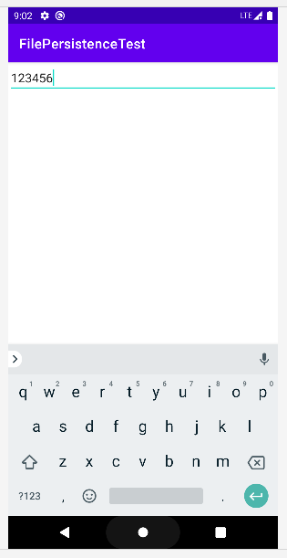

然后用返回键退出程序，打开 Device File Explorer 查看程序目录\file下的data文件内容，即可看到刚才写入的内容

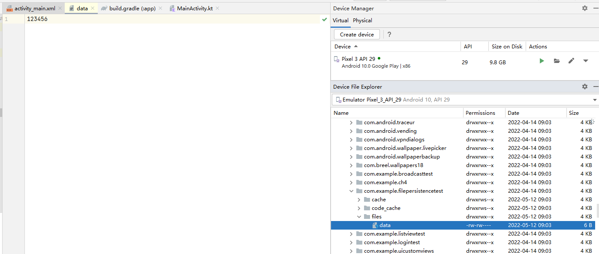


### 文件读取


```kotlin
// src/main/java/com/example/filepersistencetest/MainActivity.kt
package com.example.filepersistencetest

import android.content.Context
import androidx.appcompat.app.AppCompatActivity
import android.os.Bundle
import android.widget.Toast
import com.example.filepersistencetest.databinding.ActivityMainBinding
import java.io.*
import java.lang.StringBuilder

private lateinit var binding: ActivityMainBinding

class MainActivity : AppCompatActivity() {
    override fun onCreate(savedInstanceState: Bundle?) {
        
        ......

        val inputText = load()
        if (inputText.isNotEmpty()) {
            binding.editText.setText(inputText)
            binding.editText.setSelection(inputText.length)
            Toast.makeText(this, "Restoring succeeded", Toast.LENGTH_LONG).show()
        }

    }

    private fun load(): String {
        val content = StringBuilder()
        try {
            // 通过openFileInput()方法获取了一个FileInputStream对象
            val input = openFileInput("data")
            // 然后借助它构建出一个InputStreamReader对象，接着再使用InputStreamReader构建出一个BufferedReader对象
            // 这样通过BufferedReader就能将文件中的数据一行行读取出来，并拼接到StringBuilder对象当中
            val reader = BufferedReader(InputStreamReader(input))
            reader.use {
                reader.forEachLine {
                    content.append(it)
                }
            }
        }
        catch (e: IOException) {
            e.printStackTrace()
        }
        // 最后将读取的内容返回就可以了
        return content.toString()
    }

    ......
}
```


运行程序，可知，程序读取了data文件，将上面输入的123456自动填充到了editText中

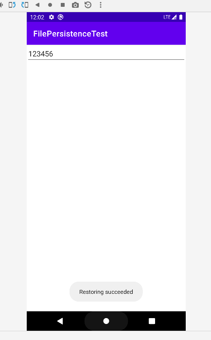


## SharedPreferences 存储

SharedPreferences是使用键值对的方式来存储数据的。

保存一条数据的时候，需要给这条数据提供一个对应的键，这样在读取数据的时候就可以通过这个键把相应的值取出来。

而且SharedPreferences还支持多种不同的数据类型存储。

注：存储时使用什么数据类型，读取时则是什么数据类型


### 数据存储

要想使用SharedPreferences存储数据，首先需要获取SharedPreferences对象。

Android 中主要提供了以下两种方法用于得到SharedPreferences对象。


**Context类中的 `getSharedPreferences()` 方法** 

接收两个参数：

1. 第一个参数用于指定SharedPreferences文件的名称，如果指定的文件不存在则会创建一个，SharedPreferences 文件存放在 `/data/data/<package name>/shared_prefs/` ；

2. 第二个参数用于指定操作模式，目前只有默认的 MODE_PRIVATE 这一种模式可选，它和直接传入 0 的效果是相同的，表示只有当前的应用程序才可以对这个 SharedPreferences 文件进行读写。


**Activity类中的 `getPreferences()` 方法**

这个方法和 Context 中的 getSharedPreferences() 方法很相似，不过它只接收一个操作模式参数，因为使用这个方法时会自动将当前 Activity 的类名作为 SharedPreferences的文件名。

得到了 SharedPreferences 对象之后，就可以开始向 SharedPreferences 文件中存储数据了，主要可以分为3步实现。

1. 调用 SharedPreferences 对象的 `edit()` 方法获取一个 SharedPreferences.Editor对象。
2. 向 SharedPreferences.Editor 对象中添加数据，比如添加一个布尔型数据就使用 `putBoolean()` 方法，添加一个字符串则使用 `putString()` 方法等。
3. 调用 `apply()` 方法将添加的数据提交，从而完成数据存储操作。


**实例**

```xml
<!-- src/main/res/layout/activity_main.xml -->
<LinearLayout xmlns:android="http://schemas.android.com/apk/res/android"
    android:layout_width="match_parent"
    android:layout_height="match_parent"
    android:orientation="vertical">

    <Button
        android:id="@+id/saveButton"
        android:layout_width="match_parent"
        android:layout_height="wrap_content"
        android:text="Save Data" />
</LinearLayout>
```


```kotlin
// src/main/java/com/example/sharedpreferencestest/MainActivity.kt
package com.example.sharedpreferencestest

import android.content.Context
import androidx.appcompat.app.AppCompatActivity
import android.os.Bundle
import com.example.sharedpreferencestest.databinding.ActivityMainBinding

private lateinit var binding: ActivityMainBinding

class MainActivity : AppCompatActivity() {
    override fun onCreate(savedInstanceState: Bundle?) {
        super.onCreate(savedInstanceState)
        setContentView(R.layout.activity_main)

        binding = ActivityMainBinding.inflate(layoutInflater)
        val view = binding.root
        setContentView(view)

        binding.saveButton.setOnClickListener {
            // 通过 getSharedPreferences() 方法指定 SharedPreferences 的文件名为 data ，并得到 SharedPreferences.Editor 对象
            val editor = getSharedPreferences("data", Context.MODE_PRIVATE).edit()
            // 向这个对象中添加了3条不同类型的数据
            editor.putString("name", "Tom")
            editor.putInt("age", 28)
            editor.putBoolean("married", false)
            // 调用 apply() 方法进行提交
            editor.apply()
        }
    }
}
```


运行程序，点击 Save Data按钮，并到 Explorer 中查看

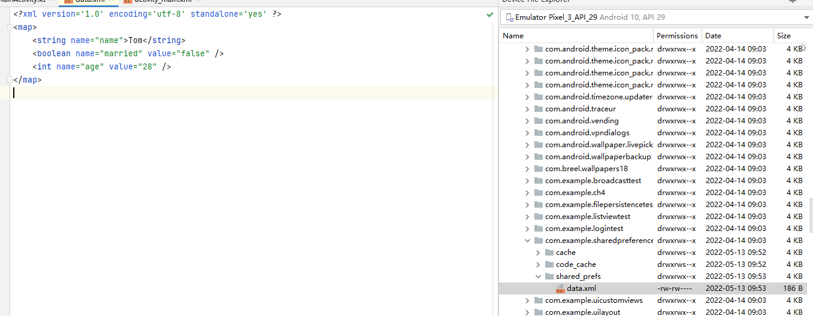


### 数据读取

SharedPreferences对象中 提供了一系列的get方法，用于读取存储的数据；

每种get方法都对应了 SharedPreferences.Editor中的一种put方法，比如读取一个布尔型数据就使用 getBoolean()方法，读取一个字符串就使用getString()方法。

这些get方法都接收两个参数：

- 第一个参数是键，传入存储数据时使用的键就可以得到相应的值了；

- 第二个参数是默认值，即表示当传入的键找不到对应的值时会以什么样的默认值进行返回。


**实例**

```xml
<!-- src/main/res/layout/activity_main.xml -->
<LinearLayout xmlns:android="http://schemas.android.com/apk/res/android"
    android:layout_width="match_parent"
    android:layout_height="match_parent"
    android:orientation="vertical">

    ......

    <Button
        android:id="@+id/restoreButton"
        android:layout_width="match_parent"
        android:layout_height="wrap_content"
        android:text="Restore Data"/>

    <TextView
        android:id="@+id/text"
        android:layout_width="match_parent"
        android:layout_height="wrap_content"/>
</LinearLayout>
```


```kotlin
// src/main/java/com/example/sharedpreferencestest/MainActivity.kt
package com.example.sharedpreferencestest

import android.content.Context
import androidx.appcompat.app.AppCompatActivity
import android.os.Bundle
import com.example.sharedpreferencestest.databinding.ActivityMainBinding

private lateinit var binding: ActivityMainBinding

class MainActivity : AppCompatActivity() {
    override fun onCreate(savedInstanceState: Bundle?) {
        
        ......

        binding.restoreButton.setOnClickListener {
            // 首先通过 getSharedPreferences() 方法得到 SharedPreferences 对象
            val prefs = getSharedPreferences("data", Context.MODE_PRIVATE)
            // 然后分别调用它的 getString() 、getInt() 和 getBoolean() 方法，去获取前面所存储的姓名、年龄和是否已婚。
            // 如果没有找到相应的值，就会使用方法中传入的默认值来代替
            val name = prefs.getString("name", "")
            val age = prefs.getInt("age", 0)
            val married = prefs.getBoolean("married", false)
            // 最后在 TextView 中显示出来
            binding.text.setText(
                "name is $name \n" +
                "age is $age \n" +
                "married is $married \n")
        }
    }
}
```


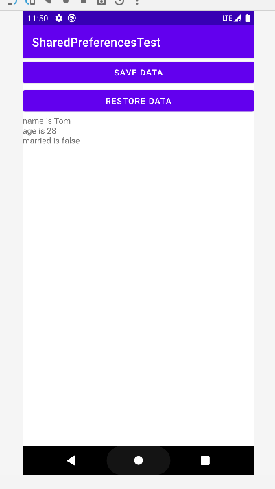

### ~~记住密码功能 (以后再补)~~

### SQLite数据库

#### **创建数据库**

Android 中存在 SQLiteOpenHelper 帮助类，借助这个类可以非常简单地对数据库进行创建和升级。

SQLiteOpenHelper是一个抽象类，这意味着如果我们想要使用它，就需要创建一个自己的帮助类去继承它。SQLiteOpenHelper中有两个抽象方法：`onCreate()`和 `onUpgrade()` 。我们必须在自己的帮助类里重写这两个方法，然后分别在这两个方法中实现创建和升级数据库的逻辑。

SQLiteOpenHelper中还有两个非常重要的实例方法：`getReadableDatabase()` 和 `getWritableDatabase()` 。这两个方法都可以创建或打开一个现有的数据库（如果数据库已 存在则直接打开，否则要创建一个新的数据库），并返回一个可对数据库进行读写操作的对象。

不同的是，当数据库不可写入的时候（如磁盘空间已满），getReadableDatabase() 方法返回的对象将以只读的方式打开数据库，而 getWritableDatabase() 方法则将出现异常。


SQLiteOpenHelper中有两个构造方法可供重写，一般使用参数少一点的那个构造方法即可。 这个构造方法中接收4个参数：

- 第一个参数是**Context**，这个没什么好说的，必须有它才能对数据库进行操作；
- 第二个参数是**数据库名**，创建数据库时使用的就是这里指定的名称；
- 第三个参数允许我们在查询数据的时候返回一个自定义的Cursor，**一般传入 null 即可**；
- 第四个参数表示 当前**数据库的版本号**，可用于对数据库进行升级操作。

构建出 SQLiteOpenHelper 的实例之 后，再调用它的 `getReadableDatabase()` 或 `getWritableDatabase()` 方法就能够创建数据库了，数据库文件会存放在 `/data/data/<package name>/databases/` 目录下。

此时，重写的 `onCreate()` 方法也会得到执行，所以通常会在这里处理一些创建表的逻辑。


例：创建一个名为BookStore.db的数据库，然后在这个数据库中新建一张Book表， 表中有id（主键）、作者、价格、页数和书名等列

```sqlite
create table Book ( 
	id integer primary key autoincrement, 
	author text, 
	price real, 
	pages integer,
	name text)
```

上述语句中，integer表示整型，real表示 浮点型，text表示文本类型，blob表示二进制类型。

primary key 将 id 列设为主键，并用 autoincrement 关键字表示id列是自增长的。


需要在代码中执行这条 SQL 语句，才能完成创建表的操作。新建 MyDatabaseHelper 类 继承自 SQLiteOpenHelper

```kotlin
// src/main/java/com/example/databasetest/MyDatabaseHelper.kt
package com.example.databasetest

import android.content.Context
import android.database.sqlite.SQLiteDatabase
import android.database.sqlite.SQLiteOpenHelper
import android.widget.Toast

class MyDatabaseHelper(var context: Context, name: String, version: Int) :
    SQLiteOpenHelper(context, name, null, version) {
    private val createBook = "Create table Book (" +
            " id integer primary key autoincrement," +
            "author text," +
            "price real," +
            "pages integer," +
            "name text)"

    override fun onCreate(db: SQLiteDatabase?) {
        db?.execSQL(createBook)
        Toast.makeText(context, "Create succeeded", Toast.LENGTH_LONG).show()
    }

    override fun onUpgrade(p0: SQLiteDatabase?, p1: Int, p2: Int) {
    }
}
```

上述语句把建表语句定义成了一个字符串变量，然后在 `onCreate()` 方法中又调用了 SQLiteDatabase 的 `execSQL()` 方法去执行这条建表语句，并弹出一个Toast提示创建成功，这样就可以保证在数据库创建完成的同时还能成功创建 Book 表。


修改布局：

```xml
<!-- src/main/res/layout/activity_main.xml -->
<LinearLayout xmlns:android="http://schemas.android.com/apk/res/android"
    android:layout_width="match_parent"
    android:layout_height="match_parent"
    android:orientation="vertical">

    <Button
        android:id="@+id/createDatabase"
        android:layout_width="match_parent"
        android:layout_height="wrap_content"
        android:text="Create Database" />
</LinearLayout>
```


MainActivity

```kotlin
// src/main/java/com/example/databasetest/MainActivity.kt
package com.example.databasetest

import androidx.appcompat.app.AppCompatActivity
import android.os.Bundle
import com.example.databasetest.databinding.ActivityMainBinding

private lateinit var binding : ActivityMainBinding

class MainActivity : AppCompatActivity() {
    override fun onCreate(savedInstanceState: Bundle?) {
        super.onCreate(savedInstanceState)
        setContentView(R.layout.activity_main)

        binding = ActivityMainBinding.inflate(layoutInflater)
        val view = binding.root
        setContentView(view)

        val dbHelper = MyDatabaseHelper(this, "BookStore.db", 1)
        binding.createDatabase.setOnClickListener { dbHelper.writableDatabase }
    }
}
```

在 `onCreate()` 方法中构建 MyDatabaseHelper 对象，并且通过构造函数的参 数将数据库名指定为 BookStore.db，版本号指定为1，

然后在“Create Database”按钮的点击事件里调用 `getWritableDatabase()` 方法。

这样当第一次点击 “Create Database” 按钮 时，就会检测到当前程序中并没有BookStore.db这个数据库，于是会创建该数据库并调用 MyDatabaseHelper 中的 `onCreate()` 方法，这样Book表也就创建好了，然后会弹出一个 Toast提示创建成功。

再次点击“Create Database”按钮时，会发现此时已经存在 BookStore.db 数据库了，因此不会再创建一次。

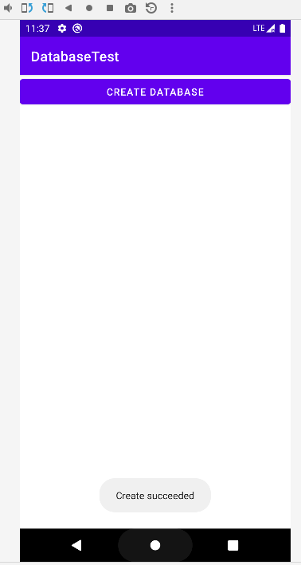


文件管理器中也能够找到该数据库

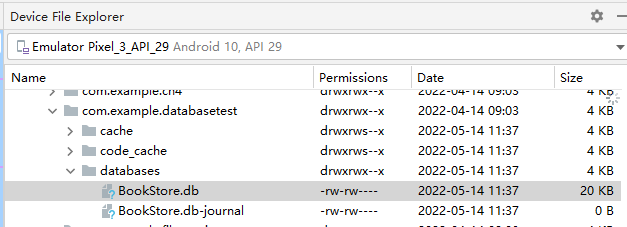


安装插件：Database Navigator

导入数据库

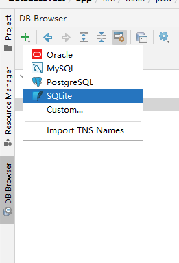

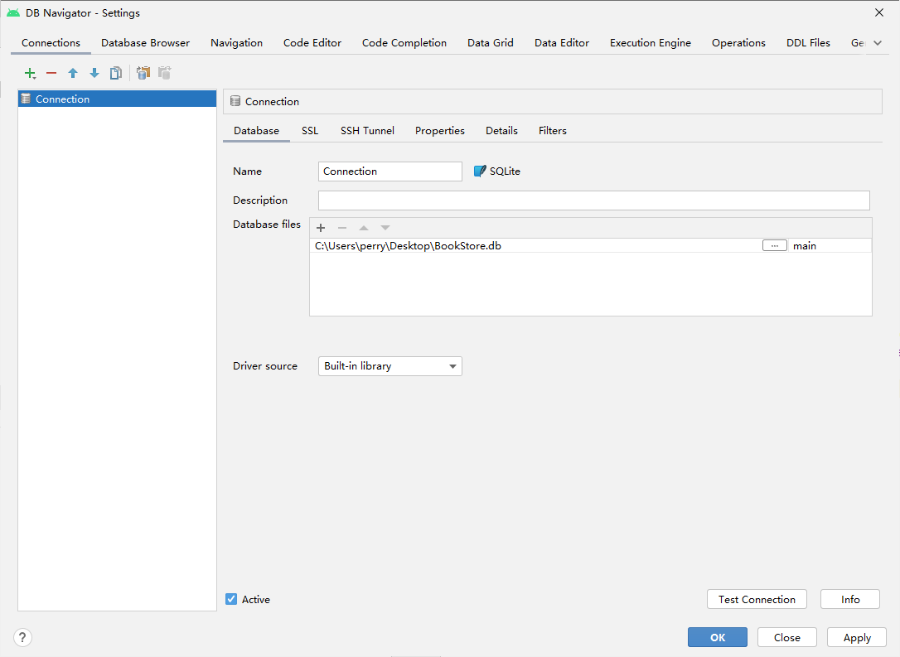


查看数据库

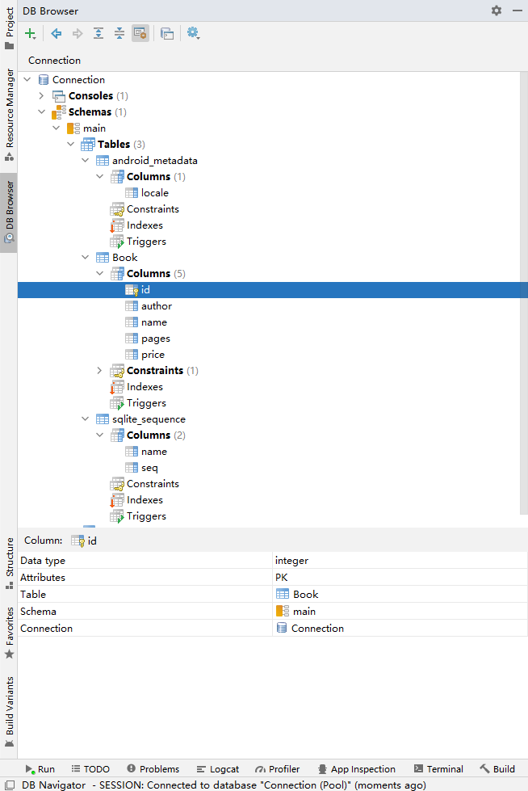


#### 升级数据库

MyDatabaseHelper 中的空方法`onUpgrade()` ，用于对数据库进行升级。

目前，DatabaseTest 项目中已经有一张Book表用于存放书的各种详细数据，如果我们想再添加一张Category表用于记录图书的分类？

比如Category表中有id（主键）、分类名和分类代码这几个列，那么建表语句就可以写成：

```sqlite
create table Category (
	id integer primary key autoincrement,
	category_name text,
	category_code integer)
```


将建表语句添加到 MyDatabaseHelper 中：

```kotlin
// src/main/java/com/example/databasetest/MyDatabaseHelper.kt
package com.example.databasetest

import android.content.Context
import android.database.sqlite.SQLiteDatabase
import android.database.sqlite.SQLiteOpenHelper
import android.widget.Toast

class MyDatabaseHelper(var context: Context, name: String, version: Int) :
    SQLiteOpenHelper(context, name, null, version) {
    // 变量：创建 Book 表
    private val createBook = "Create table Book (" +
            " id integer primary key autoincrement," +
            "author text," +
            "price real," +
            "pages integer," +
            "name text)"

    // 变量：创建 Category 表
    private val createCategory = "create table Category (" +
            "id integer primary key autoincrement," +
            "category_name text," +
            "category_code integer)"

    override fun onCreate(db: SQLiteDatabase?) {
        // 将 createBook 传给 SQLite 执行
        db?.execSQL(createBook)
        // 将 createCategory 传给 SQlite 执行
        db?.execSQL(createCategory)

        Toast.makeText(context, "Create succeeded", Toast.LENGTH_LONG).show()
    }

    override fun onUpgrade(db: SQLiteDatabase?, oldVersion: Int, newVersion: Int) {
        // 例用升级功能，将旧表删除，然后调用 onCreate() 建新表
        db?.execSQL("drop table if exists Book")
        db?.execSQL("drop table if exists Category")
        onCreate(db)
    }
}
```


要让 `onUpgrade()` 执行，在 MainActivity 中将版本号改大即可：

```kotlin
// src/main/java/com/example/databasetest/MainActivity.kt
package com.example.databasetest

import android.content.ContentValues
import androidx.appcompat.app.AppCompatActivity
import android.os.Bundle
import com.example.databasetest.databinding.ActivityMainBinding

private lateinit var binding : ActivityMainBinding

class MainActivity : AppCompatActivity() {
    ......

        val dbHelper = MyDatabaseHelper(this, "BookStore.db", 2)

        ......
        
}
```

运行并再次点击 Create Database，然后导出查看数据库

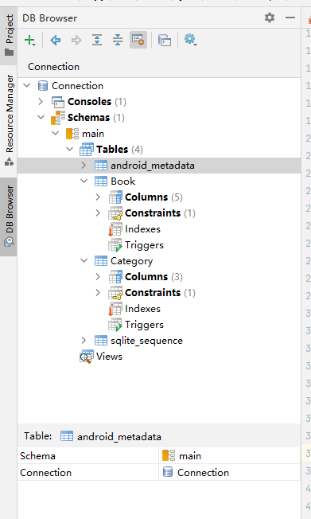


#### 添加数据

调用SQLiteOpenHelper的`getReadableDatabase()`或 `getWritableDatabase()`方法是可以用于创建和升级数据库的，不仅如此，这两个方法还都
会返回一个SQLiteDatabase对象，借助这个对象就可以对数据进行CRUD操作了。


SQLiteDatabase中提供了一个 `insert()` 方法，专门用于添加数据。它接收3个参数：

第一个参数是表名，我们希望向哪张表里添加数据，这里就传入该表的名字；

第二个参数用于在未指定添加数据的情况下给某些可为空的列自动赋值NULL，一般我们用不到这个功能，直接传入null即可；

第三个参数是一个 ContentValues对象，它提供了一系列的`put()`方法重载，用于向ContentValues中添加数据，只需要将表中的每个列名以及相应的待添加数据传入即可。


在布局文件 src/main/res/layout/activity_main.xml 中加入按钮

```xml
<Button
    android:id="@+id/addData"
    android:layout_width="match_parent"
    android:layout_height="wrap_content"
    android:text="Add Data" />
```


添加按钮点击事件

```kotlin
// src/main/java/com/example/databasetest/MainActivity.kt
package com.example.databasetest

import android.content.ContentValues
import androidx.appcompat.app.AppCompatActivity
import android.os.Bundle
import com.example.databasetest.databinding.ActivityMainBinding

private lateinit var binding : ActivityMainBinding

class MainActivity : AppCompatActivity() {
    ......

        // 增加数据
        binding.addData.setOnClickListener {
            val db = dbHelper.writableDatabase
            val values1 = ContentValues().apply {
                // 开始组装第一条数据
                put("name", "The Da Vinci Code")
                put("author", "Dan Brown")
                put("pages", 454)
                put("price", 16.96)
            }
            // 插入第一条数据：
            db.insert("Book", null, values1)

            val values2 = ContentValues().apply {
                // 开始组装第二条数据
                put("name", "The Lost Symbol")
                put("author", "Dan Brown")
                put("pages", 510)
                put("price", 19.95)
            }
            // 插入第二条数据
            db.insert("Book", null, values2)
        }
    }
}
```

先获取了SQLiteDatabase对象，然后使用 ContentValues对要添加的数据进行组装。

如果你比较细心的话，应该会发现这里只对Book 表里其中4列的数据进行了组装，id那一列并没给它赋值。这是因为在前面创建表的时候，我们 就将id列设置为自增长了，它的值会在入库的时候自动生成，所以不需要手动赋值了。

接下来调用了insert()方法将数据添加到表当中


运行后点击 Add Data，然后导出数据库 并双击Book查看表内容，可见数据已成功插入

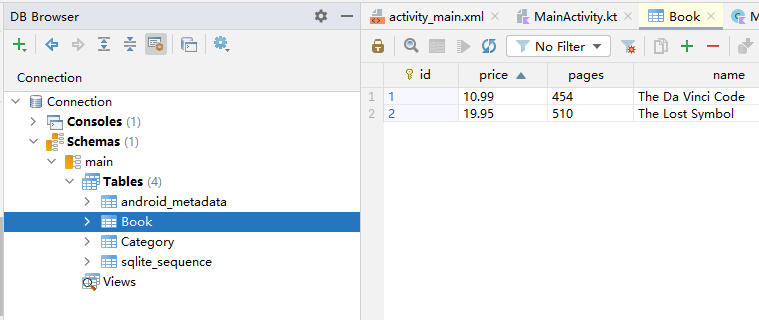


#### 更新数据

SQLiteDatabase 中提供了一个非常好用的 `update()` 方法，用于对数据进行更新。这个方法接收4个参数：

第一个参数和 `insert()` 方法一样，也是表名，指定更新哪张表里的数据；

第二个参数是 ContentValues 对象，要把更新数据在这里组装进去；

第三、第四个参数用于约束更新某一行或某几行中的数据，不指定的话默认会更新所有行。


比如刚才添加到数据库里的第一本书，由于过了畅销季，卖得不是很火了，现在需要通过降低价格的方式来吸引更多的顾客

```xml
<LinearLayout xmlns:android="http://schemas.android.com/apk/res/android"
    android:layout_width="match_parent"
    android:layout_height="match_parent"
    android:orientation="vertical">

    ......

    <Button
        android:id="@+id/updateData"
        android:layout_width="match_parent"
        android:layout_height="wrap_content"
        android:text="Update Data" />
</LinearLayout>

<!-- src/main/res/layout/activity_main.xml -->
```


```kotlin
// src/main/java/com/example/databasetest/MainActivity.kt
package com.example.databasetest

import android.content.ContentValues
import androidx.appcompat.app.AppCompatActivity
import android.os.Bundle
import android.widget.Toast
import com.example.databasetest.databinding.ActivityMainBinding

private lateinit var binding : ActivityMainBinding

class MainActivity : AppCompatActivity() {
    override fun onCreate(savedInstanceState: Bundle?) {
        ......

        // 更新数据
        binding.updateData.setOnClickListener {
            Toast.makeText(this, "Upadating", Toast.LENGTH_SHORT).show()
            val db = dbHelper.writableDatabase
            val values = ContentValues()
            values.put("price", 10.99)
            db.update("Book", values, "name = ?", arrayOf("The Da Vinci Code"))
            Toast.makeText(this, "Updated", Toast.LENGTH_SHORT).show()
        }
    }
}
```


运行，点击 Update Data ，并导出数据库查看，可见数据已成功更新：

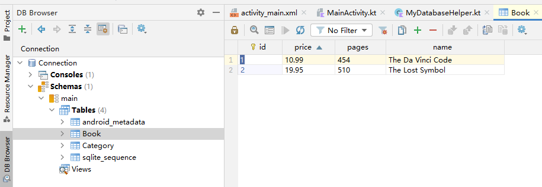


#### 删除数据

在布局中添加按钮

```xml
<Button
    android:id="@+id/deleteData"
    android:layout_width="match_parent"
    android:layout_height="wrap_content"
    android:text="Delete Data" />
```

添加点击事件

```kotlin
// src/main/java/com/example/databasetest/MainActivity.kt
package com.example.databasetest

import android.content.ContentValues
import androidx.appcompat.app.AppCompatActivity
import android.os.Bundle
import android.widget.Toast
import com.example.databasetest.databinding.ActivityMainBinding

private lateinit var binding : ActivityMainBinding

class MainActivity : AppCompatActivity() {
    ......
    
        // 删除数据
        binding.deleteData.setOnClickListener {
            val db = dbHelper.writableDatabase
            // 第一个个参数：删除Book表中的数据；
            // 第二、第三个参数来：指定仅删除那些页数超过500页的书
            db.delete("Book", "pages > ?", arrayOf("500"))
            Toast.makeText(this, "Deleted", Toast.LENGTH_SHORT).show()
        }
    }
}
```


运行程序，并点击 “Delete Data”，导出并查看数据库，可见 The Lost Symbol 这本书的页数超过500页的书，记录已被删除

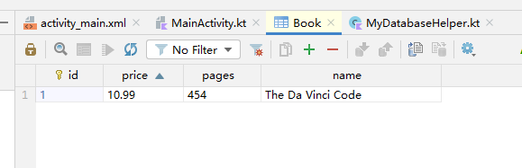


#### 查询数据

SQLiteDatabase 中还提供了一个 `query()` 方法用于对数据进行查询。这个方法的参数非常复杂，最短的一个方法重载也需要传入7个参数。

第一个参数：表名，表示我们希望从哪张表中查询数据。

第二个参数用于指定去查询哪几列，如果不指定则默认查询所有列。

第三、第四个参数用于约 束查询某一行或某几行的数据，不指定则默认查询所有行的数据。

第五个参数用于指定需要去 group by 的列，不指定则表示不对查询结果进行group by操作。

第六个参数用于对 group by 之后的数据进行进一步的过滤，不指定则表示不进行过滤。

第七个参数用于指定查询结果的排序方式，不指定则表示使用默认的排序方式。

| query() 方法参数 | 对应 SQL 部分             | 描述                            |
| :--------------- | :------------------------ | :------------------------------ |
| table            | from table_name           | 指定查询的表名                  |
| columns          | select column1, column2   | 指定查询的列名                  |
| selection        | where column = value      | 指定 where 的约束条件           |
| selectionArgs    | -                         | 为 where 中的占位符提供举例的值 |
| groupBy          | group by column           | 指定需要 group by 的列          |
| having           | having column = value     | 对 group by 后的结果进一步约束  |
| orderBy          | order by column1, column2 | 指定查询结果的排序方式          |

虽然query()方法的参数非常多，但不必为每条查询语句都指 定所有的参数，多数情况下只需要传入少数几个参数就可以完成查询操作了。

调用query()方法后会返回一个Cursor对象，查询到的所有数据都将从这个对象中取出。

```xml
<Button
    android:id="@+id/queryData"
    android:layout_width="match_parent"
    android:layout_height="wrap_content"
    android:text="Query Data" />
```

```kotlin
// src/main/java/com/example/databasetest/MainActivity.kt
package com.example.databasetest

import android.annotation.SuppressLint
import android.content.ContentValues
import androidx.appcompat.app.AppCompatActivity
import android.os.Bundle
import android.util.Log
import android.widget.Toast
import com.example.databasetest.databinding.ActivityMainBinding

private lateinit var binding : ActivityMainBinding

class MainActivity : AppCompatActivity() {
    @SuppressLint("Range")		// 需要添加此行
    override fun onCreate(savedInstanceState: Bundle?) {
        ......

        // 查找数据
        binding.queryData.setOnClickListener {
            val db = dbHelper.writableDatabase
            // 查询 Book 表中的所有数据
            val cursor = db.query("Book", null, null, null, null, null, null)
            if (cursor.moveToFirst()) {
                do {
                    // 遍历 Cursor 对象
                    val name = cursor.getString(cursor.getColumnIndex("name"))      // 需要添加：@SuppressLint("Range")
                    val author = cursor.getString(cursor.getColumnIndex("author"))  // 需要添加：@SuppressLint("Range")
                    val pages = cursor.getInt(cursor.getColumnIndex("pages"))
                    val price = cursor.getDouble(cursor.getColumnIndex("price"))
                    Log.d("MainActivity", "Book name is $name")
                    Log.d("MainActivity", "book author is $author")
                    Log.d("MainActivity", "Book pages is $pages")
                    Log.d("MainActivity", "book price is $price")
                } while (cursor.moveToNext())
            }
            cursor.close()
        }
    }
}
```


执行后点击 **Query Data** 观察 Logcat：

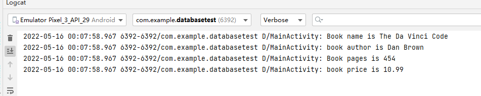


## 附录

### 关于 Try Catch

Kotlin是没有异常检查机制（checked exception）的。这意味着使用Kotlin编写的所 有代码都不会强制要求你进行异常捕获或异常抛出。上述代码中的try catch代码块是参照Java的编程规范添加的，即使你不写try catch代码块，在Kotlin中依然可以编译通过。


语法：

```java
try {
    逻辑代码块1;
} catch(ExceptionType e) {
    处理代码块1;
}
```

在以上语法中，把可能引发异常的语句封装在 try 语句块中，用以捕获可能发生的异常。

如果 try 语句块中发生异常，那么一个相应的异常对象就会被拋出，然后 catch 语句就会依据所拋出异常对象的类型进行捕获，并处理。处理之后，程序会跳过 try 语句块中剩余的语句，转到 catch 语句块后面的第一条语句开始执行。

如果 try 语句块中没有异常发生，那么 try 块正常结束，后面的 catch 语句块被跳过，程序将从 catch 语句块后的第一条语句开始执行。


在以上语法的处理代码块1中，可以使用以下 3 个方法输出相应的异常信息。

- printStackTrace() 方法：指出异常的类型、性质、栈层次及出现在程序中的位置。
- getMessage() 方法：输出错误的性质。
- toString() 方法：给出异常的类型与性质。